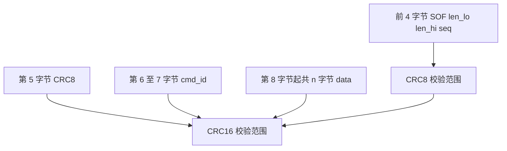
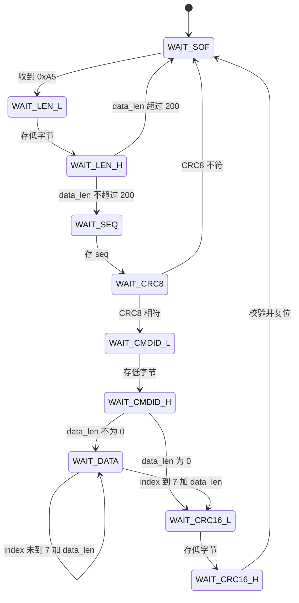
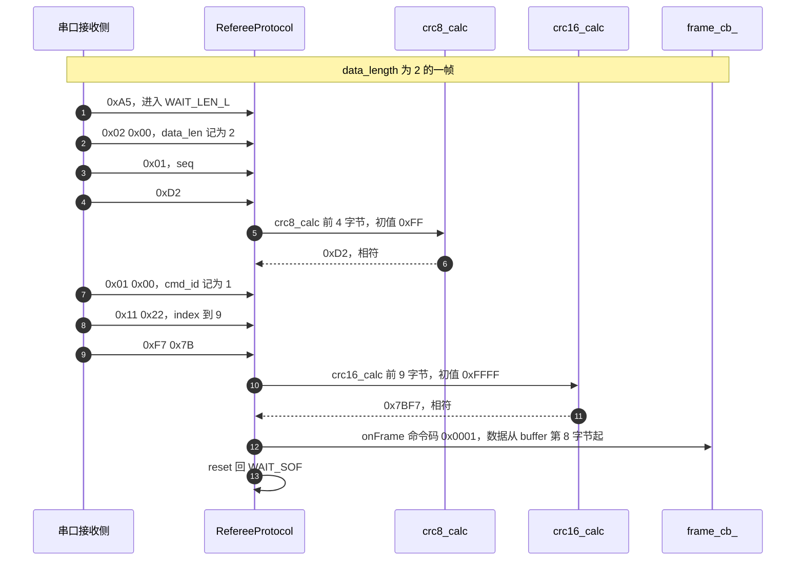

# 裁判系统帧校验流程

云台板与底盘板共用 `Communication/Src/referee_protocol.cpp` 与 `Communication/Inc/referee_protocol.h`。裁判系统帧以 `0xA5` 开头，长度不固定，一帧里有两次校验：CRC8 守帧头四个字节，CRC16 守从帧头到数据段的全部字节。底盘板把 `huart6` 注册给这套解析器，云台板没有注册。

两次校验的边界要看帧布局与状态转移才能划清，两块板与视觉链路的处理也有差别，手算示例放在中间。CRC8 与 CRC16 的实现细节见 `02-CRC8查表实现` 与 `03-CRC16查表实现`，字段映射见 `05-裁判系统协议` 单元。

## 1. 9+n 的帧布局与两个校验字段

帧布局如下：

| 偏移 | 字段 | 字节 | 含义 |
| --- | --- | --- | --- |
| 0 | SOF | 1 | 固定 0xA5 |
| 1 | data_length 低字节 | 1 | 数据段字节数，小端 |
| 2 | data_length 高字节 | 1 | 同上 |
| 3 | seq | 1 | 包序号 |
| 4 | CRC8 | 1 | 只校验前 4 字节 |
| 5 | cmd_id 低字节 | 1 | 命令码，小端 |
| 6 | cmd_id 高字节 | 1 | 同上 |
| 7 | data | n | 数据段，data_length 声明 |
| 7+n | CRC16 低字节 | 1 | 校验前 7+n 字节，小端 |
| 8+n | CRC16 高字节 | 1 | 同上 |

帧总长是 $9+n$ 字节。两个校验的目的不同：CRC8 只看帧头四个字节，帧头一旦出错可以在收到命令码之前就丢弃整帧；CRC16 覆盖从 SOF 到数据段结束的全部字节，包括第 4 字节的 CRC8 字段，作为整包兜底。



覆盖范围的边界由调用方给出的长度决定：`crc8_calc(buffer_, 4, 0xFF)` 的 4 是前 4 字节；`crc16_calc(buffer_, index_-2, 0xFFFF)` 的 `index_-2` 在最后一态等于 `7+n`，即 CRC16 字段之前的所有字节。两段范围有重叠，第 4 字节的 CRC8 字段同时被 CRC16 保护，这是有意的：帧头被改坏时两道校验都不放行。

## 2. 十个状态的转移与长度保护

`RefereeProtocol::input` 一次吃一个字节（`referee_protocol.cpp:26`），十个状态定义在 `Communication/Inc/referee_protocol.h:25-37`：

| 状态 | 行为 | 迁移条件 |
| --- | --- | --- |
| `WAIT_SOF` | 等 0xA5 | 收到 0xA5 置 `index_=1` 进入 `WAIT_LEN_L` |
| `WAIT_LEN_L` | 存长度低字节 | 无条件进入 `WAIT_LEN_H` |
| `WAIT_LEN_H` | 存长度高字节 | 长度大于 200 复位，否则进入 `WAIT_SEQ` |
| `WAIT_SEQ` | 存包序号 | 进入 `WAIT_CRC8` |
| `WAIT_CRC8` | 存第 5 字节并算 CRC8 | 相符进入 `WAIT_CMDID_L`，否则复位 |
| `WAIT_CMDID_L` | 存命令码低字节 | 进入 `WAIT_CMDID_H` |
| `WAIT_CMDID_H` | 存命令码高字节 | 长度 0 进 `WAIT_CRC16_L`，否则进 `WAIT_DATA` |
| `WAIT_DATA` | 逐字节存数据段 | `index_ >= 7 + data_len_` 进 `WAIT_CRC16_L` |
| `WAIT_CRC16_L` | 存 CRC16 低字节 | 进入 `WAIT_CRC16_H` |
| `WAIT_CRC16_H` | 存 CRC16 高字节并整包校验 | 通过则回调，随后复位 |



长度上限的检查在 `WAIT_LEN_H`（`referee_protocol.cpp:49-52`）：`data_len_ > 200` 直接 `reset()`。缓冲区是 `buffer_[256]`（`referee_protocol.h:41`），最长帧的索引是 `9+200=209`，留有余量。这个余量同时容纳 CRC16 的两个字节与索引偏移，把上限从 255 压到 200 是为了让最坏长度仍落在缓冲区内。

## 3. CRC8 只覆盖前四字节的原因

`WAIT_CRC8` 分支（`referee_protocol.cpp:64-78`）：

```cpp
case WAIT_CRC8:
{
    buffer_[index_++] = byte;

    uint8_t crc8 = crc8_calc(buffer_, 4,0xFF);
    if(crc8 != byte)
    {
        reset();
    }
    else
    {
        state_ = WAIT_CMDID_L;
    }
}
```

长度参数写死为 4，初值 0xFF。此时 `buffer_[0..3]` 已填满，第 5 字节刚写入 `buffer_[4]`。校验失败立刻 `reset()`，状态回到 `WAIT_SOF`，后面收到的字节会被当作新的帧头重新寻找 `0xA5`。

把校验点放在第 5 字节而不是帧尾，收益是在拿到命令码与数据段之前就能判断帧头是否可信。帧头一旦出错，后面 `n` 个字节都不必缓存，也不必参与 CRC16 的长循环。代价是每帧多一次 4 字节查表，这个开销可以忽略。

## 4. CRC16 覆盖到校验字段之前

`WAIT_CRC16_H` 分支（`referee_protocol.cpp:110-132`）：

```cpp
case WAIT_CRC16_H:
{
    buffer_[index_++] = byte;

    uint16_t recv_crc16 =
        buffer_[index_-2] |
        (buffer_[index_-1] << 8);

    uint16_t calc_crc16 =
        crc16_calc(buffer_, index_-2,0xFFFF);

    if(calc_crc16 == recv_crc16)
    {
        if(frame_cb_)
        {
            const uint8_t* data_ptr = &buffer_[7];
            frame_cb_(cmd_id_, data_ptr, data_len_);
        }
    }

    reset();
}
```

三件事同时确定：

| 语句 | 含义 |
| --- | --- |
| `buffer_[index_-2]` 与 `buffer_[index_-1] << 8` 做或运算 | 收到的 CRC16 按小端还原，低字节在前 |
| `crc16_calc(buffer_, index_-2, 0xFFFF)` | 覆盖前 `index_-2` 字节，初值 0xFFFF |
| `&buffer_[7]` | 回调拿到的数据指针从第 8 字节起，即数据段首地址 |

在最后一态 `index_ = 9 + n`，所以 `index_-2 = 7 + n`。CRC16 的覆盖范围包含第 5 字节的 CRC8 字段。计算值与接收值不等时静默复位，回调不执行；相等时先回调再复位。回调注册在 `Communication/Src/referee_decode.cpp:13-20`，转调 `RefereeDecode::onFrame`。



## 5. 一帧 11 字节的手算

以下字节属于手算示例，用于核对第 3、4 节的覆盖范围。数据段取两个构造字节 `0x11 0x22`，seq 取 1，命令码取 0x0001：

```text
A5 02 00 01 D2 01 00 11 22 F7 7B
```

| 位置 | 字节 | 说明 |
| --- | --- | --- |
| 0 | `0xA5` | SOF |
| 1-2 | `0x02 0x00` | data_length = 2，小端 |
| 3 | `0x01` | seq |
| 4 | `0xD2` | CRC8，覆盖 0 到 3 字节 |
| 5-6 | `0x01 0x00` | cmd_id = 0x0001，小端 |
| 7-8 | `0x11 0x22` | data，2 字节 |
| 9-10 | `0xF7 0x7B` | CRC16 = 0x7BF7，小端 |

两次校验的输入分别是：

| 校验 | 输入字节 | 初值 | 结果 | 写入位置 |
| --- | --- | --- | --- | --- |
| CRC8 | `A5 02 00 01` | 0xFF | 0xD2 | 第 5 字节 |
| CRC16 | `A5 02 00 01 D2 01 00 11 22` | 0xFFFF | 0x7BF7 | 第 10 至 11 字节 |

把数据段最后一字节从 `0x22` 改成 `0x23`，CRC16 变成 0x6A7E，需要同步改写帧尾，否则接收方在 `WAIT_CRC16_H` 静默复位。

## 6. 云台板为什么收不到裁判数据

| 环节 | 位置 | 说明 |
| --- | --- | --- |
| 状态机定义 | `Communication/Inc/referee_protocol.h:25-37` | 十个解析状态 |
| 逐字节入口 | `Communication/Src/referee_protocol.cpp:26-134` | `input` |
| 长度保护 | `referee_protocol.cpp:49-52` | 大于 200 复位 |
| CRC8 | `referee_protocol.cpp:64-78` | 覆盖 4 字节，初值 0xFF |
| CRC16 | `referee_protocol.cpp:110-132` | 覆盖 `index_-2` 字节，初值 0xFFFF |
| 回调 | `referee_protocol.cpp:123-127` | 数据指针 `&buffer_[7]` |
| 回调注册 | `Communication/Src/referee_decode.cpp:13-20` | 转 `onFrame` |
| 批量喂数据 | `Communication/Src/referee_decode.cpp:158-165` | `RefereeCallback` 逐字节 `input` |
| 底盘注册 | `2026OmniSentryChassis/2026OmniSentryChassis/Core/Src/main.c:132` | `Uart_Init(&huart6, RefereeUartCallback)` |
| 云台板 | `2026OmniSentryGimbal/Core/Src/main.c:125` | 只注册 huart3，裁判系统无接收通路 |

云台板的 `refereeproto` 与 `referee_decode` 全局对象存在（`referee_decode.cpp:10-11`），且 `RefereeCallback` 也有定义（`referee_decode.cpp:159`），但 `Uart_Init` 只传了 `MyUartCallbackFun`（`Core/Src/main.c:125`），没有实例把字节送进 `refereeproto.input`。因此云台板上裁判系统数据的接收与校验不会发生；带裁判链路的是底盘板。

## 7. 与视觉链路覆盖范围的对比

USB 视觉链路的帧长固定，CRC16 覆盖长度写成常量，不需要状态机推导：

| 帧 | 总长 | 字段 | CRC16 覆盖 | 出处 |
| --- | --- | --- | --- | --- |
| 视觉到云台 | 29 | head、mode、6 个 `float`、crc16 | 前 27 字节 | `usb_decode.cpp:79-83` |
| 云台到视觉 | 43 | head、mode、`q[4]`、5 个 `float`、bullet_count、crc16 | 前 41 字节 | `usb_protocol.cpp:41-45` |

两条链路都用 0xFFFF 初值、同一张表，差别只在覆盖范围由常量还是状态机推导。视觉发送前把 `pkt.crc16` 先清零再算（`usb_protocol.cpp:38`），避免把未初始化字段算进结果；裁判帧的状态机天然只算到 CRC16 字段之前，不需要清零。

## 8. 易错点

| 易错点 | 现象 | 说明 |
| --- | --- | --- |
| CRC8 覆盖写成 5 字节 | 接收方永远校验失败 | 应是 `crc8_calc(buffer_, 4, 0xFF)` |
| CRC16 覆盖漏掉 CRC8 字节 | 校验值与发送方不同 | 覆盖范围含 `buffer_[4]` |
| 覆盖范围多算 CRC16 字段 | 自校验永远失败 | `index_-2` 已排除两字节 |
| 大小端反写 | 值对但字节序反 | 接收按低字节在前拼接，发送亦低字节在前 |
| 长度字段当总长 | 数据段被多读或少读 | 该字段是数据段字节数 |
| 忽略 200 上限 | 大长度帧吃掉缓冲区 | `referee_protocol.cpp:49-52` |
| CRC 失败没有日志 | 现场只看得到没有数据 | 失败分支只 `reset()` |

## 9. 小结

### 核心概念

- 裁判帧是 SOF、len、seq、CRC8、cmd_id、data、CRC16 的顺序，共 $9+n$ 字节。
- CRC8 只覆盖前 4 字节，初值 0xFF，用于尽早丢弃坏帧头。
- CRC16 覆盖 CRC16 字段之前的全部字节，含 CRC8 字段，初值 0xFFFF。
- 长度字段是数据段字节数，大于 200 直接复位。
- 多字节字段与 CRC16 都按小端存放。
- 校验通过后回调拿到 `&buffer_[7]` 与 `data_len_`。

### 设计权衡

| 决策 | 选择 | 收益 | 代价 |
| --- | --- | --- | --- |
| 两级校验 | 帧头 CRC8 加整包 CRC16 | 坏帧头早停，整包兜底 | 两次查表，两个初值 |
| 长度上限 | 200 字节 | 缓冲区 256 足够 | 超长帧被静默丢弃 |
| 校验失败处理 | 静默复位，不回调 | 代码简单 | 没有错误计数与日志 |
| 数据指针 | 直接指向内部缓冲区 | 零拷贝 | 回调期间缓冲区不可重入 |
| 逐字节状态机 | 一个字节一次 `input` | 可接 DMA 与中断 | 状态多，覆盖范围靠索引推导 |

## 10. 练习

### 基础题

1. 写出帧 `A5 02 00 01 D2 01 00 11 22 F7 7B` 的总长，以及 $9+n$ 中的 `n`。
2. CRC8 覆盖哪几个字节，CRC16 覆盖哪几个字节，两者是否有重叠。
3. `data_len_ = 0` 时状态机会走哪条路径，CRC16 覆盖多少字节。
4. 接收方在 `WAIT_CRC8` 拿到 `0x00`，状态机会怎么走，后续字节如何处理。

### 挑战题

5. 按第 5 节格式构造一帧，`data_length = 3`、seq 任意、cmd_id = 0x0003、数据段三个字节自选，写出完整字节串并标注两次校验的输入。
6. 若把 CRC8 的覆盖长度从 4 改成 5，说明发送方与接收方会各自算出什么，校验是否还能通过，并解释第 4 字节与第 5 字节在覆盖上的区别。
7. 云台板未注册 huart6。若要让云台板也解析裁判数据，需要改哪几行，复用哪个已有函数，并说明 `refereeproto` 的 `frame_cb_` 是否已经绑定。

---

### 附：本页引用的固件路径

| 路径 | 用途 |
| --- | --- |
| `2026OmniSentryGimbal/Communication/Src/referee_protocol.cpp` | 状态机（:26-134）、CRC8（:64-78）、CRC16（:110-132） |
| `2026OmniSentryGimbal/Communication/Inc/referee_protocol.h` | 状态枚举（:25-37）、缓冲区（:41） |
| `2026OmniSentryGimbal/Communication/Src/referee_decode.cpp` | 回调注册（:13-20）、`RefereeCallback`（:158-165） |
| `2026OmniSentryGimbal/Core/Src/main.c` | 云台板只注册 huart3（:125） |
| `2026OmniSentryChassis/2026OmniSentryChassis/Core/Src/main.c` | 底盘板注册 huart6（:131-132） |
| `2026OmniSentryGimbal/Communication/Src/usb_protocol.cpp` | 视觉发送帧 CRC16 覆盖（:38-45） |
| `2026OmniSentryGimbal/Communication/Src/usb_decode.cpp` | 视觉接收帧 CRC16 覆盖（:79-83） |
| `2026OmniSentryGimbal/Communication/Inc/usb_protocol.h` | 两种帧长与结构体（:20-21、:39-70） |
