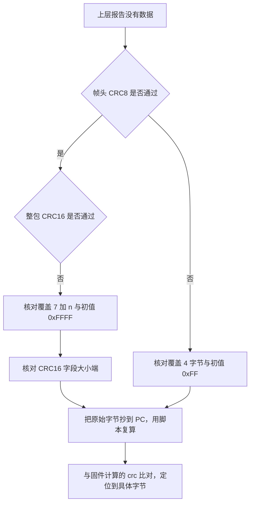
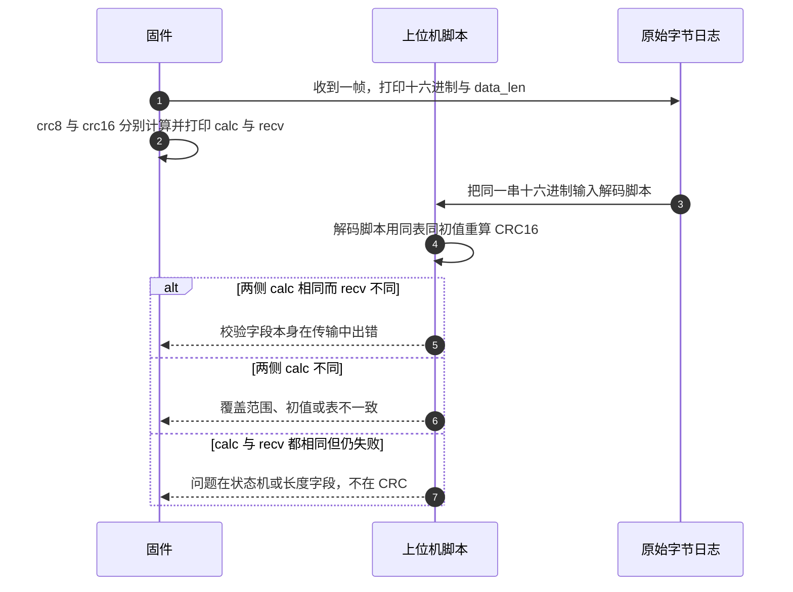

# 校验的易错点与调试

云台板与底盘板的串口链路上，校验失败的表现都一样：接收方丢弃整帧，上层看不到数据。要定位到具体原因，先要把问题分到正确的层：算法用错、参数写错、覆盖范围错、字节序错。这四类在本工程里都有对应的实例。

每条问题给出源码位置与判别方法，末尾是按帧逐段复算的调试顺序。CRC8 与 CRC16 实现见 `02-CRC8查表实现`、`03-CRC16查表实现`，裁判帧的校验顺序见 `04-裁判系统帧校验流程`。

## 1. 校验故障的四个类别

| 类别 | 典型表现 | 排查入口 |
| --- | --- | --- |
| 算法用错 | 两套校验混用，值永远对不上 | 确认调用的是 `crc8_calc` 还是累加和 |
| 参数写错 | 初值、多项式与对端不同 | 比对调用点入参 |
| 覆盖范围错 | 差一个字节就失败 | 数调用点的长度参数 |
| 字节序错 | 数值正确但顺序反 | 看收发两侧的拼接表达式 |

先把这四类分开，再谈具体代码。四类里只有第一类与第三类会在读代码时立刻暴露，后两类往往要拿原始字节离线复算才能确定。

## 2. 8 位累加和与 CRC8 的判别

`UartProtocol` 用的不是 CRC。校验算式在 `Communication/Src/usart_protocol.cpp:47-57`：

```cpp
uint8_t sum = frame_type_;
for (uint8_t i = 0; i < data_len_; ++i) sum += recv_buf_[i];
sum &= 0xFF;

if (sum == byte && cb_) {
    cb_(frame_type_, recv_buf_, data_len_);
}
```

发送侧用同一算式（`usart_protocol.cpp:82-84`）。它与 CRC8 有三处不同：

| 维度 | `UartProtocol` 累加和 | `crc8_calc` |
| --- | --- | --- |
| 覆盖范围 | `type` 与 `payload` | 由调用方给的指针与长度决定 |
| 运算 | 无符号加，模 256 | 多项式移位与异或 |
| 首字节是否参与 | 参与，初值为 `frame_type_` | 由初值决定 |
| 输出 | 1 字节和 | 1 字节余数 |
| 调用点 | 本页未查到接线 | 裁判帧头与底盘 USB 帧头 |

两者都输出 1 字节，量纲相同，直接互换会得到完全不同但长度合法的值。判断一段代码属于哪一套，看它有没有 256 项表，不要看变量名。

## 3. 初值表与脚本注释的冲突

初值是 CRC 结果的一部分，收发两侧必须一致。本工程的固定取值如下：

| 调用点 | 函数 | 初值 |
| --- | --- | --- |
| `referee_protocol.cpp:68` | `crc8_calc(buffer_, 4, ...)` | 0xFF |
| `referee_protocol.cpp:119` | `crc16_calc(buffer_, index_-2, ...)` | 0xFFFF |
| `usb_protocol.cpp:44` | `crc16_calc(..., GIMBAL_TO_VISION_LEN - 2, ...)` | 0xFFFF |
| `usb_decode.cpp:82` | `crc16_calc(..., VISION_TO_GIMBAL_LEN - 2, ...)` | 0xFFFF |
| 底盘 `UsbConnectTask.cpp:41` | `crc8_calc(data, length, ...)` | 0xFF |
| 底盘 `UsbConnectTask.cpp:244` | `crc8_calc(header, 3, ...)` | 0xFF |
| 底盘 `UsbConnectTask.cpp:255` | `crc16_calc(frame_buffer, index, ...)` | 0xFFFF |

一处需要显式标出的冲突在脚本注释：`generate_gimbal_packet.py:10` 写「多项式 0x8005，初始 0x0000」，而默认参数是 `init=0xFFFF`（`generate_gimbal_packet.py:36`）。`0x0000` 对应 CRC-16/KERMIT，`0xFFFF` 对应 CRC-16/MCRF4XX，结果不同。按代码为准，脚本实际使用 0xFFFF。多项式一项也与表不符，详见 03 篇第 5 节。

初值写错的表现是全帧百分之百失败，且失败与数据内容无关。用空数据可以直接测初值：`len = 0` 时函数返回 `init`，把返回值与预期初值比对即可。

## 4. 覆盖范围：四个调用点逐个核对

覆盖范围由调用方给出的长度决定，函数不校验。本工程的四个范围：

| 链路 | 表达式 | 覆盖字节数 |
| --- | --- | --- |
| 裁判帧头 CRC8 | `crc8_calc(buffer_, 4, 0xFF)` | 4，即偏移 0 到 3 |
| 裁判整包 CRC16 | `crc16_calc(buffer_, index_-2, 0xFFFF)` | `7+n`，到数据段结束 |
| 视觉接收 CRC16 | `crc16_calc(buffer_, VISION_TO_GIMBAL_LEN - 2, 0xFFFF)` | 27，即偏移 0 到 26 |
| 视觉发送 CRC16 | `crc16_calc(..., GIMBAL_TO_VISION_LEN - 2, 0xFFFF)` | 41，即偏移 0 到 40 |

两类边界容易写错：

1. 帧头 CRC8 只覆盖前 4 字节。把 4 写成 5 会把 CRC8 字段本身也算进去，而发送方计算时该字段还不存在，两侧必然不同。
2. 裁判整包的 `index_-2` 已经排除了 CRC16 的两个字节。`index_` 在 `WAIT_CRC16_H` 里先自增，最后一态等于 `9+n`，减 2 正好是 CRC16 字段之前的长度。若写成 `index_` 或 `index_-1`，会把 CRC16 字段也算进去。

视觉发送前把校验字段清零（`usb_protocol.cpp:38` 的 `pkt.crc16 = 0`），再对前 41 字节计算。裁判帧的状态机天然只算到 CRC16 字段之前，不需要清零，但如果有人给裁判帧加了「先填满整帧再算」的写法，就必须补上清零，否则算进去的是上一帧的残留值。

## 5. 大小端：串口侧统一小端

串口侧的多字节字段统一小端，收发的拼接方向必须一致：

| 字段 | 发送 | 接收 | 位置 |
| --- | --- | --- | --- |
| 裁判 data_length | 低字节在前 | `data_len_ = byte; data_len_ |= byte << 8` | `referee_protocol.cpp:39-47` |
| 裁判 cmd_id | 低字节在前 | `cmd_id_ = byte; cmd_id_ |= byte << 8` | `referee_protocol.cpp:80-88` |
| 裁判 CRC16 | 低字节在前 | `buffer_[index_-2] | (buffer_[index_-1] << 8)` | `referee_protocol.cpp:114-116` |
| 底盘 USB CRC16 | `crc & 0xFF` 在前 | 未做校验 | 底盘 `UsbConnectTask.cpp:255-257` |
| 上位机 CRC16 | `struct.pack('<H', crc)` | `struct.unpack('<H', ...)` | `generate_gimbal_packet.py:96` |

`usb_decode.cpp:31` 的手工解析函数把 CRC16 写成大端：

```cpp
pkt.crc16 = (data[27] << 8) | data[28];  // 注意：协议可能是小端序，需要确认
```

该函数是 `parse_vision_to_gimbal_manual`，在 `feed` 里的调用已被注释掉（`usb_decode.cpp:73-75`），当前生效的是 `reinterpret_cast`（`usb_decode.cpp:76-77`）。在 STM32 小端架构上，`reinterpret_cast` 读出的 `pkt.crc16` 等于 `data[27] | (data[28] << 8)`，与协议一致；若把手工函数重新启用，大小端相反会让所有帧校验失败。这处不一致属代码内注释与实现的冲突，以生效路径为准。

另一处提醒来自跨领域：CAN 侧 0x200 等帧把电机电流按大端拼接，串口侧多字节字段按小端。两套约定不要互相照搬。

## 6. 多项式只能从表反推

本工程两套 CRC 的多项式只能从表反推，注释与常见资料都不可靠：

| 实现 | 常见说法 | 按表反推 | 判定依据 |
| --- | --- | --- | --- |
| CRC8 | 多项式 0x07，反射形式 0xE0 | 0x31，反射形式 0x8C | 0xE0 生成表前四项是 00、91、E3、72，与固件的 00、5E、BC、E2 不符 |
| CRC16 | 多项式 0x8005，反射形式 0xA001 | 0x1021，反射形式 0x8408 | 0xA001 生成表前四项是 00、C0C1、C181、0140，与固件的 00、1189、2312、329B 不符 |

0x8C 的 8 位翻转是 0x31，0x8408 的 16 位翻转是 0x1021。这两条属推导，可用 03 篇第 9 节的脚本复核。对接外部实现时以表为准，而不是以文档里的多项式名称为准，此点待现场确认。

## 7. 硬件 CRC 没有调用点

`MX_CRC_Init()` 在两块板的 `main` 里都调用了（云台板 `Core/Src/main.c:119`、底盘板 `Core/Src/main.c:123`），但全工程没有 `HAL_CRC_Calculate` 的调用点。F407 的 CRC 外设只有 `DR`、`IDR`、`CR` 三个寄存器（`stm32f407xx.h:279-286`），无法配置成本工程的 CRC8 或 CRC16 参数，按手册它固定为 32 位多项式 0x04C11DB7、初值 0xFFFFFFFF、无反射。

本工程未使用该外设。若要使用，写法与三点注意在 01 篇第 8 节。调试时不要把它当作已经算好的 CRC，它没有任何调用点。

## 8. 按帧复算的调试顺序

校验失败时的排查顺序是先分段、再对参数、最后对字节序。一次只改一个变量，每步都保存原始字节。



| 步骤 | 动作 | 本工程依据 |
| --- | --- | --- |
| 1 | 打印收到的原始十六进制与长度 | 裁判帧 `buffer_`、`index_`、`data_len_` |
| 2 | 单独复算帧头 CRC8 | `referee_protocol.cpp:68` |
| 3 | 单独复算整包 CRC16 | `referee_protocol.cpp:118-119` |
| 4 | 比对接收值与计算值 | 接收值 `recv_crc16`，计算值 `calc_crc16` |
| 5 | 抄到 PC 用脚本复算 | `generate_gimbal_packet.py:36-47`、`generate_gimbal_packet_decode.py:43-49` |
| 6 | 检查初值与大小端 | 第 3、5 节的表 |



错误计数能帮助判断是偶发还是持续。`USBDecode` 维护了 `error_count_`（`usb_decode.cpp:41`），在帧头不符（`usb_decode.cpp:62`）、模式非法（`usb_decode.cpp:95`）与 CRC 不符（`usb_decode.cpp:101`）时自增，外部可读（`usb_decode.cpp:115-118`）。`RefereeProtocol` 没有对应计数，校验失败只做 `reset()`（`referee_protocol.cpp:69-71`、`:130`），现场需要临时加打印或计数。

## 9. 本单元核出的底盘帧头缺陷

底盘 USB 帧头的 CRC8 存在一处已知缺陷：`validate_frame_header` 在开头注释「临时禁用 CRC8 校验」（底盘 `UsbConnectTask.cpp:71`），随后无条件 `return true`（底盘 `UsbConnectTask.cpp:73`）。发送侧仍然计算并写入 `header->crc`（底盘 `UsbConnectTask.cpp:244`），接收侧不校验。这不会让数据变错，但会让 CRC8 字段失去作用。恢复校验时要同时确认覆盖范围，发送侧写的是前 3 个字节。

## 10. 易错点汇总

| 易错点 | 现象 | 对应位置 |
| --- | --- | --- |
| 累加和当 CRC8 | 值长度对但永远对不上 | `usart_protocol.cpp:47-57` |
| 初值写错 | 空数据就与预期不符 | `referee_protocol.cpp:68`、`:119` |
| 相信脚本注释 | 按 0x0000 算整包 | `generate_gimbal_packet.py:10` |
| 覆盖差一字节 | 帧头 CRC8 多算一个字节 | `referee_protocol.cpp:68` |
| 覆盖含校验字段 | 整包 CRC16 自校验失败 | `referee_protocol.cpp:119` |
| 大小端反写 | 数值对、字节序反 | `referee_protocol.cpp:114-116` |
| 重新启用手工解析 | 全部视觉帧失败 | `usb_decode.cpp:31` |
| 依赖硬件 CRC | 全工程没有调用点 | `Core/Src/crc.c:30-49` |
| 底盘帧头不校验 | CRC8 字段形同虚设 | 底盘 `UsbConnectTask.cpp:71-73` |

## 11. 小结

### 核心概念

- 串口的校验有三套：USART 偶校验、`UartProtocol` 的 8 位累加和、CRC8 与 CRC16 查表。三者不要混用。
- 初值属于协议参数，收发必须一致；本工程用 0xFF 与 0xFFFF。
- 覆盖范围由调用方长度决定，函数不检查；裁判帧头 4 字节，整包 `7+n` 字节。
- 串口多字节字段统一小端；`usb_decode.cpp:31` 的手工解析是大端且未启用。
- 表是判断多项式的可靠依据；常见说法与本工程表不符。
- 排查顺序是先分段验证 CRC8 与 CRC16，再用脚本离线复算。

### 设计权衡

| 决策 | 选择 | 收益 | 代价 |
| --- | --- | --- | --- |
| 校验失败处理 | 复位重找帧头 | 无需上层干预 | 没有计数，现场难定位 |
| 长度参数 | 调用方传入 | 一份函数服务多个协议 | 差一字节不报错 |
| 初值 | 调用方传入 | 可复用同一张表 | 写错初值不会报错 |
| 校验字段清零 | 视觉发送前清零 | 结果可复现 | 裁判帧依赖状态机不越界，未清零 |
| 底盘帧头校验 | 被注释跳过 | 调试期接收更多帧 | CRC8 字段失去意义 |

## 12. 练习

### 基础题

1. 判断下列算式属于累加和还是 CRC：`sum = type + payload[0] + ...`；`crc = TAB[crc ^ byte]`。
2. 写出 `crc16_calc(data, 0, 0xFFFF)` 的返回值，说明它为什么能用来快速确认初值。
3. 裁判帧 CRC8 的覆盖字节是哪些，写成偏移区间；CRC16 的覆盖区间是什么。
4. `usb_decode.cpp:31` 的表达式与生效路径的读取方式有什么区别，哪一个与协议一致。

### 挑战题

5. 一帧裁判数据的 `calc_crc16` 与 `recv_crc16` 不同，但把 CRC16 的两个字节按大端重排后相同。判断大小端问题出在哪一侧，并给出修改点。
6. 给 `RefereeProtocol` 增加一个 CRC 失败计数，要求不改变现有接口的前提下可在外部读取，写出成员与自增位置。
7. 底盘 `validate_frame_header` 跳过了 CRC8。若恢复校验，需要补哪一行，并说明 `header->crc` 覆盖的是哪 3 个字节。

---

### 附：本页引用的固件路径

| 路径 | 用途 |
| --- | --- |
| `2026OmniSentryGimbal/Communication/Src/usart_protocol.cpp` | 8 位累加和（:47-57、:82-84） |
| `2026OmniSentryGimbal/Communication/Src/referee_protocol.cpp` | 初值与覆盖（:68、:114-119）、失败复位（:69-71、:130） |
| `2026OmniSentryGimbal/Communication/Src/usb_protocol.cpp` | 发送前清零与 CRC16（:38-45） |
| `2026OmniSentryGimbal/Communication/Src/usb_decode.cpp` | 生效路径（:76-83）、手工解析（:31）、错误计数（:41、:115-118） |
| `2026OmniSentryGimbal/generate_gimbal_packet.py` | 注释冲突（:10）与 CRC16（:36-47、:96） |
| `2026OmniSentryGimbal/generate_gimbal_packet_decode.py` | 解码侧 CRC16（:43-49） |
| `2026OmniSentryGimbal/Algorithm/Src/CRC8.cpp` | 表与函数（:7-33） |
| `2026OmniSentryGimbal/Algorithm/Src/CRC16.cpp` | 表与函数（:7-41） |
| `2026OmniSentryGimbal/Core/Src/crc.c` | 硬件 CRC 初始化（:30-49） |
| `2026OmniSentryGimbal/Core/Src/main.c` | `MX_CRC_Init`（:119） |
| `2026OmniSentryGimbal/Drivers/CMSIS/Device/ST/STM32F4xx/Include/stm32f407xx.h` | CRC 寄存器块（:279-286） |
| `2026OmniSentryChassis/2026OmniSentryChassis/Task/Src/UsbConnectTask.cpp` | 帧头校验被跳过（:71-73）、CRC8（:244）、CRC16（:255-257） |
| `2026OmniSentryChassis/2026OmniSentryChassis/Core/Src/main.c` | 硬件 CRC 初始化（:123） |
