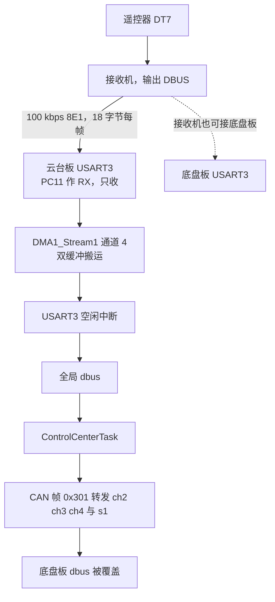
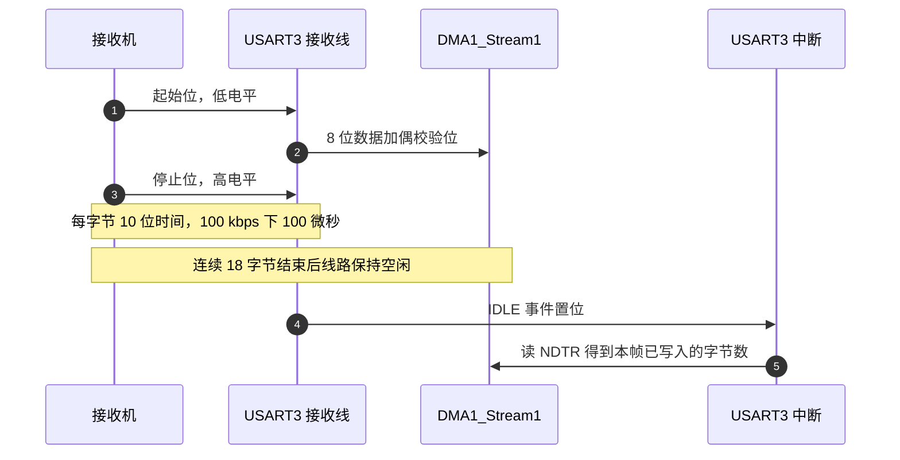
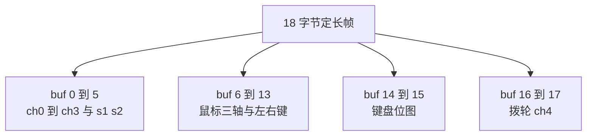

# DBUS 协议与帧格式

遥控器 DT7 与接收机配对，接收机把两个摇杆、一个拨轮、两个拨动开关、鼠标与键盘的按键状态压进一帧固定长度的串行数据，通过 DBUS 接口输出。车载主控的 USART3 接收这一帧，解析进全局结构体 `dbus`，控制任务再从结构体里取需要的字段。

这条链路是单向的：接收机只发，主控只收。整机没有向遥控器回写的需求，也没有应答或校验重传机制。理解这条链路要抓住三件事：线上一帧的物理形态、18 字节里字段怎么排、固件在哪一处把它变成结构体。逐位解析见 `02-18字节报文解析.md`，外设配置与接收链路见 `03-USART3配置与接收链路.md`，字段到目标的映射见 `04-数据结构与控制映射.md`。

## 遥控链路在整机里的位置

| 链路 | 载体 | 波特率与帧格式 | 方向 | 是否有校验 |
| --- | --- | --- | --- | --- |
| DBUS 遥控 | USART3 | 100 kbps，8E1 | 只收 | 无帧校验，仅靠偶校验与定长判断 |
| 调试串口 | USART1 | 115200，8N1 | 收发 | 无 |
| 裁判系统 | USART6 | 115200，8N1 | 收发 | CRC8 加 CRC16 |
| 视觉小电脑 | USB CDC | 全速 USB | 收发 | CRC16 |

遥控链路是其中唯一一条把链路质量交给物理层、不再做软件校验的链路。定长 18 字节与偶校验一起，构成它的全部完整性保护。



## 100 kbps 的 8E1 物理层

接收机输出的是一路异步串行数据。云台板的 USART3 初始化如下（`Core/Src/usart.c:75-83`）：

```c
huart3.Instance = USART3;
huart3.Init.BaudRate = 100000;
huart3.Init.WordLength = UART_WORDLENGTH_8B;
huart3.Init.StopBits = UART_STOPBITS_1;
huart3.Init.Parity = UART_PARITY_EVEN;
huart3.Init.Mode = UART_MODE_RX;
huart3.Init.HwFlowCtl = UART_HWCONTROL_NONE;
huart3.Init.OverSampling = UART_OVERSAMPLING_16;
```

底盘板的 `Core/Src/usart.c:75-83` 逐字相同。两板都只用这一路接收。

| 参数 | 取值 | 线上一帧的形态 |
| --- | --- | --- |
| `BaudRate` | 100000 | 每位 10 微秒 |
| `WordLength` | `UART_WORDLENGTH_8B` | 数据域 8 位 |
| `Parity` | `UART_PARITY_EVEN` | 每字节附加 1 位偶校验 |
| `StopBits` | `UART_STOPBITS_1` | 每字节后 1 位停止位 |

STM32 的 `WordLength` 只描述数据位数，校验位由 `Parity` 单独添加。8 位数据加 1 位偶校验加 1 位起始位加 1 位停止位，每个字节在线上一共占 10 位时间。100 kbps 下每字节 100 微秒，一帧 18 字节最少占 1.8 毫秒线路时间。若接收机以 14 毫秒的周期发送，线路占用率约 13%，属于轻载。

偶校验能发现每字节内的奇数个位翻转，不能纠错，也不能覆盖跨字节的连续干扰。工程上它筛掉的是电气噪声导致的偶发单字节错误。

`UART_MODE_RX` 表示该实例只启用接收方向。DBUS 链路不需要发送，配置成收发会多打开一个用不到的发送移相器与 TC 中断源。初始化后 `usart.c` 也没有配置 RX 反相（`CR2` 的 RXINV 位），固件按标准极性接收；若换用输出反相的接收机，需要另外处理极性，这一条属推断，待实测。



## 18 字节定长帧的字段分布

DBUS 一帧固定 18 字节，没有帧头、帧尾、长度域与校验域。定长本身就承担了分帧职责，接收方靠线路空闲把帧切开，再靠长度是否等于 18 决定接受或丢弃。

| 字节 | 内容 | 解析要点 |
| --- | --- | --- |
| 0 到 1 | `ch0`，左摇杆左右 | 11 位有效，跨两字节 |
| 1 到 2 | `ch1`，左摇杆前后 | 与 `ch0` 共享字节 1 |
| 2 到 4 | `ch2`，右摇杆左右 | 跨三字节 |
| 4 到 5 | `ch3`，右摇杆前后 | 与 `ch2` 共享字节 4 |
| 5 高 4 位 | `s1` 与 `s2` | 两个 2 位开关状态 |
| 6 到 11 | `mouse.x`、`mouse.y`、`mouse.z` | 各占两字节小端 |
| 12 | `mouse.l` | 左键，单字节 |
| 13 | `mouse.r` | 右键，单字节 |
| 14 到 15 | `key` | 键盘位图，小端 16 位 |
| 16 到 17 | `ch4`，拨轮 | 11 位有效，其余位忽略 |



18 字节里，摇杆与拨轮只用了 5 个 11 位字段，共 55 位，占前 6 字节的 48 位加末尾 2 字节的部分位。字节 1、2、4、5 被两个字段共享，这是后文位域拼接复杂的原因。

## 分帧靠空闲而不是帧头

DBUS 帧里没有同步字，接收方不能靠扫描特征字节找帧起点。USART 的 IDLE 事件在 RX 线上出现一个字节时间以上的空闲时置位，此时 DMA 已经把这帧全部搬进缓冲区，中断里读 NDTR 剩余计数就能得到帧长。

| 分帧方案 | 触发方式 | 每帧 CPU 参与次数 | 对帧长的要求 |
| --- | --- | --- | --- |
| RXNE 中断逐字节 | 每收到一字节 | 18 次 | 无 |
| DMA 循环加空闲中断 | 线路空闲 | 1 次 | 帧间要有空闲 |
| 定时器超时轮询 | 定时读 NDTR | 定时次数 | 帧间要有间隔 |
| 协议状态机逐字节喂入 | 每收到一字节 | 18 次 | 帧头帧尾必须存在 |

DBUS 没有帧头帧尾，第四条不适用。本工程采用第二条，代价是帧间必须有空闲：若接收机连续发送两帧而不留间隔，空闲事件不会产生，两帧的数据会被当成一帧处理。这一风险的完整分析见 `03-USART3配置与接收链路.md`。

## 配置与解析入口

解析入口在 `Communication/Src/dbus.cpp:11-34`，长度检查是第一道门：

```c
void dbus_decode(volatile uint8_t* buf, int len)
{
    if (len != 18) return; // DBUS 一帧固定 18 字节
    ...
}
```

五个通道的拼接如下：

```c
dbus.ch[0] = ((buf[0] | (buf[1] << 8)) & 0x07FF) - 1024;
dbus.ch[1] = (((buf[1] >> 3) | (buf[2] << 5)) & 0x07FF) - 1024;
dbus.ch[2] = (((buf[2] >> 6) | (buf[3] << 2) | (buf[4] << 10)) & 0x07FF) - 1024;
dbus.ch[3] = (((buf[4] >> 1) | (buf[5] << 7)) & 0x07FF) - 1024;
dbus.ch[4] = ((buf[16] | (buf[17] << 8)) & 0x07FF) - 1024;
```

五个通道都做同一件事：把散落在若干字节里的 11 位拼成一个整数，再减 1024 变成有符号值。字段结构体定义在 `Communication/Inc/dbus.h:11-26`，`ch` 是 `int16_t[5]`，中心值 1024 对应遥控器中位，解析后的范围是 -1024 到 1023。

注册与接线在 `Core/Src/main.c:72-76` 与 `Core/Src/main.c:125`：

```c
void MyUartCallbackFun(volatile uint8_t* buf, int len) {
  DBUS_Decode(buf, len);
}

Uart_Init(&huart3, MyUartCallbackFun); // huart3是连接遥控器的UART实例
```

`main.c` 只传了一个回调。`DBUS_Decode` 是 `dbus.cpp:36-40` 里的 `extern "C"` 包装，转调 `dbus_decode`。这层包装让 C 写的 `main.c` 能调用 C++ 实现。

## 读帧结构时容易弄错的地方

| 易错点 | 现象 | 本项目对应位置 |
| --- | --- | --- |
| 认为存在帧头帧尾 | 在数据里找同步字 | DBUS 没有同步字，分帧只靠空闲中断 |
| 用固定周期无脑读缓冲区 | 收到半帧也解析 | `dbus.cpp:13` 用长度 18 拦截 |
| 忽略偶校验的级别 | 以为偶校验能保证整帧正确 | 偶校验只覆盖单字节奇数位错误 |
| 把 8E1 理解成 8 位数据含校验 | 波特率或字长配错 | `WordLength` 与 `Parity` 是两个字段 |
| 认为链路可双向通信 | 为遥控器写回包 | `huart3.Init.Mode` 只启用接收 |
| 只在一处定义全局变量 | 头文件里直接定义对象 | `extern DBUS_t dbus` 在 `dbus.h:28`，实体在 `dbus.cpp:9` |
| 把 18 字节当成含校验的协议 | 找不到校验字段 | 长度本身就是全部整帧保护 |

其中“认为链路可双向通信”会直接引出无效改动：给 `huart3` 加上发送方向后，PC10 会被驱动，而该引脚在硬件上并不接回接收机，改动只是增加了两个外设中断源，链路行为不变。

## 小结

### 核心概念

- DBUS 是单向、定长、无软件校验的串行链路，参数由接收机固定为 100 kbps、8 位数据、偶校验、1 位停止位。
- 一帧 18 字节，摇杆与拨轮共 5 个 11 位字段，其余字节承载开关、鼠标与键盘。
- 8E1 下每字节 10 位时间，18 字节最少占 1.8 毫秒线路时间。
- 分帧依靠 USART 空闲中断，完整性依靠长度等于 18 与偶校验。
- 解析入口 `dbus_decode` 先判长度再写全局 `dbus`，回调链与 CAN、裁判系统各自独立。

### 设计权衡

| 决策 | 选择 | 收益 | 代价 |
| --- | --- | --- | --- |
| 数据宽度 | 每个摇杆 11 位 | 分辨率 2048 级，够用 | 字段跨字节，解析要移位拼接 |
| 帧长 | 固定 18 字节 | 无需长度域与帧头 | 换协议或加字段就要改接收端 |
| 校验 | 仅每字节偶校验 | 不占额外字节，链路开销小 | 跨字节干扰与整帧错位不可检 |
| 方向 | 只收 | 不用发送逻辑与 TC 中断 | 无法向遥控器回传状态 |
| 分帧 | 空闲中断 | 与帧长解耦，硬件自动搬运 | 空闲检测依赖线路静默，见 03 篇 |

## 练习

### 基础题

1. 写出 8E1 下每个字节在线上的位序列组成，并计算 100 kbps 时 18 字节帧的最短线路时间。
2. DBUS 帧里 5 个 11 位字段一共占多少有效位？它们分布在哪几个字节上？
3. 一帧长度是 17 时，`dbus_decode` 会做什么？`dbus` 里的旧值会怎样变化？
4. `UART_MODE_RX` 与 `UART_MODE_TX_RX` 在寄存器层面分别打开哪些功能？

### 挑战题

5. 若把接收机换成 115200 8N1 的同类模块，`usart.c` 需要改哪几行？解析层是否需要跟着改？说明理由。
6. 偶校验无法发现一个字节内两位同时翻转。构造一段 18 字节数据，使其在某个字节的两位翻转后仍能通过长度与偶校验，并说明这类错误对摇杆字段的影响。
7. 当前分帧完全依赖空闲中断。若两帧之间没有空闲间隔，`rx_data_len_` 会取到什么值？结合 `Communication/Src/usart_dma.cpp:88` 给出会发生的解析结果。

### 附：本页引用的固件路径

| 路径 | 用途 |
| --- | --- |
| `2026OmniSentryGimbal/Core/Src/usart.c` | USART3 初始化 100000 8E1 只收（`:75-83`）、MSP 与 DMA（`:158-199`） |
| `2026OmniSentryChassis/Core/Src/usart.c` | 底盘板同样的 USART3 配置（`:75-83`） |
| `2026OmniSentryGimbal/Communication/Inc/dbus.h` | `DBUS_t` 结构与全局声明（`:11-28`） |
| `2026OmniSentryGimbal/Communication/Src/dbus.cpp` | 长度检查与五个通道解析（`:11-34`） |
| `2026OmniSentryChassis/Communication/Src/dbus.cpp` | 底盘板同一份解析实现（`:11-34`） |
| `2026OmniSentryGimbal/Core/Src/main.c` | 回调与 `Uart_Init` 接线（`:72-76`、`:125`） |
| `2026OmniSentryGimbal/Communication/Src/usart_dma.cpp` | 空闲回调与帧长计算（`:81-116`） |
