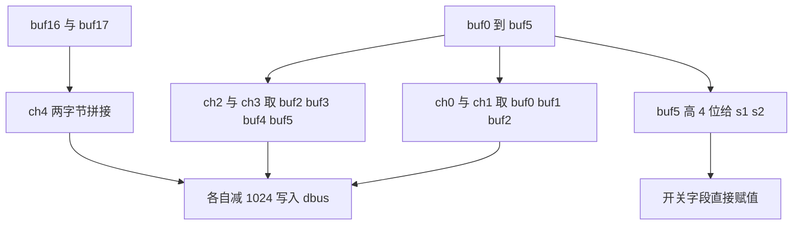
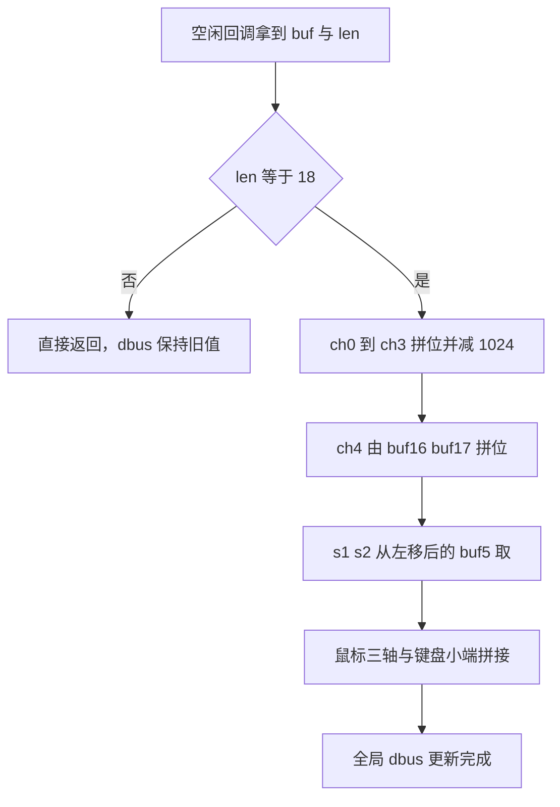

# 18 字节报文解析

18 字节的字节流里，五个摇杆与拨轮字段每个 11 位，彼此紧挨着排布，一个字节往往同时属于两个字段。固件没有建一个 48 位的中间量，而是逐字段用移位与掩码把需要的位拼出来。要把这套写法读明白，只需要抓住一条规则：越靠后的通道，低位来自越靠后的字节。

本页只拆 `Communication/Src/dbus.cpp` 这 24 行，逐条给出等价的位运算与数值验证。帧格式与物理层在 `01-DBUS协议与帧格式.md`，接收链路在 `03-USART3配置与接收链路.md`。

## 小端字节流里的 11 位字段

把前 6 个字节按小端拼成一个整数，字段与位段的对应关系是干净的：

$$S = buf[0] + buf[1]\cdot 2^8 + buf[2]\cdot 2^{16} + buf[3]\cdot 2^{24} + buf[4]\cdot 2^{32} + buf[5]\cdot 2^{40}$$

| 字段 | 位段 | 原始值表达式 | 物理含义 |
| --- | --- | --- | --- |
| `ch[0]` | 位 0 到 10 | `S & 0x07FF` | 左摇杆左右 |
| `ch[1]` | 位 11 到 21 | `(S >> 11) & 0x07FF` | 左摇杆前后 |
| `ch[2]` | 位 22 到 32 | `(S >> 22) & 0x07FF` | 右摇杆左右 |
| `ch[3]` | 位 33 到 43 | `(S >> 33) & 0x07FF` | 右摇杆前后 |
| 开关 | 位 44 到 47 | `(S >> 44) & 0x0F` | `s1` 与 `s2` |

位段连续、没有填充位，这是定长协议的常见做法：发送端一次把 11 位按序写进流里，接收端只需按固定偏移取。代价是字段边界不与字节边界对齐，单独读一个字节得不到完整字段。

## 五个通道的跨字节拼接

固件里的五条赋值：

```c
// 0000_0111_1111_1111
dbus.ch[0] = ((buf[0] | (buf[1] << 8)) & 0x07FF) - 1024;
dbus.ch[1] = (((buf[1] >> 3) | (buf[2] << 5)) & 0x07FF) - 1024;
dbus.ch[2] = (((buf[2] >> 6) | (buf[3] << 2) | (buf[4] << 10)) & 0x07FF) - 1024;
dbus.ch[3] = (((buf[4] >> 1) | (buf[5] << 7)) & 0x07FF) - 1024;
dbus.ch[4] = ((buf[16] | (buf[17] << 8)) & 0x07FF) - 1024;
```

| 字段 | 参与的字节 | 每字节贡献的位 | 掩码后取值范围 |
| --- | --- | --- | --- |
| `ch[0]` | `buf[0]`、`buf[1]` | buf0 全部 8 位、buf1 低 3 位 | 0 到 2047 |
| `ch[1]` | `buf[1]`、`buf[2]` | buf1 高 5 位（右移 3）、buf2 低 6 位（左移 5） | 0 到 2047 |
| `ch[2]` | `buf[2]`、`buf[3]`、`buf[4]` | buf2 高 2 位、buf3 全部 8 位、buf4 低 2 位（左移 10） | 0 到 2047 |
| `ch[3]` | `buf[4]`、`buf[5]` | buf4 高 7 位（右移 1）、buf5 低 4 位（左移 7） | 0 到 2047 |
| `ch[4]` | `buf[16]`、`buf[17]` | 与 `ch[0]` 相同的两字节拼接 | 0 到 2047 |

三条规律决定这些表达式怎么写：

1. 越靠后的通道，低位来自越靠后的字节。`ch[2]` 的高位在 `buf[4]`，不在 `buf[2]`。
2. 一个字节最多参与两个相邻通道。`buf[1]` 同时供 `ch[0]` 与 `ch[1]`，`buf[4]` 同时供 `ch[2]` 与 `ch[3]`。
3. 掩码 `0x07FF` 覆盖 11 位，移位后可能带入相邻字段的位，掩码把它们清掉。移位与掩码的顺序不能交换。



## 中位参考帧怎么反推

遥控器各摇杆处在中位时，每个字段的原始值都是 1024，即 11 位里只有第 10 位置 1。按位段关系反推字节，前六个字节是 `00 04 20 00 01 08`：

```c
ch0 = (0x00 | (0x04 << 8))          & 0x7FF = 0x400 = 1024 -> 0
ch1 = ((0x04 >> 3) | (0x20 << 5))   & 0x7FF = 0x400 = 1024 -> 0
ch2 = ((0x20 >> 6) | (0x00 << 2) | (0x01 << 10)) & 0x7FF = 0x400 = 1024 -> 0
ch3 = ((0x01 >> 1) | (0x08 << 7))   & 0x7FF = 0x400 = 1024 -> 0
```

拨轮中位使 `buf[16]=0x00`、`buf[17]=0x04`。完整 18 字节中位帧是 `00 04 20 00 01 08 00 00 00 00 00 00 00 00 00 00 00 04`。把这段数据写进接收缓冲区，`dbus.ch` 五个元素与鼠标、键盘都应为零。

这段数据是离线验证解析正确性的最小用例：不需要遥控器和接收机，直接把数组喂给 `dbus_decode` 就能检查五个通道是否归零以及掩码是否写对。构造其他帧时同理，先按位段写出期望的字段值，再反推字节。

## 有符号化与摇杆行程

原始字段是 11 位无符号数，范围 0 到 2047。减 1024 之后映射到 -1024 到 1023，中位对应 0。结果赋给 `int16_t`，负数转换按二进制补码，没有溢出风险。

遥控器出厂标定的摇杆有效行程通常小于满量程。`Task/Src/ControlCenterTask.cpp` 的注释写摇杆范围约 -660 到 660，这是接收机或遥控器的行程标定，不是解析层截断，两条信息不要混为一谈。该行程数值属推断，待实测。解析层能给出的理论范围始终是 -1024 到 1023，实际能到多少由遥控器机械限位决定，控制映射里的增益按实测行程标定更合理。

## s1 与 s2 的掩码方向

开关字段 `s1` 与 `s2` 都在 `buf[5]` 的高 4 位：

```c
dbus.s1 = ((buf[5] >> 4) & 0x000C) >> 2;
dbus.s2 = ((buf[5] >> 4) & 0x0003);
```

先把 `buf[5]` 右移 4 位，高 4 位落到低 4 位。`s1` 再取其中位 2 与位 3（原 `buf[5]` 的位 6 与位 7），`s2` 取位 0 与位 1（原 `buf[5]` 的位 4 与位 5）。

| 取值 | `s1` | `s2` |
| --- | --- | --- |
| 1 | 上 | 上 |
| 2 | 中 | 中 |
| 3 | 下 | 下 |
| 0 | 无效，未标定 | 无效，未标定 |

举例：`buf[5]=0x68` 时，右移 4 位得 `0x6`。`s1 = (0x6 & 0xC) >> 2 = 1`，`s2 = 0x6 & 0x3 = 2`，上开关在上、下开关在中。两行的掩码方向不同，核对时同时写出两个取值，单独看一行容易把顺序看反。

## 鼠标与键盘的位图

```c
dbus.mouse.x = buf[6] | (buf[7] << 8);
dbus.mouse.y = buf[8] | (buf[9] << 8);
dbus.mouse.z = buf[10] | (buf[11] << 8);
dbus.mouse.l = buf[12];
dbus.mouse.r = buf[13];
dbus.key = buf[14] | (buf[15] << 8);
```

鼠标三轴各占两字节小端，左右键各占一字节，键盘是一张 16 位位图。两块板都只解析、不读取这些字段：在云台板与底盘板的任务与 BSP 目录里搜索 `dbus.mouse` 与 `dbus.key`，没有命中。鼠标与键盘在整机上没有分配用途。

若后续要接入，读取方式与摇杆相同，例如 `if (dbus.mouse.l) { ... }` 与 `if (dbus.key & (1 << 3)) { ... }`，位号与按键的对应关系需要按遥控器手册另查。鼠标三轴的零点是相对位移，中位帧里这三个字段为零只说明此刻没有移动，不能当作绝对位置。

## 解析函数的四个调用点

| 调用点 | 文件与行号 | 上下文 |
| --- | --- | --- |
| `DBUS_Decode` | `Core/Src/main.c` | USART3 空闲中断 |
| `dbus_decode` | `Communication/Src/dbus.cpp` | `extern "C"` 包装 |
| 长度判断 | `Communication/Src/dbus.cpp` | 进入解析的第一道门 |
| 通道写入 | `Communication/Src/dbus.cpp` | 中断上下文 |

回调注册在 `Core/Src/main.c`，底盘板的接线与之相同。整条链路的时序与双缓冲细节在 `03-USART3配置与接收链路.md`。



## 逐位核对时容易弄错的地方

| 易错点 | 现象 | 本项目对应位置 |
| --- | --- | --- |
| 误以为 `buf[2]` 存 `ch[2]` 高位 | 摇杆方向跳变或大范围错误 | `dbus.cpp`，位段关系见前文 |
| 移位与掩码写反顺序 | 相邻字段位渗入 | 五条通道都先移位后 `& 0x07FF` |
| 忘记减 1024 | 中位读成 1024 | `dbus.cpp` 统一减去 |
| 把 `s1` 与 `s2` 掩码对调 | 开关状态与预期相反 | `dbus.cpp` |
| 认为 11 位字段是满量程 | 拿 1023 当摇杆机械极限 | 实际行程见 `ControlCenterTask.cpp` 注释 |
| 鼠标或键盘位直接当有效输入 | 读取未标定的位 | 两块板都没有消费这些字段 |
| 用单次采样判断字段是否跳动 | 把真实抖动当解析错误 | 先用中位帧做静态验证 |

最后一条是排查顺序问题：先用中位帧确认解析在静态下正确，再动遥控器观察字段，能把解析层错误与遥控器抖动分开。

## 小结

### 核心概念

- 五个摇杆与拨轮字段各 11 位，按位段连续排列在前 6 字节与末尾 2 字节里。
- 每个字段的拼接规则是：越靠后的通道，低位来自越靠后的字节。
- `ch[4]` 拨轮单独由 `buf[16]` 与 `buf[17]` 拼接，公式与 `ch[0]` 相同。
- 每个字段先移位拼接，再用 `0x07FF` 清掉邻位，最后减 1024 转成中位为零的有符号值。
- `s1` 与 `s2` 都在 `buf[5]` 高 4 位，两行掩码方向不同。
- 鼠标与键盘解析后没有消费者，位号缺少标定依据。

### 设计权衡

| 决策 | 选择 | 收益 | 代价 |
| --- | --- | --- | --- |
| 字段宽度 | 11 位 | 2048 级分辨率 | 必须跨字节拼接，可读性差 |
| 解析方式 | 展开位移，不建中间 48 位量 | 少一次宽位运算 | 每行都要单独核对位偏移 |
| 长度处理 | 非 18 直接返回 | 半帧不会污染 `dbus` | 丢弃静默，无计数可观测 |
| 鼠标键盘 | 解析但不使用 | 保留将来扩展余地 | 字段与位号缺少标定依据 |
| 有符号化 | 统一减 1024 | 中心为零，控制器友好 | 与遥控器机械行程不是同一量纲 |

## 练习

### 基础题

1. 已知 `buf[0]=0xFF`、`buf[1]=0x07`，写出 `ch[0]` 的原始值与解析后的值。
2. 写出 `buf[5]=0x48` 时 `s1`、`s2` 的取值，并对照取值表说明开关位置。
3. `ch[2]` 的 11 位里，哪几位来自 `buf[2]`，哪几位来自 `buf[4]`？
4. 把中位帧写进缓冲区，验证 `ch[1]` 与 `ch[3]` 是否为零。

### 挑战题

5. 若协议新增一个 11 位字段到 `buf[17]` 的高 3 位与 `buf[15]` 的一部分，写出类似 `ch[2]` 的三字节拼接表达式，并说明需要修改哪几条既有语句。
6. 不构造中间变量 S，只用 `buf[0]` 到 `buf[5]` 写出 `(S >> 22) & 0x07FF` 的等价展开，并与 `dbus.cpp` 逐项对照，指出哪一字节的低位被丢弃。
7. `dbus_decode` 在长度不为 18 时直接返回。设计一种在不改动函数签名的前提下观测丢弃次数的方案，并说明中断上下文里哪些操作不可用。

### 附：本页引用的固件路径

| 路径 | 用途 |
| --- | --- |
| `2026OmniSentryGimbal/Communication/Src/dbus.cpp` | 24 行解析实现 |
| `2026OmniSentryChassis/Communication/Src/dbus.cpp` | 与云台板逐字相同的解析实现 |
| `2026OmniSentryGimbal/Communication/Inc/dbus.h` | `DBUS_t` 字段类型与顺序 |
| `2026OmniSentryGimbal/Core/Src/main.c` | `MyUartCallbackFun` 与 `DBUS_Decode` 调用 |
| `2026OmniSentryChassis/Core/Src/main.c` | 底盘板同样的回调接线 |
| `2026OmniSentryGimbal/Task/Src/ControlCenterTask.cpp` | 摇杆行程注释与通道用途 |
