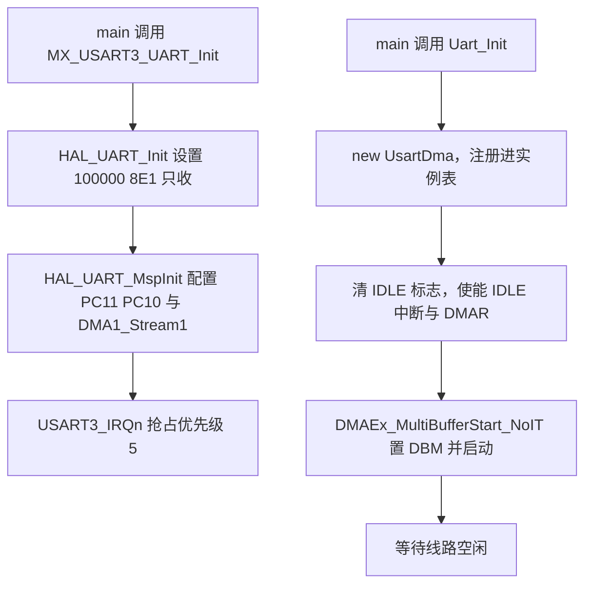
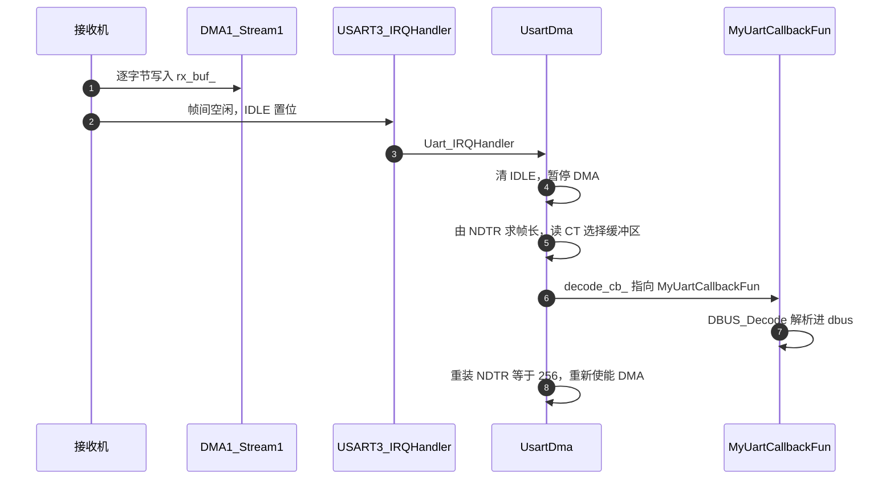

# USART3 配置与接收链路

DBUS 一帧 18 字节，接收机连续发出，帧与帧之间线路空闲。接收方不需要知道帧起点由谁给出，只需要在数据流停下来时把已写入缓冲区的字节数读出来。STM32 的 USART 提供 IDLE 事件：RX 线上出现一个字节时间以上的空闲时，SR 寄存器的 IDLE 位置 1。配合 DMA 循环搬运，这套组合可以做到数据进缓冲区不用 CPU、空闲时 CPU 只处理一次。

本页从 CubeMX 生成的配置讲到一次接收走完的完整路径，接收类与 C 接口在 `Communication/Src/usart_dma.cpp` 与 `Communication/Inc/usart_dma.h`，两块板逐字相同。帧格式在 `01-DBUS协议与帧格式.md`，解析逐行在 `02-18字节报文解析.md`。

## 定长帧为什么配空闲中断

| 分帧方案 | 触发方式 | 每帧 CPU 参与次数 | 对帧长的要求 |
| --- | --- | --- | --- |
| RXNE 中断逐字节 | 每收到一字节 | 18 次 | 无 |
| DMA 循环加空闲中断 | 线路空闲 | 1 次 | 帧间要有空闲 |
| 定时器超时轮询 | 定时读 NDTR | 定时次数 | 帧间要有间隔 |
| 协议状态机逐字节喂入 | 每收到一字节 | 18 次 | 帧头帧尾必须存在 |

DBUS 没有帧头帧尾，第四条不适用；帧长固定，第一条与第三条的额外开销没有必要。本工程采用第二条：DMA 负责搬运，IDLE 负责划定帧边界，每帧只需要一次中断服务。

## USART3 初始化参数

`MX_USART3_UART_Init` 在 `Core/Src/usart.c`，参数与 `01-DBUS协议与帧格式.md` 列出的 100000 8E1 只收一致。与接收相关的还有 `HAL_UART_MspInit` 里的三段（`usart.c`）：

| 配置项 | 取值 | 出处 |
| --- | --- | --- |
| 引脚 | PC11 作 RX，PC10 作 TX，复用 `GPIO_AF7_USART3` | `usart.c` |
| DMA 实例 | `DMA1_Stream1`，通道 4 | `usart.c` |
| 传输方向 | `DMA_PERIPH_TO_MEMORY` | `usart.c` |
| 地址自增 | 外设不自增，内存自增，单位字节 | `usart.c` |
| 模式 | `DMA_CIRCULAR` | `usart.c` |
| 中断优先级 | `USART3_IRQn` 抢占优先级 5，子优先级 0 | `usart.c` |

PC10 虽然被配置成 AF 复用并接到 USART3_TX，但 `huart3.Init.Mode` 是只收，这个引脚在 DBUS 链路上不产生输出。底盘板 `usart.c` 与之相同。



## 运行期改写双缓冲

CubeMX 配置的 `DMA_CIRCULAR` 并没有被 HAL 的 DMA 启动函数使用。`Uart_Init` 在 `main.c` 被调用后，`UsartDma` 构造函数先注册实例，再执行 `Init`（`Communication/Src/usart_dma.cpp`）：

```c
__HAL_UART_CLEAR_IDLEFLAG(huart_);
__HAL_UART_ENABLE_IT(huart_, UART_IT_IDLE);
SET_BIT(huart_->Instance->CR3, USART_CR3_DMAR);
DMAEx_MultiBufferStart_NoIT(huart_->hdmarx, ..., rx_buf_[0], rx_buf_[1], UART_RX_BUF_LEN);
SET_BIT(huart_->Instance->CR3, USART_CR3_DMAT);
```

`DMAEx_MultiBufferStart_NoIT` 自己置 `DMA_SxCR_DBM` 双缓冲位并直接写 M0AR、M1AR、NDTR（`usart_dma.cpp`），全程不经过 `HAL_UART_Receive_DMA`。这是本工程接收链路的一个特征：HAL 的 DMA 接收 API 在本工程未使用。若要使用 HAL 路径，写法是 `HAL_UART_Receive_DMA(&huart3, buf, len)` 加 `HAL_UARTEx_ReceiveToIdle_DMA`，但那样会在 HAL 内部管理 NDTR 与回调，和现有双缓冲控制方式冲突。

缓冲区是两个 256 字节数组 `rx_buf_[2][256]`（`Communication/Inc/usart_dma.h`），`UART_RX_BUF_LEN` 定义为 256（`usart_dma.h`）。双缓冲的意义在于：一块正在被解析时，DMA 可以把新数据写进另一块，解析过程中读到的内容不会被中途改写。

## 中断入口与实例表查找

`USART3_IRQHandler` 在 `Core/Src/stm32f4xx_it.c`：

```c
void USART3_IRQHandler(void)
{
  Uart_IRQHandler(&huart3);
  HAL_UART_IRQHandler(&huart3);
}
```

自定义处理放在 HAL 处理之前。`Uart_IRQHandler` 是 C 接口，转调 `UsartDma::IRQHandler`（`usart_dma.cpp`），用 `findInstance` 从静态实例表按 `huart` 指针找回对象（`usart_dma.cpp`）。实例表容量由 `DT7DMA_MAX_INSTANCES` 决定，为 3（`usart_dma.h`）。

## 空闲回调与帧长计算

`UsartDma::IRQHandler` 判断 IDLE 标志与中断使能位同时成立后，在 `callback_busy_` 为零时调用 `uartRxIdleCallback`（`usart_dma.cpp`）：

```c
callback_busy_ = 1;
__HAL_UART_CLEAR_IDLEFLAG(huart_);
__HAL_DMA_DISABLE(huart_->hdmarx);
rx_data_len_ = UART_RX_BUF_LEN - huart_->hdmarx->Instance->NDTR;
if (huart_->hdmarx->Instance->CR & DMA_SxCR_CT)
    dmaM1RxCpltCallback;
else
    dmaM0RxCpltCallback;
__HAL_DMA_SET_COUNTER(huart_->hdmarx, UART_RX_BUF_LEN);
__HAL_DMA_ENABLE(huart_->hdmarx);
callback_busy_ = 0;
```

NDTR 是 DMA 剩余传输计数器，256 减去它得到本轮已搬运的字节数。`DMA_SxCR_CT` 指示当前目标缓冲区：CT 为 1 时数据写在 `rx_buf_[1]`，调用 M1 回调；为 0 时写在 `rx_buf_[0]`，调用 M0 回调。清 IDLE 标志与暂停 DMA 都在求帧长之前完成，避免在计算过程中长度发生变化。

## 双缓冲切换与回调终点

两个回调各做两件事（`usart_dma.cpp`）：

```c
void UsartDma::dmaM0RxCpltCallback {
    huart_->hdmarx->Instance->CR |= DMA_SxCR_CT;
    if (decode_cb_) decode_cb_(rx_buf_[0], rx_data_len_);
}
void UsartDma::dmaM1RxCpltCallback {
    huart_->hdmarx->Instance->CR &= ~(uint32_t)(DMA_SxCR_CT);
    if (decode_cb_) decode_cb_(rx_buf_[1], rx_data_len_);
}
```

先翻转 CT 位再调回调，使下一次 DMA 写向另一个缓冲区，本次处理的数据在本回调期间不再被改写。

`decode_cb_` 是 `Uart_Init` 传入的函数指针（`usart_dma.cpp`）。云台板传入 `MyUartCallbackFun`，函数体只有一句 `DBUS_Decode(buf, len)`（`Core/Src/main.c`），最终落到 `dbus_decode`。



## 链路中的风险点

| 环节 | 事实 | 风险 |
| --- | --- | --- |
| 帧长计算 | `rx_data_len_ = 256 - NDTR` | 依赖 DMA 从 NDTR 等于 256 开始，重装在同一函数末尾完成 |
| 双缓冲切换 | 手动翻转 `DMA_SxCR_CT` | 不依赖 HAL 回调，改动 DMA 配置时要同步改这一位 |
| 回调重入保护 | `callback_busy_` 只覆盖空闲回调 | 解析本身仍在中断上下文里执行，耗时长的解析会拉长中断 |
| 实例表容量 | `DT7DMA_MAX_INSTANCES` 为 3（`usart_dma.h`） | `Uart_Init` 用 `new` 且不判空，表满时构造函数已运行但注册失败 |
| DMA 发送 | `Uart_Transmit_DMA` 在本工程两块板没有调用点 | 只收链路上不触发 TC 回调 |
| HAL 接收 API | `HAL_UART_Receive_DMA` 未使用 | 自定义双缓冲与 HAL 状态机不同步，混用会冲突 |

云台板 `main.c` 只注册了 `huart3`，底盘板 `main.c` 还注册了 `huart6` 给裁判系统。同一套 `UsartDma` 被两个实例复用，实例表容量 3 够用。

双缓冲与 `callback_busy_` 各解决一部分问题：前者保证解析期间数据不被改写，后者防止空闲回调自身重入。两者都不处理“解析耗时超过帧周期”的情况，那种情况下新数据会在解析尚未结束时覆盖另一块缓冲区。

## 接收链路里容易弄错的地方

| 易错点 | 现象 | 本项目对应位置 |
| --- | --- | --- |
| 以为用的是 CubeMX 的 `DMA_CIRCULAR` | 改 `usart.c` 的模式无效 | `usart_dma.cpp` 另置 `DMA_SxCR_DBM` |
| 在空闲回调外读 NDTR | 读到半帧长度 | 帧长只在 `usart_dma.cpp` 计算 |
| 忘记清 IDLE 标志 | 中断持续进入 | `usart_dma.cpp` |
| 回调里做耗时操作 | 中断占用升高 | 解析在 `dbus.cpp` 内完成，行数少 |
| 两个实例共用静态表 | 表满后回调丢失 | `usart_dma.cpp`，云台板只用 1 个 |
| 混用 HAL 接收与自定义双缓冲 | NDTR 与状态被两套逻辑改写 | `HAL_UART_Receive_DMA` 全工程无调用点 |
| 在重装 NDTR 之后读帧长 | 读到上一帧的缓存值 | `usart_dma.cpp` 与  的先后关系 |

最后一条属于观测时机问题，不是缺陷：重装之后 `rx_data_len_` 仍保留本次的值，直到下一帧空闲回调再被覆盖。断点停在重装之前才能看到本次长度。

## 小结

### 核心概念

- USART3 配 100000 8E1 只收，PC11 作 RX，DMA1_Stream1 通道 4 负责搬运，NVIC 抢占优先级 5。
- 分帧靠 IDLE 事件，帧长由 `256 - NDTR` 得到，双缓冲 M0 与 M1 交替。
- 双缓冲由 `DMAEx_MultiBufferStart_NoIT` 手动置 `DMA_SxCR_DBM` 并直接启动，不走 HAL 的 DMA 接收 API。
- 中断路径是 `USART3_IRQHandler` 到 `Uart_IRQHandler` 到 `UsartDma::IRQHandler` 到空闲回调，再到应用回调。
- `callback_busy_` 保护空闲回调重入，解析仍在中断上下文完成。
- 两个回调都先翻转 CT 位再解析，保证处理期间数据不被改写。

### 设计权衡

| 决策 | 选择 | 收益 | 代价 |
| --- | --- | --- | --- |
| 分帧 | IDLE 加 DMA 双缓冲 | 每帧一次中断，CPU 参与少 | 帧间必须有空闲，否则长度出错 |
| DMA 启动 | 绕开 HAL 自己写寄存器 | 完全控制 DBM 与 CT | 与 HAL 状态机脱节，调试要直接读寄存器 |
| 缓冲区 | 双缓冲各 256 字节 | 处理期间新数据写入另一块 | 单帧超过 256 字节会覆盖 |
| 解析位置 | 中断内直接解析 | 无队列与任务同步开销 | 中断时间等于解析时间 |
| 发送 | 不启用 | 链路简单 | `Uart_Transmit_DMA` 成为未接线代码 |

## 练习

### 基础题

1. 写出 USART3 的引脚、DMA 实例与中断优先级，并说明 PC10 在链路上的实际作用。
2. `rx_data_len_ = UART_RX_BUF_LEN - NDTR` 中，NDTR 为 238 时帧长是多少？对应接收了多少字节？
3. `DMA_SxCR_CT` 为 0 时，本次数据写在哪个缓冲区，回调是哪一个？
4. `Uart_IRQHandler` 与 `HAL_UART_IRQHandler` 在 `USART3_IRQHandler` 里的先后顺序是什么？

### 挑战题

5. 若接收机在一帧结束后立即发下一帧，帧间没有空闲，说明 NDTR 与 `rx_data_len_` 会取到什么值，以及 `dbus_decode` 会如何处理。给出一种在软件侧弥补的思路。
6. `callback_busy_` 只在 `uartRxIdleCallback` 内部置位与清零。构造一种场景说明它为什么不能防止 DMA 在解析期间改写数据，并说明双缓冲的哪一步弥补了这一点。
7. 当前 `Uart_Init` 用 `new` 分配对象且不判空（`usart_dma.cpp`）。在实例表已满时，写出会发生的行为序列，并给出一种不引入动态分配的改法。

### 附：本页引用的固件路径

| 路径 | 用途 |
| --- | --- |
| `2026OmniSentryGimbal/Core/Src/usart.c` | USART3 参数与 MSP、DMA、NVIC |
| `2026OmniSentryChassis/Core/Src/usart.c` | 底盘板同一份配置 |
| `2026OmniSentryGimbal/Core/Src/main.c` | `Uart_Init` 接线与回调 |
| `2026OmniSentryChassis/Core/Src/main.c` | `Uart_Init` 注册 huart3 与 huart6 |
| `2026OmniSentryGimbal/Core/Src/stm32f4xx_it.c` | `USART3_IRQHandler`、DMA1_Stream1 ISR |
| `2026OmniSentryChassis/Core/Src/stm32f4xx_it.c` | 底盘板同样的 USART3 中断 |
| `2026OmniSentryGimbal/Communication/Src/usart_dma.cpp` | 初始化、空闲回调、双缓冲启动 |
| `2026OmniSentryGimbal/Communication/Inc/usart_dma.h` | 缓冲区与实例表定义 |
| `2026OmniSentryChassis/Communication/Src/usart_dma.cpp` | 与云台板逐字相同的接收类 |
