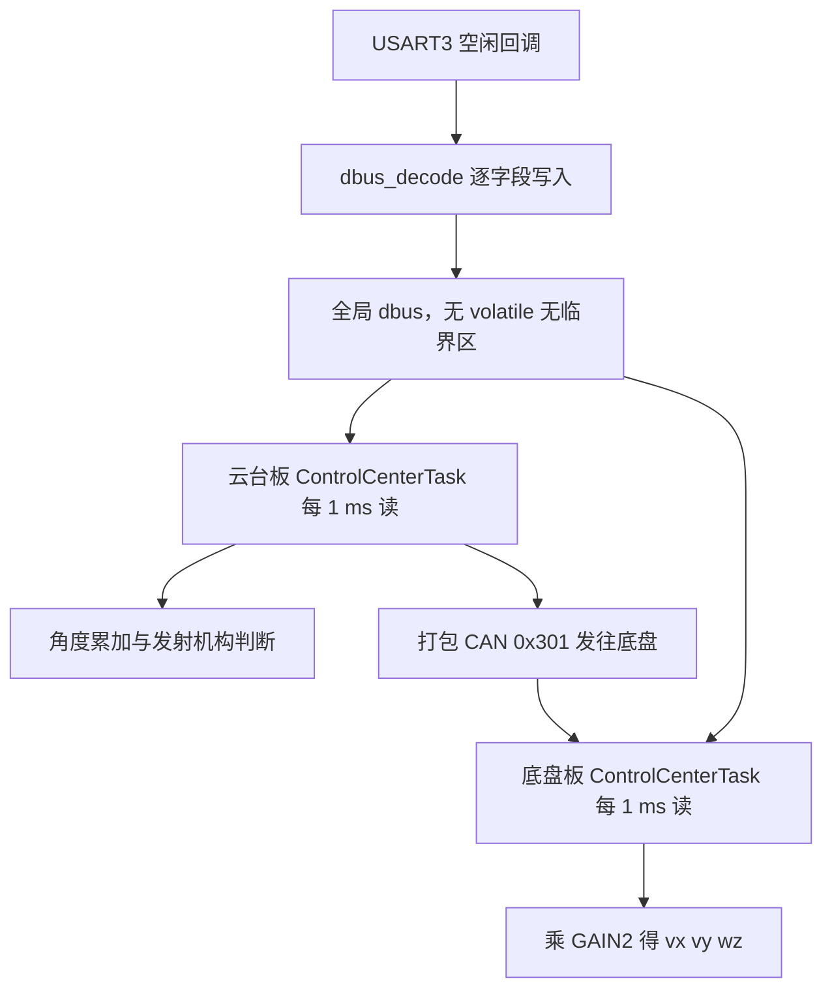
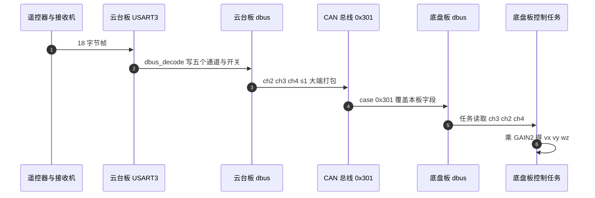

# 数据结构与控制映射

解析把 18 字节变成结构体字段，控制任务再把字段变成电机目标。两端之间没有队列、没有拷贝，只有一个全局对象 `DBUS_t dbus`：中断直接写，任务直接读。这种传递方式代码最短，代价是同步语义要由使用者自己承担。

本页关注数据结构本身的可见性与映射链路。解析逐行在 `02-18字节报文解析.md`，接收链路在 `03-USART3配置与接收链路.md`。读完要能回答：`DBUS_t` 有多大、字段偏移是多少；两块板的映射方向为什么不一致；CAN 0x301 在这条链路上承担什么角色。

## 一个全局结构体连接中断与任务

| 传递方式 | 生产者 | 消费者 | 拷贝次数 | 同步手段 |
| --- | --- | --- | --- | --- |
| 全局结构体 | 中断直接写 | 任务直接读 | 0 | 无 |
| 消息队列 | 中断投递 | 任务阻塞取 | 1 | 队列内部临界区 |
| 双缓冲加发布标志 | 中断写备用区 | 任务读活动区 | 0 | 标志位 |

本工程选第一种。对 18 字节的定长小结构体，零拷贝与零同步开销是有吸引力的；代价是任务可能读到更新到一半的内容，且没有任何机制告知数据是否新鲜。

## DBUS_t 的字段与偏移

结构体在 `Communication/Inc/dbus.h`：

```c
typedef struct
{
    int16_t ch[5];   // 四个通道（摇杆数据）
    uint8_t s1;      // 开关 S1
    uint8_t s2;      // 开关 S2

    struct {
        int16_t x;
        int16_t y;
        int16_t z;
        uint8_t l;  // 左键
        uint8_t r;  // 右键
    } mouse;

    uint16_t key;    // 键盘按键
} DBUS_t;
```

| 字段 | 类型 | 长度 | 相对偏移 |
| --- | --- | --- | --- |
| `ch[5]` | `int16_t` | 10 字节 | 0 |
| `s1`、`s2` | `uint8_t` | 各 1 字节 | 10、11 |
| `mouse.x/y/z` | `int16_t` | 各 2 字节 | 12、14、16 |
| `mouse.l/r` | `uint8_t` | 各 1 字节 | 18、19 |
| `key` | `uint16_t` | 2 字节 | 20 |

`ch` 是 `int16_t[5]`，能直接存放减 1024 之后的有符号值。摇杆与拨轮共用这个数组的下标 0 到 4，通道含义由注释给出。`mouse` 的三轴也是有符号类型，因为鼠标位移是两个方向都可取的相对量；`key` 是 16 位位图，用无符号类型。结构体没有打包修饰，自然对齐下总长 22 字节，字段偏移与上表一致。

注释写“四个通道”，实际数组长度是 5，第五个元素对应拨轮 `ch[4]`。这不影响行为，但读代码时容易按注释以为只有四个元素。

## 对象实体与重复声明

对象实体定义在 `Communication/Src/dbus.cpp`：

```c
DBUS_t dbus;
```

声明在 `Communication/Inc/dbus.h`：`extern DBUS_t dbus;`。头文件被所有消费者包含。云台板 `Task/Src/ImuTask.cpp` 与底盘板 `BSP/Src/bsp_can.cpp` 另外各写了一遍 `extern DBUS_t dbus;`，与头文件里的声明重复。重复的 `extern` 声明合法，但会在同一个翻译单元里出现两条同名声明。

没有把 `dbus` 做成函数局部静态或类成员，是为了让中断侧与任务侧访问同一个地址，不需要额外接口。代价是任何包含该头文件的翻译单元都能写它，写入点难以枚举。梳理 `dbus` 字段的更新来源时要同时看解析函数与任务侧，云台板的 `ControlCenterTask` 就会覆盖 `s1`。

## 中断写任务读的并发边界

写入发生在中断上下文，读取发生在任务上下文。两侧都直接访问同一块内存，没有临界区、没有内存屏障、声明里没有 `volatile`。

| 事实 | 位置 | 影响 |
| --- | --- | --- |
| 全局对象无 `volatile` | `dbus.h` | 编译器可在循环外缓存字段值，任务可能读不到新数据 |
| 16 位字段读写非原子保证 | `dbus.h` | 单次加载在 Cortex-M4 上是原子的，但跨字段的组合不是 |
| 任务与中断可抢占 | FreeRTOS 抢占式调度 | 一帧更新到一半时任务可能读到新旧混合 |
| 没有失联检测 | 全工程无超时判断 | 接收机停发后 `dbus` 保持最后一次的值 |

`volatile` 缺失的后果与优化等级有关。当前代码在较低优化下大概率能工作，提升优化等级后出现遥控器动作而任务不响应的可能性需要重新验证。单字段读取在 Cortex-M4 上是单条加载指令，不会读到半个字段；风险集中在跨字段组合，例如先读 `ch[2]` 再读 `ch[3]` 时，两者可能来自不同帧。



## 云台板的字段映射

`Task/Src/ControlCenterTask.cpp` 每 1 毫秒循环一次（`osDelay(1)`，），读取 `dbus` 的方式如下：

| 字段 | 用途 |
| --- | --- |
| `s1` | 选择 `control_target.control_mode` |
| `ch[1]` | 累加到 `gimbal_pitch_angle`，系数 0.001 |
| `ch[0]` | 累减到 `gimbal_yaw_angle`，系数 0.001 |
| `s2` | 控制 `friction_ready` 与 `feeder_ready` |
| `ch[2]`、`ch[3]`、`ch[4]`、`s1` | 打包进 CAN 帧 0x301 发往底盘板 |

云台板对摇杆的处理是角度累加，不是速度映射：每次循环把 `ch[1] * 0.001` 加到目标俯仰角上。摇杆回中时 `ch[1]` 为零，目标角停在当前位置。这种映射让云台在遥控器松手后保持角度。

`s1` 的分支无法按遥控器实际状态工作。`ControlCenterTask.cpp` 在读取前无条件执行 `dbus.s1 = 3;`，分支随即落到 `MODE_AI`。同一文件  在发送 0x301 前又把 `s1` 置 3。中断里解析出的 `s1` 值被任务覆盖，开关切换在云台板上不生效。这是一处明确的功能缺陷，也是后面“值正确但行为不对”类问题的典型来源。

## CAN 0x301 的板间转发

云台板把右摇杆三个分量与开关打包成标准帧发出（`BSP/Src/bsp_can.cpp`）：

```c
TxHeader.StdId = 0x301;
```

三个通道按大端写入，字节 6 放开关。调用点在 `ControlCenterTask.cpp`，实参顺序是 `ch[2]`、`ch[3]`、`ch[4]`、`s1`。

底盘板在 CAN 接收里把 `0x301` 写回本板的 `dbus`（`BSP/Src/bsp_can.cpp`）：

```c
case 0x301: {
    dbus.ch[2] = ((RxData[0] << 8) | RxData[1]);
    dbus.ch[3] = ((RxData[2] << 8) | RxData[3]);
    dbus.ch[4] = ((RxData[4] << 8) | RxData[5]);
    dbus.s1    =   RxData[6];
}
case 0x302: {
```

这段 `case 0x301` 末尾没有 `break`，执行完会落穿进 `case 0x302` 的浮点还原代码。0x302 是云台 yaw 角帧，落穿后底盘板会把 `RxData` 当浮点解析，`dbus.ch[2..4]` 随后可能被同一分支以外的逻辑覆盖。0x301 与 0x302 都由云台板发出，落穿的具体后果取决于 0x302 分支写了哪些变量，需要现场确认。

底盘板也注册了自己的 USART3 遥控接收（`Core/Src/main.c`），本板解析会写 `ch[0]`、`ch[1]` 与 `s2`，而 CAN 0x301 覆盖 `ch[2]`、`ch[3]`、`ch[4]` 与 `s1`。两块板各自接一路 DBUS 还是只有一块接接收机，属待现场确认项。



## 底盘板的字段映射

底盘板的速度映射与云台板不同：

```c
const float GAIN2=5.0f;
control_target.chassis_vx = dbus.ch[3]*GAIN2;
control_target.chassis_vy = dbus.ch[2]*GAIN2;
control_target.chassis_wz = dbus.ch[4]*GAIN2;
```

| `dbus` 字段 | 目标 | 说明 |
| --- | --- | --- |
| `ch[3]` | `chassis_vx` | 前后，系数 5.0 |
| `ch[2]` | `chassis_vy` | 左右，系数 5.0 |
| `ch[4]` | `chassis_wz` | 旋转，系数 5.0，来自拨轮 |

注意通道与目标的对应关系：云台板把 `ch[2]` 当右摇杆左右、`ch[3]` 当右摇杆前后转发出去，底盘板读回时把 `ch[3]` 给前后、`ch[2]` 给左右，对应关系保持一致。两块板的差异在于云台板把前两个通道用于角度累加，底盘板把它们完全交给麦轮解算。

解析后的摇杆范围是 -1024 到 1023，乘 5 后目标线速度落在 -5120 到 5115 之间。这个量纲与后续麦轮解算的输入直接相连，是否与轮速单位匹配由底盘控制环决定，详见 `08-机器人运动学/03-底盘指令映射/01-遥控器通道到速度指令.md`。

`ch[0]`、`ch[1]` 与 `s2` 在底盘板上没有被运动控制使用。`s1` 在  用于选择 `control_mode`，但由于 `s1` 已被 CAN 0x301 覆盖为云台板强制写入的 3，底盘实际总是进入 `MODE_AI`。同一个字段在两块板上都被任务侧改写，这是全局结构体复用带来的连锁效应。

## 映射里容易弄错的地方

| 易错点 | 现象 | 本项目对应位置 |
| --- | --- | --- |
| 认为全局变量自动同步 | 优化后任务读旧值 | `dbus.h` 无 `volatile` |
| 组合读取当原子 | 目标速度出现单帧毛刺 | 任务逐字段读，中断可插入 |
| 两板字段方向不一致 | 底盘前后反、左右反 | 云台 `ch[2]` 与 `ch[3]` 对应底盘 `vy` 与 `vx` |
| 忽略 0x301 落穿 | 底盘额外执行 0x302 分支 | 底盘 `BSP/Src/bsp_can.cpp` |
| 任务覆盖解析结果 | 云台开关不起作用 | 云台 `ControlCenterTask.cpp` |
| 认为失联会清零 | 拔掉接收机后车辆仍按旧值动作 | 全工程无超时清零 |
| 按注释认为 `ch` 只有四个元素 | 遍历时漏掉拨轮 | `dbus.h` 数组长度为 5 |

排查映射问题时先确认字段方向，再确认系数。方向错的表现是某个动作反向，系数错的表现是动作幅度不对但方向正确，两者的定位路径不同。

## 小结

### 核心概念

- `DBUS_t` 由五个 `int16_t` 通道、两个 `uint8_t` 开关、一个鼠标子结构与一个 16 位键位图组成，自然对齐下 22 字节。
- 结构体由中断写、任务读，无 `volatile`、无临界区，单字段不撕裂，组合读可能跨帧。
- 云台板把 `ch[0]`、`ch[1]` 累加成目标角度，`s2` 控制发射机构，并把 `ch[2]`、`ch[3]`、`ch[4]`、`s1` 经 CAN 0x301 转给底盘。
- 底盘板接收 0x301 后覆盖本板对应字段，再把 `ch[3]`、`ch[2]`、`ch[4]` 乘 5 映射成 `vx`、`vy`、`wz`。
- 云台板 `dbus.s1 = 3` 的强制赋值与底盘 0x301 落穿是两条确认的实现缺陷。
- 没有失联检测，掉线后 `dbus` 冻结在最后一次解析值。

### 设计权衡

| 决策 | 选择 | 收益 | 代价 |
| --- | --- | --- | --- |
| 传递方式 | 全局结构体 | 零拷贝、代码短 | 无同步、无失联语义 |
| 并发保护 | 无 `volatile`、无临界区 | 无锁开销 | 依赖优化等级，组合读可跨帧 |
| 云台摇杆 | 角度累加 | 松手保持姿态 | 需要额外限幅，遥控器无回中复位 |
| 底盘摇杆 | 速度比例 | 松手停转、直观 | 系数与量纲耦合，改增益影响手感 |
| 板间转发 | CAN 0x301 复用 `dbus` 字段 | 底盘任务无需另设变量 | 本板解析与转发结果混在同一结构体 |
| 失联处理 | 无 | 无额外代码 | 掉线后目标冻结，属危险状态 |

## 练习

### 基础题

1. 写出 `DBUS_t` 各字段的类型与相对偏移，并说明结构体总长为什么是 22 字节。
2. 云台板把哪三个通道打包进 0x301？实参顺序与底盘板写入顺序是否一致？
3. 底盘板把 `ch[3]`、`ch[2]`、`ch[4]` 分别映射成哪个目标量？
4. `dbus.s1 = 3` 后，云台板  到  的条件分支会进入哪一支？

### 挑战题

5. 设计一个把 `dbus` 的并发风险降到最低的改法，要求不改动解析函数签名，写出关键代码并说明 `volatile`、双缓冲与发布标志各自解决什么问题。
6. 云台与底盘各自维护一份 `dbus`。列出一次数据流动中 `ch[2]` 可能被写入的全部位置，并判断哪一次写入是最终有效值。
7. 若给 `dbus` 增加失联检测，需要在中断侧增加什么状态、在任务侧增加什么判断？给出一个不引入定时器中断的方案。

### 附：本页引用的固件路径

| 路径 | 用途 |
| --- | --- |
| `2026OmniSentryGimbal/Communication/Inc/dbus.h` | `DBUS_t` 布局与全局声明 |
| `2026OmniSentryGimbal/Communication/Src/dbus.cpp` | 全局对象定义与解析 |
| `2026OmniSentryGimbal/Task/Src/ControlCenterTask.cpp` | 云台字段映射与 0x301 发送 |
| `2026OmniSentryGimbal/Task/Src/ImuTask.cpp` | 重复的 `extern DBUS_t dbus` |
| `2026OmniSentryGimbal/BSP/Src/bsp_can.cpp` | 0x301 发送实现、包装函数 |
| `2026OmniSentryGimbal/Message_Bus/message_bus.h` | `ControlTarget` 结构 |
| `2026OmniSentryChassis/Task/Src/ControlCenterTask.cpp` | 底盘字段映射 |
| `2026OmniSentryChassis/BSP/Src/bsp_can.cpp` | `extern dbus`与 0x301 接收落穿 |
| `2026OmniSentryChassis/Core/Src/main.c` | 底盘板 `Uart_Init` 注册 |
