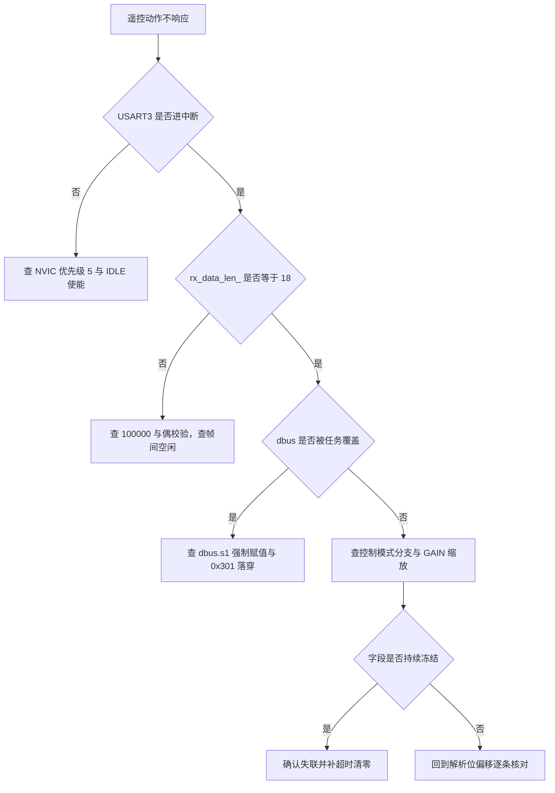
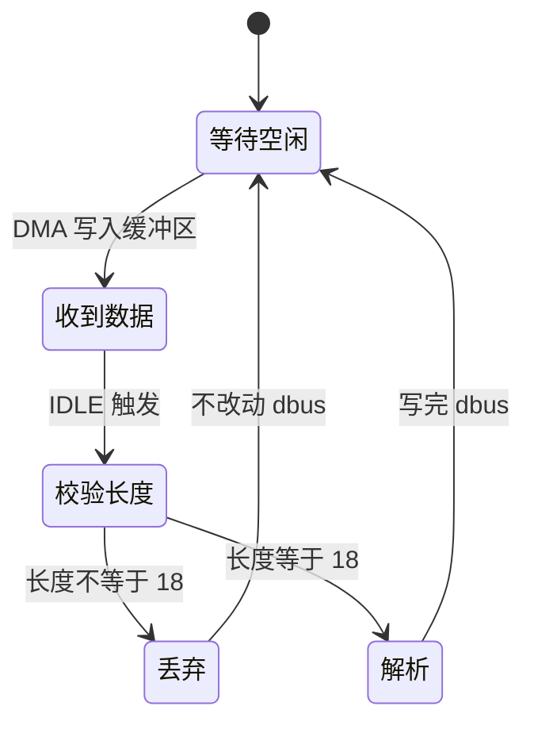

# 易错点与调试

遥控动作在整机里经过四段：接收机输出、USART3 接收与空闲中断、位域解析写全局 `dbus`、任务读字段算目标。任何一段出问题都表现为动作不响应或方向错误，需要按段定位，避免在错误的一层反复改代码。

协议见 `01-DBUS协议与帧格式.md`，解析见 `02-18字节报文解析.md`，接收链路见 `03-USART3配置与接收链路.md`，控制映射见 `04-数据结构与控制映射.md`。本页按现象归类，给出定位顺序与代码位置。

## 四段可观测环节

| 环节 | 可观测对象 | 观测手段 |
| --- | --- | --- |
| 物理层 | 波特率与校验是否匹配 | 示波器测位宽，或读 USART3 的 BRR 与 CR1 |
| 帧长 | 每帧字节数 | 断点或变量观察 `rx_data_len_` |
| 解析 | `dbus` 字段是否随摇杆变化 | 调试串口打印结构体 |
| 控制映射 | 目标量与实际输出 | 观察 `control_target` 与电机反馈 |

四段是串行的，前一段的输出是后一段的输入。定位时从链路起点往后走：先在调试器里确认缓冲区在变化，再确认帧长正确，再确认字段值合理，最后看目标量。跳过前面几段直接改任务代码，往往只是在错误的位置增加变量。

## 完全没有数据时查什么

先确认 USART3 是否收到了字节。DMA 把数据写进 `rx_buf_`，中断未触发时缓冲区仍会被填满，只是没人处理。在调试器里读 `rx_buf_[0]`，若内容固定不变，问题在引脚、波特率或接收机供电。

再确认 IDLE 中断是否使能。使能位由 `UsartDma::Init` 写入（`Communication/Src/usart_dma.cpp`），NVIC 由 `usart.c` 打开。两处缺一都不会进中断。若缓冲区在变而 `dbus` 不变，问题在中断入口或回调注册，而不在物理层。

还有一种表现更隐蔽的情况：缓冲区在变、`dbus` 也在变，但变化幅度远小于预期。这通常来自遥控器行程标定偏小，或调试观测点取在缩放之后。分别观察原始字段与目标量即可区分。

## 帧长不为 18 的两类原因

空闲回调用 `rx_data_len_ = UART_RX_BUF_LEN - NDTR` 求长度（`usart_dma.cpp`），随后立刻把 NDTR 重装为 256。若在重装之后观察 `rx_data_len_`，看到的是上一帧的缓存值，这属于正常的观测时机问题。

长度持续不为 18 的原因分两类：波特率或校验不匹配导致帧边界错位，或者接收机连续发送、帧间没有空闲导致两帧被当成一帧。前者检查 `usart.c` 的 100000 与偶校验，后者需要用示波器确认帧间间隔。两类原因的判别方法是看长度是随机变化还是稳定等于某个非 18 的值：随机变化多为波特率问题，稳定成倍则更可能是帧粘连。

另有一种观测假象：断点设在空闲回调入口时，NDTR 可能已被重装，读到的长度恒定但数值偏大。排除方法是把断点设在重装之前，或把长度先拷进一个不会被重写的变量再观察。

## 字段方向或数值异常

解析层的错位会同时影响多个通道，特征明显：某个摇杆在特定方向跳变，或者两个通道联动。对照 `dbus.cpp` 的位偏移逐条核对，重点检查每字节贡献的位是否与 `02-18字节报文解析.md` 的位段表一致。若只有单个通道在某方向不对，先怀疑位偏移；若两个通道一起动，先怀疑共享字节的移位方向。

开关顺序错误表现为 `s1` 与 `s2` 互换。两行的掩码方向不同（`dbus.cpp`），核对时同时写出两个取值，例如 `buf[5]=0x68` 应得到 `s1=1`、`s2=2`。

## 值正确但车辆行为不对

这一类的排查要越过解析层。已经确认的三处实现问题：

| 问题 | 位置 | 后果 |
| --- | --- | --- |
| `dbus.s1 = 3` 无条件覆盖 | 云台 `Task/Src/ControlCenterTask.cpp` | 开关切换无效，控制模式固定为 `MODE_AI` |
| `case 0x301` 缺 `break` | 底盘 `BSP/Src/bsp_can.cpp` | 落穿进 0x302 分支，后果待现场确认 |
| 鼠标与键盘解析后无消费者 | `dbus.cpp` | 字段有效但整机不使用，读取前需先标定位号 |

验证方法是把字段值与目标量同时观察：字段对而目标错，问题在映射；字段本身就不随遥控器变化，问题回到解析或中断侧。

三处缺陷的排查顺序建议从 `s1` 开始：先看云台任务在读取前是否改写了字段，再看底盘 0x301 分支是否落穿，最后确认鼠标与键盘确实无人消费。前两处都会让字段值与车辆行为脱节，第三处只是未使用。

## 掉线冻结与失联语义

遥控器关机、接收机断电或线缆脱落时，USART3 不再产生 IDLE 中断，`dbus` 保持最后一次解析的值。全工程没有超时判断，两个控制任务每 1 毫秒继续按旧值算目标。

后果按映射方式不同：云台是角度累加，`ch[0]`、`ch[1]` 冻结为掉线瞬间的值，目标角持续累加，云台会一直转；底盘是速度比例，冻结值让底盘持续按该速度行驶。

本工程没有实现失联保护，这一点标注为待现场确认：若实际比赛中接收机掉线会停止输出还是输出中位帧，处理方式不同。停止输出需要软件超时清零，输出中位帧则天然回零。在确认之前，`dbus` 的失联语义没有保证。

若增加失联检测，可在 `dbus_decode` 末尾更新时间戳，在任务侧比较时间戳与当前 DWT 计数，超过阈值就把 `dbus` 清零并置故障标志。这条路径不改动解析函数签名，但要注意时间戳需要 `volatile` 且更新顺序在字段写入之后。

## 一次遥控无响应的完整复盘

现象：上电后推遥控器，云台与底盘都不动，调试串口没有输出。

1. 示波器抓 PC11，看到 100 kbps 波形且偶校验位存在，排除接收机与供电。
2. 调试器读 `rx_buf_[0]`，内容随推杆变化，排除引脚接错与波特率不匹配。
3. 断点停在空闲回调，`rx_data_len_` 稳定等于 18，排除帧粘连与半帧。
4. 观察 `dbus.ch`，推杆时数值变化，解析层正常。
5. 观察 `control_target.chassis_vx`，推杆时为零；再查 `dbus.ch[3]` 仍为零。

结论：底盘板的速度来源是 CAN 0x301 转发，不是本板的 USART3 解析。接收机接在哪块板上、两块板是否各自接一路，属待现场确认项，排查前先确认这一点。

这套流程的价值在于每一步都有一个可证伪的观察点：波形、缓冲区、帧长、字段值。任一步不通过就停在该层，不要继续往后改代码。

## 一次原地打转的复盘

现象：给前进指令，车体原地自转。

1. 观察四个轮速目标，符号模式与 `v_x` 列的四轮同号不一致，问题不在遥控链路。
2. 回到 `dbus` 层确认 `ch[3]` 有值且随推杆变化，链路与解析都正常。
3. 结论：缺陷在麦轮解算层，转入 `08-机器人运动学/01-全向轮解算/05-易错点与调试.md`。

这条复盘划出了本页的排查边界：字段值正确而车辆行为错误时，问题已经离开串口与解析，要继续定位就得换到运动学单元。

## 易错点汇总

| 易错点 | 现象 | 定位 | 修复方向 |
| --- | --- | --- | --- |
| 帧长判断缺失或放宽 | 半帧污染字段 | `dbus.cpp` | 保持长度必须等于 18 |
| 位偏移写错 | 单通道方向跳变 | `dbus.cpp` | 对照位段表重算 |
| `s1` 与 `s2` 顺序写反 | 开关与预期相反 | `dbus.cpp` | 用 `buf[5]=0x68` 验证 |
| 只收配置被改成收发 | 发送方向与接收抢引脚 | `usart.c` | 恢复 `UART_MODE_RX` |
| 掉线后数值冻结 | 车辆按旧值持续动作 | 全工程无超时 | 增加时间戳与清零 |
| 全局变量无 `volatile` | 优化后读旧值 | `dbus.h` | 加限制或改用双缓冲 |
| 16 位字段组合读 | 目标量单帧毛刺 | 任务逐字段读 | 先拷贝再计算 |
| 手动改 DMA 模式 | 改 `usart.c` 无效 | `usart_dma.cpp` | 同时改 DBM 与缓冲启动 |
| 实例表容量不足 | 实例注册返回 -1 | `usart_dma.cpp` | 扩大 `DT7DMA_MAX_INSTANCES` |
| `Uart_Transmit_DMA` 误当已接线 | 期望有回包却收不到 | 全工程无调用点 | 需要发送时自行接入 |

这张表的顺序按定位代价排列：帧长与位偏移的核对只需要调试器，失联与实例表问题需要现场断电复现。

## 中断占用的观测边界

空闲回调与解析都在 USART3 中断上下文执行，解析耗时直接等于中断占用。18 字节的解析只有几十条指令，正常情况下占用很短；但如果在回调链上加了打印或浮点运算，占用会明显上升。

观测方法是统计中断进入与退出的 DWT 差值，取最大值而不是平均值。平均耗时看不出偶发长中断，而帧周期是固定的，偶发长中断会直接吞掉下一帧的空闲事件。

| 观测对象 | 取值方式 | 阈值判断 |
| --- | --- | --- |
| 解析耗时 | DWT 前后差值，取最大 | 远小于帧周期即可 |
| 中断进入频率 | 每帧一次 | 明显高于帧率说明标志未清 |
| 重装时机 | 回调内 NDTR 是否已为 256 | 未重装则下一帧长度偏大 |

## 调试手法与代价

可用的手段按代价从低到高：

1. 在 `dbus_decode` 里对 `len` 做分支，把异常长度计数到一个全局变量，任务里定期打印。改动点小，能区分没收到与收到但长度不对。
2. 用 `DebugUART`（USART1，115200 8N1）打印 `dbus` 字段。注意 USART1 的 DMA 接收没有在 `main.c` 里注册，发送仍可用（`Task/Src/ImuTask.cpp` 调用 `DebugUART_Init`）。
3. 用 DWT 计时测量 `dbus_decode` 的耗时，确认中断占用在上限内。
4. 示波器抓 PC11，确认波特率、校验位与帧间间隔。这是判定物理层问题的最终依据。
5. 用 CAN 分析仪观察 0x301 帧，确认云台板转发与底盘板接收的字节序是否一致。多板链路的问题常出现在这一段，单看一块板看不出来。

调试期间不要在中断里加阻塞打印。空闲回调运行在 USART3 中断上下文，打印会拉长中断并可能影响 DMA 重装。若必须打印，把字段拷进全局缓冲，在任务侧输出。

## 小结

### 核心概念

- 定位按四段走：物理层、帧长、解析、控制映射，不要跨层猜。
- 帧长由 `256 - NDTR` 得到，重装后观察到的值属于观测时机问题。
- 位偏移与开关顺序的错误特征不同：前者影响单通道方向，后者让两个开关互换。
- 掉线后 `dbus` 冻结，工程没有失联检测，属待现场确认项。
- 并发风险来自无 `volatile` 与非原子的组合读，优化等级变化后需要重测。
- 云台 `s1` 强制赋值与底盘 0x301 落穿会在字段值正确的情况下改变车辆行为。

### 设计权衡

| 决策 | 选择 | 收益 | 代价 |
| --- | --- | --- | --- |
| 异常处理 | 非 18 直接丢弃 | 不污染字段 | 丢弃事件不可见，需自行加计数 |
| 失联语义 | 不处理 | 无额外状态 | 掉线后目标冻结 |
| 并发保护 | 无 | 无锁开销 | 依赖优化等级 |
| 调试观测 | 变量计数加串口打印 | 无需额外硬件 | 中断内打印有代价 |
| 发送回包 | 不实现 | 链路单向、简单 | 无法向遥控器回传状态 |

## 练习

### 基础题

1. 列出遥控无响应时四个可观测环节与各自的观测对象。
2. `rx_data_len_` 读到 0 的两种情况分别是什么？
3. `case 0x301` 缺 `break` 会让底盘板执行哪一段代码？
4. 掉线后云台与底盘的行为差异由哪两种映射方式决定？

### 挑战题

5. 写一个不引入定时器中断的失联检测方案，说明时间戳的更新点、清零条件与清零时应该复位哪些字段。
6. 用 DWT 测出 `dbus_decode` 的最坏耗时后，判断把解析移出中断、改为任务侧解析需要改哪些函数，并列出随之出现的同步问题。
7. 若接收机掉线时输出全零帧而不是停止输出，现有的长度判断会接受还是丢弃？解析后的 `ch` 值是多少？这对车辆行为意味着什么？

### 附：本页引用的固件路径

| 路径 | 用途 |
| --- | --- |
| `2026OmniSentryGimbal/Communication/Src/dbus.cpp` | 长度判断与解析 |
| `2026OmniSentryGimbal/Communication/Inc/dbus.h` | 全局声明与字段类型 |
| `2026OmniSentryGimbal/Communication/Src/usart_dma.cpp` | 帧长计算与缓冲重装、实例表 |
| `2026OmniSentryGimbal/Core/Src/usart.c` | USART3 只收与 NVIC |
| `2026OmniSentryGimbal/Task/Src/ControlCenterTask.cpp` | `dbus.s1` 覆盖 |
| `2026OmniSentryGimbal/Task/Src/ImuTask.cpp` | 调试串口初始化 |
| `2026OmniSentryChassis/BSP/Src/bsp_can.cpp` | 0x301 接收落穿 |
| `2026OmniSentryChassis/Task/Src/ControlCenterTask.cpp` | 底盘速度映射 |
