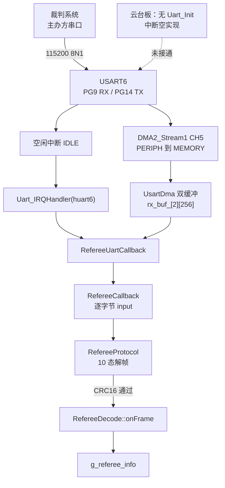
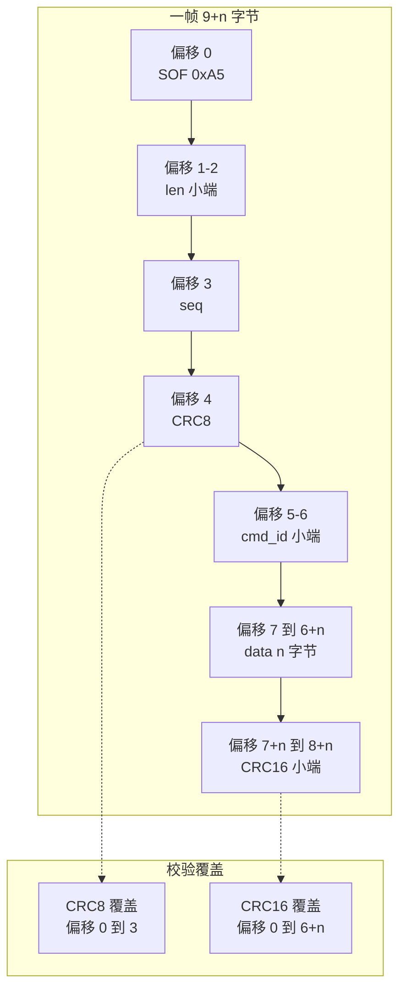
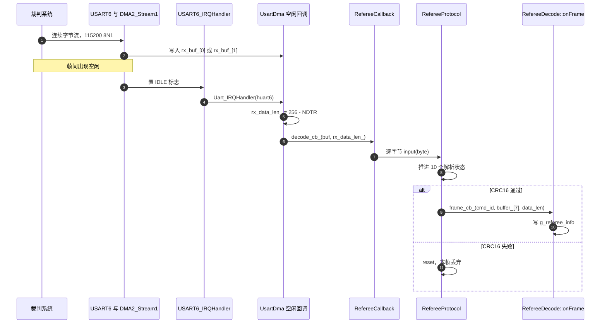

# 裁判系统链路与帧格式

> 对象是云台板固件 `/home/wyx/rm/2026SentriOmeniGimbal/2026OmniSentryGimbal` 与底盘板固件 `/home/wyx/rm/2026SentriOmeniChassis/2026OmniSentryChassis`。两块板的裁判系统协议代码逐字节相同，接线与中断注册不同。
>
> 本页只讲链路与帧结构。解帧状态机在 `03-RefereeProtocol状态机`，命令码与数据段在 `02-命令码与数据段`，字段落库在 `04-RefereeDecode字段映射`。

裁判系统是比赛主办方提供的数据源，向机器人主控下行播报比赛状态、机器人血量、热量与功率、场地位置、伤害事件、射击弹速、增益状态等。链路是单向的：下位机只接收，不向裁判系统发送。本工程两块板都没有构造裁判系统上行帧的代码，`Uart_Transmit_DMA` 有实现但没有调用点。

数据方向决定了三项工程事实：接收通路可以只用 DMA 加空闲中断，不需要发送状态机；帧解析只需要按字节流推进，不需要处理发送应答；断线时表现为数据停更，不会表现为发送失败。



> 源码索引

| 路径 | 作用 |
| --- | --- |
| `Core/Src/usart.c` | USART6 参数、GPIO、DMA 与 NVIC |
| `Core/Src/main.c` | 两块板的注册差异 |
| `Core/Src/stm32f4xx_it.c` | 中断入口与 USER CODE 段 |
| `Communication/Src/referee_protocol.cpp` | 帧同步、校验与数据段指针 |
| `Communication/Inc/referee_decode.h` | 帧头结构体与 pack |
| `Communication/Src/referee_decode.cpp` | 回调与字段落库 |

## USART6 的物理参数与 DMA 资源

两块板的 `MX_USART6_UART_Init` 参数一致，逐字段如下（底盘板 `Core/Src/usart.c`，云台板 `Core/Src/usart.c`）：

| 配置项 | 取值 | 含义 |
| --- | --- | --- |
| `Instance` | `USART6` | 六个 USART 中的第 6 个 |
| `BaudRate` | 115200 | 与裁判系统串口速率一致 |
| `WordLength` | `UART_WORDLENGTH_8B` | 8 位数据 |
| `StopBits` | `UART_STOPBITS_1` | 1 位停止位 |
| `Parity` | `UART_PARITY_NONE` | 无校验，8N1 |
| `Mode` | `UART_MODE_TX_RX` | 收发都开，实际只用 RX |
| `HwFlowCtl` | `UART_HWCONTROL_NONE` | 无硬件流控 |
| `OverSampling` | `UART_OVERSAMPLING_16` | 16 倍过采样 |

引脚固定为 PG14 作 TX、PG9 作 RX，复用 `GPIO_AF8_USART6`，输出速度 `GPIO_SPEED_FREQ_VERY_HIGH`（`Core/Src/usart.c`）。DMA 与中断在 MSP 回调里配置：

| 资源 | 实例 | 通道 | 方向 | 模式 |
| --- | --- | --- | --- | --- |
| RX | `DMA2_Stream1` | `DMA_CHANNEL_5` | PERIPH 到 MEMORY | `DMA_NORMAL` |
| TX | `DMA2_Stream6` | `DMA_CHANNEL_5` | MEMORY 到 PERIPH | `DMA_CIRCULAR` |
| NVIC | `USART6_IRQn` | 抢占优先级 5 | 子优先级 0 | 使能 |

DMA 初始化后分别用 `__HAL_LINKDMA` 挂到 `huart6.hdmarx` 与 `huart6.hdmatx`（`Core/Src/usart.c`），NVIC 在 `Core/Src/usart.c`。CubeMX 给 RX 配的是 `DMA_NORMAL`，但运行期 `UsartDma::Init` 直接对 `DMA_SxCR` 置双缓冲位并自己启动 DMA，不经过 `HAL_UART_Receive_DMA`（`Communication/Src/usart_dma.cpp`）。这一层与 CubeMX 配置的差异在 `01-UART+DMA收发` 里展开。

发送方向虽然配了 `DMA2_Stream6` 并链接到 `hdmatx`，但全工程没有裁判系统上行帧，这条流只被初始化过，没有启动过。

## 两块板的接线差异

底盘板在初始化末尾注册两个串口实例（`Core/Src/main.c`）：

```c
Uart_Init(&huart3, MyUartCallbackFun);   // huart3是连接遥控器的UART实例
Uart_Init(&huart6, RefereeUartCallback); // huart6是裁判系统
```

云台板只注册了遥控器（`Core/Src/main.c`）：

```c
Uart_Init(&huart3, MyUartCallbackFun); // huart3是连接遥控器的UART实例
```

差异不止初始化这一处。底盘板的中断服务函数在 `HAL_UART_IRQHandler` 之前插入了自定义处理（`Core/Src/stm32f4xx_it.c`）：

```c
void USART6_IRQHandler(void)
{
  /* USER CODE BEGIN USART6_IRQn 0 */
  Uart_IRQHandler(&huart6);
  /* USER CODE END USART6_IRQn 0 */
  HAL_UART_IRQHandler(&huart6);
}
```

云台板同名函数的两段 USER CODE 都是空的（`Core/Src/stm32f4xx_it.c`），没有 `Uart_IRQHandler(&huart6)`。因此云台板上的 `huart6` 既没有启动 DMA，空闲中断也没有被使能，`USART6_IRQHandler` 不会产生有效处理。

共享代码在云台板上仍然被编译：`Communication/Src/referee_decode.cpp` 定义了 `g_referee_info`、`refereeproto`、`referee_decode` 三个全局对象，`CMakeLists.txt` 把它们列进源文件。`refereeproto.input` 的唯一调用点在 `RefereeCallback`（`Communication/Src/referee_decode.cpp`），而 `RefereeCallback` 只被底盘板的 `RefereeUartCallback` 调用（`Core/Src/main.c`）。云台板上这条链没有入口，对象存在但收不到数据。底盘板的 `RefereeUartCallback` 只做一次转发：

```c
void RefereeUartCallback(volatile uint8_t* buf, int len) {
  RefereeCallback(buf, len);  // 调用裁判系统解码
}
```

两处缺失的效果不同：没有 `Uart_Init` 时 DMA 与空闲中断都没打开，硬件层面收不到字节；没有中断里的 `Uart_IRQHandler` 时字节进了双缓冲但没人取走，表现为数据停在缓冲区而 `g_referee_info` 不变。

## 0xA5 帧的逐字段偏移

裁判系统帧以 `0xA5` 起始，长度字段小端，`cmd_id` 小端，两处校验分别为 CRC8 与 CRC16，CRC16 以小端存放。设数据段长度为 `n`，一帧共 `9+n` 字节：

| 偏移 | 长度 | 字段 | 编码 | 说明 |
| --- | --- | --- | --- | --- |
| 0 | 1 | SOF | 固定 `0xA5` | 帧起始字节 |
| 1 | 1 | `len` 低字节 | 小端 | 数据段长度 `n` |
| 2 | 1 | `len` 高字节 | 小端 | 与低字节合成 `data_len_` |
| 3 | 1 | `seq` | 单字节 | 包序号，代码只存不查 |
| 4 | 1 | CRC8 | 单字节 | 覆盖偏移 0 到 3 |
| 5 | 1 | `cmd_id` 低字节 | 小端 | 命令码 |
| 6 | 1 | `cmd_id` 高字节 | 小端 | 与低字节合成 `cmd_id_` |
| 7 | `n` | data | 按命令定义 | 数据段 |
| 7+n | 1 | CRC16 低字节 | 小端 | 覆盖偏移 0 到 6+n |
| 8+n | 1 | CRC16 高字节 | 小端 | 覆盖偏移 0 到 6+n |

长度字段只描述数据段，不含 7 字节帧头与 2 字节 CRC16。CRC16 的覆盖范围从 SOF 一直到最后 1 字节数据，超过 `cmd_id` 所在的偏移：解帧代码用 `index_-2` 作长度，此时 `index_` 已计入两字节 CRC16，所以实际覆盖 `7+n` 字节（`Communication/Src/referee_protocol.cpp`）。



## 两处校验的覆盖范围

两处校验的算法与参数不同，覆盖范围也不一样：

| 校验 | 覆盖字节 | 长度参数 | 初值 | 源码 |
| --- | --- | --- | --- | --- |
| CRC8 | SOF、len 低、len 高、seq 共 4 字节 | 固定 4 | `0xFF` | `referee_protocol.cpp` |
| CRC16 | SOF 到最后 1 字节数据，共 `7+n` 字节 | `index_-2` | `0xFFFF` | `referee_protocol.cpp` |

CRC8 只覆盖前 4 字节，不把 `cmd_id` 算进去；CRC16 从 `buffer_[0]` 起算，包含帧头与 `cmd_id`，但不含它自己的两个字节。两处校验都通过之后才调用回调，回调的数据段指针是 `&buffer_[7]`，长度是 `data_len_`（`Communication/Src/referee_protocol.cpp`）。

帧头在 `Communication/Inc/referee_decode.h` 另有一份结构体定义：

```c
struct referee_frame_header_t
{
    uint8_t  sof;          // 数据帧起始字节 0xA5
    uint16_t data_length;  // data长度
    uint8_t  seq;          // 包序号
    uint8_t  crc8;         // 对上面三者进行CRC8校验
};
```

## 帧头结构体为什么没有被使用

该结构体没有被解析代码使用，`RefereeProtocol` 是按状态逐字节写入 `buffer_` 再按固定偏移读取的。整份头文件被 `#pragma pack(push,1)` 与 `#pragma pack(pop)` 包住（`Communication/Inc/referee_decode.h`），所以这个 5 字节结构体在内存中与线上布局一致。

不使用的直接原因是解帧需要在 CRC8 通过之前就按固定偏移写字节，而结构体映射要求先有一块已校验的内存。两者顺序相反：结构体适合在整帧到手之后解释，状态机适合逐字节推进。保留这份定义的价值是文档作用，它写明了帧头四个字段的名称与含义，调试时对照更方便。

## 接收缓冲与回调时机

`RefereeProtocol` 用一块固定缓冲 `buffer_[256]`（`Communication/Inc/referee_protocol.h`），配合 `index_` 记录写入位置。接收由 `UsartDma` 的空闲中断路径驱动：空闲回调算出本轮字节数 `UART_RX_BUF_LEN - NDTR`，再调用注册的 `decode_cb_`（`Communication/Src/usart_dma.cpp`）。对裁判系统，这个回调就是 `RefereeUartCallback`，它把整段缓冲逐字节喂给 `refereeproto.input`。

数据段指针是 `&buffer_[7]`，长度是 `data_len_`（`Communication/Src/referee_protocol.cpp`）。CRC16 通过之前回调不会触发，所以 `onFrame` 拿到的 `data` 一定通过了 CRC8 与 CRC16 两层校验。

底盘板的数据消费点在控制任务里：`Task/Src/ControlCenterTask.cpp` 用 `g_referee_info.bullet_speed` 统计发弹， 又把它随裁判数据发到 CAN。云台板没有任何文件读 `g_referee_info`，只有 `referee_decode.cpp` 的写入。



## 链路层面的易错点

| 易错点 | 现象 | 本项目的对应位置 |
| --- | --- | --- |
| 把 `len` 当整帧长度 | 按 `len` 分配或校验缓冲，少算 9 字节 | 帧长是 `9+n`，`len` 只是数据段 |
| 认为 CRC16 只覆盖数据段 | 手动算校验时把帧头排除，校验对不上 | `referee_protocol.cpp` 从 `buffer_[0]` 起算 |
| 认为 CRC8 覆盖整个帧头 | 把 `cmd_id` 也算进去 | 只覆盖前 4 字节（SOF、len、len、seq） |
| 在云台板找裁判数据 | 全局对象存在，数值一直是初值 | 云台板 `main.c` 未注册 `huart6`，中断也未调用 `Uart_IRQHandler` |
| 认为 `seq` 被校验 | 期待乱序包被丢弃 | 代码写入 `buffer_` 后不再比较，乱序不报错 |
| 把 `cmd_id` 按大端解析 | 0x0201 被读成 0x0102 | 小端，`cmd_id_ = byte \| (byte << 8)` |
| 期待 `referee_frame_header_t` 被使用 | 在其上打断点没有命中 | 解析器按固定下标读写，该结构体是备用定义 |
| 认为 TX 流会发数据 | 在 `DMA2_Stream6` 上等波形 | 裁判链路单向，TX 流从未启动 |

## 小结

### 核心概念

- 裁判系统链路单向，主控只收不发；本工程没有裁判系统上行帧。
- 物理层是 USART6，115200 8N1，PG9 收、PG14 发，RX 走 `DMA2_Stream1`，NVIC 优先级 5。
- 底盘板注册 `huart6` 并在中断里调用 `Uart_IRQHandler`；云台板两处都没有接。
- 帧以 `0xA5` 起始，`len` 与 `cmd_id` 小端，数据段从偏移 7 起，整帧 `9+n` 字节。
- CRC8 覆盖前 4 字节，初值 `0xFF`；CRC16 覆盖偏移 0 到最后 1 字节数据，初值 `0xFFFF`，两字节小端。
- 回调只在 CRC16 通过后触发，回调数据指针为 `&buffer_[7]`。

### 设计权衡

| 决策 | 选择 | 收益 | 代价 |
| --- | --- | --- | --- |
| 帧同步 | 固定 `0xA5` 起始字节 | 实现简单，无转义开销 | 数据段出现 `0xA5` 时靠长度字段区分，失步后要重同步 |
| 长度表示 | `len` 只含数据段 | 与官方手册一致 | 读代码的人容易按整帧理解 |
| 校验分层 | 帧头 CRC8 加整帧 CRC16 | CRC8 便宜，CRC16 兜住数据 | 两处校验范围不同，手写解析要分别对齐 |
| 接收方式 | 空闲中断加 DMA 双缓冲 | CPU 占用低 | 云台板漏接其中任一环就完全收不到 |
| 数据落库 | 逐字段拷贝到 `g_referee_info` | 调用方不接触原始缓冲 | 字段增加时要同步维护枚举、结构体与分支 |
| 帧头定义 | 保留结构体但不使用 | 调试时可对照字段名 | 结构与实际解析路径不一致，易误以为在生效 |

## 练习

### 基础题

1. 写出 `0x0201` 机器人状态帧数据段长度为 13 时的整帧字节数，以及 CRC16 覆盖的字节数。
2. 一帧的 `len` 字段两个字节分别是 `0x0A`、`0x00`，数据段是多少字节？`cmd_id` 位于哪个偏移？
3. 按偏移表，说明 `RefereeProtocol` 在 `WAIT_CRC8` 状态时 `buffer_` 里已经有哪些字节。
4. 底盘板上 `g_referee_info` 被哪个任务读取，读取的是哪个字段？

### 挑战题

5. 云台板已经初始化了 USART6、配置了 DMA，只补 `Uart_Init(&huart6, RefereeUartCallback)` 与中断里的 `Uart_IRQHandler` 两处即可打通接收。说明这两处各自解决的问题，以及只补其中一处会出现什么现象。
6. 假设把数据段长度上限从 200 放宽到 260，`buffer_[256]` 与 `index_ >= 7 + data_len_` 的判断会发生什么？给出需要同步修改的常量与位置。
7. 帧同步丢失后，某一帧的 `0xA5` 恰好落在上一帧的 CRC8 位置上。按现有 `WAIT_CRC8` 分支的处理，这个字节会被怎样处置，是否可能丢掉一个合法帧的起点？

---

### 附：本页引用的固件路径

| 路径 | 用途 |
| --- | --- |
| `2026OmniSentryChassis/Core/Src/main.c` | `RefereeUartCallback`、注册 `huart6` |
| `2026OmniSentryGimbal/Core/Src/main.c` | 只注册 `huart3` |
| `2026OmniSentryChassis/Core/Src/stm32f4xx_it.c` | `USART6_IRQHandler` 调用 `Uart_IRQHandler` |
| `2026OmniSentryGimbal/Core/Src/stm32f4xx_it.c` | 同名中断的 USER CODE 为空 |
| `2026OmniSentryChassis/Core/Src/usart.c` | USART6 参数、GPIO、DMA、NVIC |
| `2026OmniSentryGimbal/Core/Src/usart.c` | 同名参数与 DMA 配置 |
| `2026OmniSentryGimbal/Communication/Inc/referee_protocol.h` | 10 态枚举、`buffer_[256]` |
| `2026OmniSentryGimbal/Communication/Src/referee_protocol.cpp` | CRC8 覆盖 4 字节、数据指针、CRC16 范围 |
| `2026OmniSentryGimbal/Communication/Src/referee_decode.cpp` | 全局对象、`RefereeCallback` |
| `2026OmniSentryGimbal/Communication/Inc/referee_decode.h` | `referee_frame_header_t`、`pack` |
| `2026OmniSentryGimbal/Communication/Src/usart_dma.cpp` | 空闲回调与字节数、启动 DMA |
| `2026OmniSentryChassis/Task/Src/ControlCenterTask.cpp` | 读取 `bullet_speed` |
