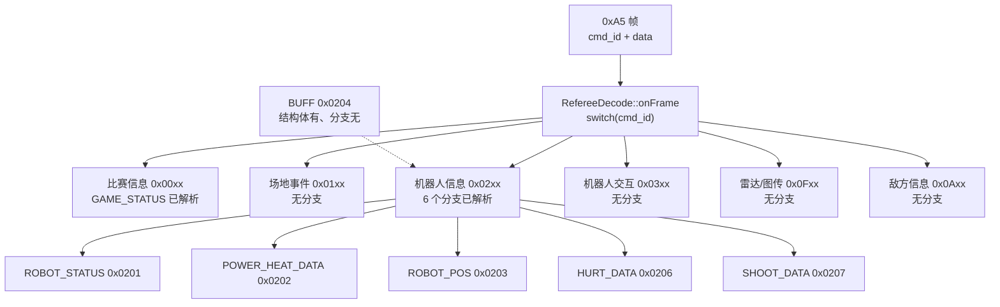
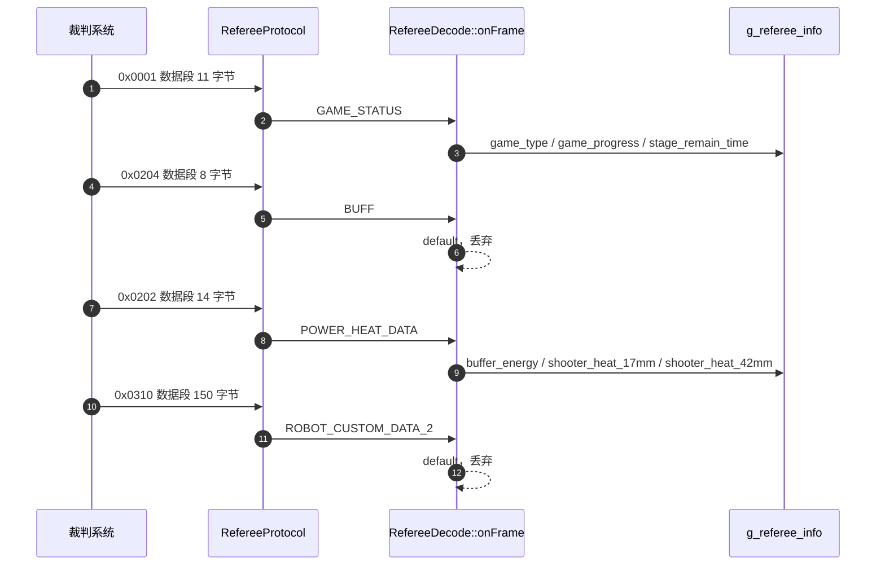

# 命令码与数据段

> 命令码枚举与数据段结构体都在 `Communication/Inc/referee_decode.h`，两块板逐字节相同。帧格式与校验范围见 `01-裁判系统链路与帧格式`，字段如何写入 `g_referee_info` 见 `04-RefereeDecode字段映射`。

裁判系统的所有下行数据共用同一种帧结构。帧头的 `cmd_id` 是唯一分派依据，它决定后面 `len` 字节如何解释。命令码在 `Communication/Inc/referee_decode.h` 的 `RefCmdID` 命名空间里按官方功能分组枚举：

| 分组 | 码段 | 结构体前缀 |
| --- | --- | --- |
| 比赛信息 | 0x0001 到 0x0003 | `game_` |
| 场地事件 | 0x0101 到 0x0105 | `event_`、`referee_warning_t`、`dart_info_t` |
| 机器人信息 | 0x0201 到 0x020E | `robot_`、`power_heat_data_t`、`buff_t` 等 |
| 机器人交互 | 0x0301 到 0x0310 | `robot_interaction`、`map_`、`custom_` |
| 雷达/图传 | 0x0F01、0x0F02 | 无结构体，仅注释占位 |
| 敌方信息 | 0x0A01 到 0x0A06 | 无结构体，仅注释占位 |



## cmd_id 是数据段布局的唯一分派依据

帧结构本身与命令无关，长度字段只给出数据段的字节数，不给出类型。解释数据段所需的信息全部来自 `cmd_id`：它决定用哪个结构体、按什么偏移取字段、长度校验的上限是多少。三者的关系是

$$\text{数据段字节数} = \texttt{sizeof}(\text{该 cmd\_id 对应的结构体})$$

成立的前提是结构体按 1 字节对齐。头文件用 `#pragma pack(push,1)` 保证了这一点（`referee_decode.h`），因此表中列出的结构体 `sizeof` 对线上长度即为数据段长度。

> 源码索引

| 路径 | 作用 |
| --- | --- |
| `Communication/Inc/referee_decode.h` | 命令码枚举与全部数据段结构体 |
| `Communication/Src/referee_decode.cpp` | 六个解析分支与长度校验 |
| `Communication/Src/referee_protocol.cpp` | 帧长与数据段指针 |

## 比赛信息与场地事件命令

| cmd_id | 枚举名 | 结构体 | 数据段 | onFrame |
| --- | --- | --- | --- | --- |
| 0x0001 | `GAME_STATUS` | `game_status_t` | 11 | 解析（`referee_decode.cpp`） |
| 0x0002 | `GAME_RESULT` | `game_result_t` | 1 | 无分支 |
| 0x0003 | `ROBOT_HP` | `game_robot_HP_t` | 16 | 无分支 |
| 0x0101 | `EVENT_DATA` | `event_data_t` | 4 | 无分支 |
| 0x0104 | `REFEREE_WARNING` | `referee_warning_t` | 3 | 无分支 |
| 0x0105 | `DART_INFO` | `dart_info_t` | 3 | 无分支 |

0x0102 与 0x0103 没有出现在枚举里，与 0x0205 一样属于未登记项。这一组里只有 0x0001 有解析分支，其余五个结构体定义了但不落库。

## 机器人信息命令

| cmd_id | 枚举名 | 结构体 | 数据段 | onFrame |
| --- | --- | --- | --- | --- |
| 0x0201 | `ROBOT_STATUS` | `robot_status_t` | 13 | 解析 |
| 0x0202 | `POWER_HEAT_DATA` | `power_heat_data_t` | 14 | 解析 |
| 0x0203 | `ROBOT_POS` | `robot_pos_t` | 12 | 解析 |
| 0x0204 | `BUFF` | `buff_t` | 8 | 无分支 |
| 0x0206 | `HURT_DATA` | `hurt_data_t` | 1 | 解析 |
| 0x0207 | `SHOOT_DATA` | `shoot_data_t` | 7 | 解析 |
| 0x0208 | `PROJECTILE_ALLOW` | `projectile_allowance_t` | 8 | 无分支 |
| 0x0209 | `RFID_STATUS` | `rfid_status_t` | 5 | 无分支 |
| 0x020A | `DART_CLIENT_CMD` | `dart_client_cmd_t` | 6 | 无分支 |
| 0x020B | `GROUND_ROBOT_POS` | `ground_robot_position_t` | 40 | 无分支 |
| 0x020C | `RADAR_MARK_DATA` | `radar_mark_data_t` | 2 | 无分支 |
| 0x020D | `SENTRY_INFO` | `sentry_info_t` | 6 | 无分支 |
| 0x020E | `RADAR_INFO` | `radar_info_t` | 1 | 无分支 |

0x0205 在枚举里没有定义，0x020A 之前也不是连续排列。命令码的连续性由官方手册决定，代码只登记了用到的部分。

## 交互、雷达与敌方命令

| cmd_id | 枚举名 | 结构体 | 数据段 | onFrame |
| --- | --- | --- | --- | --- |
| 0x0301 | `ROBOT_INTERACTION` | `robot_interaction_data_t` | 118 | 无分支 |
| 0x0302 | `CUSTOM_ROBOT_DATA` | `custom_robot_data_t` | 30 | 无分支 |
| 0x0303 | `MAP_COMMAND` | `map_command_t` | 12 | 无分支 |
| 0x0304 | `REMOTE_CONTROL` | `remote_control_t` | 12 | 无分支 |
| 0x0305 | `MAP_ROBOT_DATA` | `map_robot_data_t` | 24 | 无分支 |
| 0x0306 | `CUSTOM_CLIENT_DATA` | `custom_client_data_t` | 8 | 无分支 |
| 0x0307 | `MAP_DATA` | `map_data_t` | 105 | 无分支 |
| 0x0308 | `CUSTOM_INFO` | `custom_info_t` | 34 | 无分支 |
| 0x0309 | `ROBOT_CUSTOM_DATA` | `robot_custom_data_t` | 30 | 无分支 |
| 0x0310 | `ROBOT_CUSTOM_DATA_2` | `robot_custom_data_2_t` | 150 | 无分支 |
| 0x0F01 | `RADAR_CHANNEL_SET` | 无 | 未定义 | 无分支 |
| 0x0F02 | `RADAR_CHANNEL_QUERY` | 无 | 未定义 | 无分支 |
| 0x0A01 | `ENEMY_ROBOT_POS` | 无 | 未定义 | 无分支 |
| 0x0A02 | `ENEMY_ROBOT_HP` | 无 | 未定义 | 无分支 |
| 0x0A03 | `ENEMY_PROJECTILE_ALLOW` | 无 | 未定义 | 无分支 |
| 0x0A04 | `ENEMY_MACRO_STATUS` | 无 | 未定义 | 无分支 |
| 0x0A05 | `ENEMY_BUFF_STATUS` | 无 | 未定义 | 无分支 |
| 0x0A06 | `INTERFERENCE_KEY` | 无 | 未定义 | 无分支 |

`0x0310` 与 `0x0309` 的枚举名相差一个后缀，数值却跳了 7。按官方命令码表，自定义数据相关的一对通常是 0x0309 与 0x030A，此处疑似应为 `0x030A`。该结论未经现场抓包核对，待现场确认；改动前不要按 0x0309 推导 0x0310 的语义。

两个雷达命令码与八个敌方命令码只登记了枚举值与注释，没有结构体。收到这类帧时状态机会正常校验并通过，进入 `onFrame` 后落到 `default`，数据段被完整丢弃。

## 六个已解析命令的数据段偏移

`RefereeDecode::onFrame` 只覆盖 6 个命令。数据段的字段顺序与字节宽度按结构体定义排列，下面的偏移以数据段首字节为 0。

### 0x0001 `game_status_t`（11 字节，`referee_decode.h`）

| 偏移 | 类型 | 字段 | 说明 |
| --- | --- | --- | --- |
| 0 位 0-3 | `uint8_t:4` | `game_type` | 比赛类型 |
| 0 位 4-7 | `uint8_t:4` | `game_progress` | 比赛阶段 |
| 1-2 | `uint16_t` | `stage_remain_time` | 当前阶段剩余秒数 |
| 3-10 | `uint64_t` | `SyncTimeStamp` | 时间戳，未被解析写入 |

### 0x0201 `robot_status_t`（13 字节，`referee_decode.h`）

| 偏移 | 类型 | 字段 | 说明 |
| --- | --- | --- | --- |
| 0 | `uint8_t` | `robot_id` | 机器人 ID |
| 1 | `uint8_t` | `robot_level` | 等级 |
| 2-3 | `uint16_t` | `current_HP` | 当前血量 |
| 4-5 | `uint16_t` | `maximum_HP` | 血量上限 |
| 6-7 | `uint16_t` | `shooter_barrel_cooling_value` | 枪口冷却值，未落库 |
| 8-9 | `uint16_t` | `shooter_barrel_heat_limit` | 热量上限，未落库 |
| 10-11 | `uint16_t` | `chassis_power_limit` | 底盘功率上限 |
| 12 位 0-2 | `uint8_t:1` | `power_management_*_output` | 云台/底盘/发射机构三路输出开关 |

### 0x0202 `power_heat_data_t`（14 字节，`referee_decode.h`）

| 偏移 | 类型 | 字段 | 说明 |
| --- | --- | --- | --- |
| 0-1 | `uint16_t` | `reserved1` | 保留，未落库 |
| 2-3 | `uint16_t` | `reserved2` | 保留，未落库 |
| 4-7 | `float` | `reserved3` | 保留浮点，未落库 |
| 8-9 | `uint16_t` | `buffer_energy` | 缓冲能量 |
| 10-11 | `uint16_t` | `shooter_17mm_heat` | 17mm 枪口热量 |
| 12-13 | `uint16_t` | `shooter_42mm_heat` | 42mm 枪口热量 |

### 0x0203 `robot_pos_t`（12 字节，`referee_decode.h`）

三个 `float` 依次为 `x`、`y`、`angle`，各占 4 字节，未落库的字段不存在。

### 0x0206 `hurt_data_t`（1 字节，`referee_decode.h`）

| 偏移 | 类型 | 字段 | 说明 |
| --- | --- | --- | --- |
| 0 位 0-3 | `uint8_t:4` | `armor_id` | 受击装甲板 ID |
| 0 位 4-7 | `uint8_t:4` | `hurt_HP_deduction_reason` | 扣血原因 |

### 0x0207 `shoot_data_t`（7 字节，`referee_decode.h`）

| 偏移 | 类型 | 字段 | 说明 |
| --- | --- | --- | --- |
| 0 | `uint8_t` | `bullet_type` | 弹种 |
| 1 | `uint8_t` | `shooter_number` | 发射机构编号 |
| 2 | `uint8_t` | `launching_frequency` | 发射射频 |
| 3-6 | `float` | `initial_speed` | 初始弹速 |

## 定义了结构体却无分支的命令

0x0204 `buff_t`（`referee_decode.h`）是最典型的一处。该结构体在头文件里定义完整，但 `onFrame` 的 `switch` 没有 `RefCmdID::BUFF` 分支（`referee_decode.cpp`），也不存在对应的 `g_referee_info` 字段。

| 偏移 | 类型 | 字段 |
| --- | --- | --- |
| 0 | `uint8_t` | `recovery_buff` |
| 1-2 | `uint16_t` | `cooling_buff` |
| 3 | `uint8_t` | `defence_buff` |
| 4 | `uint8_t` | `vulnerability_buff` |
| 5-6 | `uint16_t` | `attack_buff` |
| 7 | `uint8_t` | `remaining_energy` |

收到 0x0204 帧时会落到 `default: break;`，不做任何处理。同类情形还有 0x0208 到 0x020E 与全部 0x03xx 命令：结构体与长度都在头文件里，解析分支一个都没有。



## 长度校验为什么写成 len < sizeof

每个已解析分支都以同一形式做前置校验：

```cpp
if(len < sizeof(game_status_t))
    return;
```

6 处校验分别在 `Communication/Src/referee_decode.cpp`。语义是「短于结构体长度就丢弃」，等于长度通过。因为结构体被 `pack(1)` 压到与线上一致，`sizeof` 就是官方数据段长度；若改成默认对齐，`game_status_t` 会因 `uint64_t` 的 8 字节对齐膨胀到 16 字节，11 字节的合法帧会被全部拒绝。这一点在 `04-RefereeDecode字段映射` 里作为对齐风险展开。

校验写成小于而非不等于，是有意为之：官方可能给同一个命令加长数据段，多出的尾部被忽略，旧固件仍能工作。代价是长度异常变大时不会告警。

`len` 的类型是 `uint16_t`，`sizeof` 是无符号整数。比较时 `len` 向更宽的无符号类型提升，不存在负数被当成大正数的情况。

未登记的命令走 `default` 分支（`referee_decode.cpp`），只是 `break`。解析层不记录丢弃的 `cmd_id`，因此无法从代码侧统计哪些命令在被忽略。

## 命令码层面的易错点

| 易错点 | 现象 | 位置 |
| --- | --- | --- |
| 把 `0x0310` 当官方值 | 与上位机对不上，或按 0x030A 的长度解析失败 | `referee_decode.h`，待现场确认 |
| 认为定义了结构体就会解析 | 0x0204 有完整结构体却收不到数据 | `referee_decode.cpp` 无 `BUFF` 分支 |
| 认为 `sizeof` 与线上长度总是相等 | 去掉 `pack` 后合法帧被拒 | `referee_decode.h` |
| 给数据段加末尾对齐填充 | 多算 1 到 3 字节，偏移全错 | 结构体按 1 字节对齐，无填充 |
| 按枚举顺序推断命令码连续 | 0x0204 之后直接是 0x0206 | `referee_decode.h` |
| 认为 0x0F01、0x0A01 组有结构体 | 找不到对应定义 | 只有注释占位（`referee_decode.h`） |
| 用大端读多字节字段 | `stage_remain_time` 等数值异常 | 数据段多字节整数为小端 |
| 按 `len` 反推命令码 | 长度只描述数据段，不含 9 字节帧开销 | 帧长是 `9+n` |

## 小结

### 核心概念

- `cmd_id` 决定数据段布局，共 6 个功能分组，官方码段不连续。
- 代码登记了 37 个命令码，`onFrame` 只解析其中 6 个；其余落到 `default`。
- 数据段结构体按 `pack(1)` 布局，`sizeof` 即线上长度。
- 每个解析分支先做 `len < sizeof` 校验，短的丢弃，等长的通过。
- 0x0204 `BUFF` 有结构体无分支，是「定义了但未接线」的一处。
- `0x0310` 疑似 `0x030A` 笔误，待现场确认。

### 设计权衡

| 决策 | 选择 | 收益 | 代价 |
| --- | --- | --- | --- |
| 枚举覆盖 | 登记 37 个官方命令 | 头文件不臃肿 | 新命令要手动补，未登记的静默丢弃 |
| 长度校验 | `len < sizeof` 才丢弃 | 兼容官方加长数据段 | 多余字节被忽略，不会告警 |
| 结构体布局 | `pack(1)` | `sizeof` 与线上一致 | 成员可能跨缓存行，访问略慢 |
| 解析范围 | 只解析 6 个命令 | 代码短，写点明确 | 其余 31 个命令的数据无法从应用层取到 |
| 未命中处理 | `default: break` | 未知命令不影响解析 | 丢弃行为不可观测 |
| 命令登记 | 雷达与敌方组只留枚举 | 保留码位，便于后续补结构体 | 收到帧后数据被完整丢弃 |

## 练习

### 基础题

1. 写出 0x0001、0x0201、0x0203、0x0207 四个命令的数据段长度与整帧长度。
2. `0x0310` 按 `robot_custom_data_2_t` 解析时数据段是 150 字节，整帧多少字节？是否超过 `buffer_[256]` 的容量核算？
3. `game_status_t` 里 `SyncTimeStamp` 是 `uint64_t`，它是否被写入 `g_referee_info`？在哪个分支？
4. 列出三个「定义了结构体但 `onFrame` 无分支」的命令码。

### 挑战题

5. 若把 `#pragma pack` 去掉，逐个数出至少三个结构体的 `sizeof` 变化，并说明哪一处长度校验会因此拒绝合法帧。
6. 假设要在 `onFrame` 里增加 0x0204 `BUFF` 的解析，列出需要同步修改的三处：枚举是否已存在、结构体、`RefereeInfo` 字段，并给出新增字段的数据类型建议。
7. 0x0F01、0x0F02 只登记了命令码没有结构体。按官方手册补齐这两个命令的数据段时，需要先确认哪些信息，才能保证 `len < sizeof` 校验成立？

---

### 附：本页引用的固件路径

| 路径 | 用途 |
| --- | --- |
| `2026OmniSentryGimbal/Communication/Inc/referee_decode.h` | `RefCmdID`、全部数据段结构体、`pack` |
| `2026OmniSentryGimbal/Communication/Src/referee_decode.cpp` | 6 个解析分支、长度校验、`default` |
| `2026OmniSentryGimbal/Communication/Src/referee_protocol.cpp` | 帧长与数据段指针 |
