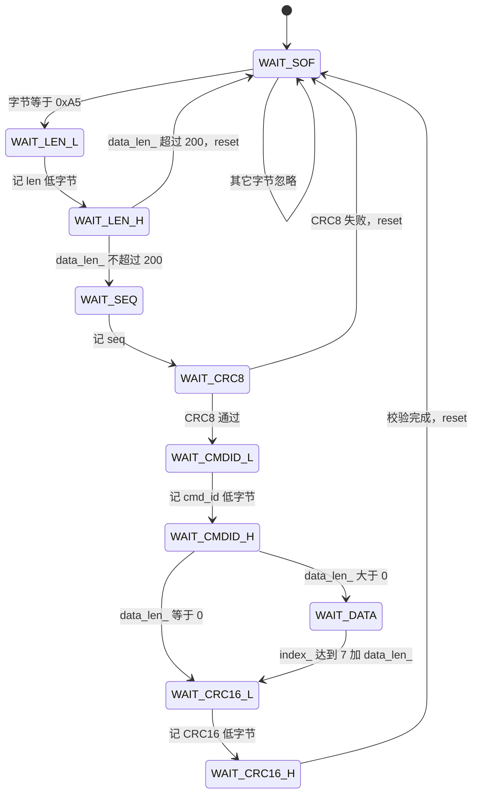
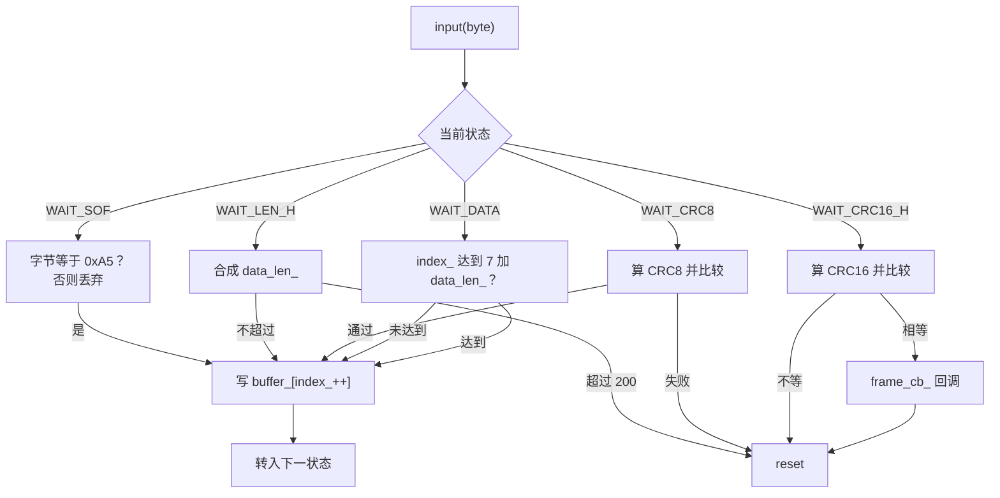
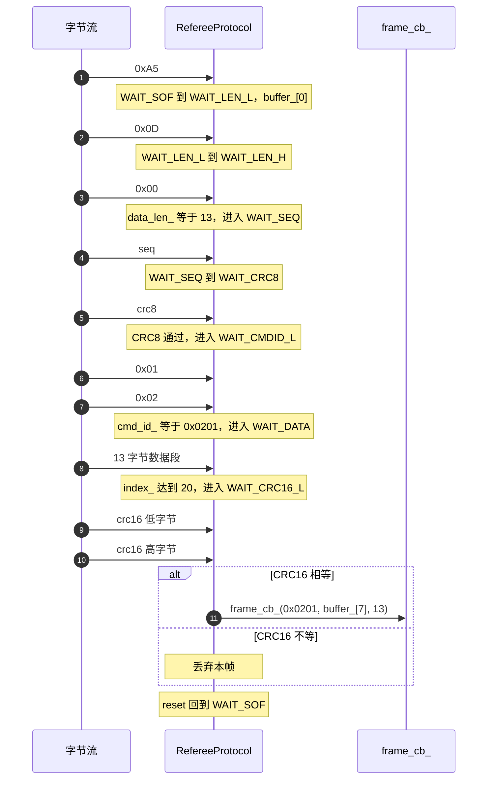

# RefereeProtocol 状态机

> 实现在 `Communication/Inc/referee_protocol.h` 的 `State` 枚举与 `Communication/Src/referee_protocol.cpp` 的 `input` 函数，两块板逐字节相同。帧字段布局见 `01-裁判系统链路与帧格式`，校验通过后的字段映射见 `04-RefereeDecode字段映射`。

串口给出的是无边界的字节流，接收方必须自己找出帧的起点与终点。裁判系统帧的起点固定为 `0xA5`，长度由帧内 `len` 字段给出，于是解帧可以写成一台有限状态机：每来一个字节，按当前状态决定写到哪里、下一个状态是什么。

状态机的状态数等于需要顺序确认的字段数。帧头有 SOF、len 低、len 高、seq、CRC8 五个位置，`cmd_id` 有两个字节，数据段长度可变，CRC16 有两个字节。合并同类状态后共 10 个：

| 状态 | 对应字段 | 进入该状态时已确认的字节数 |
| --- | --- | --- |
| `WAIT_SOF` | 帧起始 | 0 |
| `WAIT_LEN_L` | `len` 低字节 | 1 |
| `WAIT_LEN_H` | `len` 高字节 | 2 |
| `WAIT_SEQ` | `seq` | 3 |
| `WAIT_CRC8` | 帧头 CRC8 | 4 |
| `WAIT_CMDID_L` | `cmd_id` 低字节 | 5 |
| `WAIT_CMDID_H` | `cmd_id` 高字节 | 6 |
| `WAIT_DATA` | 数据段 | 7 |
| `WAIT_CRC16_L` | 帧尾 CRC16 低字节 | 7+n |
| `WAIT_CRC16_H` | 帧尾 CRC16 高字节 | 8+n |

状态在头文件里以 `enum State` 定义，初值 `WAIT_SOF`（`Communication/Inc/referee_protocol.h`）。对象只有三块持久状态：`buffer_[256]`、`index_`、`data_len_` 与 `cmd_id_`（`referee_protocol.h`）。

> 源码索引

| 路径 | 作用 |
| --- | --- |
| `Communication/Inc/referee_protocol.h` | 状态枚举、初值与缓冲成员 |
| `Communication/Src/referee_protocol.cpp` | `input` 状态机与 `reset` |
| `Communication/Src/referee_decode.cpp` | 回调注册与逐字节喂数 |
| `Communication/Src/usart_dma.cpp` | 空闲回调与重入标志 |

## 状态机全景

`reset` 把所有状态清回起点，是两条失败路径的公共终点（`Communication/Src/referee_protocol.cpp`）。



## 逐态动作与转移

| 状态 | 收到字节后的动作 | 去向 | 源码 |
| --- | --- | --- | --- |
| `WAIT_SOF` | 字节等于 `0xA5` 时写入 `buffer_[0]`，`index_` 置 1；否则丢字节并留在本态 | `WAIT_LEN_L` | `referee_protocol.cpp` |
| `WAIT_LEN_L` | `buffer_[index_++]`，`data_len_ = byte` | `WAIT_LEN_H` | `referee_protocol.cpp` |
| `WAIT_LEN_H` | `data_len_ \|= byte << 8`，合成 16 位长度 | 超过 200 回 `WAIT_SOF`，否则 `WAIT_SEQ` | `referee_protocol.cpp` |
| `WAIT_SEQ` | 存 `seq`，不校验 | `WAIT_CRC8` | `referee_protocol.cpp` |
| `WAIT_CRC8` | 存字节后算 `crc8_calc(buffer_, 4, 0xFF)` 并与该字节比较 | 相等进 `WAIT_CMDID_L`，否则 `WAIT_SOF` | `referee_protocol.cpp` |
| `WAIT_CMDID_L` | `cmd_id_ = byte` | `WAIT_CMDID_H` | `referee_protocol.cpp` |
| `WAIT_CMDID_H` | `cmd_id_ \|= byte << 8` | 长度为 0 进 `WAIT_CRC16_L`，否则 `WAIT_DATA` | `referee_protocol.cpp` |
| `WAIT_DATA` | 逐字节存数据段，每字节后检查 `index_ >= 7 + data_len_` | 达成进 `WAIT_CRC16_L` | `referee_protocol.cpp` |
| `WAIT_CRC16_L` | 存 CRC16 低字节 | `WAIT_CRC16_H` | `referee_protocol.cpp` |
| `WAIT_CRC16_H` | 存高字节，拼出 `recv_crc16`，算 `crc16_calc(buffer_, index_-2, 0xFFFF)` | 无条件回 `WAIT_SOF` | `referee_protocol.cpp` |

两个字段的读取顺序需要留意。`data_len_` 是先取低字节再或上高字节左移 8 位，`cmd_id_` 同样，都是小端。`seq` 被写入缓冲但既不比较也不参与任何判断。

十个状态里只有 `WAIT_DATA` 的驻留时间可变，其余每个字节恰好推进一次。`WAIT_SOF` 是唯一一个会连续吞掉多个字节的状态，它靠比较 `0xA5` 挑出起点。

## 长度字段的 200 上限

长度字段两字节合成后立即检查：

```cpp
if(data_len_ > 200)  // 安全保护
{
    reset;
}
```

该判断在 `Communication/Src/referee_protocol.cpp`。触发时整帧丢弃，且当前这个高字节不会被重新当作 SOF 使用。200 是官方单帧数据段的上限，代码把它同时当作缓冲越界保护。

把上限写成 200 而不是按缓冲容量 256 反推，是因为越界保护要留出帧头与 CRC16 的余量：一帧最多 `9+200` 字节，仍小于 256。若上限按 256 来写，最大写入下标会越过缓冲边界。

## CRC8 与 CRC16 的覆盖范围

`crc8_calc` 的三个参数是数据指针、长度、初值，调用处传入 `buffer_`、4、`0xFF`（`referee_protocol.cpp`）。4 字节正好是 SOF、len 低、len 高、seq，此时 `index_` 为 5，`buffer_[4]` 存的就是待比较的 CRC8 本身。把 `cmd_id` 也纳入帧头校验会算错，帧头校验的范围由协议规定为前 4 字节。

`WAIT_CRC16_H` 先拼接收值，再算校验值：

```cpp
uint16_t recv_crc16 =
    buffer_[index_-2] |
    (buffer_[index_-1] << 8);

uint16_t calc_crc16 =
    crc16_calc(buffer_, index_-2, 0xFFFF);
```

接收值低字节在前、高字节在后，为小端。计算长度是 `index_-2`：此时 `index_` 等于 `9+n`，减 2 得 `7+n`，覆盖 SOF 到最后 1 字节数据，不含两字节 CRC16。初值 `0xFFFF`。两值相等才调用回调，随后无论结果都执行 `reset`（`referee_protocol.cpp`）。

| 校验 | 覆盖字节 | 长度参数 | 初值 |
| --- | --- | --- | --- |
| CRC8 | SOF 到 seq | 固定 4 | `0xFF` |
| CRC16 | SOF 到最后 1 字节数据 | `index_-2` | `0xFFFF` |

## 零长数据段与结束判断

`WAIT_CMDID_H` 里 `data_len_ == 0` 时直接跳到 CRC16 低字节（`referee_protocol.cpp`），不进入 `WAIT_DATA`。零长帧整帧 9 字节，CRC16 覆盖前 7 字节。

`WAIT_DATA` 每收一字节把 `index_` 加一，再判断是否达到 `7 + data_len_`（`referee_protocol.cpp`）。用累加下标而不是另设计数器，好处是与 CRC16 的 `index_` 语义一致，代价是下标与「已收数据字节数」需要换算。

## buffer_ 的边界核算

数据段上限 200 保证了写入不越界。逐态算下标：SOF 到 `cmd_id` 高字节共 7 次写入，数据段 `n` 次，CRC16 两次，最大写入下标为 `8+n`，最大 `index_` 为 `9+n`。

| 量 | 表达式 | 上限 |
| --- | --- | --- |
| 数据段 | `n` | 200 |
| 缓冲容量 | `sizeof(buffer_)` | 256 |
| 最大写入下标 | `8+n` | 208 |
| 最终 `index_` | `9+n` | 209 |
| 剩余空间 | `256-(9+n)` | 47 |

`WAIT_DATA` 的结束位置 `7+200` 等于 207，两字节 CRC16 写到下标 208，都在 256 之内。上限若放宽到 247，最大下标会顶到 255；再大就会越过 `buffer_[256]`。代码没有在每次写入前做运行时下标检查，安全性完全依赖 200 的上限判断。



## 失步与重同步

状态机没有帧间超时，也没有「空闲即复位」。`UsartDma` 的空闲中断只负责把这一批字节交给回调，`RefereeProtocol` 的状态跨调用保留。由此有两类行为：

1. 一帧被截断时，状态停在中间位置，后续字节继续按该状态解释，直到某个判断失败或长度走完才复位；
2. 复位时当前字节被消费掉，不会重新按 SOF 判断。

以 `WAIT_CRC8` 失败为例，若这帧的 CRC8 位置恰好来了一个新帧的 `0xA5`，比较失败后 `reset` 把该字节丢弃，新帧的第一个字节损失，必须等下一个 `0xA5` 才能重新同步。这是固定起始字节协议在错误帧之后的常见代价。



## 回调注册与运行上下文

`RefereeProtocol` 不持有回调以外的依赖。构造时把回调存进 `frame_cb_`，`RefereeDecode` 在构造里注册成员函数转发（`Communication/Src/referee_decode.cpp`）。`WAIT_CRC16_H` 调用回调前判空（`referee_protocol.cpp`），所以 `refereeproto(nullptr)` 状态下即使有数据也只丢弃不崩。

解析全程在中断上下文执行：`RefereeCallback` 由 `RefereeUartCallback` 在 `USART6_IRQHandler` 里调用，逐字节 `input`（`Communication/Src/referee_decode.cpp`）。一帧 209 字节的最坏情况下，中断里要跑 209 次状态机，外加一次 CRC16 表查，属于可接受的短临界区。`UsartDma` 用 `callback_busy_` 防止空闲回调重入（`Communication/Src/usart_dma.cpp`），但该标志不覆盖协议状态机本身。

## 状态机层面的易错点

| 易错点 | 现象 | 位置 |
| --- | --- | --- |
| 认为空闲会产生复位 | 截断帧之后的状态一直保留 | 状态机没有超时逻辑，`reset` 只由校验与长度触发 |
| 复位后期望当前字节被重解释 | 丢失一个可能的 `0xA5` | `referee_protocol.cpp`、 直接 `reset` |
| 用 `data_len_` 当整帧长度 | `WAIT_DATA` 的结束条件算错 | 结束条件是 `7 + data_len_` |
| 把 `index_` 当数据字节数 | 少算 7 字节帧头 | `index_` 含帧头与 `cmd_id` |
| 认为 CRC8 用了整个缓冲 | 校验范围随 `index_` 变化 | 固定传 4 |
| 认为 CRC16 覆盖全帧 | 把两字节 CRC16 也纳入计算 | 长度取 `index_-2` |
| 放宽 200 上限不改缓冲 | 写入越过 `buffer_[256]` | 无运行时下标检查，仅靠  的上限 |

## 小结

### 核心概念

- 解帧是字节流上的 10 态状态机，起点 `WAIT_SOF`，终点 `WAIT_CRC16_H`。
- `data_len_` 与 `cmd_id_` 小端合成；`seq` 只存不查。
- 两处校验各自有独立的覆盖范围：CRC8 前 4 字节、CRC16 前 `7+n` 字节，初值分别为 `0xFF` 与 `0xFFFF`。
- 超过 200 的数据段直接复位，是缓冲保护的唯一依赖。
- 最大帧 209 字节，`buffer_[256]` 余 47 字节。
- 状态机无超时，截断帧会保留状态直到后续判断失败。

### 设计权衡

| 决策 | 选择 | 收益 | 代价 |
| --- | --- | --- | --- |
| 解帧方式 | 逐字节有限状态机 | 不依赖帧间间隔，缓冲小 | 每个字节一次 `switch`，状态跨调用保留 |
| 越界保护 | 只判 `data_len_ > 200` | 判断便宜 | 依赖该常量与缓冲容量同步维护 |
| 失步恢复 | 仅在校验失败时复位 | 逻辑简单 | 复位吃掉当前字节，可能多丢一帧起点 |
| 缓冲策略 | 单块 `buffer_` 复用 | 无动态分配 | 回调内必须拷贝或立即消费 |
| 回调时机 | CRC16 通过后 | 上层不接触坏帧 | 坏帧对上层不可见，无法统计误码率 |
| 序号处理 | `seq` 只存不查 | 少一次比较 | 乱序与丢帧不可观测 |

## 练习

### 基础题

1. 画出数据段长度 0、1、200 三种情况下 `input` 经过的状态序列。
2. `WAIT_LEN_H` 收到的两个字节为 `0xC8`、`0x00` 时会发生什么？`0x00`、`0x01` 呢？
3. 数据段 200 字节时，最大写入下标与最终 `index_` 各是多少？`buffer_` 还剩多少字节。
4. `WAIT_CRC16_H` 里 `recv_crc16` 的两个字节分别对应帧的哪个偏移？

### 挑战题

5. 把 `data_len_` 上限从 200 调到 250 会让最大写入下标变成多少？据此判断 `buffer_[256]` 是否仍安全，并给出两种不改缓冲的替代做法。
6. 为状态机增加空闲超时复位：说明需要哪一层提供时间基准（`UsartDma` 的空闲回调或独立定时器），以及超时判断放在复位路径的哪个位置才不会误伤正常帧。
7. `WAIT_SOF` 之外的任一状态收到新帧 `0xA5` 时不会被识别为起点。分析这一设计的利弊，并给出一种代价最小的改进思路。

---

### 附：本页引用的固件路径

| 路径 | 用途 |
| --- | --- |
| `2026OmniSentryGimbal/Communication/Inc/referee_protocol.h` | `State` 十态、初值、`buffer_[256]` |
| `2026OmniSentryGimbal/Communication/Src/referee_protocol.cpp` | `input` 状态机、`reset`、len 保护、CRC8、数据段结束、CRC16 |
| `2026OmniSentryGimbal/Communication/Src/referee_decode.cpp` | 回调注册、`RefereeCallback` |
| `2026OmniSentryGimbal/Communication/Src/usart_dma.cpp` | 空闲回调重入标志 |
