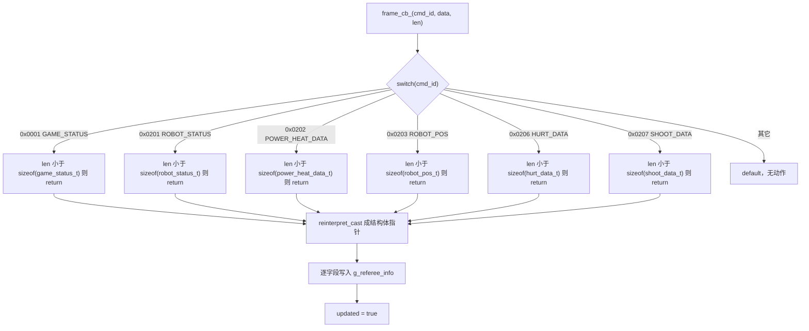
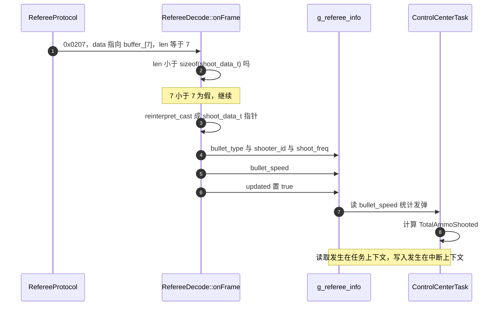

# RefereeDecode 字段映射

> 实现在 `Communication/Inc/referee_decode.h` 与 `Communication/Src/referee_decode.cpp`，两块板逐字节相同，仅 `g_referee_info` 的定义位置不同。帧结构见 `01-裁判系统链路与帧格式`，解帧状态机见 `03-RefereeProtocol状态机`，命令码与数据段布局见 `02-命令码与数据段`。

`RefereeProtocol` 校验通过后调用 `frame_cb_(cmd_id, &buffer_[7], data_len_)`，把数据段首指针交给上层。`RefereeDecode::onFrame` 负责把这条原始指针解释成具体字段，并写入全局 `g_referee_info`。映射采用零拷贝：不复制数据段，直接把指针 `reinterpret_cast` 成对应结构体指针，再逐字段取值。

`g_referee_info`（类型 `RefereeInfo`）是所有下游代码唯一能看到裁判数据的地方。字段清单在 `Communication/Inc/referee_decode.h:456-499`，声明为全局对象在 `:501`。

零拷贝的成立依赖三个隐含前提：结构体按 1 字节对齐、线上字节序与主机一致、位域分配顺序与编译器一致。三者都在默认配置下成立，改动任一项都会让字段静默取错值，而不是报错。

> 源码索引

| 路径 | 作用 |
| --- | --- |
| `Communication/Inc/referee_decode.h` | `pack`、`RefereeInfo` 与全局声明 |
| `Communication/Src/referee_decode.cpp` | 六个解析分支 |
| `Communication/Src/referee_protocol.cpp` | 小端合成与 CRC16 |
| 底盘板 `Message_Bus` | `g_referee_info` 的定义位置 |
| 底盘板 `ControlCenterTask.cpp` | 唯一消费点 |

## 零拷贝映射到 g_referee_info

六个分支的形状一致，以 0x0207 为例：

1. 判 `len < sizeof(shoot_data_t)`，不满足则 `return`，不置 `updated`。
2. `reinterpret_cast` 数据段指针为 `shoot_data_t*`。
3. 逐字段取值写入 `g_referee_info`。
4. 六个字段都写完之后置 `updated = true`。

映射表按命令列出结构体字段、`g_referee_info` 目标字段与写入行号。未列出的结构体成员不被读取。

### 0x0001 GAME_STATUS（`referee_decode.cpp:33-46`）

| 结构体字段 | 类型 | 目标字段 | 写入行 |
| --- | --- | --- | --- |
| `game_type` | 位域 4 位 | `game_type` | `:40` |
| `game_progress` | 位域 4 位 | `game_progress` | `:41` |
| `stage_remain_time` | `uint16_t` | `stage_remain_time` | `:42` |
| `SyncTimeStamp` | `uint64_t` | 无 | 不读取 |

### 0x0201 ROBOT_STATUS（`:52-73`）

| 结构体字段 | 类型 | 目标字段 | 写入行 |
| --- | --- | --- | --- |
| `robot_id` | `uint8_t` | `robot_id` | `:59` |
| `robot_level` | `uint8_t` | `robot_level` | `:60` |
| `current_HP` | `uint16_t` | `current_hp` | `:62` |
| `maximum_HP` | `uint16_t` | `max_hp` | `:63` |
| `chassis_power_limit` | `uint16_t` | `chassis_power_limit` | `:65` |
| `power_management_gimbal_output` | 位域 1 位 | `gimbal_output` | `:67` |
| `power_management_chassis_output` | 位域 1 位 | `chassis_output` | `:68` |
| `power_management_shooter_output` | 位域 1 位 | `shooter_output` | `:69` |
| `shooter_barrel_cooling_value`、`shooter_barrel_heat_limit` | `uint16_t` | 无 | 不读取 |

### 0x0202 POWER_HEAT_DATA（`:79-93`）

| 结构体字段 | 类型 | 目标字段 | 写入行 |
| --- | --- | --- | --- |
| `buffer_energy` | `uint16_t` | `buffer_energy` | `:86` |
| `shooter_17mm_heat` | `uint16_t` | `shooter_heat_17mm` | `:88` |
| `shooter_42mm_heat` | `uint16_t` | `shooter_heat_42mm` | `:89` |
| `reserved1`、`reserved2`、`reserved3` | 保留 | 无 | 不读取 |

### 0x0203 ROBOT_POS（`:99-112`）

| 结构体字段 | 类型 | 目标字段 | 写入行 |
| --- | --- | --- | --- |
| `x` | `float` | `robot_x` | `:106` |
| `y` | `float` | `robot_y` | `:107` |
| `angle` | `float` | `robot_angle` | `:108` |

### 0x0206 HURT_DATA（`:118-130`）

| 结构体字段 | 类型 | 目标字段 | 写入行 |
| --- | --- | --- | --- |
| `armor_id` | 位域 4 位 | `hurt_armor_id` | `:125` |
| `hurt_HP_deduction_reason` | 位域 4 位 | `hurt_type` | `:126` |

### 0x0207 SHOOT_DATA（`:136-150`）

| 结构体字段 | 类型 | 目标字段 | 写入行 |
| --- | --- | --- | --- |
| `bullet_type` | `uint8_t` | `bullet_type` | `:143` |
| `shooter_number` | `uint8_t` | `shooter_id` | `:144` |
| `launching_frequency` | `uint8_t` | `shoot_freq` | `:145` |
| `initial_speed` | `float` | `bullet_speed` | `:146` |

六个分支的结构体字段命名与目标字段命名并不一一对应：`current_HP` 对应 `current_hp`，`shooter_number` 对应 `shooter_id`，`hurt_HP_deduction_reason` 对应 `hurt_type`。改字段名时两侧要同时改。

每个分支在取字段前都有 `len < sizeof(结构体)` 的判断，不满足则 `return`，不置 `updated`。数据段比结构体长时按结构体的字节数读取，多出的尾部忽略。

## pack(1) 决定了 sizeof 与对齐

线上结构体全部包在 `#pragma pack(push,1)` 与 `#pragma pack(pop)` 之间（`Communication/Inc/referee_decode.h:15`、`:450`）。压缩到 1 字节对齐后，`sizeof` 与线上数据段长度相等，且 `alignof` 为 1，任意字节偏移的 `reinterpret_cast` 都不会触发未对齐访问。

去掉 `pack` 会同时改变两件东西。下面是用同一份头文件去掉 pack 前后编译得到的 `sizeof`：

| 结构体 | pack(1) | 默认对齐 | 差值来源 |
| --- | --- | --- | --- |
| `game_status_t` | 11 | 16 | `uint64_t` 要求 8 字节对齐，前面补 5 字节 |
| `robot_status_t` | 13 | 14 | 结构体对齐 2，末尾补 1 字节 |
| `power_heat_data_t` | 14 | 16 | `float` 要求 4 字节对齐，末尾补 2 字节 |
| `buff_t` | 8 | 10 | `uint16_t` 前后各补 1 字节 |
| `shoot_data_t` | 7 | 8 | `float` 前补 1 字节 |
| `robot_pos_t` | 12 | 12 | 三个 `float` 无填充 |
| `hurt_data_t` | 1 | 1 | 单个字节，无填充 |
| `referee_frame_header_t` | 5 | 6 | `uint16_t` 后补 1 字节 |

`onFrame` 的长度校验写的是 `len < sizeof(结构体)`。去掉 pack 后 `game_status_t` 的 `sizeof` 变成 16，11 字节的合法数据段会被判为过短，比赛状态数据全部丢失。`RefereeInfo` 定义在 `pragma pack(pop)` 之后（`referee_decode.h:456-499`），不参与线上映射，它是普通结构体，本机编译 `sizeof` 为 48。

对齐还决定访问方式。pack 到 1 之后 `uint16_t` 与 `float` 成员可能落在奇数地址上，Cortex-M4 支持非对齐的字访问，但同一成员的访问会拆成多次总线动作，这是压缩布局的效率代价。

## 小端与位域顺序的隐含前提

帧内所有多字节整数按小端存放：`data_len_` 与 `cmd_id_` 的合成方式是低字节在前（`referee_protocol.cpp:47`、`:88`），CRC16 的接收值同样低字节在前（`:114-116`）。数据段里的 `uint16_t`、`uint64_t` 与 `float` 通过 `reinterpret_cast` 直接按主机字节序读取，隐含前提是线上也是小端。Cortex-M4 为小端，与官方协议的整数编码一致；`float` 字段（`robot_pos_t` 的三个坐标、`shoot_data_t` 的弹速、`power_heat_data_t` 的 `reserved3`）的线上字节序按官方手册为小端，此处属按手册推断，未在两块板上抓包核对。

位域顺序同样依赖编译器。`game_status_t` 把 `game_type` 与 `game_progress` 声明在同一个 `uint8_t` 里，各占 4 位；`hurt_data_t` 的 `armor_id` 与 `hurt_HP_deduction_reason` 同样。GCC 在小端目标上把先声明的位域放在低位，因此 `game_type` 占字节 0 的低 4 位，`game_progress` 占高 4 位。这一顺序由编译器 ABI 决定，属推断，未在目标板上核对。

## updated 标志的实际语义

`RefereeInfo::updated` 初值为 `false`（`Communication/Inc/referee_decode.h:498`），六个分支在写完全部字段后都置 `true`。全工程没有把 `updated` 清回 `false` 的代码，也没有重置接口。

由此它的语义是「自本机启动以来成功解析过至少一帧」，而不是「本帧刚更新」。按命令区分也做不到：任一分支置位后，其它命令的更新无法从该标志看出，各字段也没有各自的版本号或时间戳。把 `updated` 当逐帧新数据标志会造成两个后果：首次置位后的每一轮循环都会当成有新数据；某一路命令断更时无法察觉。

全局对象没有读写锁或双缓冲。写入发生在 `USART6_IRQHandler` 的中断上下文，读取发生在任务上下文。Cortex-M4 对对齐的 16 位与 32 位读写是单指令，单个字段不会撕裂，但一组跨命令的字段可能来自不同帧。底盘板只读 `bullet_speed`（`Task/Src/ControlCenterTask.cpp:123`），没有这种跨字段一致性问题。

## 两块板的定义位置与消费点

两块板的 `referee_decode.cpp` 只有一行不同：云台板在 `:9` 定义 `g_referee_info`，底盘板在 `:9` 写成 `extern`，定义本体放在 `Message_Bus/message_bus.cpp:13`，并在 `Message_Bus/message_bus.h:60` 声明。

| 板 | 定义位置 | 读取者 | 读到的字段 |
| --- | --- | --- | --- |
| 云台板 | `Communication/Src/referee_decode.cpp:9` | 无 | 无 |
| 底盘板 | `Message_Bus/message_bus.cpp:13` | `Task/Src/ControlCenterTask.cpp:123`、`:127` | `bullet_speed` |

云台板的 `onFrame` 同样会被链接进固件，但因为没有接收通路，六个分支不会被执行，`updated` 永远保持 `false`。底盘板在 1 ms 控制周期里读第 123 行的弹速做发弹统计，第 127 行把统计值随裁判数据发到 CAN。

## 映射层面的易错点

| 易错点 | 现象 | 位置 |
| --- | --- | --- |
| 认为结构体没有 pack | 手动按默认对齐算偏移，字段全错 | `referee_decode.h:15`、`:450` |
| 去掉 pack 后长度校验拒绝合法帧 | 11 字节状态帧被丢弃 | `referee_decode.cpp:35` 的 `sizeof` 变为 16 |
| 把 `updated` 当逐帧标志 | 每轮循环都读到「有新数据」 | 置位后无清除代码，`:44` 等六处 |
| 认为六个分支覆盖全部字段 | 枪口冷却值、热量上限、保留字段取不到 | 结构体成员未写入 `g_referee_info` |
| 按结构体字段名找目标字段 | `shooter_number`、`hurt_HP_deduction_reason` 找不到 | 目标名是 `shooter_id`、`hurt_type` |
| 在云台板读裁判字段 | 全是初值 0 | 无接收通路，分支不执行 |
| 认为位域顺序跨编译器一致 | 换编译器后高低位颠倒 | 位域分配属实现定义 |
| 把 `RefereeInfo` 也当成线上结构体 | 按 48 字节去算数据段长度 | `RefereeInfo` 在 `pack(pop)` 之后，不参与映射 |

## 小结

### 核心概念

- `onFrame` 是 `cmd_id` 到字段的六路分派，只覆盖 0x0001、0x0201、0x0202、0x0203、0x0206、0x0207。
- 每个分支先判 `len < sizeof(结构体)`，再 `reinterpret_cast` 取字段，零拷贝。
- 线上结构体在 `#pragma pack(push,1)` 区间内，`sizeof` 等于数据段长度，且指针偏移任意字节都对齐安全。
- `g_referee_info` 是唯一下游出口，部分字段重命名后写入，保留字段与冷却值、热量上限未落库。
- `updated` 置位后从不复位，语义是「解析过至少一帧」，与逐帧新数据无关。
- 云台板只定义不消费；底盘板在 `ControlCenterTask` 里读 `bullet_speed`。

### 设计权衡

| 决策 | 选择 | 收益 | 代价 |
| --- | --- | --- | --- |
| 字段获取 | `reinterpret_cast` 零拷贝 | 无逐字节拼接开销 | 依赖线上字节序与主机一致 |
| 结构体布局 | `pack(1)` | `sizeof` 与对齐都可控 | 成员可能跨字访问，效率略低 |
| 校验粒度 | 每条命令单独 `len` 判断 | 单条命令损坏不影响其它 | 六处判断重复，新增命令要照抄 |
| 数据落库 | 只映射关心的字段 | `RefereeInfo` 精简 | 未映射字段要改代码才能取到 |
| 更新标志 | 单个全局 `updated` | 实现最省 | 无法区分命令与帧，且不可复位 |
| 并发访问 | 中断写、任务读 | 无需队列 | 跨字段读取可能来自不同帧 |

## 练习

### 基础题

1. `game_status_t` 的 `SyncTimeStamp` 是 8 字节，为什么 `onFrame` 不读它？如果以后要用，需要改哪几处？
2. `power_heat_data_t` 的 `reserved3` 被声明为 `float`。写出在 pack(1) 下它占用的偏移区间，并说明它与默认对齐下的差值。
3. 底盘板读到 `updated` 为 `true` 时，能否断定 `bullet_speed` 就是本帧 0x0207 写入的值？说明理由。
4. 列出 `hurt_data_t` 两个位域字段各自映射到的目标字段名，并说明为什么它们是同字节的两个半字节。

### 挑战题

5. 把 `g_referee_info` 改成双缓冲加一个序号，让任务侧能拿到同一帧的一致快照。说明写入侧与读取侧各需要什么同步原语，以及 Cortex-M4 上哪些操作本身是原子的。
6. 现在 `updated` 无法区分命令。设计一种按命令分组的更新标志（例如位掩码或每个字段的时间戳），给出结构与置位、清除的时机。
7. `onFrame` 直接用 `reinterpret_cast` 读取 `float` 字段。若把固件迁移到默认对齐会怎样，若迁移到大端处理器又会怎样？分别给出需要改动的部分。

---

### 附：本页引用的固件路径

| 路径 | 用途 |
| --- | --- |
| `2026OmniSentryGimbal/Communication/Inc/referee_decode.h` | `pack`（:15、:450）、`RefereeInfo`（:456-499）、`updated` 初值（:498）、全局声明（:501） |
| `2026OmniSentryGimbal/Communication/Src/referee_decode.cpp` | 六个解析分支（:33-150）、`updated` 置位（:44 等六处） |
| `2026OmniSentryGimbal/Communication/Src/referee_protocol.cpp` | 小端合成（:47、:88）、CRC16 接收值（:114-116） |
| `2026OmniSentryChassis/Message_Bus/message_bus.cpp` | `g_referee_info` 定义（:13） |
| `2026OmniSentryChassis/Message_Bus/message_bus.h` | 全局声明（:60） |
| `2026OmniSentryChassis/Task/Src/ControlCenterTask.cpp` | 读取 `bullet_speed`（:123、:127） |
| `2026OmniSentryGimbal/Communication/Inc/referee_protocol.h` | `buffer_[256]`（:41） |
