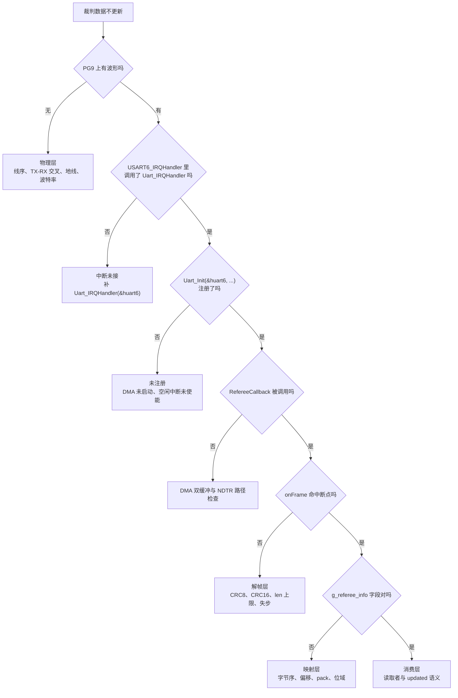
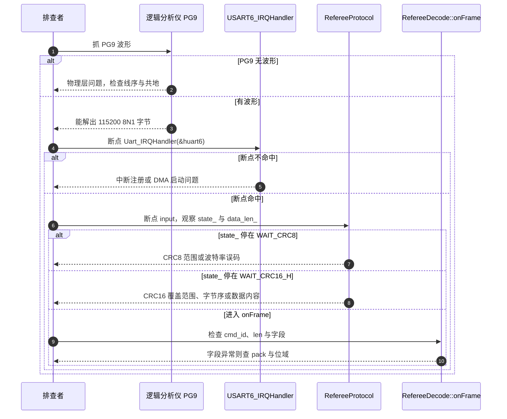

# 裁判系统易错点与调试

> 前四页分别讲链路与帧格式、命令码与数据段、解帧状态机、字段映射。本页把两块板的实际缺陷与定位方法汇总。源码引用中的行号以 `2026OmniSentryGimbal` 与 `2026OmniSentryChassis` 仓库为准。

裁判系统从线缆到应用字段是一条五段链路，任何一段断开都表现为「数据不动」。逐层向前定位比从头读代码快：物理层看 PG9 有没有波形，中断与 DMA 层看空闲回调有没有被命中，解帧层看状态机有没有走到校验通过，映射层看 `onFrame` 有没有命中，消费层看谁在读 `g_referee_info`。

两处已知的断裂在中断与 DMA 层：云台板没有 `Uart_Init(&huart6, ...)`，且 `USART6_IRQHandler` 的 USER CODE 段为空。底盘板两处都接好，是全工程唯一有裁判数据通路的板。

> 源码索引

| 路径 | 作用 |
| --- | --- |
| 两块板 `Core/Src/main.c` | 注册差异 |
| 两块板 `Core/Src/stm32f4xx_it.c` | 中断入口 |
| `Communication/Src/referee_protocol.cpp` | 校验、上限与数据指针 |
| `Communication/Inc/referee_decode.h` | pack、位域与 `updated` |
| `Communication/Src/referee_decode.cpp` | 六路分派与全局定义 |
| `Algorithm/Src/CRC8.cpp`、`CRC16.cpp` | 离线重算用的实现 |

## 五层链路上的故障分层

| 层次 | 关注点 | 关键判据 |
| --- | --- | --- |
| 物理层 | PG9 有没有符合 115200 8N1 的波形 | 逻辑分析仪能解出字节 |
| 中断与 DMA | `USART6_IRQHandler` 是否调用 `Uart_IRQHandler`，`Uart_Init` 是否注册 | 空闲回调被命中 |
| 解帧层 | 状态机是否走到 `WAIT_CRC16_H` 并校验通过 | `state_`、`data_len_`、CRC 比较 |
| 映射层 | `onFrame` 是否命中，字段是否按小端与 pack 布局读取 | `cmd_id` 与 `g_referee_info` |
| 消费层 | 谁读 `g_referee_info`，`updated` 怎么用 | 读取者与更新语义 |

五层里只有第一层需要外部仪器，其余四层都能用断点与变量观察。定位顺序从后往前也成立：先确认 `onFrame` 是否命中，命中则直接跳到映射层，不命中再往前查解帧与中断。

## 已知缺陷与高频错误清单

下表汇总两页源码里已核实的缺陷与协议层易错点，按定位层次排列。

| 层次 | 现象 | 根因 | 位置 |
| --- | --- | --- | --- |
| 中断与 DMA | 云台板裁判字段恒为初值 | 未注册 `huart6`，DMA 未启动、空闲中断未使能 | 云台 `Core/Src/main.c:125` |
| 中断与 DMA | 云台板断点打在 `onFrame` 从不命中 | `USART6_IRQHandler` 的 USER CODE 为空，未调用 `Uart_IRQHandler` | 云台 `Core/Src/stm32f4xx_it.c:359-368` |
| 中断与 DMA | 底盘板有波形但回调不触发 | 注册缺失或 USART6 NVIC 未使能 | 底盘 `Core/Src/main.c:132`、`Core/Src/usart.c:261-263` |
| 解帧 | CRC16 始终不相等 | 计算范围写成只覆盖数据段，未包含帧头与 `cmd_id` | `referee_protocol.cpp:118-119` |
| 解帧 | CRC8 始终不相等 | 把 `cmd_id` 也算进帧头校验 | `referee_protocol.cpp:68` |
| 解帧 | `cmd_id` 读成 0x0102 | 按大端解析 | `referee_protocol.cpp:88` |
| 解帧 | 数据段取值整体偏移 7 字节 | 从帧首而不是 `buffer_[7]` 取数据 | `referee_protocol.cpp:125` |
| 解帧 | 帧被整批丢弃 | 数据段超过 200，触发上限保护 | `referee_protocol.cpp:49-52` |
| 解帧 | 失步后连续丢几帧 | 无帧间超时，复位消费掉当前字节 | `referee_protocol.cpp:71`、`:51` |
| 解帧 | 乱序包未按序丢弃 | `seq` 只存不查 | `referee_protocol.cpp:59-62` |
| 映射 | 去掉 `pack` 后合法帧被拒 | `sizeof` 膨胀，`len < sizeof` 判负 | `referee_decode.h:15`、`referee_decode.cpp:35` |
| 映射 | 位域高低位颠倒 | 位域分配由编译器 ABI 决定 | `referee_decode.h:88-89` |
| 映射 | 0x0204 增益数据收不到 | `buff_t` 无对应 `switch` 分支 | `referee_decode.cpp:27-155` |
| 映射 | `updated` 每轮都读成新数据 | 置位后无清除代码 | `referee_decode.h:498` |
| 消费 | 云台板没有字段读取者 | 全工程无 `g_referee_info` 的读取点 | 云台 `Communication/Src/referee_decode.cpp:9` |
| 消费 | 底盘板只拿到弹速 | 仅 `ControlCenterTask` 读 `bullet_speed` | 底盘 `Task/Src/ControlCenterTask.cpp:123` |
| 消费 | 一组字段来自不同帧 | 中断写、任务读，无快照 | 全局对象，无锁 |

其中云台板的接收通路缺失是整条链的入口问题，其余协议层错误在底盘板上才会实际暴露。协议层最容易被误改的是 CRC16 覆盖范围、`cmd_id` 字节序与数据段起始偏移三处，它们都在 `referee_protocol.cpp` 的同一个文件里。

## 物理层与中断 DMA 层的调试

物理层用逻辑分析仪或示波器接 PG9，确认有波形且能按 115200 8N1 解出字节。裁判系统是主办方设备，机器人端只接它的 TX 到 PG9，同时确认共地。若波形存在但字节错乱，先怀疑波特率或采样点，再怀疑协议。

中断与 DMA 层在 `USART6_IRQHandler` 与 `Uart_IRQHandler` 上打断点，确认中断进入。`UsartDma::IRQHandler` 先判 IDLE 标志再进入空闲回调（`Communication/Src/usart_dma.cpp:50-72`）。空闲回调里可观察两个量：

- `rx_data_len_ = UART_RX_BUF_LEN - NDTR`（`:88`），值应在 1 到 256 之间；
- `hdmarx->Instance->CR` 的 `DMA_SxCR_CT` 位决定读取 `rx_buf_[0]` 还是 `rx_buf_[1]`（`:90-93`）。

云台板在这一层就会看到断点不命中，因为中断里没有自定义调用，DMA 也从未启动。

## 解帧层的条件断点

在 `RefereeProtocol::input` 或 `reset` 上设条件断点，观察 `state_`、`index_`、`data_len_`、`cmd_id_` 四个变量，可以直接判断失步位置：

| 断点现象 | 判断 |
| --- | --- |
| `state_` 停在 `WAIT_SOF` | 未收到 `0xA5`，或前序帧 CRC8 失败后被复位 |
| `state_` 停在 `WAIT_DATA` | 数据段长度与实际字节数不符，帧被截断 |
| `WAIT_CRC16_H` 中 `calc_crc16 != recv_crc16` | 覆盖范围、字节序或数据段内容有误 |
| `data_len_` 恒为 0 | 长度字段解析错误，或帧本身是零长命令 |

`data_len_` 超过 200 而状态回到 `WAIT_SOF` 是上限保护生效，不是失步。区分办法是看 `reset` 的调用来源：上限判断在 `WAIT_LEN_H`，失步复位在 `WAIT_CRC8` 或 CRC16 比较处。

## 映射层的核对点

在 `onFrame` 的六个 `case` 上打断点，确认命中的 `cmd_id` 与 `len`。`data` 指针应等于 `&buffer_[7]`。若命令码命中但字段值异常，按下面三项逐个排除：

1. `pack` 是否仍在头文件里（`referee_decode.h:15`、`:450`），结构体 `sizeof` 是否等于数据段长度。
2. 位域是否被改动，`game_type` 与 `game_progress` 的高低半字节是否符合预期。
3. 目标字段名是否与结构体字段名不同，例如 `shooter_number` 写入的是 `shooter_id`。

## 离线重算校验

把逻辑分析仪捕获的一帧字节按偏移表切分，用工程内同一份 CRC 实现重算：CRC8 覆盖前 4 字节、初值 `0xFF`；CRC16 覆盖 `7+n` 字节、初值 `0xFFFF`（`Algorithm/Src/CRC16.cpp:31-41`、`Algorithm/Src/CRC8.cpp:26-33`）。通用校验工具的默认参数（初值、反射方式、最终异或）与这里的调用不一定相同，重算时必须显式指定这三项与覆盖范围，否则会得到假阳性。

## 应用层打印的约束

调试串口是 `huart1`，两块板分别在 `Task/Src/ImuTask.cpp:33` 与 `:34` 调用 `DebugUART_Init(&huart1)`。`SendDebugData` 用格式字符串描述参数（`BSP/Inc/debug.h:29-41`），例如 `SendDebugData("hh", cmd_id, len)` 发送两个 `uint16_t`。输出走 `HAL_UART_Transmit` 阻塞发送，超时上限 100 ms（`debug.h:19`），只能在任务上下文调用，不能放进 `onFrame` 或中断里。

## 小结

### 核心概念

- 故障按物理层、中断与 DMA、解帧、映射、消费五层定位，逐层向后排除。
- 云台板断在中断与 DMA 层：未注册 `huart6`，中断里也没有 `Uart_IRQHandler`；底盘板两处都接好。
- 解帧层的高风险三处是 CRC8 覆盖 4 字节、CRC16 覆盖 `7+n` 字节、数据段从 `buffer_[7]` 取。
- 映射层依赖 `pack(1)` 与 GCC 小端位域分配，去掉任一前提都会让合法帧取到错值或被拒。
- `updated` 只置位不复位，云台板没有读取者，底盘板只读 `bullet_speed`。
- 调试串口是 `huart1`，阻塞发送不能放进中断。

### 设计权衡

| 决策 | 选择 | 收益 | 代价 |
| --- | --- | --- | --- |
| 断线表现 | 仅数据停更 | 无错误上报路径，链路简单 | 故障不可自检，只能靠外部观测 |
| 校验失败处理 | 静默 `reset` | 不打断后续帧 | 无错误计数，误码率不可见 |
| 未登记命令 | `default` 丢弃 | 解析层不被未知命令影响 | 丢失命令不可观测 |
| 全局数据 | 单实例 `g_referee_info` | 使用零成本 | 无快照，跨字段一致性弱 |
| 调试输出 | 阻塞式 `HAL_UART_Transmit` | 调用简单 | 只能任务上下文使用，长输出占时间 |
| 长度上限 | 200 硬编码 | 判断便宜，越界保护明确 | 与缓冲容量的关系只写在注释里 |

## 练习

### 基础题

1. 云台板接上裁判系统后依然没有数据，按五层顺序列出前三步检查点，并指出在哪一层能最快定位。
2. 一帧在 `WAIT_CRC16_H` 比较失败。列出三个优先检查点，并说明每个检查点对应的偏移或参数。
3. 为什么 `SendDebugData` 不能放在 `onFrame` 里调用？给出一条替代做法。
4. 离线重算 CRC16 时，为什么必须用工程内的 `crc16_calc` 或确认初值与覆盖范围，而不用校验工具的默认配置？

### 挑战题

5. 在裁判系统未接入的情况下自测解帧与映射：用一帧已知字节调用 `RefereeCallback`（声明在 `Communication/Inc/referee_decode.h:524`），走完状态机与 `onFrame`，检查 `g_referee_info`。说明 `refereeproto` 全局对象为何不能直接调用，以及自测代码应放在哪一层。
6. 为误码率统计增加分类计数：统计 CRC8 失败、CRC16 失败、长度超限三类复位次数。说明计数变量放在哪个函数、是否需要 `volatile`、读取端如何取快照。
7. 若要把底盘板收到的裁判数据经 CAN 转发给云台板，设计帧标识符、数据段布局与校验方式，并说明如何保证两侧字段定义一致。

---

### 附：本页引用的固件路径

| 路径 | 用途 |
| --- | --- |
| `2026OmniSentryGimbal/Core/Src/main.c` | 未注册 `huart6`（:125） |
| `2026OmniSentryGimbal/Core/Src/stm32f4xx_it.c` | `USART6_IRQHandler` 空 USER CODE（:359-368） |
| `2026OmniSentryChassis/Core/Src/main.c` | 注册 `huart6`（:132） |
| `2026OmniSentryChassis/Core/Src/usart.c` | USART6 NVIC（:261-263） |
| `2026OmniSentryGimbal/Communication/Src/referee_protocol.cpp` | CRC8（:68）、`cmd_id`（:88）、数据指针（:125）、CRC16（:118-119）、上限与复位（:49-52、:71） |
| `2026OmniSentryGimbal/Communication/Inc/referee_decode.h` | `pack`（:15）、位域（:88-89）、`updated`（:498）、`RefereeCallback` 声明（:524） |
| `2026OmniSentryGimbal/Communication/Src/referee_decode.cpp` | 六路分派（:27-155）、全局定义（:9） |
| `2026OmniSentryChassis/Task/Src/ControlCenterTask.cpp` | 读取 `bullet_speed`（:123） |
| `2026OmniSentryGimbal/Communication/Src/usart_dma.cpp` | 空闲回调（:81-99）、双缓冲字节数（:88-93） |
| `2026OmniSentryGimbal/Task/Src/ImuTask.cpp` | `DebugUART_Init(&huart1)`（:34） |
| `2026OmniSentryChassis/BSP/Inc/debug.h` | 打印格式与超时（:19、:29-41） |
| `2026OmniSentryGimbal/Algorithm/Src/CRC16.cpp` | CRC16 实现（:31-41） |
| `2026OmniSentryGimbal/Algorithm/Src/CRC8.cpp` | CRC8 实现（:26-33） |
