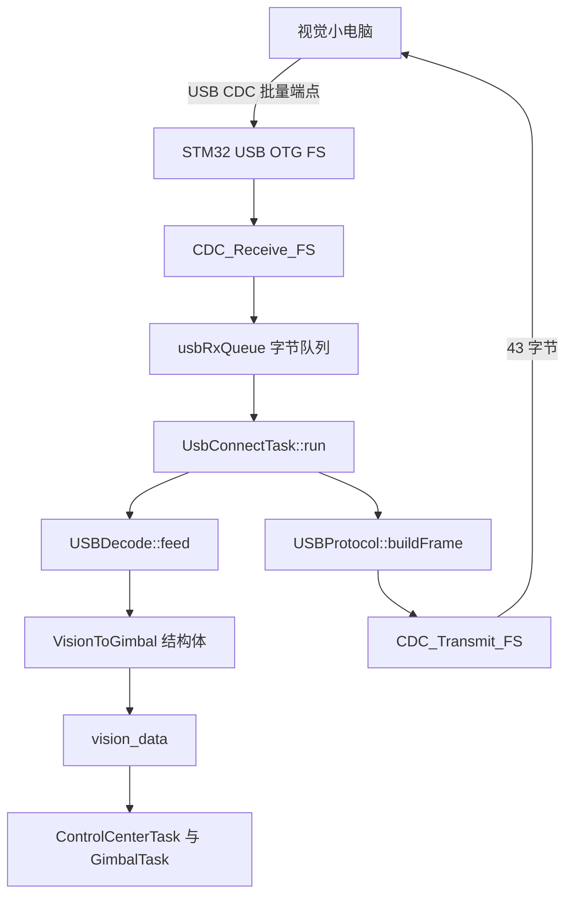
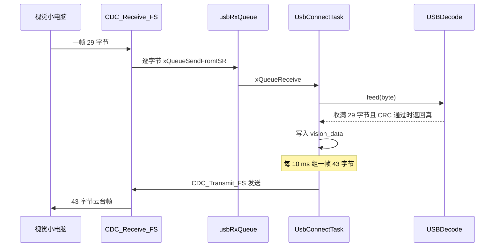

# 视觉链路协议回顾

云台板固件根目录是 `/home/wyx/rm/2026SentriOmeniGimbal/2026OmniSentryGimbal`。视觉链路的协议常量与两个数据包结构在 `Communication/Inc/usb_protocol.h`，接收状态机在 `Communication/Src/usb_decode.cpp`，收发任务在 `Task/Src/UsbConnectTask.cpp`，仓库根目录另有一份协议文本 `云台串口协议.md`。

封包脚本在 `02-封包脚本与CRC16`，解码脚本在 `03-解码脚本与校验`，结构体对照在 `04-与固件结构体一致性`，问题清单在 `05-易错点与调试`。协议本身是这四篇的共同底稿，先把帧布局与字段讲清楚。

## 1. SP 协议与它的物理载体

视觉链路是云台板与视觉计算单元之间的全双工数据通道。视觉侧下发期望瞄准角，云台侧回传姿态与弹道状态。两帧的帧头固定为字符 `S` 与 `P`，这套协议在代码里因此被叫作 SP 协议。

物理层是 STM32F407 的 USB OTG FS 外设，枚举成 CDC 类虚拟串口。固件不调用 USART 外设完成这条链路的收发，两端看到的是一个字节流。链路的方向与规模：

| 方向 | 总长 | 主要内容 | 发送方 | 接收方 |
| --- | --- | --- | --- | --- |
| 视觉→云台 | 29 字节 | 控制模式与 6 个期望量 | 视觉小电脑 | 云台板 |
| 云台→视觉 | 43 字节 | 云台模式、四元数、角度、弹道 | 云台板 | 视觉小电脑 |

两帧的共同结构是：两字节帧头，一字节模式，中间若干小端字段，尾部两字节 CRC16。帧头之后所有多字节字段都是小端。USB 本身有包边界，但 CDC 在主机侧只暴露字节流，所以协议层仍然自己划帧，这一点与 USART 链路相同。



## 2. 视觉下行帧：29 字节逐字段

固定 29 字节，结构名为 `VisionToGimbal`。字段与偏移：

| 偏移 | 长度 | 类型 | 字段 | 说明 |
| --- | --- | --- | --- | --- |
| 0 | 1 | `uint8_t` | `head[0]` | 帧头 `'S'`，即 0x53 |
| 1 | 1 | `uint8_t` | `head[1]` | 帧头 `'P'`，即 0x50 |
| 2 | 1 | `uint8_t` | `mode` | 控制模式，取值见下表 |
| 3~6 | 4 | `float` | `yaw` | 期望 yaw 角，弧度 |
| 7~10 | 4 | `float` | `yaw_vel` | 期望 yaw 角速度，弧度每秒 |
| 11~14 | 4 | `float` | `yaw_acc` | 期望 yaw 角加速度，弧度每二次方秒 |
| 15~18 | 4 | `float` | `pitch` | 期望 pitch 角，弧度 |
| 19~22 | 4 | `float` | `pitch_vel` | 期望 pitch 角速度 |
| 23~26 | 4 | `float` | `pitch_acc` | 期望 pitch 角加速度 |
| 27~28 | 2 | `uint16_t` | `crc16` | CRC16，覆盖偏移 0 到 26 |

`mode` 使用 `ControlMode` 枚举（`Communication/Inc/usb_protocol.h`）：

| 取值 | 枚举名 | 含义 | 固件消费点 |
| --- | --- | --- | --- |
| 0 | `NONE` | 不控制 | `ControlCenterTask.cpp` 的条件不成立 |
| 1 | `CONTROL` | 控制但不开火 | 写角度目标 |
| 2 | `CONTROL_FIRE` | 控制且开火 | 写角度目标并触发摩擦轮与拨弹 |

视觉数据落到全局 `vision_data`（`Task/Src/UsbConnectTask.cpp`），`ControlCenterTask` 在每周期读它（`Task/Src/ControlCenterTask.cpp`）：`mode` 为 1 或 2 时把 `vision_data.yaw` 与 `vision_data.pitch` 乘 `RAD_TO_DEG` 写入 `control_target`，`mode` 为 2 时额外开火。

## 3. 云台上行帧：43 字节逐字段

固定 43 字节，结构名为 `GimbalToVision`。字段与偏移：

| 偏移 | 长度 | 类型 | 字段 | 说明 |
| --- | --- | --- | --- | --- |
| 0 | 1 | `uint8_t` | `head[0]` | 帧头 0x53 |
| 1 | 1 | `uint8_t` | `head[1]` | 帧头 0x50 |
| 2 | 1 | `uint8_t` | `mode` | 云台模式，取值见下表 |
| 3~6 | 4 | `float` | `q[0]` | 四元数 w |
| 7~10 | 4 | `float` | `q[1]` | 四元数 x |
| 11~14 | 4 | `float` | `q[2]` | 四元数 y |
| 15~18 | 4 | `float` | `q[3]` | 四元数 z |
| 19~22 | 4 | `float` | `yaw` | 云台 yaw 角，弧度 |
| 23~26 | 4 | `float` | `yaw_vel` | 云台 yaw 角速度 |
| 27~30 | 4 | `float` | `pitch` | 云台 pitch 角，弧度 |
| 31~34 | 4 | `float` | `pitch_vel` | 云台 pitch 角速度 |
| 35~38 | 4 | `float` | `bullet_speed` | 当前弹速，米每秒 |
| 39~40 | 2 | `uint16_t` | `bullet_count` | 累计发射弹数 |
| 41~42 | 2 | `uint16_t` | `crc16` | CRC16，覆盖偏移 0 到 40 |

四元数按 w、x、y、z 的顺序连续排布，共 16 字节，紧接模式字节。这个顺序在结构体注释与 `云台串口协议.md` 里一致，视觉侧按同序解读。

## 4. 两个方向的 mode 字段各有一套枚举

43 字节帧的 `mode` 使用 `GimbalMode` 枚举（`Communication/Inc/usb_protocol.h`）：

| 取值 | 枚举名 | 含义 |
| --- | --- | --- |
| 0 | `FREE` | 空闲 |
| 1 | `AIM` | 自瞄 |
| 2 | `SMALL` | 小符 |
| 3 | `BIG` | 大符 |

云台板当前只在自瞄与否之间切换：`Task/Src/UsbConnectTask.cpp` 在 `control_target.friction_ready` 为真时填 1，否则填 0。2 与 3 在本工程没有写入点，属未启用取值。两个方向的 `mode` 都在偏移 2，长度都是一字节，但语义完全不同，解析时不能共用一张表。

## 5. 常量、packed 与 static_assert

两个长度常量与帧头写在 `Communication/Inc/usb_protocol.h`：

```c
static constexpr uint8_t FRAME_HEAD_0 = 'S'; // 0x53
static constexpr uint8_t FRAME_HEAD_1 = 'P'; // 0x50
static constexpr size_t  VISION_TO_GIMBAL_LEN = 29;
static constexpr size_t  GIMBAL_TO_VISION_LEN = 43;
```

两个结构体都带 `__attribute__((packed))`（`usb_protocol.h` 的结构体定义段）。文件末尾用 `static_assert` 把编译期尺寸钉死（`usb_protocol.h`），结构体字段一旦错位就无法通过编译：

```c
static_assert(sizeof(VisionToGimbal) == VISION_TO_GIMBAL_LEN,
              "VisionToGimbal packet size mismatch");
static_assert(sizeof(GimbalToVision) == GIMBAL_TO_VISION_LEN,
              "GimbalToVision size mismatch");
```

断言只能保证总长，字段同长度换序不会触发。改动线格式时，除了这两个结构体，还要同步 `Task/Inc/UsbConnectTask.h` 里的第二份定义与两个 Python 脚本。

## 6. 从 CDC 中断到 vision_data 的接收链路

USB 接收中断 `CDC_Receive_FS`（`USB_DEVICE/App/usbd_cdc_if.c`）把收到的每个字节用 `xQueueSendFromISR` 投进 `usbRxQueue`（`usbd_cdc_if.c`）。队列在 `Core/Src/freertos.c` 创建，深度 128、元素 1 字节。

`UsbConnectTask::run` 从队列取字节喂给 `usb_decoder`（`Task/Src/UsbConnectTask.cpp`），解析成功后把字段搬进 `vision_data`。整条接收路径：



## 7. 每 10 ms 一帧的发送链路

云台侧每 10 ms 组一帧（`UsbConnectTask.cpp`）。模式按 `friction_ready` 决定（`UsbConnectTask.cpp`），姿态用 `eulerToQuaternion`（`UsbConnectTask.cpp`）从欧拉角转换，弹速与弹数取全局 `AmmoSpeed`、`TotalAmmoShooted`（`UsbConnectTask.cpp`）。组帧由 `USBProtocol::buildFrame` 完成（`Communication/Src/usb_protocol.cpp`）：填字段、把 `pkt.crc16` 清零、对前 41 字节算 CRC16、把结果写回 `pkt.crc16`，返回 43。发送用 `CDC_Transmit_FS`，遇 `USBD_BUSY` 时 `osDelay(5)` 重试（`UsbConnectTask.cpp`）。

同一份协议在 `Task/Inc/UsbConnectTask.h` 里还有一份 `#pragma pack(push, 1)` 的 C 结构体副本（`UsbConnectTask.h`）和三个长度宏（`UsbConnectTask.h`）。宏与 typedef 定义了但没有其它调用点，实际参与编译的尺寸约束来自 `usb_protocol.h` 的 `static_assert`。

## 8. 易错点

- 把 43 字节帧按 29 字节解析。`USBDecode` 的缓冲区与收满判据都写死 29（`Communication/Inc/usb_decode.h`、`Communication/Src/usb_decode.cpp`），只服务视觉→云台方向；43 字节帧由固件组好直接送出，PC 侧另有解码脚本。
- 混淆两个方向的 `mode` 语义。29 字节帧的 `mode` 是 `ControlMode`，43 字节帧的 `mode` 是 `GimbalMode`，两者在取值 1、2 上含义完全不同。
- 改动结构体字段顺序或类型后忘记重新对齐。`static_assert` 会拦下长度变化，但对同长度换序不会报错。
- 忽略 `GIMBAL_TO_VISION_SIZE` 宏未被使用这一事实，改宏而不改 `usb_protocol.h` 的常量。长度约束以 `usb_protocol.h` 为准。

## 9. 小结

核心概念：

| 概念 | 内容 |
| --- | --- |
| 物理链路 | USB CDC 虚拟串口，不走 USART |
| 帧头 | `'S'` 加 `'P'`，即 0x53 0x50 |
| 视觉→云台 | 29 字节，CRC 覆盖 27 字节 |
| 云台→视觉 | 43 字节，CRC 覆盖 41 字节 |
| 字节序 | 全部小端，浮点为 IEEE754 单精度 |
| 模式字段 | 两个方向各有一套枚举 |

设计权衡：

| 决策 | 收益 | 代价 |
| --- | --- | --- |
| 双向都用固定长度 | 接收端不需要长度字段，状态机简单 | 增删字段必须两端同时改 |
| 尾部 CRC16 只覆盖数据区 | 校验计算不依赖自己的输出 | 长度常量写错时校验不会报错，只会整帧失败 |
| 结构体 `packed` 加 `static_assert` | 编译期挡住错位 | 每次改字段都要重新核对两侧长度 |
| 帧头用可打印字符 | 抓包时肉眼可辨 | 载荷中出现同字节能造成假同步，靠 CRC 兜底 |

## 10. 练习

基础题：

1. 29 字节帧的 `yaw` 字段落在哪几个偏移；若把 `mode` 改成 `uint16_t` 而不改 CRC 覆盖长度，会先在哪一层出错。
2. 写出 `ControlMode` 与 `GimbalMode` 在取值 2 上各自的含义，并指出固件里哪个文件写、哪个文件读 `vision_data.mode`。
3. 43 字节帧中 `q[4]` 占多少字节，从哪一偏移开始。

挑战题：

1. 依据 `Communication/Src/usb_protocol.cpp` 计算 CRC 的输入范围，说明为什么把 `pkt.crc16` 清零不影响 CRC 结果。
2. 若要新增一个 40 字节的云台→视觉帧版本并把 `GimbalMode` 扩到 4 个以上取值，列出需要同时改动的常量、结构体与 `static_assert` 位置。

---

### 附：本页引用的固件路径

- `Communication/Inc/usb_protocol.h`
- `Communication/Src/usb_protocol.cpp`
- `Communication/Inc/usb_decode.h`
- `Communication/Src/usb_decode.cpp`
- `Task/Src/UsbConnectTask.cpp`
- `Task/Inc/UsbConnectTask.h`
- `Task/Src/ControlCenterTask.cpp`
- `USB_DEVICE/App/usbd_cdc_if.c`
- `Core/Src/freertos.c`
- `云台串口协议.md`
