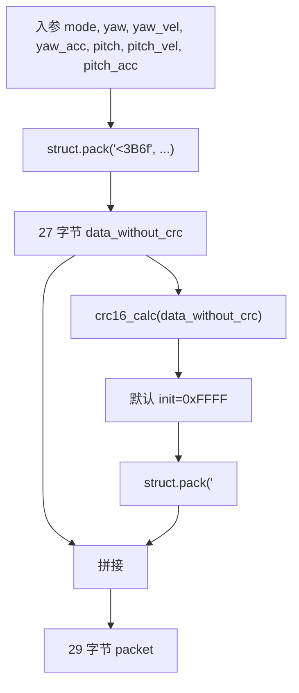
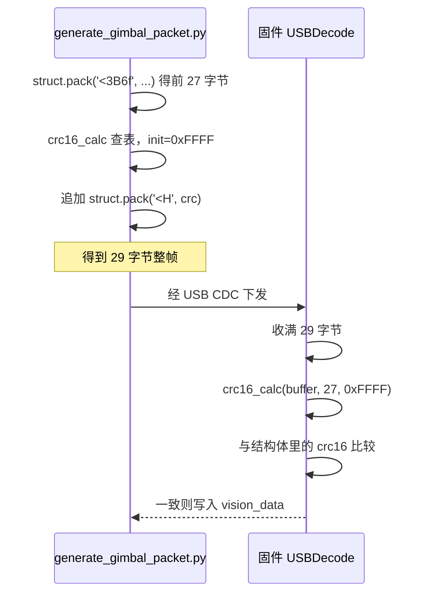

# 封包脚本与 CRC16

脚本位于云台板固件仓库根目录：`/home/wyx/rm/2026SentriOmeniGimbal/2026OmniSentryGimbal/generate_gimbal_packet.py`，共 152 行。它按 `云台串口协议.md` 与 `Communication/Inc/usb_protocol.h` 生成视觉→云台方向的 29 字节帧。

反向的 43 字节解析在 `03-解码脚本与校验`，两侧结构体与 C 对齐的对照在 `04-与固件结构体一致性`。脚本自身的结构、格式串与 CRC 实现在这里拆开，末尾附一次实跑输出并核对到固件。

## 1. 封包脚本是协议的第二份规格

封包脚本的作用是把一组人给的物理量变成一段可以直接写进串口或 USB 的字节。它同时充当协议的第二份规格：当固件结构体改动而脚本没跟上时，脚本会先发出错误的帧，固件只能靠 CRC 拒收。

脚本只生成视觉→云台方向。它的输入是控制模式与 6 个期望量，输出是 29 字节，其中最后两字节是 CRC16。脚本不带命令行参数，`main` 里写死一组演示值，改参数要动源码。



## 2. 152 行脚本的五个部分

`generate_gimbal_packet.py` 从顶到底由五部分组成：

| 行号 | 内容 | 作用 |
| --- | --- | --- |
| 10 | 一行注释 | 声称多项式 0x8005、初始 0x0000，与代码不符 |
| 11-34 | `CRC16_TABLE` | 256 项查表，反射式生成 |
| 36-47 | `crc16_calc(data, init=0xFFFF)` | 查表算 CRC，默认初始值 0xFFFF |
| 49-57 | `build_crc_packet(data)` | 追加两字节小端 CRC，脚本内未调用 |
| 59-98 | `generate_vision_to_gimbal_packet(...)` | 打包 27 字节、算 CRC、拼成 29 字节 |
| 100-149 | `main` | 用 `mode=1, yaw=pi/2, pitch=0` 演示并回读校验 |

第 93 行调用 `crc16_calc` 时没有传 `init`，取默认值 `0xFFFF`。第 96 行用 `struct.pack('<H', crc)` 把 CRC 写成小端两字节。

`build_crc_packet` 定义了但没有任何调用点，主流程在 `generate_vision_to_gimbal_packet` 内部把算 CRC 与追加分开写（在 `generate_vision_to_gimbal_packet` 内分成两步）。若要复用它，把算 CRC 与追加这两步换成 `crc = crc16_calc(data_without_crc)` 再 `packet = build_crc_packet(data_without_crc)` 即可，语义等价。

## 3. struct 格式串 <3B6f 的逐字符拆解

核心逻辑是：

```python
data_without_crc = struct.pack('<3B6f',
                               0x53, 0x50,    # head[0], head[1]
                               mode,           # mode
                               yaw,            # yaw
                               yaw_vel,        # yaw_vel
                               yaw_acc,        # yaw_acc
                               pitch,          # pitch
                               pitch_vel,      # pitch_vel
                               pitch_acc)      # pitch_acc
```

`<3B6f` 逐字符展开：

| 字符 | 含义 | 字节数 |
| --- | --- | --- |
| `<` | 小端，且不使用本机对齐填充 | 0 |
| `3` | 后面一个字符重复 3 次 | 0 |
| `B` | `unsigned char` | 3 |
| `6` | 后面一个字符重复 6 次 | 0 |
| `f` | IEEE754 单精度 float | 24 |

合计 3 加 24 等于 27，与 `VISION_TO_GIMBAL_LEN - 2` 一致。字符顺序与结构体字段顺序一一对应：`head[2]`、`mode`、6 个 float。前缀写 `<` 时 Python 不插入任何填充；写成默认的 `@` 会按本机对齐补齐，长度就不再是 27。重复计数写在类型字符之前，是 `struct` 的固定语法，不能写成 `B3`。

CRC 的两字节用同样的方式拼：

```python
crc = crc16_calc(data_without_crc)
full_packet = data_without_crc + struct.pack('<H', crc)
```

`<H` 表示 2 字节无符号整数、小端，低字节在前。`main` 第 138 行用 `struct.unpack('<3B6fH', packet)` 把整帧读回，字段顺序与打包时相同。

## 4. 查表 CRC16 与 init=0xFFFF

生成表的算法是：

```python
def crc16_calc(data, init=0xFFFF):
    crc = init
    for byte in data:
        idx = (crc ^ byte) & 0xFF
        crc = (crc >> 8) ^ CRC16_TABLE[idx]
    return crc & 0xFFFF
```

每次取当前 CRC 的低字节与输入字节异或得到表索引，右移 8 位后与表项异或。这是反射式（LSB first）的查表写法，初始值由参数给定。返回前的 `& 0xFFFF` 在 Python 里没有实际作用，整数不会溢出，但把“结果只有 16 位”写在了代码上。

第 10 行注释写多项式 0x8005、初始 0x0000 的表格，与代码有两处冲突。用本机对脚本里的 256 项表做了逐项比对：

| 比对项 | 结果 |
| --- | --- |
| 与反射形式 0x8408 生成的表 | 完全一致（256 项全等） |
| 与反射形式 0x8005（即 0xA001）生成的表 | 不一致 |
| `crc16_calc(b"123456789", 0xFFFF)` | 0x6F91 |
| `crc16_calc(b"123456789", 0x0000)` | 0x2189 |

0x6F91 是标准参数 CRC-16/MCRF4XX 的 check 值：多项式 0x1021，初始值 0xFFFF，输入输出都反射，异或输出为 0。结论以代码为准：多项式是 0x1021（反射形式 0x8408），实际初始值是 `0xFFFF`。注释里的 0x8005 与 0x0000 都不成立，属文档与代码冲突，标为待现场确认。上面四个数字是本机实跑结果。

算法逐字节的执行顺序也可以用一张时序表示：



## 5. 默认参数下的 29 字节实跑输出

在云台板固件仓库根目录执行 `python3 generate_gimbal_packet.py`，本机输出如下（默认 `mode=1`、`yaw=math.pi/2`、`pitch=0.0`，其余浮点为 0）：

```text
总长度：29 字节
53 50 01 db 0f c9 3f 00 00 00 00 00 00 00 00 00 00 00 00 00 00 00 00 00 00 00 00 0e fc
CRC：包中 0xFC0E，计算 0xFC0E，校验通过
```

逐段对应：

| 字节 | 值 | 含义 |
| --- | --- | --- |
| 0-1 | `53 50` | 帧头 `'S' 'P'` |
| 2 | `01` | `mode=1`，控制但不开火 |
| 3-6 | `db 0f c9 3f` | π/2 的 float32 位模式 0x3FC90FDB，小端存放 |
| 7-26 | 24 个 `00` | 6 个 float 里除 yaw 外全为 0 |
| 27-28 | `0e fc` | CRC 0xFC0E 的小端形式 |

第 3-6 个字节可以反过来验证字节序：0x3FC90FDB 的高字节 0x3F 排在偏移 6，低字节 0xDB 排在偏移 3。若按大端解释会得到完全不同的数。

## 6. 封包脚本与固件 CRC16 的逐行对照

固件侧的 CRC 函数与脚本逐行一致。`Algorithm/Src/CRC16.cpp`：

```c
uint16_t crc16_calc(const uint8_t *data, uint32_t len, uint16_t init)
{
    uint16_t crc = init;
    while (len--) {
        uint8_t index = (crc ^ *data++) & 0xFF;
        crc = (crc >> 8) ^ CRC16_TABLE[index];
    }
    return crc;
}
```

表在 `Algorithm/Src/CRC16.cpp`，与脚本里的 `CRC16_TABLE` 逐项相同（本机比对确认）。云台→视觉帧的发送端调用它（`Communication/Src/usb_protocol.cpp`），传入初始值 `0xFFFF`、长度 `GIMBAL_TO_VISION_LEN - 2`。视觉→云台的接收端同样传 `0xFFFF`（`Communication/Src/usb_decode.cpp`）。两端初始值统一为 `0xFFFF`，脚本不能改成别的值。

## 7. 易错点

- 把第 10 行注释当成规格，在其它工具里选 0x8005 或 0x0000 初始值。以 `36` 与 `93` 的行为为准，初始值是 `0xFFFF`，表对应反射 0x1021。
- 用默认格式串 `@` 打包。需要显式写 `<`，否则本机对齐会插入填充字节。
- 用 `struct.pack('<f', ...)` 之外的方式写入浮点，例如把角度当整数乘 100 再打包。协议定义的是 IEEE754 单精度，接收端按 float 解读。
- CRC 高低字节写反。`build_crc_packet` 与 `96` 都按低字节在前追加，固件也按小端读取字段（`usb_protocol.h` 的 `uint16_t` 直接处于 packed 结构里）。
- 只改 `CRC16_TABLE` 而不同步改固件表。两处必须逐项相同，任何一项不同都会让所有帧校验失败。

## 8. 小结

核心概念：

| 概念 | 内容 |
| --- | --- |
| 帧长 | 29 字节，前 27 字节参与 CRC |
| 格式串 | `<3B6f` 加 `<H`，小端无填充 |
| CRC 参数 | 查表、反射式，init `0xFFFF`，实测等同 CRC-16/MCRF4XX |
| 字节序 | 全部小端，低字节在前 |
| 脚本职责 | 生成视觉→云台帧，不含解析 |

设计权衡：

| 决策 | 收益 | 代价 |
| --- | --- | --- |
| 用查表而非逐位 | 每字节一次异或与查表，脚本与 MCU 都够快 | 需要维护 256 项表，两端一致性靠人工 |
| 初始值做成参数 | 固件可复用到不同协议 | 默认值与注释容易脱节 |
| 只封视觉→云台方向 | 脚本职责单一 | 43 字节方向的构造没有对等脚本 |

## 9. 练习

基础题：

1. 写出 `<3B6fH` 打包一条 29 字节帧时各字段的字节数，并说明 `3` 与 `6` 这类重复计数的含义。
2. 用脚本算出 `yaw=0.0, pitch=0.0, mode=0` 时的整帧十六进制，指出哪些字节与默认输出不同。
3. `0x3FC90FDB` 按小端写入时偏移 3 到 6 各是什么值。

挑战题：

1. 不查表，用位运算实现同一套 CRC（反射形式、poly 0x8408、init 0xFFFF），并验证 `b"123456789"` 得到 0x6F91。
2. 给脚本加一个 `--mode` 参数，在不改 CRC 与 `struct` 语句的前提下让 `main` 接受命令行模式值。

---

### 附：本页引用的固件路径

- `generate_gimbal_packet.py`
- `Algorithm/Src/CRC16.cpp`
- `Algorithm/Inc/CRC16.h`
- `Communication/Src/usb_protocol.cpp`
- `Communication/Src/usb_decode.cpp`
- `Communication/Inc/usb_protocol.h`
- `云台串口协议.md`
