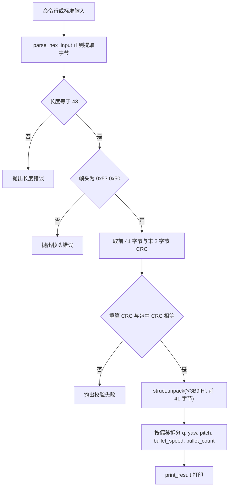
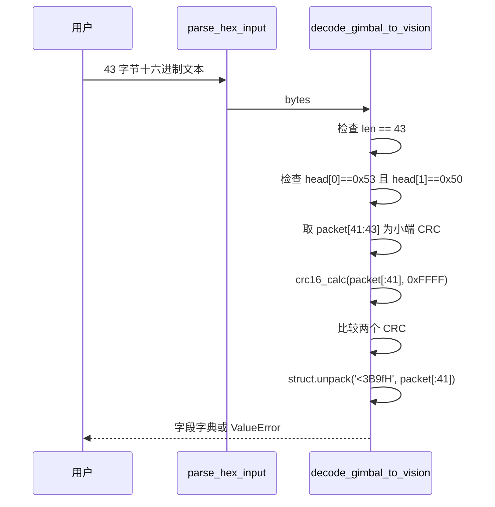

# 解码脚本与校验

解码脚本位于云台板固件仓库根目录：`/home/wyx/rm/2026SentriOmeniGimbal/2026OmniSentryGimbal/generate_gimbal_packet_decode.py`，共 158 行。它解析云台→视觉方向的 43 字节帧。

该帧由固件 `USBProtocol::buildFrame` 生成（`Communication/Src/usb_protocol.cpp:11-49`），字段定义在 `Communication/Inc/usb_protocol.h:55-70`。封包方向见 `02-封包脚本与CRC16`，两侧结构体与 C 对齐的对照在 `04-与固件结构体一致性`。

## 1. 解码脚本面向整帧

解码脚本接收一段十六进制文本，还原成姿态与弹道字段。它服务于两类场景：抓包后离线复算，以及在联调时把视觉小电脑收到的原始字节贴进终端逐字段核对。

与固件里的接收状态机相比，脚本面向整帧而不是字节流。它先要求输入长度正好 43，再校验帧头与 CRC，最后才解字段。任一步失败就抛出 `ValueError`，不做半帧输出。这个取舍让脚本写起来短，代价是粘包、半帧与帧头出现在载荷中的情况都要由调用方先切分，脚本本身不处理。



## 2. 158 行脚本的六个部分

| 行号 | 内容 | 作用 |
| --- | --- | --- |
| 18-41 | `CRC16_TABLE` | 与封包脚本逐项相同的 256 项表 |
| 43-49 | `crc16_calc(data, init=0xFFFF)` | 与封包脚本同一份算法 |
| 51-69 | `parse_hex_input(hex_str)` | 正则提取十六进制字节 |
| 71-112 | `decode_gimbal_to_vision(...)` | 长度、帧头、CRC 与字段解析 |
| 114-136 | `print_result(decoded)` | 格式化打印，含一处模式名映射 |
| 138-155 | `main()` | 读命令行参数或交互输入 |

CRC 表与函数在脚本里是复制粘贴的第二份。它与 `generate_gimbal_packet.py` 的表逐项相同，改动其中一份而漏掉另一份会造成校验行为不一致。脚本里没有 `import` 封包脚本，两份实现各自独立，靠人工保持同步。

## 3. 十六进制输入的宽容提取

`parse_hex_input`（`51-69`）用一条正则把所有形如两个十六进制字符的片段抓出来：

```python
pattern = r'(?:0x)?([0-9A-Fa-f]{2})'
matches = re.findall(pattern, hex_str)
return bytes(int(byte, 16) for byte in matches)
```

`0x` 前缀可选，分隔符不限。空格、逗号、连续字符串都能被同一条正则切分，`0x53,0x50,01` 也会得到三个字节。这套提取方式对分隔符宽容，但也带来一个后果：输入里任何两字符的十六进制片段都会被收进结果，多写一段说明文字就可能多出字节。长度检查（`76-77`）因此成为第一道闸门。

## 4. 长度、帧头、CRC 三道检查

```python
if len(packet_bytes) != 43:
    raise ValueError(...)
if verify_header:
    if packet_bytes[0] != 0x53 or packet_bytes[1] != 0x50:
        raise ValueError(...)
data_without_crc = packet_bytes[:41]
packet_crc = struct.unpack('<H', packet_bytes[41:43])[0]
if verify_crc:
    calc_crc = crc16_calc(data_without_crc)
    if packet_crc != calc_crc:
        raise ValueError(...)
```

CRC 覆盖偏移 0 到 40 共 41 字节，末两字节是小端存放的校验值。`packet_bytes[41:43]` 用 `<H` 读出，等价于低字节加高字节左移 8 位。校验值与协议文本 `云台串口协议.md` 第 16 行的记录一致。

三道检查的顺序是先长度、再帧头、最后 CRC。长度放在最前，因为 CRC 需要一个确定的 41 字节窗口；帧头放在 CRC 之前，坏帧头可以省掉一次 41 字节的查表循环。

## 5. <3B9fH 与 <3B4f5fH 的等价性

字段解包是一行：

```python
unpacked = struct.unpack('<3B9fH', data_without_crc)
head0, head1, mode = unpacked[0:3]
q = list(unpacked[3:7])
yaw, yaw_vel, pitch, pitch_vel, bullet_speed = unpacked[7:12]
bullet_count = unpacked[12]
```

`<3B9fH` 作用于 41 字节：3 字节帧头与模式，9 个 float 共 36 字节，1 个 `uint16_t` 共 2 字节，合计 41。9 个 float 依次是 `q[0]` 到 `q[3]`、`yaw`、`yaw_vel`、`pitch`、`pitch_vel`、`bullet_speed`。

把格式串按语义拆开写，长度不变：

| 写法 | 展开 | 字节数 | 用途 |
| --- | --- | --- | --- |
| `<3B9fH` | 3 个 B、9 个 f、1 个 H | 41 | 脚本当前写法，连续 9 个 float |
| `<3B4f5fH` | 3 个 B、4 个 f、5 个 f、1 个 H | 41 | 把四元数与 5 个标量分开，字段边界更清楚 |
| `<3B6fH` | 3 个 B、6 个 f、1 个 H | 29 | 视觉→云台方向的格式串，不能用于本帧 |

`<3B4f5fH` 与 `<3B9fH` 对同一段字节给出的数值完全相同，区别只在书写方式。`<3B6fH` 只适用于 29 字节帧，若误用于 43 字节帧会因长度不符触发 `struct.error`。

脚本在解包后只做三件事：拆分字段、组成字典、打印。浮点量的合理性没有检查。按协议语义可以补上几项，这些属建议而非当前实现：

| 校验项 | 依据 | 说明 |
| --- | --- | --- |
| `mode` 在 0 到 3 | `GimbalMode` 只有四个取值 | 固件当前只写 0 与 1 |
| `q` 的模接近 1 | 四元数的定义 | 归一化四元数平方和为 1，容差可设 1e-3 |
| `bullet_speed` 为正且在合理区间 | 弹速的物理范围 | 具体上下限按实际弹丸待实测 |



## 6. 43 字节样例的实跑输出

用本机合成的一条 43 字节样例（`q=(1,0,0,0)`、`yaw=0.5`、`yaw_vel=1.0`、`pitch=0.1`、`pitch_vel=0.2`、`bullet_speed=15.0`、`bullet_count=7`、`mode=1`）跑解码脚本，输入与输出如下：

```text
输入：
53 50 01 00 00 80 3f 00 00 00 00 00 00 00 00 00 00 00 00 00 00 00 3f 00 00 80 3f
cd cc cc 3d cd cc 4c 3e 00 00 70 41 07 00 58 c8

输出：
帧头: 0x53 0x50
模式: 1 (跟随)
w: 1.000000  x: 0.000000  y: 0.000000  z: 0.000000
Yaw 角度: 0.500000 rad = 28.648°
Yaw 角速度: 1.000000 rad/s
Pitch 角度: 0.100000 rad = 5.730°
Pitch 角速度: 0.200000 rad/s
弹速: 15.000 m/s
子弹计数: 7
CRC16: 0xC858
```

样例是本机按协议合成的，不是从实车抓到的原始帧；解析结果是脚本的真实运行输出。合成时 CRC 用与固件相同的函数计算，所以校验通过。输入里 `0x3F800000` 是 1.0、`0x3F000000` 是 0.5、`0x3DCCCCCD` 是 0.1，都按小端分四字节写在对应偏移上。

## 7. 模式名映射与固件枚举的冲突

`print_result` 里有一张硬编码的模式名表（`116`）：

```python
mode_desc = {0: "待机", 1: "跟随", 2: "自瞄", 3: "小陀螺"}  # 根据实际定义修改
```

它与固件 `GimbalMode`（`Communication/Inc/usb_protocol.h:31-36`）的取值对不上：

| 取值 | 脚本映射 | 固件枚举 | 是否一致 |
| --- | --- | --- | --- |
| 0 | 待机 | `FREE` 空闲 | 含义接近 |
| 1 | 跟随 | `AIM` 自瞄 | 不一致 |
| 2 | 自瞄 | `SMALL` 小符 | 不一致 |
| 3 | 小陀螺 | `BIG` 大符 | 不一致 |

注释「根据实际定义修改」说明这张表是占位值。脚本打印的模式名不能作为判据，实际取值以 `usb_protocol.h` 的枚举为准。这条冲突标为待现场确认。

## 8. 固件里没有 43 字节解码器

固件发送端先清零 `pkt.crc16`、再对前 41 字节算 CRC（`Communication/Src/usb_protocol.cpp:38-45`），与解码脚本的覆盖范围 `packet[:41]` 逐字节对齐。两侧初始值都为 `0xFFFF`。

固件接收端 `USBDecode` 只处理 29 字节的视觉→云台帧（`Communication/Src/usb_decode.cpp:66-104`），其缓冲区大小写死 `VISION_TO_GIMBAL_LEN`（`Communication/Inc/usb_decode.h:36`）。43 字节方向的解析目前只有这个脚本，固件内没有对应的 43 字节解码器。

`USBDecode` 里还留着一段被注释掉的手动解析函数 `parse_vision_to_gimbal_manual`（`usb_decode.cpp:13-34`），它对 CRC 字段的读法写成大端（`usb_decode.cpp:31`），与协议小端不符；因为该函数没有调用点，实际路径不受影响。这条差异在 `05-易错点与调试` 展开。

## 9. 易错点

- 把 `packet_bytes[41:43]` 写成 `packet_bytes[39:41]`。43 字节帧的 `bullet_count` 在偏移 39 到 40，把这两字节当 CRC 会永远校验失败。
- 用 `>H` 读 CRC。协议是小端，用 `<H`；用大端读会把 0xC858 读成 0x58C8。
- 把 `<3B9fH` 的长度 41 记成 43。`struct.unpack` 的格式串长度必须等于传入字节数，多传两字节会直接抛 `struct.error`。
- 把脚本打印的模式名当作协议取值。模式名映射表与固件枚举不一致，取值本身才有效。
- 只依赖 CRC 判定帧有效。CRC 通过只说明字节没被破坏，不说明 `q` 已归一化或 `bullet_speed` 已更新。
- 用正则提取时输入了说明文字。两字符的十六进制片段会被当成字节，长度检查会先拦下，但报错信息指向长度而不是内容。

## 10. 小结

核心概念：

| 概念 | 内容 |
| --- | --- |
| 方向 | 云台→视觉，43 字节 |
| CRC 覆盖 | 偏移 0 到 40，共 41 字节 |
| CRC 存放 | 偏移 41 到 42，小端 |
| 解包格式 | `<3B9fH` 作用在前 41 字节 |
| 等价写法 | `<3B4f5fH` 与 `<3B9fH` 数值相同 |
| 校验粒度 | 只做长度、帧头、CRC 三项 |

设计权衡：

| 决策 | 收益 | 代价 |
| --- | --- | --- |
| 面向整帧而非字节流 | 离线复算简单，失败即报错 | 无法处理粘包与半帧，需要调用方先切分 |
| 正则宽容提取 | 多种分隔符都能读 | 多余文本可能被当成字节，靠长度检查兜底 |
| 格式串连续 9 个 float | 与内存布局一一对应 | 读代码时数不出四元数边界，可用 `<3B4f5fH` 改善 |
| 模式名映射硬编码 | 打印直观 | 与固件枚举脱节，是错误信息的来源 |

## 11. 练习

基础题：

1. 写出 43 字节帧里 `q[0]` 与 `bullet_count` 的偏移，并说明为什么 CRC 从偏移 41 开始读。
2. 对第 6 节的十六进制输入，把偏移 39 到 40 的两字节解释成 `uint16_t`，给出十进制值。
3. `<3B9fH` 与 `<3B4f5fH` 的长度各是多少，为什么可以互换。

挑战题：

1. 在 `decode_gimbal_to_vision` 里补一段四元数模校验，要求模与 1 的偏差超过 `1e-3` 时给出警告而不抛异常，并说明为什么用警告而非异常。
2. 写一个切分函数，把一段连续字节流按帧头 `0x53 0x50` 与固定长度 43 切成整帧，处理帧头出现在载荷中的情况。

---

### 附：本页引用的固件路径

- `generate_gimbal_packet_decode.py:18-155`
- `Communication/Inc/usb_protocol.h:31-36`、`55-70`
- `Communication/Src/usb_protocol.cpp:11-49`
- `Communication/Inc/usb_decode.h:36`
- `Communication/Src/usb_decode.cpp:13-34`、`66-104`
- `云台串口协议.md`
