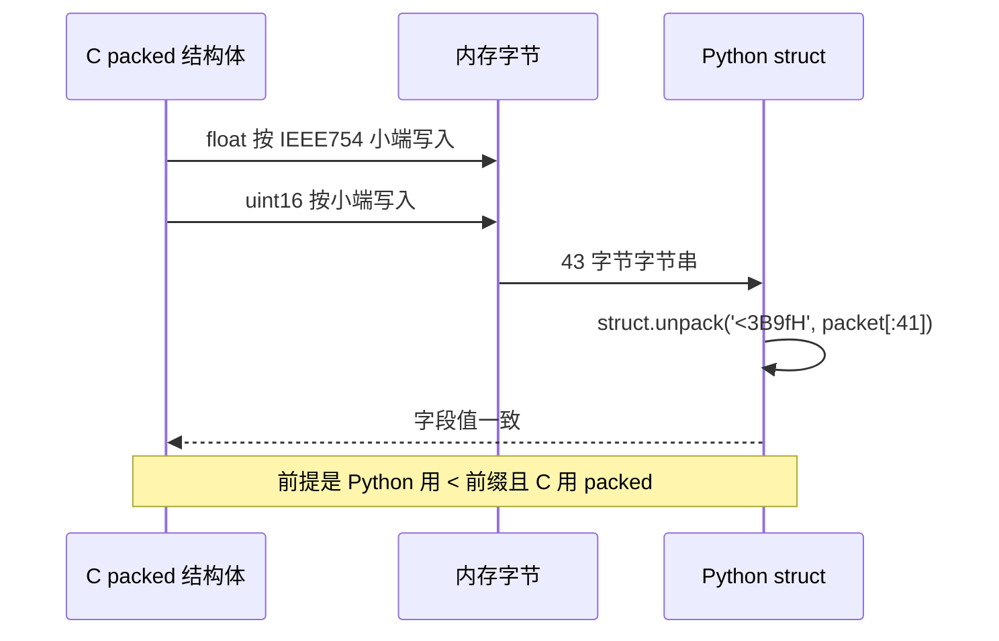

# 与固件结构体一致性

线格式由固件 `Communication/Inc/usb_protocol.h` 的两个 packed 结构体定义，Python 侧由 `generate_gimbal_packet.py` 与 `generate_gimbal_packet_decode.py` 的 `struct` 格式串描述。两侧要对齐到字节，才谈得上 CRC 通过。

上位机脚本的总体说明在 `02-封包脚本与CRC16` 与 `03-解码脚本与校验`。两侧逐字节对齐要看四件事：C 的填充规则、Python 的前缀语义、浮点与整数的位模式，以及同长度换序这类断言拦不住的情况。

## 1. 内存布局的两种描述

同一段内存布局有两种描述方式：C 用结构体，Python 用格式串。两者必须表达同一件事：每个字段从第几字节开始、占几字节、按什么字节序解释。

C 结构体的默认行为是在字段之间插入填充字节以满足各自的对齐要求。float 的对齐要求是 4 字节，`head[2]` 加 `mode` 占 3 字节后，编译器会在偏移 3 插入 1 个填充字节，让 float 落在偏移 4。这样结构体的内存形状与线格式就不一致了。`__attribute__((packed))` 关掉填充，成员逐个紧挨着排。

Python 的 `struct` 也有两种模式：格式串以 `@` 开头或省略顺序符时按本机对齐填充；以 `<`、`>`、`=`、`!` 开头时不做对齐填充。脚本用的是 `<`，因此与 packed 结构体一致。


## 2. C 默认对齐插入的填充字节

Cortex-M4 的 ABI 对这几个类型的要求：`uint8_t` 对齐 1，`uint16_t` 对齐 2，`float` 对齐 4。结构体自身的对齐取成员要求的最大值，所以两个包结构体的自然对齐都是 4。

填充出现在两处：字段前的空隙，以及结构体末尾为满足自身对齐而补的字节。用本机 gcc 对同一组字段做了实测（x86_64 上 `float` 与 `uint16_t` 的对齐要求与 Cortex-M4 的 AAPCS 相同，按 ABI 推断数值一致）：

| 结构体 | 字段 | packed 尺寸 | 去掉 packed 尺寸 | 填充来源 |
| --- | --- | --- | --- | --- |
| 29 字节包 | head[2] mode + 6 float + crc16 | 29 | 32 | mode 后 1 字节，尾部 2 字节 |
| 43 字节包 | head[2] mode + 4 float + 5 float + 2 个 uint16 | 43 | 44 | mode 后 1 字节 |

去掉 packed 后 29 字节包变成 32 字节，多出的 3 字节就是 1 字节字段内填充加 2 字节尾部补齐。43 字节包只多 1 字节，因为它以两个 `uint16_t` 结尾，末尾不需要额外补齐。

## 3. Python 前缀 @ 与 < 的差别

`struct` 的前缀决定两件事：字节序与是否按本机对齐。这两个维度是绑在一起的，不能只选一个：

| 前缀 | 字节序 | 对齐填充 | 与本工程的关系 |
| --- | --- | --- | --- |
| 省略或 `@` | 本机 | 按本机 ABI 填充 | 与 packed 结构体不符 |
| `=` | 本机 | 不填充 | 在 x86 与 STM32 上都是小端，可用但不表达意图 |
| `<` | 小端 | 不填充 | 脚本使用 |
| `>` | 大端 | 不填充 | 与协议相反 |
| `!` | 大端（网络序） | 不填充 | 与协议相反 |

脚本一律写 `<`，既锁字节序也锁填充。若省略前缀，在 x86_64 上 `struct.calcsize('3B6f')` 是 28 而不是 27，因为 `mode` 之后会插入 1 个填充字节让 float 落在 4 字节边界上。

## 4. IEEE754 小端与 uint16 小端

协议里的 `float` 是 IEEE754 单精度，占 4 字节：1 位符号、8 位指数、23 位尾数。STM32F407 的字节序是小端，Python 用 `<f` 表达同样的顺序。

以 `02-封包脚本与CRC16` 的实测帧为例，π/2 的位模式是 `0x3FC90FDB`，小端写入后偏移 3 到 6 依次是 `DB 0F C9 3F`。按大端写入会得到 `3F C9 0F DB`，接收端解出的数完全不同。`struct` 里表示大端的是 `>f`。

`bullet_count` 与 `crc16` 都是 `uint16_t`。协议按小端传输，Python 侧对应 `<H`，C 侧直接读写 packed 结构体成员即可，因为 MCU 本身是小端。

`USBDecode` 里另有一段被注释掉的手动解析（`Communication/Src/usb_decode.cpp`）：它把 CRC 读成 `(data[27] << 8) | data[28]`，即大端，注释紧接着写出了正确写法 `data[27] | (data[28] << 8)`。该函数没有调用点，实际生效的是对 packed 结构体的 `reinterpret_cast`，按小端读取。这条差异属代码内部的不一致，标为待现场确认。

## 5. 两个包的字段偏移对照

### 5.1 视觉→云台，29 字节

| 字段 | 偏移 | Python 格式 | C 类型 |
| --- | --- | --- | --- |
| `head[0]` | 0 | `B` | `uint8_t` |
| `head[1]` | 1 | `B` | `uint8_t` |
| `mode` | 2 | `B` | `uint8_t` |
| `yaw` | 3 | `f` | `float` |
| `yaw_vel` | 7 | `f` | `float` |
| `yaw_acc` | 11 | `f` | `float` |
| `pitch` | 15 | `f` | `float` |
| `pitch_vel` | 19 | `f` | `float` |
| `pitch_acc` | 23 | `f` | `float` |
| `crc16` | 27 | `H` | `uint16_t` |

打包格式串 `<3B6f` 覆盖偏移 0 到 26，追加 `<H` 得到完整的 29 字节。

### 5.2 云台→视觉，43 字节

| 字段 | 偏移 | Python 格式 | C 类型 |
| --- | --- | --- | --- |
| `head[0]` | 0 | `B` | `uint8_t` |
| `head[1]` | 1 | `B` | `uint8_t` |
| `mode` | 2 | `B` | `uint8_t` |
| `q[0]` 到 `q[3]` | 3 | `4f` | `float[4]` |
| `yaw` | 19 | `f` | `float` |
| `yaw_vel` | 23 | `f` | `float` |
| `pitch` | 27 | `f` | `float` |
| `pitch_vel` | 31 | `f` | `float` |
| `bullet_speed` | 35 | `f` | `float` |
| `bullet_count` | 39 | `H` | `uint16_t` |
| `crc16` | 41 | `H` | `uint16_t` |

解码脚本的 `<3B9fH` 与这张表一一对应；把它按语义写成 `<3B4f5fH` 时，`4f` 与 `5f` 的分界恰好落在偏移 19。

## 6. 落地：两份结构体与 static_assert

C 侧两个结构体的声明（`Communication/Inc/usb_protocol.h` 的结构体定义段）：

```c
struct  __attribute__((packed)) VisionToGimbal {
    uint8_t head[2];
    uint8_t mode;
    float yaw, yaw_vel, yaw_acc;
    float pitch, pitch_vel, pitch_acc;
    uint16_t crc16;
};

struct  __attribute__((packed)) GimbalToVision {
    uint8_t head[2];
    uint8_t mode;
    float q[4];
    float yaw, yaw_vel, pitch, pitch_vel;
    float bullet_speed;
    uint16_t bullet_count;
    uint16_t crc16;
};
```

尺寸在编译期被 `static_assert` 钉住（`usb_protocol.h`）。`sizeof` 与两个长度常量相等时才通过，填充导致的偏差无法进入固件。

项目里还有三处需要一起维护：

- 线格式的唯一权威是 `Communication/Inc/usb_protocol.h` 的两个 packed 结构体与 `static_assert`。
- `Task/Inc/UsbConnectTask.h` 用 `#pragma pack(push, 1)` 又写了一份 `vision_to_gimbal_t` 与 `gimbal_to_vision_t`。两份定义内容一致，但 typedef 与宏 `VISION_TO_GIMBAL_SIZE`、`GIMBAL_TO_VISION_SIZE`（`UsbConnectTask.h`）没有其它调用点。改动线格式时两份都要同步，漏掉一份编译器不会报错。
- 固件接收端直接用 packed 结构体覆盖缓冲区（`Communication/Src/usb_decode.cpp`）。packed 结构体的对齐要求是 1，缓冲区是对齐无要求的 `uint8_t[29]`，这种转型不会因对齐触发异常。

CRC 计算把结构体指针转成 `const uint8_t*` 并按长度遍历（`Communication/Src/usb_protocol.cpp`、`usb_decode.cpp`）。长度用的是常量而不是 `sizeof`，两处都在编译期由 `static_assert` 保证相等。



## 7. 死代码里的大端读法

`usb_decode.cpp` 的 `parse_vision_to_gimbal_manual` 是整条链路上唯一按大端读 CRC 的地方。它的存在说明协议早期可能有过另一种字节序约定，但当前生效路径已经统一到小端。判断一段代码是否在运行，看它的调用点；这份函数的调用点被注释掉，生效的是 `reinterpret_cast` 那条路径。

## 8. 易错点

- Python 格式串漏写 `<`。默认按本机对齐，`3B6f` 会多出填充，长度不再是 27。
- C 结构体漏写 `__attribute__((packed))` 或 `#pragma pack`。尺寸变成 32 或 44，`static_assert` 会拦下，但手写 `sizeof` 的发送路径会多发字节。
- 认为 `reinterpret_cast` 到 packed 结构体需要额外对齐处理。packed 的对齐是 1，直接转型成立；反而是非 packed 结构体才会有对齐风险。
- 把 `float` 当整数或定点数收发。协议定义的是 IEEE754，位模式不一致时 CRC 可能通过而数值错误。
- 只用 `static_assert` 保证长度，忽略同长度换序。字段顺序与类型同时改、总长不变时编译期不会报错。
- 改动 `usb_protocol.h` 后忘记 `Task/Inc/UsbConnectTask.h` 的第二份定义。

## 9. 小结

核心概念：

| 概念 | 内容 |
| --- | --- |
| C 默认对齐 | float 要求 4 字节，会插入填充 |
| packed | 关闭填充，成员紧排，对齐为 1 |
| Python `<` | 小端且不填充，与 packed 对应 |
| float | IEEE754 单精度 4 字节，小端 |
| uint16 | 2 字节小端 |
| 尺寸保障 | `static_assert` 在编译期比对 `sizeof` |

设计权衡：

| 决策 | 收益 | 代价 |
| --- | --- | --- |
| 用 packed 结构体描述线格式 | 字段与字节一一对应，可整体转型 | 成员访问可能生成非对齐读写，性能略降 |
| 用 `static_assert` 校验尺寸 | 错位在编译期暴露 | 不校验字段顺序，换序仍可编译 |
| 两份结构体定义 | 任务层可独立引用 | 同步成本，容易只改一处 |
| CRC 长度用常量 | 与协议文本直接对照 | 常量写错时 CRC 覆盖范围随之出错 |

## 10. 练习

基础题：

1. 按 C 对齐规则手工推出 29 字节包去掉 packed 后的总长，并指出填充字节的位置。
2. 写出 `0x3FC90FDB` 在小端与大端两种顺序下，偏移 3 到 6 各自的字节。
3. `bullet_count` 在 43 字节帧里的偏移是多少，`<H` 从该偏移读取时得到的字节顺序是什么。

挑战题：

1. 用 C 写一份与 `usb_protocol.h` 等价的 packed 结构体，加 `static_assert` 检查尺寸，并说明为什么 `_Static_assert` 在 C 里也能起到同样作用。
2. 若要给 43 字节帧新增一个 `float` 字段，列出 `usb_protocol.h`、两个 Python 脚本、`usb_protocol.cpp` 与 `云台串口协议.md` 中需要改动的位置。

---

### 附：本页引用的固件路径

- `Communication/Inc/usb_protocol.h`
- `Communication/Src/usb_protocol.cpp`
- `Communication/Src/usb_decode.cpp`
- `Task/Inc/UsbConnectTask.h`
- `generate_gimbal_packet.py`
- `generate_gimbal_packet_decode.py`
- `云台串口协议.md`
