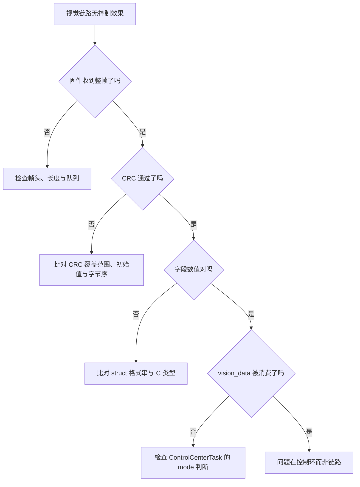
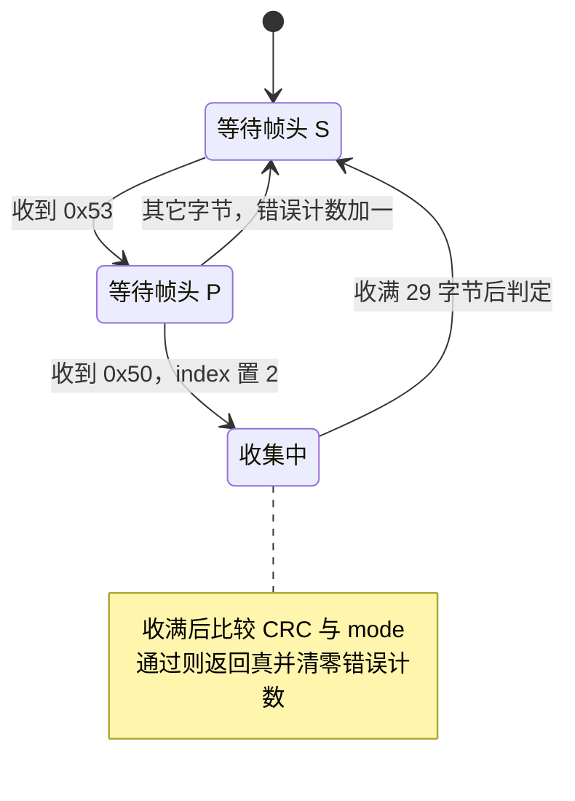
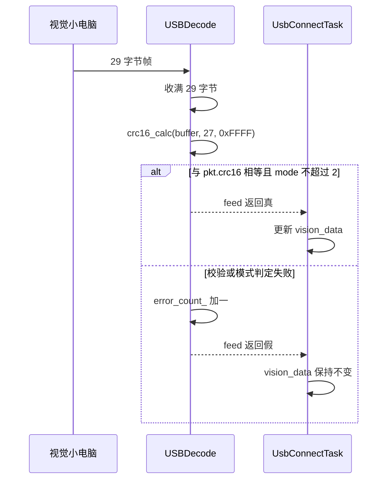

# 封包链路的易错点与调试

涉及的文件：云台板固件根目录的 `generate_gimbal_packet.py`、`generate_gimbal_packet_decode.py`、`云台串口协议.md`，固件侧 `Communication/Inc/usb_protocol.h`、`Communication/Src/usb_protocol.cpp`、`Communication/Src/usb_decode.cpp`、`Task/Src/UsbConnectTask.cpp`、`USB_DEVICE/App/usbd_cdc_if.c`。

协议布局见 `01-视觉链路协议回顾`，脚本结构见 `02-封包脚本与CRC16` 与 `03-解码脚本与校验`，结构体对照见 `04-与固件结构体一致性`。冲突与未使用代码汇总成清单，末尾是分层排查流程与自检命令。

## 1. 上位机与固件之间的四层排查思路

上位机脚本与固件之间只有一段字节作为契约。链路出问题时，可能的原因集中在四层：脚本打包、链路传输、固件收包状态机、字段消费。分层排查先确定字节在哪一层开始偏离协议，再进到具体字段。

排查的共同手段是比对字节：把脚本实跑的十六进制与固件断点处缓冲区的十六进制并排看，差异位置直接指向出错字段。CRC 只能说明整帧是否被破坏，定位到字段仍要靠偏移。



## 2. 十二项已知问题清单

| 编号 | 位置 | 现象 | 性质 |
| --- | --- | --- | --- |
| 1 | `generate_gimbal_packet.py:10` | 注释称多项式 0x8005、初始 0x0000 | 文档与代码冲突，实测为 0x1021 与 0xFFFF |
| 2 | `Communication/Src/usb_protocol.cpp:38` | `pkt.crc16` 清零 | 防御性写法，本实现非必要 |
| 3 | Python 格式串 | 漏写 `<` 时插入填充 | 与 C packed 不一致 |
| 4 | `<f` 与 `>f` | 浮点字节序写反 | 数值错但长度对 |
| 5 | 长度常量 | 43 字节帧按 29 字节处理 | 状态机长度写死 |
| 6 | `generate_gimbal_packet_decode.py:116` | 模式名映射与枚举不符 | 打印信息误导 |
| 7 | `Communication/Src/usb_decode.cpp:31` | 手动解析按大端读 CRC | 死代码，无调用点 |
| 8 | `Communication/Src/usb_decode.cpp:90` | `memcpy` 自我复制 | 空操作 |
| 9 | `generate_gimbal_packet.py:49-57` | `build_crc_packet` 未调用 | 冗余函数 |
| 10 | `Task/Src/UsbConnectTask.cpp:165-174` | `USB_Data_Received` 空实现 | 与真实接收路径重复 |
| 11 | `Communication/Src/usb_decode.cpp:115-123` | `errorCount` 无调用 | 统计量只写不读 |
| 12 | `Core/Src/freertos.c:114` | 队列容量 128 字节 | 满时丢字节 |

## 3. CRC 注释冲突与清零语句的作用

脚本第 10 行写「多项式 0x8005，初始 0x0000 的表格」，代码里 `crc16_calc` 的默认初始值是 `0xFFFF`（`36` 行），调用处没有覆盖它（`93` 行）。对 256 项表做逐项比对的结果：表与反射形式 0x8408（标准形式 0x1021）生成的表一致，与反射 0x8005 的表不一致；`crc16_calc(b"123456789")` 得到 0x6F91，即 CRC-16/MCRF4XX 的 check 值。以代码为准，注释两处都不成立，标为待现场确认。固件 `Algorithm/Src/CRC16.cpp:7-41` 的表与算法和脚本相同。

`usb_protocol.cpp:38` 在算 CRC 前执行 `pkt.crc16 = 0`。CRC 的输入长度是 `GIMBAL_TO_VISION_LEN - 2` 即 41 字节（`41-45`），正好不含最后 2 字节的 `crc16`，所以清零不改变计算结果，`47` 行随即把真值写回。

清零的价值在于防御：一旦有人把长度改成 `sizeof(pkt)`，CRC 输入就会包含 `crc16` 字段。不清零时，`tx_pkt` 作为全局变量会带着上一帧的残值参与计算，接收端拿到的校验值与按全零重算的值不一致，表现为随机校验失败。改动长度常量时不能同时删掉这一行。

## 4. 对齐、浮点与长度写死的三处差异

Python 的默认字节序符号是 `@`，按本机对齐插入填充。脚本用 `<` 关闭填充，与 `__attribute__((packed))` 一致。把 `<3B6f` 写成 `3B6f` 或 `@3B6f`，前 27 字节会变成 32 字节。C 侧去掉 packed 的尺寸是 32（29 字节包）与 44（43 字节包），由本机 gcc 实测。

`<f` 是小端 IEEE754，`>f` 是大端。STM32F407 是小端，协议也按小端定义。写反时长度与 CRC 都可能正常，只有数值错。用 π/2 的位模式 `0x3FC90FDB` 可以快速判断：小端写入是 `DB 0F C9 3F`。

固件 `USBDecode` 的缓冲区大小与收满判据都固定为 `VISION_TO_GIMBAL_LEN`（`Communication/Inc/usb_decode.h:36`、`Communication/Src/usb_decode.cpp:69`），它只处理视觉→云台方向。把 43 字节帧喂给它，状态机会在收满 29 字节时就尝试校验，CRC 覆盖范围随之错位，全部失败。43 字节帧的解析在 PC 侧的 `generate_gimbal_packet_decode.py`，不在固件里。

模式名映射是同一类的误导来源：`generate_gimbal_packet_decode.py:116` 的 `mode_desc` 为 `{0: "待机", 1: "跟随", 2: "自瞄", 3: "小陀螺"}`，与固件 `GimbalMode` 的 `FREE/AIM/SMALL/BIG` 对不上。脚本注释也写了「根据实际定义修改」。模式取值以 `Communication/Inc/usb_protocol.h:31-36` 为准。

## 5. 死代码与空操作

`usb_decode.cpp:13-34` 的 `parse_vision_to_gimbal_manual` 在 `31` 行把 CRC 读成 `(data[27] << 8) | data[28]`，即大端，与协议和注释里的正确写法相反。该函数在 `73-75` 行被注释掉，实际执行的是 `76-77` 行的 packed 结构体转型，按小端读取。修改这段代码时不要照着死代码的读法改。

其余三处冗余或空操作：

- `usb_decode.cpp:90` 的 `memcpy(buffer_, &pkt, sizeof(pkt))` 源和目标都指向 `buffer_`，是自我复制，不改变任何字节。
- `generate_gimbal_packet.py:49-57` 的 `build_crc_packet` 没有调用点。
- `Task/Src/UsbConnectTask.cpp:165-174` 的 `USB_Data_Received` 只做了一次字节循环，未把字节投进队列，注释写明队列发送未实现。真实路径是 `usbd_cdc_if.c:270-274` 的 `xQueueSendFromISR`。
- `usb_decode.cpp:115-123` 的 `errorCount` 与 `resetErrorCount` 没有调用点；`error_count_` 在解析成功时被清零（`91`），只在连续出错时累加。

## 6. 队列容量与重同步弱点

`usbRxQueue` 用 `xQueueCreate(128, sizeof(uint8_t))` 创建（`Core/Src/freertos.c:114`），即 128 字节的字节队列。`UsbConnectTask::run` 每轮把队列读空后 `osDelay(10)`（`Task/Src/UsbConnectTask.cpp:154`），发送侧又占用了同一轮的时间。队列满时 `CDC_Receive_FS` 按注释丢弃该字节（`usbd_cdc_if.c:273`），被丢的字节落在帧中间会让这一帧整体作废。29 字节约能缓冲 4 帧，帧率或发送间隔变化时需要重新评估容量。

`USBDecode::feed` 在 `WAIT_HEAD_1` 阶段遇到非 `FRAME_HEAD_1` 的字节时直接回到 `WAIT_HEAD_0`（`usb_decode.cpp:60-63`），不把该字节当作新的头字节重新判断。字节流中在帧头前多出一个 `0x53` 时，本该接收的帧会被整帧跳过。这是状态机的重同步策略，属代码可观察的行为。



## 7. 调试手段：CRC 自检与基准帧

对任何一侧的 CRC16 表，先用标准 check 串自检，结果应为 0x6F91：

```python
crc16_calc(b"123456789", 0xFFFF) == 0x6F91
```

不相等说明表或初始值被改过，先解决这一层，再看帧。

用脚本实跑生成基准字节，在固件仓库根目录执行 `python3 generate_gimbal_packet.py`。默认参数下应输出 `53 50 01 db 0f c9 3f` 开头、`0e fc` 结尾的 29 字节。把这段字节发给固件，在 `usb_decode.cpp:85` 的 `calc == pkt.crc16` 处下断点，比较 `calc` 与 `pkt.crc16`。两者不等时，检查 CRC 覆盖长度是否仍是 27。

反向解码把固件实际发出的 43 字节贴给解码脚本：

```bash
python3 generate_gimbal_packet_decode.py "53 50 01 ... 58 c8"
```

输出里的 `Yaw 角度`、`Pitch 角度` 与固件断点处的 `tx_pkt` 成员比对。CRC 报错时先看长度是否为 43，再确认 CRC 是否从偏移 41 读取。

## 8. CRC 失败路径的两种结果



失败路径有两种：字节被破坏与模式值非法。两者都会让 `feed` 返回假并自增 `error_count_`，区分它们需要在比较处临时打印，或者先看 `mode` 字节是否超过 2。`error_count_` 在成功时清零（`91`），因此它只反映连续失败次数。

## 9. 易错点速查

- 改 CRC 初始值或表时只改一侧。
- 改结构体字段后只改了 C 或只改了 Python。
- 把脚本打印的模式名当成协议取值。
- 用死代码 `parse_vision_to_gimbal_manual` 的读法作为参考。
- 把 `pkt.crc16 = 0` 当成多余语句删掉后，又改了 CRC 覆盖长度。
- 依赖 `USB_Data_Received` 收数据，而真实路径在 `CDC_Receive_FS`。
- 队列容量与帧率不匹配时出现偶发丢帧，误判为 CRC 算法问题。
- 只靠 CRC 判定帧有效，忽略 `mode` 与字段数值的合理性。

## 10. 小结

核心概念：

| 概念 | 内容 |
| --- | --- |
| 排查顺序 | 长度、帧头、CRC、字段、消费点 |
| CRC 自检 | `crc16_calc(b"123456789", 0xFFFF)` 应为 0x6F91 |
| 基准帧 | 脚本默认输出以 `0e fc` 结尾 |
| 唯一权威 | 协议取 `usb_protocol.h` 与代码，注释与打印仅供参考 |
| 死代码 | 手动解析、`build_crc_packet`、`USB_Data_Received`、`errorCount` |

设计权衡：

| 决策 | 收益 | 代价 |
| --- | --- | --- |
| 协议在结构与脚本中各有一份 | 两侧独立实现便于交叉验证 | 表与字段要人工保持同步 |
| 状态机不做回溯重同步 | 实现简单，不会误吞载荷 | 帧头前多一字节时跳过整帧 |
| 队列按字节存放 | 与 CDC 回调的粒度一致 | 容量按字节计，帧率上升时容易满 |
| 错误计数只在成功时清零 | 反映连续出错情况 | 历史累计错误会被抹掉 |

## 11. 练习

基础题：

1. 写出 `crc16_calc` 自检用的输入与期望输出，并说明为什么这个值能判断表的正确性。
2. 脚本默认输出中 CRC 是 `0e fc`，写出它按 `<H` 读出的数值。
3. 指出 `USB_Data_Received` 与 `CDC_Receive_FS` 各自的职责，说明哪一个在当前固件里实际被调用。

挑战题：

1. 给 `USBDecode::feed` 增加在 `WAIT_HEAD_1` 失败时把当前字节当作 `FRAME_HEAD_0` 重试的逻辑，说明修改后错误计数与重同步行为的变化。
2. 用一段抓包字节复现「帧头前多一个 0x53」导致的整帧跳过，给出原始字节与修改前后的解析结果。

---

### 附：本页引用的固件路径

- `generate_gimbal_packet.py:10`、`36-57`、`93`
- `generate_gimbal_packet_decode.py:116`
- `Communication/Inc/usb_protocol.h:31-36`
- `Communication/Src/usb_protocol.cpp:38-45`
- `Communication/Inc/usb_decode.h:36`
- `Communication/Src/usb_decode.cpp:13-34`、`60-104`、`115-123`
- `Task/Src/UsbConnectTask.cpp:154`、`165-174`
- `USB_DEVICE/App/usbd_cdc_if.c:270-274`
- `Core/Src/freertos.c:114`
- `Algorithm/Src/CRC16.cpp:7-41`
- `云台串口协议.md`
