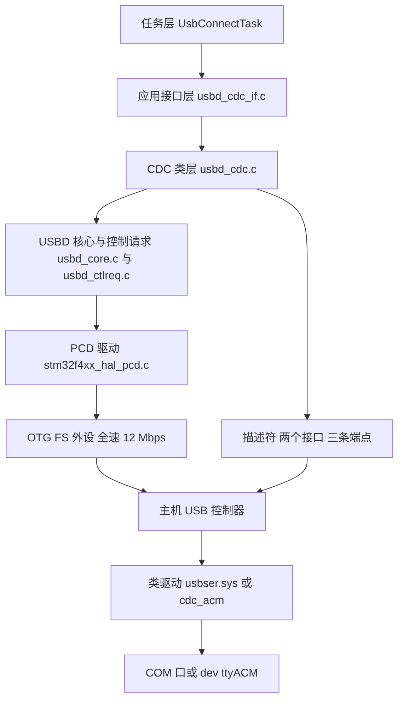
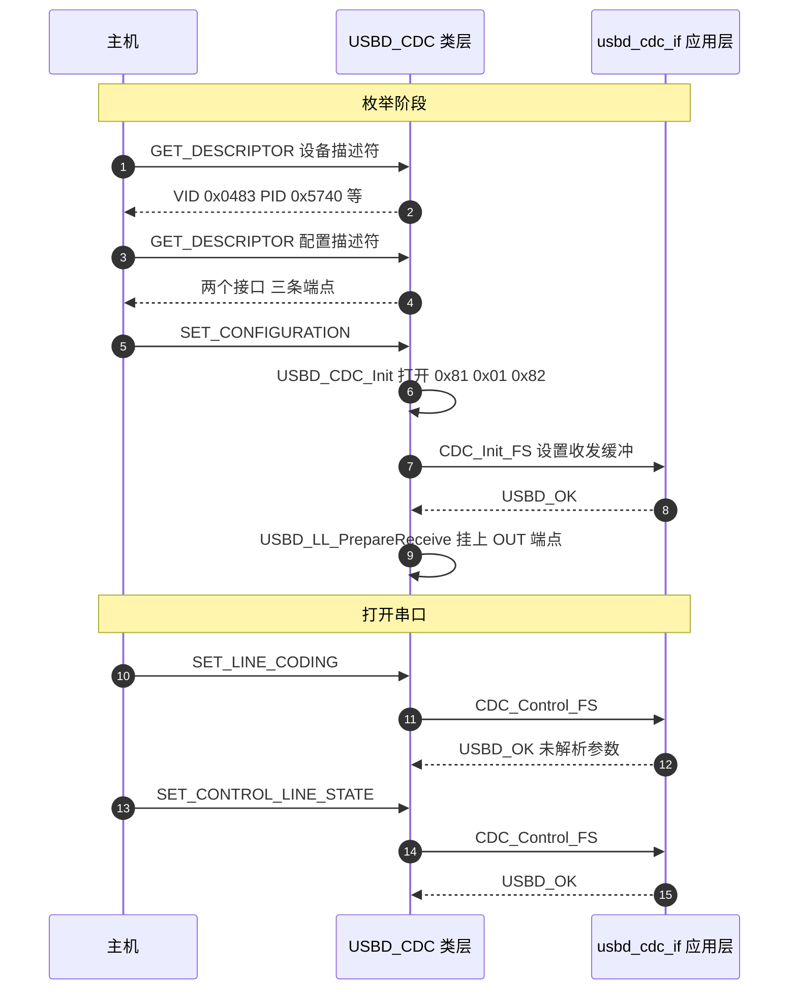

# USB CDC 类与虚拟串口

云台板的 CDC 虚拟串口类分布在 `USB_DEVICE/App/usbd_cdc_if.c`（348 行）、ST 官方 CDC 类库 `Middlewares/ST/STM32_USB_Device_Library/Class/CDC/` 与初始化入口 `USB_DEVICE/App/usb_device.c`。

端点与缓冲的细节在 `02-端点与缓冲配置.md`，接收与发送链路分别在 `03-接收链路与队列.md` 与 `04-发送链路与忙等待.md` 两页。主机把它当成串口，靠的是接口描述符里的类代码；固件把它变成设备，靠的是初始化调用链的顺序，两者的判据不同。

## 1. CDC 与 ACM 两个缩写各自管什么

主机在枚举时靠接口描述符里的类代码认出这是串口。CDC 是 USB-IF 为通信设备定义的一类接口规范，全称 Communications Device Class；ACM 是其中 PSTN 子类下的抽象控制模型，全称 Abstract Control Model。

前者规定接口的功能描述符与类请求格式，后者规定控制通路上怎么模拟调制解调器。两者同时成立时，主机侧加载类驱动，把设备呈现成一个串口。

两个缩写合起来才是完整的匹配条件。ACM 接口的匹配要三个字段同时成立：`bInterfaceClass` 为 0x02（CDC）、`bInterfaceSubClass` 为 0x02（ACM）、`bInterfaceProtocol` 为 0x01（AT 命令集）。少任何一个，系统都会把它归到别的 CDC 子类，例如以太网控制模型或 OBEX，而不是串口。

## 2. 通信接口与数据接口如何拼成一个功能

一个 CDC/ACM 功能由两个接口组成：

| 接口 | bInterfaceClass | bInterfaceSubClass | bInterfaceProtocol | 承载 |
| --- | --- | --- | --- | --- |
| 通信接口 | 0x02 CDC | 0x02 ACM | 0x01 AT 命令集 | EP0 上的类请求与一条中断 IN 端点上的通知 |
| 数据接口 | 0x0A CDC-Data | 0x00 | 0x00 | 一对批量端点，实际字节流 |

匹配顺序是先看通信接口：类 0x02、子类 0x02、协议 0x01 三者同时成立，系统才把它当作 ACM 串口；数据接口的类 0x0A 只说明这里是一条 CDC 数据通路。

两个接口通过 Union 功能描述符绑定成一个功能：通信接口是 master，数据接口是 slave。主机驱动把这对接口当作一个设备实例处理，两个接口分开看都不构成可用的串口。

## 3. 三条端点加 EP0 的分工

| 端点 | 地址 | 方向 | 传输类型 | 最大包 | 所属接口 | 本工程用途 |
| --- | --- | --- | --- | --- | --- | --- |
| 控制端点 | 0x00 | 双向 | 控制 | 64 B | 默认 | 枚举与类请求 |
| 命令端点 | 0x82 | IN | 中断 | 8 B | 通信接口 | 类通知，本工程未主动发送 |
| 数据 OUT | 0x01 | OUT | 批量 | 64 B | 数据接口 | 主机到设备，视觉数据入站 |
| 数据 IN | 0x81 | IN | 批量 | 64 B | 数据接口 | 设备到主机，云台状态出站 |

主机看见 COM 口的原因在这张表的后半部分：只要接口类代码与描述符组合能被系统自带的 CDC 驱动匹配，Windows 的 usbser.sys 或 Linux 的 cdc_acm 就会绑定并创建一个串口设备节点。这个串口没有真实的 UART 收发器，波特率、数据位、校验位都是名义参数，USB 侧的节奏由主机的批量传输调度决定。



## 4. 设备栈的五层与初始化四步

自上而下依次是五层：

- 应用接口层 `usbd_cdc_if.c`：实现 CDC 类要求的五个回调，向上暴露 `CDC_Transmit_FS`，向下接收数据到达通知。
- CDC 类层 `usbd_cdc.c`：维护 `USBD_CDC_HandleTypeDef` 状态、端点开关、配置描述符、类请求分发。
- USBD 核心层：管理设备状态机与标准请求。
- PCD 层与 HAL：操作 OTG FS 寄存器与 FIFO。
- 外设与总线。

`MX_USB_DEVICE_Init()` 依次完成四件事，任一步失败进入 `Error_Handler()`：

1 `USBD_Init(&hUsbDeviceFS, &FS_Desc, DEVICE_FS)`：挂上设备描述符与底层驱动。
2 `USBD_RegisterClass(&hUsbDeviceFS, &USBD_CDC)`：把 CDC 类回调表挂进设备句柄。
3 `USBD_CDC_RegisterInterface(&hUsbDeviceFS, &USBD_Interface_fops_FS)`：把应用侧五个回调注册给类层。
4 `USBD_Start(&hUsbDeviceFS)`：打开 OTG FS，进入可枚举状态。

第 2 步与第 3 步缺一不可。类层通过第 2 步拿到描述符与端点管理代码，通过第 3 步拿到应用回调；只做其中之一，设备可能枚举成功但数据通路为空。

类层 `USBD_CDC` 的成员函数表在 `usbd_cdc.c` 中定义，其中 `Init`、`Setup`、`DataIn`、`DataOut` 是关键四项。应用侧 `USBD_CDC_ItfTypeDef` 的五个函数指针在 `usbd_cdc_if.c` 末尾填成 `USBD_Interface_fops_FS`。枚举到 `SET_CONFIGURATION` 时，类层 `USBD_CDC_Init()` 打开三条端点，随后调用应用侧 `Init` 回调。

## 5. 枚举时序：从设备描述符到 SET_CONFIGURATION



## 6. 初始化入口与两次调用

`MX_USB_DEVICE_Init()` 在 `USB_DEVICE/App/usb_device.c:64-91` 定义，四步失败都调用 `Error_Handler()`。工程里有两处调用：

```c
/* Core/Src/main.c:121 */
  MX_USB_DEVICE_Init();
...
/* Core/Src/main.c:130 */
  MX_FREERTOS_Init();
/* Core/Src/main.c:133 */
  osKernelStart();
```

```c
/* Core/Src/freertos.c:146-155（节选） */
void StartDefaultTask(void const * argument)
{
  /* init code for USB_DEVICE */
  MX_USB_DEVICE_Init();
  for(;;)
  {
    osDelay(1);
  }
}
```

第一次调用在调度器启动之前，此时 `usbRxQueue` 还没有创建（`Core/Src/freertos.c:114` 在 `MX_FREERTOS_Init()` 内执行）。第二次调用在 `StartDefaultTask` 里，调度器已经运行、队列已经存在。同一套初始化被执行两次，第二次会重新复位 OTG FS 并触发一次重新枚举。硬件上是否能观察到主机的断开重连属于待实测项。

接收回调因此保留了一个空指针保护分支：`usbd_cdc_if.c:266-268` 判断 `usbRxQueue == NULL` 时跳过入队、只重挂端点。这段分支覆盖的是第一次初始化到队列创建之间的窗口。

## 7. 描述符、端点宏与外设侧参数

类回调表与配置描述符都在类库里：

```c
/* Middlewares/ST/STM32_USB_Device_Library/Class/CDC/Src/usbd_cdc.c:141-164（节选） */
USBD_ClassTypeDef  USBD_CDC =
{
  USBD_CDC_Init,
  USBD_CDC_DeInit,
  USBD_CDC_Setup,
  NULL,                 /* EP0_TxSent */
  USBD_CDC_EP0_RxReady,
  USBD_CDC_DataIn,
  USBD_CDC_DataOut,
  ...
};
```

配置描述符在 `usbd_cdc.c:168-265`：`bNumInterfaces` 为 `0x02`，接口 0 为通信接口（类 `0x02`、子类 `0x02`、协议 `0x01`），带三条功能描述符与命令端点；接口 1 为数据接口（类 `0x0A`），带 OUT 与 IN 两条批量端点。

```c
/* usbd_cdc.c:238-264（节选） */
  0x09, 0x04, 0x01, 0x00, 0x02, 0x0A, 0x00, 0x00, 0x00,  /* 数据接口 */
  0x07, 0x05, CDC_OUT_EP, 0x02, 64, 0x00, 0x00,           /* 批量 OUT */
  0x07, 0x05, CDC_IN_EP,  0x02, 64, 0x00, 0x00            /* 批量 IN  */
```

端点宏集中在 `Class/CDC/Inc/usbd_cdc.h:43-74` 这一段。

| 宏 | 值 | 含义 |
| --- | --- | --- |
| `CDC_IN_EP` | `0x81` | 数据 IN 端点 |
| `CDC_OUT_EP` | `0x01` | 数据 OUT 端点 |
| `CDC_CMD_EP` | `0x82` | 命令 IN 端点 |
| `CDC_DATA_FS_MAX_PACKET_SIZE` | `64` | 全速数据端点包大小 |
| `CDC_CMD_PACKET_SIZE` | `8` | 命令端点包大小 |
| `CDC_FS_BINTERVAL` | `0x10` | 命令端点的轮询间隔 |

端点开关在 `usbd_cdc.c:329-349` 的全速分支里完成：先以 64 字节打开数据 IN 与数据 OUT，再以 8 字节打开命令 IN，并把命令端点的 `bInterval` 设为 `CDC_FS_BINTERVAL`。本工程没有在 `USB_DEVICE/` 下覆盖这些宏（类头文件用 `#ifndef` 包裹），配置描述符与端点开关都直接引用类库默认值。

外设侧的引脚与中断：

```c
/* USB_DEVICE/Target/usbd_conf.c:78-95（节选） */
    GPIO_InitStruct.Pin = GPIO_PIN_12|GPIO_PIN_11;
    GPIO_InitStruct.Alternate = GPIO_AF10_OTG_FS;
    HAL_GPIO_Init(GPIOA, &GPIO_InitStruct);
    __HAL_RCC_USB_OTG_FS_CLK_ENABLE();
    HAL_NVIC_SetPriority(OTG_FS_IRQn, 5, 0);
    HAL_NVIC_EnableIRQ(OTG_FS_IRQn);
```

PA11 为 DM、PA12 为 DP，走 `GPIO_AF10_OTG_FS`。中断优先级为 5，服务函数在 `Core/Src/stm32f4xx_it.c:331-340`，只调用 `HAL_PCD_IRQHandler(&hpcd_USB_OTG_FS)`。设备句柄 `hUsbDeviceFS` 在 `USB_DEVICE/App/usbd_cdc_if.c:109` 外部声明。

FIFO 分配在 `usbd_conf.c:365-367`：接收 FIFO 为 `0x80` words，发送 FIFO 0 为 `0x40`，发送 FIFO 1 为 `0x80`。三项之和为 `0x140`，等于 320 words，与 OTG FS 的总 FIFO 容量一致（按参考手册值，未在板子上实测）。

主机侧的身份信息在 `USB_DEVICE/App/usbd_desc.c:65-69`：`USBD_VID` 为 `1155`（0x0483）、`USBD_PID_FS` 为 `22336`（0x5740）、产品字符串为 `STM32 Virtual ComPort`。这两个 ID 是 ST 官方虚拟串口例程的默认组合，工程没有改成自己的编号。

## 8. 易错点

- `CDC_Control_FS` 不解析 Line Coding。`usbd_cdc_if.c:180-244` 的 `switch` 覆盖了 `CDC_SET_LINE_CODING` 与 `CDC_GET_LINE_CODING` 等九个命令，全部分支为空，函数末尾统一返回 `USBD_OK`。主机设置波特率时收到成功应答，但设备不保存也不使用任何参数。
- 设备级 `bDeviceClass` 写成 0x02。设备描述符把 `bDeviceClass` 填成 `0x02`，即设备级声明为 CDC；另一种常见做法是填 `0x00`，把类定义留给接口描述符。两种写法在主流系统上都能枚举，差异在于系统匹配驱动的顺序。工程沿用 ST 例程的写法，按事实记录即可。
- VID/PID 沿用 ST 默认导致同名设备。两块板插在同一台电脑上时，设备名与管理器里的条目相同，串口号可能出现互换。这是推断，未在同机双板条件下实测。要根治需要换成项目自己的 `idVendor` 与 `idProduct`，并同步更新主机侧 INF 或 udev 规则。
- 初始化被调用两次。`main.c:121` 与 `freertos.c:149` 各调用一次 `MX_USB_DEVICE_Init()`，两次调用之间的差异与待确认项见第 6 节。
- LPM 关闭。`USB_DEVICE/Target/usbd_conf.h:74` 的 `USBD_LPM_ENABLED` 为 `0U`，链路电源管理未启用。设备描述符因此走 `bcdUSB 0x0200` 的常规分支，BOS 描述符中的 LPM 能力位不会出现。总线空闲时设备不会主动请求挂起。

## 9. 小结

核心概念：

| 概念 | 内容 |
| --- | --- |
| CDC/ACM | 通信接口与数据接口两部分，靠 Union 功能描述符绑定成一个功能 |
| 三条端点 | `0x82` 走类通知，`0x01` 与 `0x81` 走批量数据，EP0 负责枚举与类请求 |
| COM 口的来历 | 接口类代码与系统类驱动匹配，与设备端是否真的驱动 UART 无关 |
| 初始化四步 | 注册设备、注册类、注册应用接口、启动外设，任一失败都进 `Error_Handler()` |
| 两次调用 | 第一次在队列创建之前，这也是接收回调保留空指针保护的原因 |

设计权衡：

| 决策 | 好处 | 代价 |
| --- | --- | --- |
| 用 ST 官方 CDC/ACM 类 | 描述符与类请求都现成，枚举成功率高 | 设备身份是 ST 默认值，多板并存时会重名 |
| 设备级 `bDeviceClass` 取 0x02 | 与 ST 例程一致，主机匹配路径固定 | 与按接口定义类的写法并存时，驱动选择顺序不同 |
| 应用缓冲区 2048 字节 | 单次接收可容纳多包数据，改动空间大 | 实际逐字节转发，缓冲容量没有被用到 |
| 命令端点用中断传输 | 类通知延迟有界 | 本工程未主动发送通知，端点闲置 |
| 类控制请求全部空实现 | 枚举过程简单，不会因参数错误失败 | 主机侧波特率等设置不生效 |

## 10. 练习

基础题：

1 写出 CDC/ACM 两个接口的 `bInterfaceClass` 与各自的职责，并说明 Union 功能描述符的作用。
2 列出三条端点的地址、方向、传输类型与包大小，并指出哪一条挂在通信接口上。
3 按顺序写出 `MX_USB_DEVICE_Init()` 的四步，说明缺少注册应用接口这一步会出现什么现象。
4 解释接收回调里 `usbRxQueue == NULL` 分支存在的原因，指出它对应哪一次初始化与队列创建之间的窗口。

挑战题：

5 把设备身份改成项目自有的 VID/PID。要求说明需要修改的文件与宏、主机侧需要同步的动作，并分析未同步时会出现什么现象。
6 让 `CDC_Control_FS` 实际保存 Line Coding 参数。要求给出需要保存的结构体字段、保存位置、以及在收发路径上使用这些参数的可行方式。
7 论证是否应该删除 `freertos.c:149` 的第二次初始化。要求给出可以观察到的判据、验证步骤，以及结论对接收回调空指针保护分支的影响。

---

### 附：本页引用的固件路径

| 路径 | 用途 |
| --- | --- |
| `/home/wyx/rm/2026SentriOmeniGimbal/2026OmniSentryGimbal/USB_DEVICE/App/usbd_cdc_if.c` | 应用回调与端点参数（:109、:152-160、:180-244、:266-268、:297-313） |
| `/home/wyx/rm/2026SentriOmeniGimbal/2026OmniSentryGimbal/USB_DEVICE/App/usbd_cdc_if.h` | 应用缓冲大小（:52-53）、发送函数声明（:109） |
| `/home/wyx/rm/2026SentriOmeniGimbal/2026OmniSentryGimbal/USB_DEVICE/App/usb_device.c` | 初始化四步（:64-91） |
| `/home/wyx/rm/2026SentriOmeniGimbal/2026OmniSentryGimbal/USB_DEVICE/App/usbd_desc.c` | 设备身份（:65-69） |
| `/home/wyx/rm/2026SentriOmeniGimbal/2026OmniSentryGimbal/USB_DEVICE/Target/usbd_conf.c` | 引脚与中断（:78-95）、FIFO 分配（:365-367） |
| `/home/wyx/rm/2026SentriOmeniGimbal/2026OmniSentryGimbal/USB_DEVICE/Target/usbd_conf.h` | 设备库配置（:66-81） |
| `/home/wyx/rm/2026SentriOmeniGimbal/2026OmniSentryGimbal/Middlewares/ST/STM32_USB_Device_Library/Class/CDC/Inc/usbd_cdc.h` | 端点宏与包大小（:43-74）、句柄结构（:120-132） |
| `/home/wyx/rm/2026SentriOmeniGimbal/2026OmniSentryGimbal/Middlewares/ST/STM32_USB_Device_Library/Class/CDC/Src/usbd_cdc.c` | 类回调表（:141-164）、配置描述符（:168-265）、端点开关（:287-379）、端点重挂（:853-881） |
| `/home/wyx/rm/2026SentriOmeniGimbal/2026OmniSentryGimbal/Core/Src/main.c` | 初始化调用与调度器启动（:121、:130、:133） |
| `/home/wyx/rm/2026SentriOmeniGimbal/2026OmniSentryGimbal/Core/Src/freertos.c` | 第二次初始化（:146-155）、队列创建（:114） |
| `/home/wyx/rm/2026SentriOmeniGimbal/2026OmniSentryGimbal/Core/Src/stm32f4xx_it.c` | OTG FS 中断服务（:331-340） |
