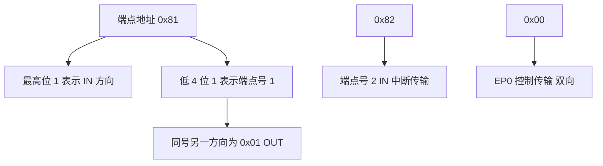
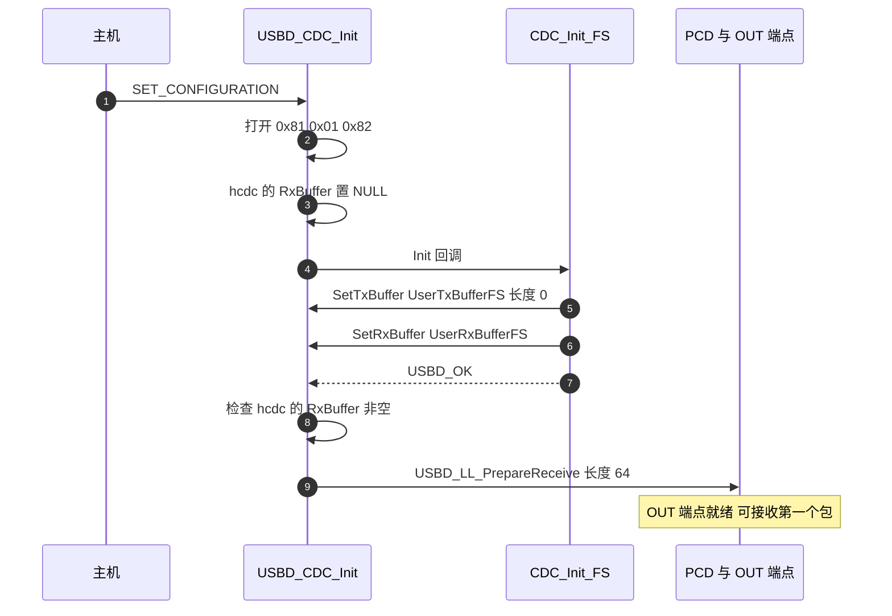

# 端点与缓冲配置

CDC 的端点与缓冲参数主要看四个文件：`Class/CDC/Inc/usbd_cdc.h`、`Class/CDC/Src/usbd_cdc.c`、`USB_DEVICE/App/usbd_cdc_if.h` 与 `usbd_cdc_if.c`。

CDC 类与 COM 口的关系在 `01-USB-CDC类与虚拟串口.md`，链路行为在 `03-接收链路与队列.md` 与 `04-发送链路与忙等待.md`。端点地址怎么读、包大小怎么定、2048 字节的应用缓冲放在哪一层，是这里要回答的三个问题。

## 1. 端点地址里的方向位与端点号

USB 端点是设备与主机之间单向数据通道的抽象。一个端点由地址唯一标识：地址低 4 位是端点号，最高位是方向，1 表示 IN（设备到主机），0 表示 OUT（主机到设备）。因此 `0x81` 与 `0x01` 是同一个端点号 1 的两个方向，`0x82` 是端点号 2 的 IN 方向。



方向位与端点号一起决定 PCD 层用哪一个寄存器组，也决定回调里 `epnum` 参数的含义：类层拿到的是端点号，方向由调用的是 `DataIn` 还是 `DataOut` 区分。

## 2. 四种传输类型中 CDC 用到两种

USB 全速总线提供四种传输类型，CDC 用到其中两种：

| 传输类型 | 特点 | CDC 中的用途 |
| --- | --- | --- |
| 控制传输 | 由 EP0 承载，有握手与状态阶段 | 枚举、类请求 |
| 批量传输 | 有错误重传与流控，无带宽保证 | 数据端点，字节流 |
| 中断传输 | 按 bInterval 轮询，延迟有界 | 命令端点，类通知 |
| 同步传输 | 带宽保证，不重传 | 未使用 |

批量传输没有带宽保证，但在全速总线上，主机会把空闲带宽尽量分给批量端点。这也是虚拟串口在主机侧看起来「速率很高」的原因：实际速率取决于主机的调度，而不是设备声明的参数。

## 3. wMaxPacketSize 与拆包

每个端点声明一个最大包长度 `wMaxPacketSize`。全速批量端点最大 64 字节；主机的一次传输如果超过该长度，会被拆成多个包，每个包分别触发一次接收完成事件。

应用缓冲与端点包是两回事。端点包大小决定单个 USB 事务能搬多少字节，应用缓冲是设备侧存放这些字节的内存。工程给收发各准备了一块 2048 字节缓冲。

## 4. 全速下三条端点的打开顺序

类层 `USBD_CDC_Init()` 在主机下发 `SET_CONFIGURATION` 时执行。它先按速率分支选择包大小：高速用 512，全速用 64，然后依次打开数据 IN、数据 OUT、命令 IN，并把命令端点的 `bInterval` 写入。

端点宏与包大小：

```c
/* Middlewares/ST/STM32_USB_Device_Library/Class/CDC/Inc/usbd_cdc.h（节选） */
#define CDC_IN_EP        0x81U  /* EP1 for data IN  */
#define CDC_OUT_EP       0x01U  /* EP1 for data OUT */
#define CDC_CMD_EP       0x82U  /* EP2 for CDC commands */
#define CDC_HS_BINTERVAL 0x10U
#define CDC_FS_BINTERVAL 0x10U
#define CDC_CMD_PACKET_SIZE        8U
#define CDC_DATA_HS_MAX_PACKET_SIZE 512U
#define CDC_DATA_FS_MAX_PACKET_SIZE 64U
```

全速分支的打开顺序：

```c
/* Class/CDC/Src/usbd_cdc.c（节选） */
  else
  {
    (void)USBD_LL_OpenEP(pdev, CDCInEpAdd, USBD_EP_TYPE_BULK,
                         CDC_DATA_FS_IN_PACKET_SIZE);
    (void)USBD_LL_OpenEP(pdev, CDCOutEpAdd, USBD_EP_TYPE_BULK,
                         CDC_DATA_FS_OUT_PACKET_SIZE);
    pdev->ep_in[CDCCmdEpAdd & 0xFU].bInterval = CDC_FS_BINTERVAL;
  }
  (void)USBD_LL_OpenEP(pdev, CDCCmdEpAdd, USBD_EP_TYPE_INTR, CDC_CMD_PACKET_SIZE);
```

三条端点全部打开后，类层把接收缓冲置空并调用应用侧 `Init` 回调，随后校验 `RxBuffer` 是否已设置。这个顺序决定了应用回调必须设置缓冲，否则类层在下一步返回内存不足错误。

## 5. 应用缓冲 2048 字节的实体与位置

```c
/* USB_DEVICE/App/usbd_cdc_if.h */
#define APP_RX_DATA_SIZE  2048
#define APP_TX_DATA_SIZE  2048
```

```c
/* USB_DEVICE/App/usbd_cdc_if.c */
uint8_t UserRxBufferFS[APP_RX_DATA_SIZE];
uint8_t UserTxBufferFS[APP_TX_DATA_SIZE];
```

两块缓冲是独立的静态数组，接收一块、发送一块。它们并不构成乒乓双缓冲：没有第二块同向缓冲，也没有缓冲区切换逻辑。

## 6. CDC_Init_FS 设置缓冲的时机

```c
/* USB_DEVICE/App/usbd_cdc_if.c */
static int8_t CDC_Init_FS(void)
{
  USBD_CDC_SetTxBuffer(&hUsbDeviceFS, UserTxBufferFS, 0);
  USBD_CDC_SetRxBuffer(&hUsbDeviceFS, UserRxBufferFS);
  return (USBD_OK);
}
```

调用链是 `SET_CONFIGURATION` 到 `USBD_CDC_Init()`、打开端点、`pdev->pUserData[pdev->classId]->Init()`（即 `CDC_Init_FS`）、`hcdc->RxBuffer` 非空校验、`USBD_LL_PrepareReceive` 首次挂上 OUT 端点。

`USBD_CDC_SetTxBuffer` 与 `USBD_CDC_SetRxBuffer` 只把指针写进类层句柄：前者同时清零 `TxLength`，后者只写 `RxBuffer`。实际传输长度在每次发送前由 `CDC_Transmit_FS` 重新设置。



## 7. 硬件 FIFO 与应用缓冲处于两层

OTG FS 内部另有一组 FIFO，与 2048 字节的应用缓冲处在不同层次：

```c
/* USB_DEVICE/Target/usbd_conf.c */
  HAL_PCDEx_SetRxFiFo(&hpcd_USB_OTG_FS, 0x80);
  HAL_PCDEx_SetTxFiFo(&hpcd_USB_OTG_FS, 0, 0x40);
  HAL_PCDEx_SetTxFiFo(&hpcd_USB_OTG_FS, 1, 0x80);
```

接收 FIFO 为 `0x80` words，两个发送 FIFO 分别为 `0x40` 与 `0x80` words，合计 `0x140` words。OTG FS 的总 FIFO 为 320 words（按参考手册值，未实测），三个数正好用满。FIFO 由 USB 外设硬件使用，应用缓冲由 CPU 侧回调访问，两者之间由 PCD 层搬运。

## 8. 2048 字节缓冲与整帧容量的关系

协议帧长在 `Communication/Inc/usb_protocol.h` 定义为 `VISION_TO_GIMBAL_LEN = 29` 与 `GIMBAL_TO_VISION_LEN = 43`，并有编译期断言保证结构体大小一致。把 2048 除以帧长会得到 70 与 47 两个数，但它们只在「缓冲整帧复用」的假设下成立：实际路径逐字节入队，缓冲只决定单次包的最大长度，这两个数在本单元后续核算里不再出现。

## 9. 易错点

- 把两块应用缓冲当成乒乓双缓冲。`UserRxBufferFS` 与 `UserTxBufferFS` 是收发各一块，不能在一次接收未处理完时切换到另一块同向缓冲。接收回调必须在返回前完成字节搬运，否则新包会覆盖旧数据。
- 把收包等同于收帧。主机侧写 29 字节一次并不能保证设备收到一个 64 字节以内的完整包，也不能保证一个包内只有一个协议帧。帧边界由应用层状态机（见 `03-接收链路与队列.md`）判定，与 USB 包边界无关。
- 认为 2048 字节决定了吞吐。逐字节转发路径里，每个包到达后会被立即搬进队列，缓冲大小只影响单次包的最大长度上限。瓶颈在队列深度（128 字节）与任务周期，见 `03-接收链路与队列.md` 的核算。
- RxBuffer 为空时初始化失败。类层在 `usbd_cdc.c` 检查 `hcdc->RxBuffer == NULL` 并返回 `USBD_EMEM`。若 `CDC_Init_FS` 没有调用 `USBD_CDC_SetRxBuffer`，设备会在配置阶段直接失败，表现为枚举后无数据端点。
- 忘记重新挂端点。`USBD_LL_PrepareReceive` 只在 `CDC_Init_FS` 与 `CDC_ReceivePacket` 两处调用。每个 OUT 包处理完后若不重新挂，端点保持 NAK，后续数据不会到达。详见 `03-接收链路与队列.md`。

## 10. 小结

核心概念：

| 概念 | 内容 |
| --- | --- |
| 端点地址 | 方向位加端点号；`0x81` 与 `0x01` 是端点 1 的两个方向 |
| 包大小 | 全速批量端点 64 字节，命令端点 8 字节，`bInterval` 为 `0x10` |
| 应用缓冲 | 2048 字节收发各一块，是独立静态数组，不构成乒乓结构 |
| 设置时机 | `CDC_Init_FS` 在 `SET_CONFIGURATION` 时由类层调用，只设置指针，不搬数据 |
| 分层 | 硬件 FIFO 与应用缓冲分层，FIFO 之和等于 OTG FS 总容量 |

设计权衡：

| 决策 | 好处 | 代价 |
| --- | --- | --- |
| 数据端点用 64 字节包 | 全速下的最大值，单包效率最高 | 单包超限时主机侧会拆分，设备需按包处理 |
| 应用缓冲取 2048 | 单次可容纳多个包的数据量 | 逐字节转发下容量未被利用，占用 4 KB 静态内存 |
| 收发各一块缓冲 | 结构简单，无需管理所有权 | 无乒乓，回调返回前必须完成搬运 |
| 命令端点用中断传输 | 类通知有延迟上界 | 未发送通知时端点闲置 |
| FIFO 按 0x80 与 0x40 与 0x80 分配 | 用满 320 words，收发方向都有余量 | 改动端点数量或包大小时要重新核算 |

## 11. 练习

基础题：

1 由端点地址 `0x81` 与 `0x01` 分别写出方向、端点号，并说明它们是否同一条物理通道。
2 列出全速下三条端点的传输类型与最大包长度，指出命令端点挂在哪一个接口上。
3 写出 `CDC_Init_FS` 的两个调用，说明它们各自只改变了类层句柄的哪些字段。
4 计算 2048 字节收发缓冲分别能装下多少个 29 字节与 43 字节的协议帧。

挑战题：

5 把数据端点包大小从 64 改成 32。要求分析主机侧行为、设备侧回调触发次数、以及吞吐的变化，并说明是否需要同步调整 FIFO。
6 为接收路径设计乒乓双缓冲。要求给出两块缓冲的切换条件、与 `USBD_CDC_SetRxBuffer` 的配合方式，并说明在何处通知任务另一块缓冲已就绪。
7 论证 `APP_RX_DATA_SIZE` 与 `APP_TX_DATA_SIZE` 是否可以缩小到 64 与 64。要求给出不破坏功能的判据，并指出哪些现有代码依赖 2048 这个数值。

---

### 附：本页引用的固件路径

| 路径 | 用途 |
| --- | --- |
| `USB_DEVICE/App/usbd_cdc_if.h` | 应用缓冲大小 |
| `USB_DEVICE/App/usbd_cdc_if.c` | 缓冲实体、`CDC_Init_FS` |
| `Middlewares/ST/STM32_USB_Device_Library/Class/CDC/Inc/usbd_cdc.h` | 端点宏与包大小、句柄结构 |
| `Middlewares/ST/STM32_USB_Device_Library/Class/CDC/Src/usbd_cdc.c` | 打开端点、`SetTxBuffer` 与 `SetRxBuffer`、`ReceivePacket` |
| `USB_DEVICE/Target/usbd_conf.c` | FIFO 分配 |
| `Communication/Inc/usb_protocol.h` | 帧长常量与编译期断言 |
