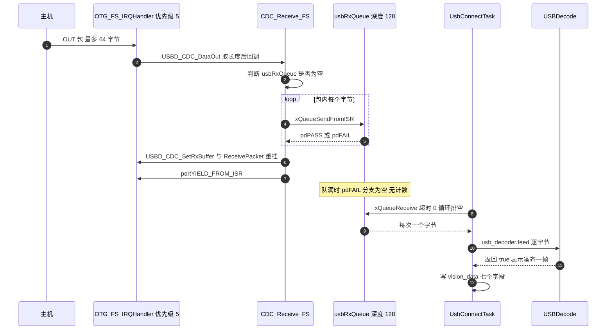
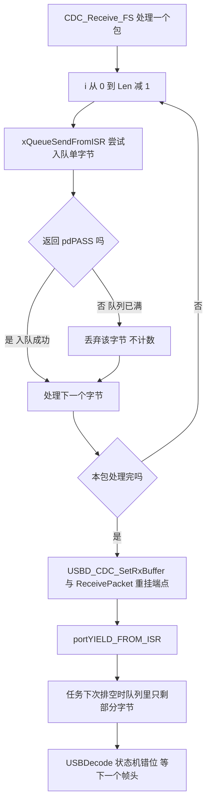

# 接收链路与队列

视觉数据从 USB OUT 端点到应用解析器要经过三处：`USB_DEVICE/App/usbd_cdc_if.c`、`Core/Src/freertos.c` 与 `Task/Src/UsbConnectTask.cpp`。

协议解帧的状态机属于 USB 协议收发单元，本页只讲到把字节交给解析器。发送方向见 `04-发送链路与忙等待.md`。

## 1. 中断入队与任务排空的两段式结构

USB OUT 数据的到达时刻由主机决定。设备在 OTG 中断里拿到一个包，应用解析器需要按帧状态机逐字节处理。两者节奏不同：中断上下文要求尽量短，解析状态机可能跨越多个包。用一个字节队列把两者分开，中断只入队，任务负责排空与解析。

队列的容量是这段设计里唯一没有反馈的环节。满队时入队失败，代码里没有计数，也没有告警。

## 2. 从 OUT 包到 Receive 回调

类层 `USBD_CDC_DataOut()` 在中断上下文被调用，它先取出本包长度，再把缓冲指针与长度交给应用侧 `Receive` 回调。应用回调在返回前必须完成字节搬运，因为注释里写明的语义是：在回调执行期间，主机发往该 OUT 端点的后续包会被 NAK。

类层取长度与回调的实现：

```c
/* Middlewares/ST/STM32_USB_Device_Library/Class/CDC/Src/usbd_cdc.c（节选） */
static uint8_t USBD_CDC_DataOut(USBD_HandleTypeDef *pdev, uint8_t epnum)
{
  USBD_CDC_HandleTypeDef *hcdc = (USBD_CDC_HandleTypeDef *)pdev->pClassDataCmsit[pdev->classId];
  ...
  hcdc->RxLength = USBD_LL_GetRxDataSize(pdev, epnum);
  ((USBD_CDC_ItfTypeDef *)pdev->pUserData[pdev->classId])->Receive(hcdc->RxBuffer, &hcdc->RxLength);
  return (uint8_t)USBD_OK;
}
```

## 3. NAK 与端点重挂

NAK 表示设备暂时不能接收。它不会造成数据丢失：主机检测到 NAK 后会稍后重试同一个包。代价是这段时间总线带宽被浪费。回调执行越久，NAK 窗口越长。

回调结尾必须调用 `USBD_CDC_ReceivePacket` 重新准备 OUT 端点。这个动作告诉 PCD 层把接收缓冲重新挂上，允许下一个包进入。漏掉这一步，端点会一直 NAK，接收链路停止。

## 4. CDC_Receive_FS 的五个要点

```c
/* USB_DEVICE/App/usbd_cdc_if.c */
static int8_t CDC_Receive_FS(uint8_t* Buf, uint32_t *Len)
{
  BaseType_t xHigherPriorityTaskWoken = pdFALSE;

  if (usbRxQueue == NULL) {
    goto exit;
  }

  for (uint32_t i = 0; i < *Len; i++) {
    if (xQueueSendFromISR(usbRxQueue,
                          &Buf[i],
                          &xHigherPriorityTaskWoken) != pdPASS) {}
  }

  exit:
    USBD_CDC_SetRxBuffer(&hUsbDeviceFS, Buf);
  USBD_CDC_ReceivePacket(&hUsbDeviceFS);

  portYIELD_FROM_ISR(xHigherPriorityTaskWoken);

  return USBD_OK;
}
```

五个要点：

- `usbRxQueue == NULL` 时直接跳到 `exit`，跳过入队但仍重挂端点。这个分支对应 USB 初始化先于队列创建的时间窗（见 `01-USB-CDC类与虚拟串口.md`）。
- 循环上界是本包长度 `*Len`，最大 64。每个字节一次队列操作，一包最多 64 次。
- 失败分支 `{}` 为空，队列满时对应字节被丢弃，不计数、不置标志。
- `USBD_CDC_SetRxBuffer(&hUsbDeviceFS, Buf)` 里的 `Buf` 就是类层句柄里的 `RxBuffer`，它等于 `UserRxBufferFS`，这次调用把同一个指针写回，等价于空操作。实际起作用的是下一行的重挂。
- `portYIELD_FROM_ISR` 在返回路径上执行，参数可能在入队过程中被置为 `pdTRUE`。

## 5. 队列创建与 FreeRTOS 配置

```c
/* Core/Src/freertos.c */
QueueHandle_t usbRxQueue = NULL;

/* Core/Src/freertos.c（节选） */
  usbRxQueue = xQueueCreate(128, sizeof(uint8_t));
  if (usbRxQueue == NULL) {
    // 队列创建失败，可以添加错误处理
  }
```

队列深度 128，单元大小 `sizeof(uint8_t)` 为 1，数据区合计 128 字节。创建走动态分配：`Core/Inc/FreeRTOSConfig.h` 打开 `configSUPPORT_DYNAMIC_ALLOCATION` 的堆为 40960 字节。创建失败时处理体为空，`usbRxQueue` 保持 `NULL`，接收回调之后每次都走 `NULL` 分支，表现为一个字节都收不到。

## 6. 任务侧排空与喂帧

```cpp
/* Task/Src/UsbConnectTask.cpp（节选） */
    for (;;) {
        if (usbRxQueue != NULL) {
            while (xQueueReceive(usbRxQueue, &byte, 0) == pdTRUE)
            {
                if (usb_decoder.feed(byte))
                {
                    const auto& pkt = usb_decoder.packet();
                    vision_data.mode = pkt.mode;
                    vision_data.yaw = pkt.yaw;
                    ...
                }
            }
        }
        ...
        osDelay(10);
    }
```

排空用超时 0 的 `xQueueReceive`，一次取一个字节，直到队列为空。任务周期由循环末尾的 `osDelay(10)` 决定，发送侧的忙等还会额外拉长这个周期。



## 7. 中断优先级 5 与内核临界区

`USB_DEVICE/Target/usbd_conf.c` 把 `OTG_FS_IRQn` 设为优先级 5。`Core/Inc/FreeRTOSConfig.h` 的 `configLIBRARY_MAX_SYSCALL_INTERRUPT_PRIORITY` 也是 5。Cortex-M 上调用中断安全 FreeRTOS API 的条件是中断数值优先级不小于该阈值，5 恰好满足，`xQueueSendFromISR` 与 `portYIELD_FROM_ISR` 合法。

若把 OTG 优先级调到 4 或更高，中断仍会进入，但队列操作会破坏内核临界区，属于必须避免的改法。

## 8. 队列容量核算：三种工况

先列符号：

| 符号 | 含义 | 取值 |
| --- | --- | --- |
| `C` | 队列可用字节数 | 128 |
| `P` | 单个批量 OUT 包上限 | 64 |
| `F` | 视觉帧长 | 29 |
| `T` | 任务循环周期 | 10 ms 起 |
| `t_b` | 发送忙等造成的阻塞时长 | 不定 |
| `R` | 字节到达率 | 由主机决定 |

名义工况。视觉端按 100 Hz 发送 29 字节帧，到达率与每周期累积量：

$$R = 100 \times 29 = 2900\ \text{B/s},\qquad R\,T = 2900 \times 0.010 = 29\ \text{B}$$

队列的整帧余量为：

$$\frac{C}{F} = \frac{128}{29} \approx 4.4\ \text{帧}$$

突发工况（假设）。下面的到达率属假设值：主机把一次较大的写入拆成背靠背的 64 字节包，并且每个 1 ms 帧只调度一个包。实际全速总线上一个帧内可以安排多个事务，批量端点并不受「一帧一包」限制（见 `05-USB Device/03-USB协议收发/01-USB传输类型与端点.md`），所以 64000 B/s 只是用于给出最坏情形的假设工况：

$$R_{burst} = \frac{64\ \text{B}}{1\ \text{ms}} = 64000\ \text{B/s}$$

在一个任务周期内累积：

$$R_{burst}\,T = 64000 \times 0.010 = 640\ \text{B} \gg 128\ \text{B}$$

在上述假设下，一个满速突发周期就能让队列溢出。队列恰好容纳两个完整的 64 字节包：`64 + 64 = 128`；只有在任务连续两个周期都不排空的极端情况下，第三个包到达时其字节才会全部被丢弃，若任务在包间隙排空过一次，丢弃量小于一整包。

阻塞工况。任务在发送侧忙等 `t_b` 期间完全不排空。要覆盖这段窗口并留出一个在途包，容量需要满足：

$$C \ge R\,t_b + P$$

代入名义到达率 `R = 2900\ \text{B/s}` 与 `C = 128`，可容忍的阻塞时长为：

$$t_b \le \frac{C - P}{R} = \frac{128 - 64}{2900} \approx 22\ \text{ms}$$

超过约 22 ms 的单次阻塞，名义帧率下也会开始丢字节。若按上面的突发假设计算，可容忍阻塞只有：

$$t_b \le \frac{128 - 64}{64000} = 1\ \text{ms}$$

22 ms 与 1 ms 分别依赖名义到达率 2900 B/s 与 64000 B/s 的突发假设，只在这两个工况下成立，不是实测带宽下的普适值。

丢字节不报错。`xQueueSendFromISR` 返回 `pdFAIL` 后循环继续处理下一个字节，包内后续字节仍可能入队，队列里留下的是一段被截断的字节流。解析器的帧头搜索只能等下一个 `'S'` 重新对齐。



## 9. 丢字节后的现象链

队列满不是立刻可见的错误。它留下的是一段被截断的字节流，后续现象分三步出现：

- 队列里字节数减少，任务排空后喂给状态机的字节序列与主机发送序列不一致。
- `USBDecode` 在 `COLLECT` 阶段收满 29 字节，但凑出的帧错位，CRC 与模式校验失败（`Communication/Src/usb_decode.cpp`）。
只有等下一个帧头 `'S'` 重新对齐

因此排查帧错位时，先看 `error_count_` 是否随队列水位一起变化，再看队列水位是否曾接近 128。

## 10. 易错点

- 队列满时静默丢字节。失败分支为空，是整条接收链路里唯一没有计数的环节。`USBDecode` 内部有 `error_count_`（`Communication/Src/usb_decode.cpp`），但队列满造成的字节缺失不会进入那个计数。排查丢包时先怀疑这里。
- 忽略发送忙等对接收周期的拉长。排空与发送在同一个 `for(;;)` 循环里，发送侧的 `while` 忙等（`Task/Src/UsbConnectTask.cpp`）会把下一次排空一起推迟。视觉端长时间不取数据时，接收队列同时承担压力。这一点属于推断，未在视觉端停取的条件下实测。
- 把帧边界当成包边界。一个 USB 包可能含多个协议帧，一个协议帧也可能跨包。队列只保证字节顺序，帧边界完全由解析器状态机决定。包长度与帧长度没有对齐关系。
- 提高 OTG 中断优先级。把 `OTG_FS_IRQn` 调到 5 以上会越过 FreeRTOS 的临界区界限，`xQueueSendFromISR` 可能在内核操作队列时打断内核。表现不可预期，通常是随机死机或队列结构损坏。
- 误以为 NAK 会丢数据。NAK 只是拒绝当前包，主机会重试。实际的丢失发生在设备已经收下这个包、字节却没进队列的时候，也就是队列满的分支。

## 11. 小结

核心概念：

| 概念 | 内容 |
| --- | --- |
| 结构 | 中断入队、任务排空的两段式结构，队列是唯一交接点 |
| 入队粒度 | `CDC_Receive_FS` 逐字节入队，一包最多 64 次队列操作，失败分支为空 |
| 端点重挂 | 回调返回前必须重挂 OUT 端点；重挂前主机发来的包会被 NAK |
| 中断让渡 | `portYIELD_FROM_ISR` 在队列操作唤醒更高优先级任务时请求切换 |
| 容量 | 128 字节，名义 100 Hz 下有约 4.4 帧余量，满速突发或超过约 22 ms 的阻塞会导致丢字节 |

设计权衡：

| 决策 | 好处 | 代价 |
| --- | --- | --- |
| 中断里逐字节入队 | 任务侧接口简单，按字节喂状态机 | 每包最多 64 次队列操作，回调时间偏长 |
| 队列深度 128 | 名义帧率下有余量，占用内存小 | 满速突发下不足，满队静默丢弃 |
| 任务周期排空加 10 ms 延时 | 任务不空转，CPU 占用低 | 到达突发全部压在队列上，靠容量吸收 |
| 入队失败不计数 | 代码路径最短 | 丢包不可观测，排查只能靠现象 |
| 重挂端点放在函数末尾 | 无论入队是否成功都恢复接收 | 队列故障不会阻止端点继续收包，丢包持续发生 |

## 12. 练习

基础题：

1 按顺序写出 `CDC_Receive_FS` 的五个动作，指出哪一步保证后续包能进来。
2 解释 `xQueueSendFromISR` 返回 `pdFAIL` 时会发生什么，代码里有没有记录。
3 说明 `USBD_CDC_SetRxBuffer(&hUsbDeviceFS, Buf)` 在本工程里为什么等价于空操作。
4 写出 OTG 中断优先级与 `configLIBRARY_MAX_SYSCALL_INTERRUPT_PRIORITY` 的数值，说明两者相等意味着什么。

挑战题：

5 为接收链路加入丢字节计数。要求：给出计数器变量与递增位置、计数器的访问方式（中断写任务读）、以及在不引入锁的前提下读取它的方法。
6 重新设计队列容量。要求：选定目标阻塞时长与突发模型，用本页公式算出 `C`，并说明为什么按字节队列与按包队列的容量需求不同。
7 论证 `CDC_Receive_FS` 是否应该改成一次性把整包交给任务。要求：给出交接方式（队列传指针或流缓冲）、所有权与生命周期安排，并分析对解析器的影响。

---

### 附：本页引用的固件路径

| 路径 | 用途 |
| --- | --- |
| `USB_DEVICE/App/usbd_cdc_if.c` | `CDC_Receive_FS`、队列外部声明 |
| `Middlewares/ST/STM32_USB_Device_Library/Class/CDC/Src/usbd_cdc.c` | `USBD_CDC_DataOut`、`USBD_CDC_ReceivePacket` |
| `Core/Src/freertos.c` | 队列变量、创建 |
| `Core/Inc/FreeRTOSConfig.h` | 动态分配、堆大小、中断优先级阈值 |
| `Task/Src/UsbConnectTask.cpp` | 排空与喂帧、发送忙等 |
| `USB_DEVICE/Target/usbd_conf.c` | OTG 中断优先级 |
| `Communication/Src/usb_decode.cpp` | 解析状态机与错误计数 |
| `Communication/Inc/usb_protocol.h` | 帧头与帧长 |
