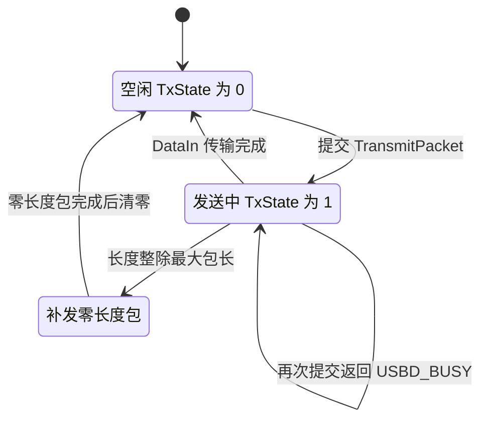
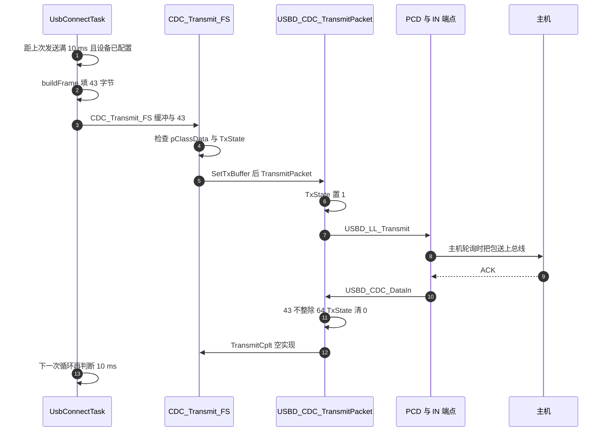

# 发送链路与忙等待

云台状态帧从任务到 USB IN 端点要经过三处：`USB_DEVICE/App/usbd_cdc_if.c:297-336`、`Class/CDC/Src/usbd_cdc.c:536-568,813-845` 与 `Task/Src/UsbConnectTask.cpp:105-155`。

接收链路在 `03-接收链路与队列.md`，帧内容与协议在 USB 协议收发单元；这里只跟一帧的提交、完成与重试有关。

## 1. IN 传输与 TxState 忙标志

设备往主机发数据走 IN 端点。一次 IN 传输提交给 PCD 层后，硬件按主机的轮询节奏把它送上总线。应用不能在上一次传输还没结束时再次提交，因此类层用一个 TxState 标志表示占用状态。

忙等指的是应用拿到忙碌返回后不阻塞睡眠，而是循环重试。本工程在任务上下文里用的是忙等加 `osDelay(5)` 的组合，每次重试之间让出 5 ms。



## 2. 一次提交的四个环节

任务调用 `CDC_Transmit_FS`，它检查句柄与忙标志，把缓冲指针与长度写进类层，再调用 `USBD_CDC_TransmitPacket`。后者把 `TxState` 置 1 并调用 `USBD_LL_Transmit` 交给 PCD。传输完成后，PCD 层的传输完成回调进入类层 `USBD_CDC_DataIn`，在那里把 `TxState` 清 0。

四个环节的代码位置：

```c
/* Class/CDC/Src/usbd_cdc.c:813-845（节选） */
  if (hcdc->TxState == 0U)
  {
    hcdc->TxState = 1U;
    pdev->ep_in[CDCInEpAdd & 0xFU].total_length = hcdc->TxLength;
    (void)USBD_LL_Transmit(pdev, CDCInEpAdd, hcdc->TxBuffer, hcdc->TxLength);
    ret = USBD_OK;
  }
  return (uint8_t)ret;
```

`ret` 初值为 `USBD_BUSY`，只有在 `TxState == 0` 的分支里才改成 `USBD_OK`。这意味着忙标志在类层又检查了一次，即使应用层的检查刚通过。

## 3. 零长度包与 43 字节帧

`USBD_CDC_DataIn` 先判断本次传输长度是否是端点最大包长的整数倍。若整除，还需要补一个零长度包（ZLP）作为结束标志；若不整除，直接清忙标志。43 字节不是 64 的整数倍，走直接清零分支。

```c
/* Class/CDC/Src/usbd_cdc.c:536-568（节选） */
static uint8_t USBD_CDC_DataIn(USBD_HandleTypeDef *pdev, uint8_t epnum)
{
  ...
  if ((pdev->ep_in[epnum & 0xFU].total_length > 0U) &&
      ((pdev->ep_in[epnum & 0xFU].total_length % hpcd->IN_ep[epnum & 0xFU].maxpacket) == 0U))
  {
    pdev->ep_in[epnum & 0xFU].total_length = 0U;
    (void)USBD_LL_Transmit(pdev, epnum, NULL, 0U);
  }
  else
  {
    hcdc->TxState = 0U;
    if (((USBD_CDC_ItfTypeDef *)pdev->pUserData[pdev->classId])->TransmitCplt != NULL)
    {
      ((USBD_CDC_ItfTypeDef *)pdev->pUserData[pdev->classId])->TransmitCplt(hcdc->TxBuffer, &hcdc->TxLength, epnum);
    }
  }
  return (uint8_t)USBD_OK;
}
```

43 字节帧的 `total_length % 64` 为 43，走 `else`，`TxState` 清 0，随后调用 `CDC_TransmitCplt_FS`。类层在清忙标志后调用应用侧 `TransmitCplt` 回调，本工程的这个回调是空的。

## 4. CDC_Transmit_FS 的两个前置检查

```c
/* USB_DEVICE/App/usbd_cdc_if.c:297-313 */
uint8_t CDC_Transmit_FS(uint8_t* Buf, uint16_t Len)
{
  uint8_t result = USBD_OK;
  if (hUsbDeviceFS.pClassData == NULL)
    return USBD_FAIL;

  USBD_CDC_HandleTypeDef *hcdc = (USBD_CDC_HandleTypeDef*)hUsbDeviceFS.pClassData;

  if (hcdc->TxState != 0)
    return USBD_BUSY;

  USBD_CDC_SetTxBuffer(&hUsbDeviceFS, Buf, Len);
  result = USBD_CDC_TransmitPacket(&hUsbDeviceFS);
  return result;
}
```

两个前置检查：类数据为空返回 `USBD_FAIL`；忙标志非零返回 `USBD_BUSY`。长度由调用方给出，本工程传 43。

## 5. 任务侧 while 加 osDelay(5)

```cpp
/* Task/Src/UsbConnectTask.cpp:105-110（节选） */
        if (hUsbDeviceFS.dev_state == USBD_STATE_CONFIGURED)
        {
            uint32_t current_time = HAL_GetTick();
            if (current_time - last_send_time >= 10) {
                last_send_time = current_time;
```

```cpp
/* Task/Src/UsbConnectTask.cpp:143-154（节选） */
                while (
                    CDC_Transmit_FS(
                           reinterpret_cast<uint8_t*>(&tx_pkt),
                           USBProtocol::GIMBAL_TO_VISION_LEN
                       ) == USBD_BUSY) {
                    osDelay(5);
                }
            }
        }

        osDelay(10);
```

三个要点：

- 发送条件是设备处于 `USBD_STATE_CONFIGURED`，并且距上次发送至少 10 ms。
- 忙等循环只在返回 `USBD_BUSY` 时继续。返回 `USBD_OK` 或 `USBD_FAIL` 都会跳出循环。
- `osDelay(5)` 让出 CPU，因此这不是空转式忙等，但任务本身被卡在循环里，同步周期与排空都被推迟。

## 6. 发送周期与出站码率

任务循环末尾 `osDelay(10)`，发送门槛也是 10 ms，两者叠加使名义发送周期为 10 ms 量级，即 100 Hz。每帧 43 字节，名义出站码率为：

$$R_{tx} = 100 \times 43 = 4300\ \text{B/s}$$

43 字节小于一个 64 字节包，一帧对应一次 `USBD_LL_Transmit`。全速批量传输的名义上限远高于此，发送侧的瓶颈在忙标志与主机取数节奏。

帧结构在 `Communication/Inc/usb_protocol.h:55-70`，建帧在 `Communication/Src/usb_protocol.cpp:11-49`：先填帧头与字段，`:38` 把 `crc16` 清零，`:41-45` 对前 41 字节算 CRC，`:47` 写回，返回 `GIMBAL_TO_VISION_LEN`。



## 7. 完成回调为空的影响

`CDC_TransmitCplt_FS` 只对三个参数做 `UNUSED`（`usbd_cdc_if.c:327-336`）。发送完成的时刻在应用侧不可观测，只能靠下一轮 `TxState` 查询间接判断。

回调为空也意味着发送完成与下一帧组帧之间没有同步点：任务在收到 `USBD_OK` 之后才继续，而 `USBD_OK` 只表示提交成功，不表示总线已经 ACK。若要严格统计发送延迟，需要在这个回调里打时间戳。

## 8. 易错点

- 忙等没有上界。`while` 没有超时。若主机长时间不取数据，`TxState` 一直为 1，任务停在这里，接收排空与状态更新一起延迟。队列溢出风险见 `03-接收链路与队列.md` 的阻塞工况核算。
- 把 `USBD_FAIL` 当成发送完成。循环条件只比较 `USBD_BUSY`。类数据为空时返回 `USBD_FAIL`，循环立刻退出，调用方不会知道这一帧没有发出去。若需要严格语义，应在调用点区分两个返回值。
- 复用同一块发送缓冲。传入的是全局 `tx_pkt` 的地址。因为 `TxState` 保证前一次传输完成前不会提交新的，指针在传输期间保持有效。一旦有人绕过忙标志直接调用 `USBD_CDC_TransmitPacket`，缓冲会在传输中被改写。
- 忘记零长度包的条件。长度恰好是 64 的整数倍时才需要补零长度包。43 字节不触发该分支。若把帧长改成 64 或 128，`DataIn` 会先发零长度包，`TxState` 推迟到零长度包完成后才清零，忙标志持续时间变长。
- 完成回调为空导致没有发送确认。发送完成的时刻在应用侧不可观测，只能靠下一轮 `TxState` 查询间接判断。

## 9. 小结

核心概念：

| 概念 | 内容 |
| --- | --- |
| TxState | 类层的发送占用标志，提交时置 1，传输完成时在 `USBD_CDC_DataIn` 清 0 |
| 返回值 | `CDC_Transmit_FS` 在类数据为空时返回 `USBD_FAIL`，忙时返回 `USBD_BUSY` |
| 零长度包 | 长度整除端点最大包长时需要补发；43 字节不触发 |
| 任务侧重试 | 用 `while` 加 `osDelay(5)` 重试忙标志，没有超时 |
| 名义出站 | 发送门槛 10 ms 与循环延时 10 ms 叠加，名义为 100 Hz、4300 B/s |

设计权衡：

| 决策 | 好处 | 代价 |
| --- | --- | --- |
| 用 `TxState` 单标志控制发送 | 实现简单，硬件状态单一 | 无法排队多帧，只能等上一帧完成 |
| 忙时 `osDelay(5)` 重试 | 不空转 CPU，实现直观 | 无超时，主机停取时任务被拖住 |
| 完成回调留空 | 少一层回调开销 | 发送完成时刻不可观测 |
| 10 ms 固定周期发送 | 与视觉端 100 Hz 约定一致 | 与循环延时叠加，实际周期略大于 10 ms |
| 复用全局 `tx_pkt` | 无额外缓冲与拷贝 | 依赖忙标志保证指针有效 |

## 10. 练习

基础题：

1 写出 `TxState` 置 1 与清 0 的位置，指出完成路径经过哪一个回调。
2 说明 `CDC_Transmit_FS` 三种返回值的触发条件，以及任务侧怎么处理它们。
3 计算 43 字节帧的 `total_length % maxpacket`，判断是否需要补零长度包。
4 说明发送门槛 10 ms 与循环末尾 `osDelay(10)` 的关系，估算实际发送周期。

挑战题：

5 给忙等加上超时与丢帧统计。要求：给出超时时长、超时后的动作、统计变量的类型与访问方式。
6 把单帧发送改成按需发送。要求：说明触发条件、如何避免与 100 Hz 约定冲突、以及主机侧需要做什么配合。
7 论证发送完成回调可以承担哪些职责。要求：给出至少两项可行的用途，并说明它们与忙标志、缓冲区生命周期的关系。

---

### 附：本页引用的固件路径

| 路径 | 用途 |
| --- | --- |
| `/home/wyx/rm/2026SentriOmeniGimbal/2026OmniSentryGimbal/USB_DEVICE/App/usbd_cdc_if.c` | `CDC_Transmit_FS`（:297-313）、`CDC_TransmitCplt_FS`（:327-336） |
| `/home/wyx/rm/2026SentriOmeniGimbal/2026OmniSentryGimbal/Middlewares/ST/STM32_USB_Device_Library/Class/CDC/Src/usbd_cdc.c` | `USBD_CDC_DataIn`（:536-568）、`USBD_CDC_TransmitPacket`（:813-845） |
| `/home/wyx/rm/2026SentriOmeniGimbal/2026OmniSentryGimbal/Middlewares/ST/STM32_USB_Device_Library/Class/CDC/Inc/usbd_cdc.h` | `TxState` 与句柄结构（:120-132） |
| `/home/wyx/rm/2026SentriOmeniGimbal/2026OmniSentryGimbal/Task/Src/UsbConnectTask.cpp` | 发送条件与忙等（:105-155）、建帧调用（:129-140） |
| `/home/wyx/rm/2026SentriOmeniGimbal/2026OmniSentryGimbal/Communication/Src/usb_protocol.cpp` | 建帧与 CRC（:11-49） |
| `/home/wyx/rm/2026SentriOmeniGimbal/2026OmniSentryGimbal/Communication/Inc/usb_protocol.h` | 帧结构（:55-70）、帧长常量（:20-21） |
