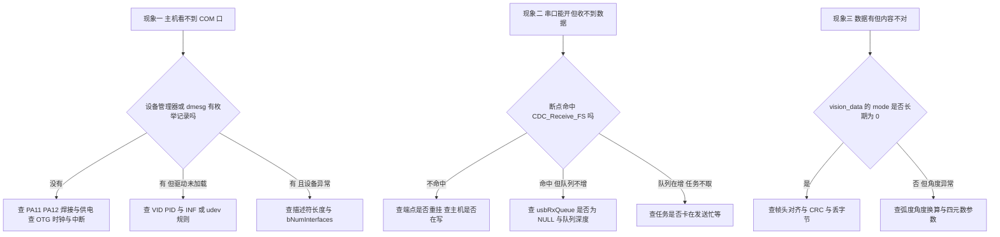
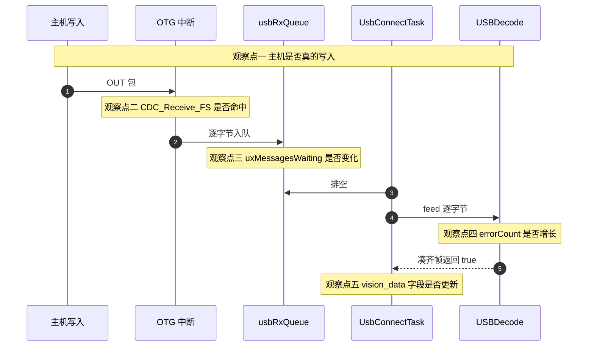

# CDC 虚拟串口的易错点与排查

CDC 单元的已知问题集中在 `01-USB-CDC类与虚拟串口.md` 到 `04-发送链路与忙等待.md` 四页引用的同一批文件里。每条问题都标出源码位置与可观察现象，推断项单独注明。

## 1. 三类现象与它们的排查层级

CDC 虚拟串口牵涉主机、USB 外设、类库、应用回调、FreeRTOS 队列与任务六个环节。问题表现大多收敛成三类：主机看不到串口、串口能开但收不到数据、数据有但内容不对。三类现象对应的排查层级不同。

## 2. 从枚举到内容：五级排查顺序

主机侧先确认枚举是否发生。Linux 用 `dmesg` 看 USB 设备接入记录与驱动绑定，Windows 看设备管理器里的端口节点与驱动状态。没有记录时问题在硬件或外设初始化，不在类库。

有记录但驱动异常时，核对 `USB_DEVICE/App/usbd_desc.c:65-69` 的 `VID` 与 `PID`，以及 `Class/CDC/Src/usbd_cdc.c:168-265` 的配置描述符长度与接口数量。描述符长度写错会导致枚举在配置阶段失败。

串口能打开说明枚举完成。此时先在 `CDC_Receive_FS` 入口下一个断点，或用一个计数变量确认回调是否到达。不命中说明 OUT 端点没有重挂，或主机根本没有写数据。

回调命中但任务取不到字节时，在调试器里读 `usbRxQueue` 的 uxMessagesWaiting 字段。它长期为 0 说明入队没有发生，先检查队列指针是否为 `NULL`。它长期顶在 128 附近说明任务排空太慢。

任务排空与发送共用一个循环。若任务停在 `Task/Src/UsbConnectTask.cpp:143-149` 的 `while` 里，接收也会一起停。用 `osThreadGetState` 或在忙等循环里递增一个计数可以看到这一点。

五个观察点在链路里的位置：

## 3. 队列满静默丢字节与帧错位

`USB_DEVICE/App/usbd_cdc_if.c:270-274` 的入队失败分支为空。队列深度 128 字节，满速突发或超过约 22 ms 的阻塞即可溢出，丢字节不计数。定量推导见 `03-接收链路与队列.md`。

解析器状态机在 `Communication/Src/usb_decode.cpp:45-108`：先等 `'S'` 再等 `'P'`，然后连续收集 29 字节。中间少一个字节会让整帧错位，只能等下一个 `'S'` 重新同步，`error_count_` 只在 CRC 或模式校验失败时增长。两件事叠加起来的表现是：丢的是队列里的字节，报错的是解析器的计数，两者不同源。

## 4. CDC_Control_FS 空实现与跨层 include

`usbd_cdc_if.c:180-244` 的九个命令分支全为空，统一返回 `USBD_OK`。主机设置波特率、数据位、校验位都得到成功应答但不生效。虚拟串口数据通路不依赖这些参数，所以现象不体现在收发的正确性上。

`usbd_cdc_if.c:25` 引入了 `../../Task/Inc/UsbConnectTask.h`，注释写的是包含接收函数声明。该头文件里并没有接收函数声明，实际用到的是同文件 `:34` 的 `extern QueueHandle_t usbRxQueue`。USB 设备层反向依赖任务层头文件，编译耦合不必要。

## 5. 两处历史遗留：USB_Data_Received 与 mode 类型

`Task/Src/UsbConnectTask.cpp:165-174` 的 `USB_Data_Received` 函数体只做 `(void) byte`，循环没有取数动作；声明留在 `Task/Inc/UsbConnectTask.h:109`。接收实际走 `CDC_Receive_FS` 的队列路径，这个函数是历史遗留。

`Task/Inc/UsbConnectTask.h:56-64` 的结构体把 `mode` 声明为 `float`，协议里是 `uint8_t`。赋值处 `Task/Src/UsbConnectTask.cpp:92` 隐式转换。下游比较 `== 1 || == 2`（`Task/Src/ControlCenterTask.cpp:68,79`）在浮点精确表示 0 到 2 的前提下成立，改类型前要检查所有读取点。

## 6. 四元数转换参数重复

`Task/Src/UsbConnectTask.cpp:129` 调用 `eulerToQuaternion(imu_data.gimbal_yaw_total_angle, imu_data.roll, imu_data.roll)`，第二个与第三个实参相同。函数签名第三个参数是 `roll`，第二个是 `pitch`（`:19`），调用处相当于把 roll 同时当作 pitch 与 roll。是否为有意为之需要对照视觉端约定确认。

## 7. 初始化两次与忙等无超时

`Core/Src/main.c:121` 与 `Core/Src/freertos.c:149` 各调用一次 `MX_USB_DEVICE_Init()`，两次调用的完整叙述与待实测项见 `01-USB-CDC类与虚拟串口.md` 的「初始化入口与两次调用」一节。

`Task/Src/UsbConnectTask.cpp:143-149` 的 `while` 没有上界，返回 `USBD_FAIL` 时也会跳出。详见 `04-发送链路与忙等待.md`。

`Task/Src/ControlCenterTask.cpp:52` 把 USB 模式注释为待实现，但 `:68-102` 已经在使用 `vision_data` 并据此设置摩擦轮与拨弹状态。以代码为准。

## 8. 调试手段：队列水位与观察点

在调试器里展开 `usbRxQueue`，读 `uxMessagesWaiting` 与 `uxLength`。前者是当前字节数，后者是深度 128。这两个字段能直接区分入队问题与排空问题。

队列满分支、`error_count_`、发送忙等循环各加一个 `volatile uint32_t` 计数。中断写任务读的场合，单次 32 位读写本身原子；跨字段一致性不做保证。注意 `volatile` 不提供互斥，只阻止编译器优化掉读写。

用 `bsp_dwt` 记录回调进入与退出的时刻，可以量化中断内处理时长与 NAK 窗口。`Task/Src/UsbConnectTask.cpp:15` 已经引入该头文件。

在 `CDC_Receive_FS` 入口、`USBD_CDC_DataOut` 与 `USBD_CDC_DataIn` 三处下断点，可以确认包级事件顺序。中断里断点会暂停整个链路，观察队列水位时注意这一点。

主机侧工具：Linux 用 `lsusb -v` 读描述符与端点，用 `cat /dev/ttyACM0` 与 `stty` 观察数据流。USB 协议分析仪能看到包级重试与 NAK，属于最直接的证据。

## 9. 易错点速查

- 把「收不到数据」当成解析问题，先去看 `USBDecode` 而跳过队列水位。
- 在中断里加长时间打印，拉长 NAK 窗口，反而制造新的丢包。
- 只看 `error_count_` 判断链路质量，忽略队列满这一层没有计数。
- 改动 `vision_data.mode` 类型时只改结构体，不改下游比较点。
- 依赖 `USB_Data_Received` 作为接收入口。
- 调整 `OTG_FS_IRQn` 优先级越过 FreeRTOS 阈值。
- 把 `MX_USB_DEVICE_Init()` 的两次调用当成冗余直接删除，不先验证枚举行为。

## 10. 小结

核心概念：

| 概念 | 内容 |
| --- | --- |
| 三类现象 | 看不到串口查硬件与描述符，收不到数据查端点与队列，内容不对查丢字节与换算 |
| 唯一静默失败点 | 队列满分支，排查时应优先读取队列水位 |
| 可清理的遗留 | `CDC_Control_FS` 空实现、`USB_Data_Received` 空实现、跨层 include |
| 待约定确认 | `vision_data.mode` 类型与协议不一致、四元数转换参数重复 |
| 调试顺序 | 先确认枚举、再确认回调、再看队列、最后看任务与内容 |

设计权衡：

| 决策 | 好处 | 代价 |
| --- | --- | --- |
| 中断只入队不做解析 | 中断时间短，解析可在任务里慢慢做 | 队列容量成为丢包点且无计数 |
| 接收缓冲由回调重挂 | 端点连续可用 | 队列故障不会阻止继续收包，丢包持续 |
| 保留 `USB_Data_Received` 空函数 | 兼容旧调用点 | 读代码时容易误以为这是接收入口 |
| 发送忙等不设超时 | 实现最短 | 主机停取时任务与接收一起停 |
| 类控制请求空实现 | 枚举不因参数错误失败 | 主机侧参数不可见地失效 |

## 11. 练习

基础题：

1 列出三类现象，并写出每一类第一个应当检查的对象。
2 说明如何在调试器里判断队列是在入队侧还是排空侧出问题。
3 指出 `USB_Data_Received` 与 `CDC_Receive_FS` 哪一个是实际接收入口，给出依据。
4 写出 `vision_data.mode` 与协议字段类型不一致的两处位置。

挑战题：

5 设计一套可观测性方案。要求：列出需要增加的计数器与时间戳、各自的访问方式、以及如何在不侵入主链路的前提下导出。
6 给出清理跨层 include 的步骤。要求：说明如何用前向声明或独立头文件替代，并验证不破坏编译单元。
7 针对 `06-四元数转换参数重复` 的问题，设计一个判据实验。要求：给出输入激励、预期输出、与视觉端确认时需要提供的证据。

---

### 附：本页引用的固件路径

| 路径 | 用途 |
| --- | --- |
| `/home/wyx/rm/2026SentriOmeniGimbal/2026OmniSentryGimbal/USB_DEVICE/App/usbd_cdc_if.c` | 入队失败分支（:270-274）、空控制请求（:180-244）、跨层 include（:25、:34） |
| `/home/wyx/rm/2026SentriOmeniGimbal/2026OmniSentryGimbal/USB_DEVICE/App/usbd_desc.c` | 设备身份（:65-69） |
| `/home/wyx/rm/2026SentriOmeniGimbal/2026OmniSentryGimbal/USB_DEVICE/Target/usbd_conf.c` | 引脚与中断（:78-95） |
| `/home/wyx/rm/2026SentriOmeniGimbal/2026OmniSentryGimbal/Core/Src/main.c` | 第一次 USB 初始化（:121） |
| `/home/wyx/rm/2026SentriOmeniGimbal/2026OmniSentryGimbal/Core/Src/freertos.c` | 第二次初始化（:149）、队列创建（:114） |
| `/home/wyx/rm/2026SentriOmeniGimbal/2026OmniSentryGimbal/Task/Src/UsbConnectTask.cpp` | 排空与喂帧（:79-101）、忙等（:143-149）、空实现（:165-174）、四元数调用（:129）、DWT 引入（:15） |
| `/home/wyx/rm/2026SentriOmeniGimbal/2026OmniSentryGimbal/Task/Inc/UsbConnectTask.h` | `vision_data` 结构体（:56-64）、函数声明（:109） |
| `/home/wyx/rm/2026SentriOmeniGimbal/2026OmniSentryGimbal/Task/Src/ControlCenterTask.cpp` | USB 模式注释（:52）、使用 `vision_data`（:68-102） |
| `/home/wyx/rm/2026SentriOmeniGimbal/2026OmniSentryGimbal/Communication/Src/usb_decode.cpp` | 解析状态机与错误计数（:45-108） |
| `/home/wyx/rm/2026SentriOmeniGimbal/2026OmniSentryGimbal/Middlewares/ST/STM32_USB_Device_Library/Class/CDC/Src/usbd_cdc.c` | 配置描述符（:168-265） |
