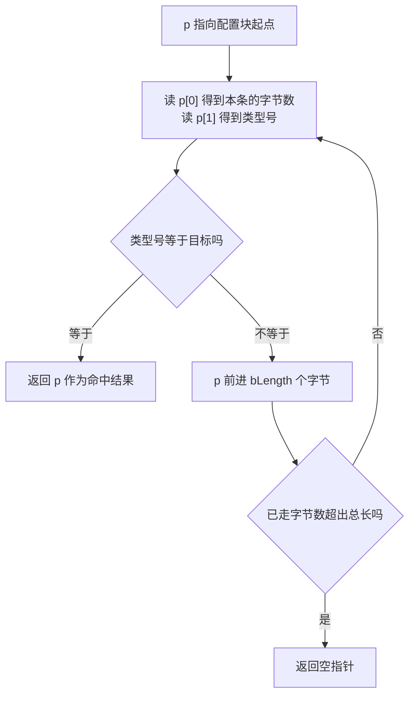
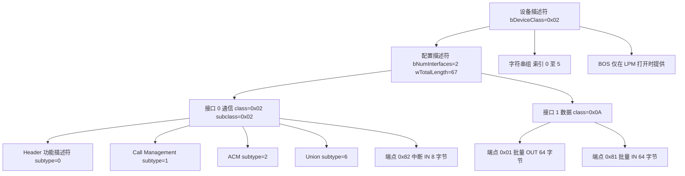
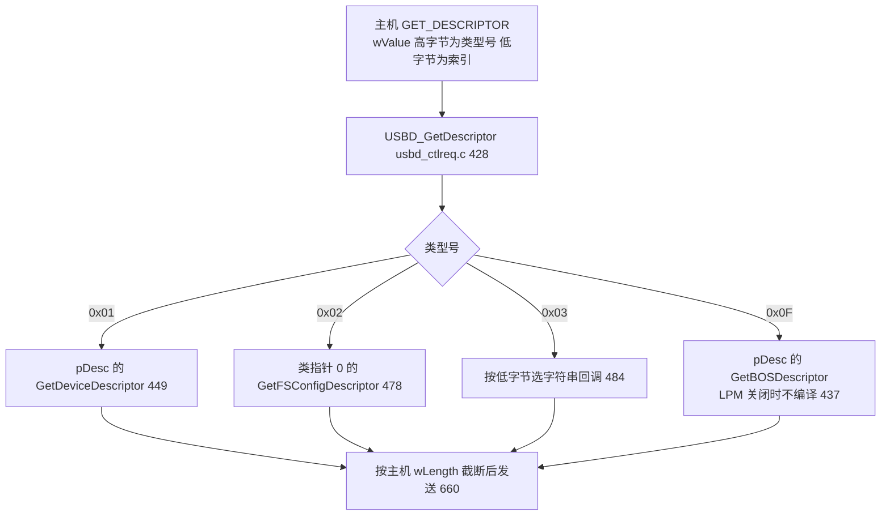

# USB 描述符体系

主机在设备刚接上总线时对设备一无所知。设备属于哪一类、有几份配置、每个接口能做什么、端点一次能传多少字节、厂商与产品名怎么写，这些信息没有一条写在总线的电气层里，全部由设备侧提供一串只读结构，主机按固定格式逐条读走，这串结构就是描述符。它与枚举的关系类似寄存器手册与初始化代码：描述符是设备对自己的声明，枚举是主机据此建立档案的过程。

本工程的 USB 设备栈是 ST 的 USB Device Library，工作在 CDC 类。设备侧描述符分散在两处：设备描述符与字符串回调在 `USB_DEVICE/App/usbd_desc.c`，配置、接口、功能与端点描述符在 CDC 类驱动 `Middlewares/ST/STM32_USB_Device_Library/Class/CDC/Src/usbd_cdc.c`。把这两处读通，就能回答主机在枚举的每一步向设备要了什么。

本页先说明描述符的公共头部与遍历方式，再展开设备、配置、接口、端点四级树，对照类型号表，然后落到本工程 CDC 描述符树的实际字节数与字符串索引，最后给出库按类型号分派请求的路径。同单元的《设备描述符与 VID-PID》逐字段拆 18 字节设备描述符，《配置与接口描述符》拆 67 字节配置块，《枚举流程》讲这些描述符在什么时序下被请求，本页负责提供它们共用的层级与类型号口径。

> 源码索引

| 文件 | 作用 |
| --- | --- |
| `USB_DEVICE/App/usbd_desc.c` | 设备描述符数组、字符串回调表、序列号生成 |
| `USB_DEVICE/App/usbd_desc.h` | 序列号长度与 UID 宏 |
| `USB_DEVICE/Target/usbd_conf.h` | 字符串缓冲大小、配置数、LPM 开关 |
| `Middlewares/ST/STM32_USB_Device_Library/Core/Inc/usbd_def.h` | 描述符类型号、字符串索引、状态常量 |
| `Middlewares/ST/STM32_USB_Device_Library/Core/Src/usbd_ctlreq.c` | `USBD_GetDescriptor` 的类型号分派 |
| `Middlewares/ST/STM32_USB_Device_Library/Core/Src/usbd_core.c` | `USBD_GetNextDesc` 的线性遍历 |
| `.../Class/CDC/Src/usbd_cdc.c` | CDC 配置描述符整块与类回调 |
| `.../Class/CDC/Inc/usbd_cdc.h` | 端点地址、包长与间隔宏 |

## 主机靠一条可遍历的字节链认识设备

描述符的公共头部只有两个字节。第一个字节 `bLength` 给出本描述符的总字节数，第二个字节 `bDescriptorType` 给出类型号。把长度放在最前面是一个遍历约定：接收方拿到一块缓冲后，读一个描述符、按 `bLength` 前进到下一条、再读下一条，直到走满整块缓冲。没有这个约定，接收方必须提前知道每种描述符的长度才能切分，而配置块里混着接口、功能与端点，长度各不相同。

库里的 `USBD_GetNextDesc()` 就是这个走法（`usbd_core.c`）。它接收当前描述符指针与一个指向目标类型号的指针，循环条件是当前偏移还没有到缓冲末尾：若当前描述符的类型号等于目标，返回当前指针；否则把指针加上 `p[0]`，也就是加上本描述符自己声明的长度。整个函数不校验 `bLength` 是否为零，缓冲里若写出一处长度为 0 的描述符，指针就不再前进，循环会一直停在同一条上。描述符数组是手写的常量，这个风险由写数组的人承担。

遍历的另一个后果是顺序有意义。配置块内描述符的先后必须与实际布局一致，主机只按字节流解析，不会按类型号重新排序。接口描述符之后紧跟的端点描述符，按 USB 规范属于该接口；类功能描述符必须紧跟它所属的接口，否则主机会把它算到上一个接口名下。

以本工程 67 字节的配置块为例，从配置头出发依次是接口 0 描述符、四个 CDC 功能描述符、一条中断端点、接口 1 描述符、两条批量端点。要定位中断端点，遍历会在类型号 0x05 处停下；要定位接口 1，遍历在类型号 0x04 且接口号为 1 处停下。同一套循环服务所有查找。

## 设备、配置、接口、端点构成的四级树

USB 描述符按树形组织。设备描述符是根，它下面的每个配置是一棵子树，配置下面是接口，接口下面是端点。字符串描述符不挂在这棵树上，而是单独成组，由设备、配置、接口里各自的索引字段指向。BOS 与设备限定符同样独立于四级树，前者报告规范之外的能力，后者描述设备在另一速度下的外形。

每一层回答一个不同的问题，字段也各管一段，整理如下。

| 层 | 回答的问题 | 关键字段 |
| --- | --- | --- |
| 设备 | 整体是什么设备、按什么协议通信 | `bcdUSB` `bDeviceClass` `idVendor` `idProduct` `bMaxPacketSize0` |
| 配置 | 这一套配置包含几个接口、耗电多少 | `wTotalLength` `bNumInterfaces` `bmAttributes` `bMaxPower` |
| 接口 | 一组完成同一功能的端点，属于哪一类 | `bInterfaceNumber` `bInterfaceClass` `bNumEndpoints` |
| 端点 | 数据从哪个方向、用什么传输类型、多大包 | `bEndpointAddress` `bmAttributes` `wMaxPacketSize` `bInterval` |
| 字符串 | 厂商、产品、序列号的可读名称 | 索引与 UTF-16LE 内容 |
| BOS | 设备支持哪些超出基础规范的扩展能力 | 设备能力与 LPM 位 |

层级里的数量关系是：一个设备可以有多个配置，同一时刻只有一份生效；一份配置里的接口数量写在 `bNumInterfaces`；每个接口的端点数写在它的 `bNumEndpoints`，端点 0 不计入任何接口，它由库在复位时单独打开。

## 类型号决定主机与库走哪条分派

类型号定义在 `usbd_def.h`，是描述符第二字节的取值空间，也是 `GET_DESCRIPTOR` 请求里 `wValue` 高字节的取值空间。两者共用同一套编号，主机请求与设备返回才能对上。

| 类型号 | 宏 | 对应描述符 |
| --- | --- | --- |
| 0x01 | `USB_DESC_TYPE_DEVICE` | 设备描述符 |
| 0x02 | `USB_DESC_TYPE_CONFIGURATION` | 配置描述符 |
| 0x03 | `USB_DESC_TYPE_STRING` | 字符串描述符 |
| 0x04 | `USB_DESC_TYPE_INTERFACE` | 接口描述符 |
| 0x05 | `USB_DESC_TYPE_ENDPOINT` | 端点描述符 |
| 0x06 | `USB_DESC_TYPE_DEVICE_QUALIFIER` | 设备限定符 |
| 0x0B | `USB_DESC_TYPE_IAD` | 接口关联描述符 |
| 0x0F | `USB_DESC_TYPE_BOS` | BOS 描述符 |

这张表只覆盖通用描述符。CDC 类自己的功能描述符用的是另一套编号：类型号固定为 `CS_INTERFACE` 即 0x24，区分靠紧随其后的 `bDescriptorSubtype`。两套编号不共享空间，0x24 不会出现在 `GET_DESCRIPTOR` 的 `wValue` 里，主机也不会主动请求它，它是配置块内部的结构。

## 每一类描述符在枚举里提供什么

### 设备描述符固定 18 字节

设备描述符是主机读到的第一个描述符，长度固定，字段与偏移在《设备描述符与 VID-PID》里逐项列出。它给出 `bMaxPacketSize0`，主机据此决定端点 0 一次能读多少字节，随后读完整 18 字节，用 `idVendor` 与 `idProduct` 匹配驱动，用 `bNumConfigurations` 知道后面还有几份配置要读。

### 配置描述符是一块 9 字节的头加后续内容

配置描述符本身 9 字节，后面紧跟该配置下所有接口、功能与端点描述符。`wTotalLength` 给出这一整块的字节数，主机因此可以用一次控制传输取回全部内容。本工程的整块长度是 67 字节（`usbd_cdc.c`），其中配置头 9 字节，其余为接口、功能与端点。一个设备可以有多份配置，`bConfigurationValue` 是主机在 `SET_CONFIGURATION` 里回填的编号，本工程只有一份，值为 1。

### 接口描述符把端点按功能分组

接口把端点分组。CDC 设备定义两个接口：通信接口负责命令与状态，数据接口负责载荷。`bInterfaceNumber` 是接口编号，`bNumEndpoints` 是本接口独占的端点数。通信接口后面还跟随四个类功能描述符，它们是接口的一部分，不单独占接口号。

### 端点描述符给出通信的物理入口

端点描述符给出通信的物理入口。`bEndpointAddress` 的最高位是方向，1 表示 IN，0 表示 OUT，低四位是端点号。`bmAttributes` 低两位给出传输类型，0 控制、1 同步、2 批量、3 中断。`wMaxPacketSize` 是全速下一次事务的最大字节数，全速批量端点上限 64。`bInterval` 只对中断与同步端点有意义，全速下单位是帧，一帧 1 ms。

### 字符串描述符用 UTF-16LE 编码

字符串描述符用 UTF-16LE 编码，每个字符占两字节，因此描述符长度是偶数。索引 0 是固定的语言 ID 描述符，内容是 LANGID 列表，主机会先取它再决定用哪种语言去取其余字符串。设备描述符的 `iManufacturer` `iProduct` `iSerialNumber` 三个索引指向其余字符串，取值来自 `usbd_def.h`。

### BOS 与设备限定符只服务特定场景

BOS 描述符用于报告超出基础规范的能力，LPM 是其中一项，全速设备通常不需要。设备限定符描述设备在另一速度下的能力，只在高速设备上有意义。本工程的 CDC 类提供了设备限定符（`usbd_cdc.c`、`usbd_cdc.c`），全速下库不会向主机返回它（`usbd_ctlreq.c`），所以主机看不到这一条。BOS 的编译与否由 `USBD_LPM_ENABLED` 决定，本工程该开关为 0（`usbd_conf.h`），数组中不提供 BOS。

## 本工程 CDC 描述符树的实际形状

### 设备与字符串描述符在 usbd_desc.c

设备描述符数组在 `usbd_desc.c`，长度 18 字节。字符串由一组回调函数按索引返回，回调表在 `usbd_desc.c`，即 `FS_Desc`。回调与索引的对应关系如下。

| 索引 | 回调 | 返回内容 | 位置 |
| --- | --- | --- | --- |
| 0 | `USBD_FS_LangIDStrDescriptor` | 语言 ID 1033 | `usbd_desc.c` |
| 1 | `USBD_FS_ManufacturerStrDescriptor` | STMicroelectronics | `usbd_desc.c` |
| 2 | `USBD_FS_ProductStrDescriptor` | STM32 Virtual ComPort | `usbd_desc.c` |
| 3 | `USBD_FS_SerialStrDescriptor` | 芯片 UID 转出的序列号 | `usbd_desc.c` |
| 4 | `USBD_FS_ConfigStrDescriptor` | CDC Config | `usbd_desc.c` |
| 5 | `USBD_FS_InterfaceStrDescriptor` | CDC Interface | `usbd_desc.c` |

字符串回调共用一个缓冲 `USBD_StrDesc`，大小由 `USBD_MAX_STR_DESC_SIZ` 决定，为 512 字节（`usbd_desc.c`、`usbd_conf.h`）。序列号不共享这个缓冲，它有一个 0x1A 字节的独立数组（`usbd_desc.h`、`usbd_desc.c`），内容由 `Get_SerialNum()` 从三个 UID 寄存器拼出（`usbd_desc.c`）。

### 配置、功能与端点在 usbd_cdc.c

CDC 的配置描述符数组 `USBD_CDC_CfgDesc` 在 `usbd_cdc.c`，总长 67 字节，由类驱动通过 `USBD_CDC_GetFSCfgDesc()` 返回（`usbd_cdc.c`）。`wTotalLength` 与数组长度共用同一个宏 `USB_CDC_CONFIG_DESC_SIZ`（`usbd_cdc.h`），数组声明与长度声明出自同一处，不会各写一套。

## 库按 wValue 分派请求

主机用 `GET_DESCRIPTOR` 请求描述符，`wValue` 的高字节是类型号，低字节是索引。库在 `USBD_GetDescriptor()` 里按类型号分派（`usbd_ctlreq.c`）：设备描述符来自 `pdev->pDesc` 指向的描述符表，配置描述符来自已注册的类，字符串描述符按低字节在回调表里选函数，BOS 在编译开关关闭时不参与。

取到缓冲与长度后，库按主机请求的 `wLength` 截断再发送（`usbd_ctlreq.c`）。设备描述符数组始终保持 18 字节，主机先要 8 字节时截断由库完成，设备侧不需要另一份 8 字节数组。分派按类型号而不是按长度，所以同一类型号的描述符无论主机要多少字节都走同一条路径。

## 描述符写法上的易错点

### 把配置描述符当成 9 字节

请求配置时设备返回的是 `wTotalLength` 指定的整块，主机一次拿到配置头、接口、功能与端点全部内容。只看 9 字节配置头会漏掉接口与端点，用工具解析时容易把接口描述符当成配置块的垃圾数据。

### 字符串索引指向了没人实现的回调

设备描述符里的索引只是编号。库拿着编号去回调表里取函数，取不到就返回错误并让端点 0 停机（`usbd_ctlreq.c`）。索引与回调必须成套出现，改索引时先确认表里有对应项。反过来，定义了回调却没有字段指向它，这个字符串永远不会被主机请求，本工程的索引 4 与 5 就处于这种状态，见《配置与接口描述符》。

### 类型号与类功能子类型号混用

通用描述符用 `usbd_def.h` 里的类型号，值域到 0x0F。CDC 功能描述符的类型号固定为 0x24，子类型号另有 0x00 至 0x06 一套。写配置块时把两者填错，主机解析出的接口与端点会整体错位。

### 丢掉描述符数组的对齐声明

描述符数组用 `__ALIGN_BEGIN` 与 `__ALIGN_END` 包裹，库会把这些数组强制转换为结构体视图来访问字段。去掉对齐声明后，在某些编译器与优化级别上会生成非对齐访问，Cortex-M4 对非对齐的多字节访问支持有限。改动数组内容时保留这两对宏。

## 小结

### 核心概念

- 描述符由设备单方面提供，公共头部为 `bLength` 与 `bDescriptorType`，接收方按长度逐条前进。
- 层级为设备、配置、接口、端点四级，字符串独立成组并按索引引用，BOS 与设备限定符独立于四级树。
- 配置描述符是一整块，`wTotalLength` 给出总长，接口、功能与端点依次跟随，顺序不能重排。
- 端点地址最高位是方向位，低四位是端点号；传输类型由 `bmAttributes` 低两位给出。
- 通用描述符类型号到 0x0F，CDC 功能描述符统一用 0x24 加子类型号区分。
- 库按 `wValue` 高字节选描述符类型，按低字节选字符串索引，取到后按 `wLength` 截断发送。

### 设计权衡

| 决策 | 好处 | 代价 |
| --- | --- | --- |
| 配置描述符整块一次返回 | 主机一次控制传输拿全，枚举快 | `wTotalLength` 与实际字节数必须手写一致，改端点要同步两处 |
| 字符串按索引动态生成 | 序列号可读芯片 UID，无需烧录 | 每次请求都要重算，共用一个 512 字节缓冲 |
| 功能描述符跟随接口而不占接口号 | 主机按接口统一管理类别 | 类描述符解析依赖它紧跟接口，位置写错会错位 |
| BOS 由编译开关控制 | 不需要 LPM 时省掉一段代码 | 开关同时改变 `bcdUSB`，开关两侧行为不同 |
| 描述符数组用对齐声明 | 库可安全地做结构体视图 | 数组长度与结构体布局要一致 |

## 练习

### 基础题

1. 列出本工程配置描述符整块的字节数，并说明该值写在哪个字段里。
2. 数出 `usbd_cdc.c` 里一共有几个描述符，各是什么类型。
3. 说明端点地址 0x81 与 0x01 的差别，以及库用哪个掩码取端点号。

### 挑战题

4. 新增一个 CDC 之外的自定义接口，写出它在配置描述符里需要追加的字节，并指出 `wTotalLength` 与 `bNumInterfaces` 应如何改。
5. 设计一个带两个配置的设备，说明 `bConfigurationValue`、`bNumConfigurations` 与 `USBD_MAX_NUM_CONFIGURATION` 三者的关系。
6. 若某个描述符的 `bLength` 被误写成 0，说明 `USBD_GetNextDesc()` 的循环行为，以及在主机侧会观察到什么现象。

## 附：本页引用的固件路径

| 路径 | 用途 |
| --- | --- |
| USB_DEVICE/App/usbd_desc.c | 设备描述符、回调表、字符串回调、序列号 |
| USB_DEVICE/App/usbd_desc.h | 序列号长度 0x1A |
| USB_DEVICE/Target/usbd_conf.h | `USBD_MAX_STR_DESC_SIZ`、`USBD_LPM_ENABLED` |
| Middlewares/ST/STM32_USB_Device_Library/Core/Inc/usbd_def.h | 类型号、字符串索引 |
| Middlewares/ST/STM32_USB_Device_Library/Core/Src/usbd_ctlreq.c | `USBD_GetDescriptor`、设备限定符返回条件 |
| Middlewares/ST/STM32_USB_Device_Library/Core/Src/usbd_core.c | `USBD_GetNextDesc` |
| Middlewares/ST/STM32_USB_Device_Library/Class/CDC/Src/usbd_cdc.c | CDC 配置描述符、`USBD_CDC_GetFSCfgDesc`、设备限定符 |
| Middlewares/ST/STM32_USB_Device_Library/Class/CDC/Inc/usbd_cdc.h | 端点与包长宏 |
