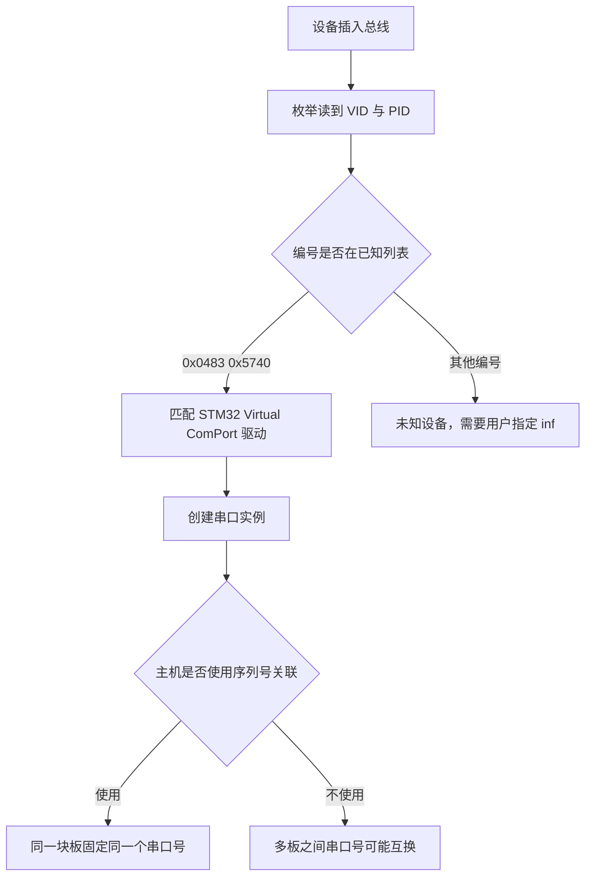

# 设备描述符与 VID-PID

设备描述符是主机在枚举开始时读到的第一份结构，长度固定 18 字节，位置固定在描述符数组的最前面。它要回答的问题很少但都很硬：设备按哪一版 USB 规范通信、端点 0 一次能收发多少字节、用什么厂商与产品编号去匹配驱动。其余信息由它内部的索引和后续的配置描述符补充，所以 18 字节写错任何一个字段，后面几步都会受影响。

本工程这一份是 CubeMX 生成 CDC 工程后的默认值，没有做项目化定制。VID 与 PID 仍取 ST 的 0x0483 与 0x5740，字符串索引指向 ST 提供的回调，设备与产品名也保持出厂文本。这一组取值能正常工作，但会带来设备识别上的限制。

本页按偏移逐字段拆开 `usbd_desc.c:155-181` 的数组，核对每一处的宏来源，然后单独说明 VID 与 PID 与主机驱动的对应关系，以及沿用一个不属于本项目的编号会造成什么结果。所有数值都可以在仓库里比对，推断的部分会单独标注。

> 源码索引

| 路径 | 作用 |
| --- | --- |
| `USB_DEVICE/App/usbd_desc.c` | 设备描述符数组、VID 与 PID 宏、字符串回调 |
| `USB_DEVICE/App/usbd_desc.h` | UID 寄存器宏、序列号数组长度 |
| `USB_DEVICE/Target/usbd_conf.h` | 配置数量与 LPM 开关 |
| `.../Core/Inc/usbd_def.h` | `USB_MAX_EP0_SIZE`、字符串索引宏 |
| `.../Core/Src/usbd_ctlreq.c` | `USBD_GetDescriptor` 取设备描述符、`USBD_SetConfig` 上限判断 |
| `.../Core/Src/usbd_core.c` | 总线复位时按 `USB_MAX_EP0_SIZE` 打开端点 0 |

## 主机为什么先读 8 字节再读 18 字节

设备描述符是主机在枚举开始时读取的第一份描述符，长度固定 18 字节。主机通常分两次读它。第一次只请求前 8 字节，因为此时主机还不知道设备的端点 0 包长，只能用保守的方式试探；第 8 个字节恰好是 `bMaxPacketSize0`，主机拿到它之后按这个包长重新发起一次请求，取回完整 18 字节。

库对两次请求的处理相同，都是按主机给出的 `wLength` 截断后发送（`usbd_ctlreq.c:656-671`）。设备侧只有一份 18 字节数组，主机要多少字节就发多少，不需要为试探请求准备第二份数据。这一点在后文的易错点里还会用到：8 字节与 18 字节不是两条路径。

## 逐偏移拆开这 18 个字节

本工程的设备描述符数组在 `usbd_desc.c:155-181`。按偏移整理如下，数值列取自数组内容与相关宏。

| 偏移 | 字段 | 本工程取值 | 含义 |
| --- | --- | --- | --- |
| 0 | `bLength` | 0x12 | 描述符长度 18 |
| 1 | `bDescriptorType` | 0x01 | 设备描述符 |
| 2 | `bcdUSB` 低字节 | 0x00 | USB 版本 0x0200 |
| 3 | `bcdUSB` 高字节 | 0x02 | 与低字节合成 0x0200 |
| 4 | `bDeviceClass` | 0x02 | 设备级类别为 CDC |
| 5 | `bDeviceSubClass` | 0x02 | 抽象控制模型 |
| 6 | `bDeviceProtocol` | 0x00 | 无协议 |
| 7 | `bMaxPacketSize0` | 64 | 端点 0 包长 |
| 8 | `idVendor` 低字节 | 0x83 | 厂商编号 0x0483 |
| 9 | `idVendor` 高字节 | 0x04 | 与低字节合成 0x0483 |
| 10 | `idProduct` 低字节 | 0x40 | 产品编号 0x5740 |
| 11 | `idProduct` 高字节 | 0x57 | 与低字节合成 0x5740 |
| 12 | `bcdDevice` 低字节 | 0x00 | 设备版本 0x0200 |
| 13 | `bcdDevice` 高字节 | 0x02 | 与低字节合成 0x0200 |
| 14 | `iManufacturer` | 1 | 厂商字符串索引 |
| 15 | `iProduct` | 2 | 产品字符串索引 |
| 16 | `iSerialNumber` | 3 | 序列号字符串索引 |
| 17 | `bNumConfigurations` | 1 | 配置数量 |

多字节字段统一按小端存放，低字节在前。读数组时按出现顺序把低位字节放前面，不能按人眼顺序直接拼。0x00 在前、0x02 在后合成的是 0x0200，不是 0x0002。下面按数组顺序画出 18 个字节的排列。

### bcdUSB 用 BCD 编码表示规范版本

`bcdUSB` 表示设备支持的 USB 规范版本，编码为 BCD，即每个十六进制位对应一个十进制位。0x0200 读作 2.00，对应 USB 2.00；0x0201 读作 2.01，对应 USB 2.01。本工程非 LPM 分支写入 0x00 与 0x02 两个字节，合成 0x0200（`usbd_desc.c:163-166`）。

当 `USBD_LPM_ENABLED` 为 1 时，数组改走另一分支，字节变为 0x01 与 0x02，合成 0x0201，用来声明支持 LPM 的 L1 挂起恢复。本工程该宏为 0（`usbd_conf.h:74`），因此设备对外声明 0x0200。同一个开关还决定 BOS 描述符是否编译（`usbd_desc.c:185-205`），只改一处会让声明与实现不一致。

### 设备级类别的三个字段

`bDeviceClass` `bDeviceSubClass` `bDeviceProtocol` 描述设备级类别，依次占偏移 4、5、6。本工程取 0x02 / 0x02 / 0x00：0x02 表示通信设备类，子类 0x02 表示抽象控制模型，协议字段为 0。

设备级类别填 CDC 是一种做法，另一种做法是把设备级类别填 0x00，交给接口描述符各自声明类别。本工程的配置描述符里两个接口也各自带了类别，因此设备级这一组即使改成 0x00，通信功能仍由接口级声明承担，设备仍会被识别成虚拟串口。当前取值是 CubeMX 生成 CDC 工程的默认写法，改动它属于可选优化，不影响功能。

### bMaxPacketSize0 决定端点 0 一次能读多少

`bMaxPacketSize0` 是端点 0 的最大包长，本工程填 `USB_MAX_EP0_SIZE`，该宏在 `usbd_def.h:157` 定义为 64。库在总线复位时打开端点 0 用的也是同一个宏（`usbd_core.c:825`、`usbd_core.c:831`），描述符里的声明与控制器里的实际配置来自同一处，不会漂移。

全速设备的端点 0 包长只能取 8、16、32 或 64。主机在拿到这个值之前只能用最大包长试探，这也是它先读 8 字节的原因。这个字段只约束端点 0，与数据端点的包长无关，后者写在端点描述符里。

### idVendor 与 idProduct 是两个 16 位编号

`idVendor` 与 `idProduct` 占偏移 8 到 11 四个字节。本工程的宏在 `usbd_desc.c:65` 与 `usbd_desc.c:68`：

| 宏 | 十进制 | 十六进制 | 归属 |
| --- | --- | --- | --- |
| `USBD_VID` | 1155 | 0x0483 | STMicroelectronics |
| `USBD_PID_FS` | 22336 | 0x5740 | STM32 Virtual ComPort 示例 |

描述符数组用 `LOBYTE` 与 `HIBYTE` 把两个宏拆成两个字节（`usbd_desc.c:171-174`）。宏写的是十进制，十六进制值只在注释与主机侧工具里出现，核对时用 1155 与 22336 去搜源码更直接。

### bcdDevice 是固件版本而不是规范版本

`bcdDevice` 是设备自身的版本号，与 `bcdUSB` 无关，两者在同一份数组里相邻，容易看混。本工程写 0x00 与 0x02，合成 0x0200，注释标为 rel. 2.00（`usbd_desc.c:175-176`）。主机与驱动可以用它区分同一 VID 与 PID 下的不同固件版本，本工程没有利用这个能力，改版本号不影响枚举。

### 三个字符串索引指向回调而不是文本

`iManufacturer` `iProduct` `iSerialNumber` 取 `usbd_def.h:102-107` 的宏：

| 字段 | 宏 | 值 | 对应回调 |
| --- | --- | --- | --- |
| `iManufacturer` | `USBD_IDX_MFC_STR` | 1 | `USBD_FS_ManufacturerStrDescriptor` |
| `iProduct` | `USBD_IDX_PRODUCT_STR` | 2 | `USBD_FS_ProductStrDescriptor` |
| `iSerialNumber` | `USBD_IDX_SERIAL_STR` | 3 | `USBD_FS_SerialStrDescriptor` |

索引 0 留给语言 ID 描述符，主机会先取它。索引值本身没有内容，返回文本的是回调函数。序列号的内容不是常量，`Get_SerialNum()` 每次请求时从 `UID_BASE` 处的三个 32 位寄存器读出并转成十六进制文本（`usbd_desc.c:388-405`、`usbd_desc.h:48-50`）。同一颗芯片的 UID 固定，序列号在设备复位与重新插拔后保持稳定。

### bNumConfigurations 与配置上限引用同一个宏

`bNumConfigurations` 填 `USBD_MAX_NUM_CONFIGURATION`，值为 1（`usbd_desc.c:180`、`usbd_conf.h:68`）。同一个宏还被 `USBD_SetConfig()` 用作配置编号的上限判断（`usbd_ctlreq.c:730`），描述符里声明的数量与请求处理里能接受的编号出自同一个常量，两边不会漂移。当前只有一份配置，`SET_CONFIGURATION` 只接受值 1。

## 宏与数组分别写在哪里

设备描述符里的数值不是散落在数组里的字面量，每一处都能追到一个宏或一段代码。核对时按下表定位：

| 项 | 位置 | 值 |
| --- | --- | --- |
| `USBD_VID` | `usbd_desc.c:65` | 1155 |
| `USBD_PID_FS` | `usbd_desc.c:68` | 22336 |
| `USBD_MANUFACTURER_STRING` | `usbd_desc.c:67` | STMicroelectronics |
| `USBD_PRODUCT_STRING_FS` | `usbd_desc.c:69` | STM32 Virtual ComPort |
| 设备描述符数组 | `usbd_desc.c:155-181` | 18 字节 |
| 设备描述符回调 | `usbd_desc.c:258-263` | 返回数组与长度 |

设备描述符数组与字符串宏分处同一文件的不同段落，宏定义集中在文件开头，数组在中段，回调在文件末尾。主机在地址分配前后各读一次设备描述符，库的入口是 `USBD_GetDescriptor()`（`usbd_ctlreq.c:428-672`），类型号 0x01 分支调用 `pdev->pDesc->GetDeviceDescriptor`（`usbd_ctlreq.c:449-451`），也就是 `USBD_FS_DeviceDescriptor()`。完整往返见本单元《枚举流程》。

## VID 与 PID 如何与主机驱动对应

主机拿 `idVendor` 与 `idProduct` 匹配驱动。厂商编号由 USB-IF 分配，产品编号由厂商自行分配。操作系统与驱动库通常按这两个编号识别设备类别，再决定加载哪个驱动。CDC 的通信能力写在接口描述符里，但设备能不能被自动识别，第一步就取决于这两个编号是否落在已知列表里。

本工程沿用 ST 默认组合，没有改成项目自己的编号。由此产生的后果如下，这几条属推断，不在源码中直接体现。

1. 同一台主机插入两块本工程的板，设备管理器里会出现两个同名 STM32 Virtual ComPort 实例，仅凭名称无法区分。序列号来自 UID，编号本身不同，主机若按序列号关联，两块板的串口号各自稳定。
2. 主机或驱动若只按 VID 与 PID 建立设备与串口号的映射，重新插拔后两块板的串口号可能互换，上位机按固定串口名打开时会连错板。
3. 0x0483 属于 STMicroelectronics，0x5740 对应其虚拟串口示例。把这两个值用于对外发布的产品，在 USB-IF 规则下不属于自己的编号，正式产品需要自备 VID 与 PID。

第一条与第三条依赖主机与 USB-IF 的行为，第二条依赖具体驱动的映射策略，均属推断，落地前应在目标主机上实测。

## 这个文件里几个容易读错的字段

### 忽略小端字节序

数组里 0x00 在前、0x02 在后，合成的是 0x0200。若按顺序读成 0x0002，会把 USB 2.00 误判为 0.02，进而去查一个不存在的规范版本。VID 与 PID 同理，0x83 0x04 是 0x0483。

### 改了宏却忘了数组里的字节拆分

`idVendor` 与 `idProduct` 在数组里通过 `LOBYTE` 与 `HIBYTE` 展开。直接改数组里的字节而不改宏，或者只改宏而漏掉某一份数组，都会让设备对外编号与预期不一致。`bMaxPacketSize0` 与 `bNumConfigurations` 也各有宏来源，改动前先确认宏定义位置。

### bcdUSB 与 bcdDevice 混用

两个字段都写成 0x0200，但含义不同。前者是 USB 规范版本，后者是设备固件版本。排查驱动兼容问题时先看的是 `bcdUSB`，它决定主机按哪版规范与设备交互。

### 以为 bMaxPacketSize0 与数据端点包长相同

`bMaxPacketSize0` 只约束端点 0。数据端点的包长写在端点描述符里，本工程为 64，两者数值相同但来源不同，改一个不会影响另一个。

### LPM 开关牵动两处编译分支

`USBD_LPM_ENABLED` 同时改变 `bcdUSB` 与 BOS 描述符。只开 BOS 不改 `bcdUSB`，或者反过来，都会让设备声明与实现不一致。

## 小结

### 核心概念

- 设备描述符固定 18 字节，是主机枚举时读到的第一个描述符，主机分 8 字节与 18 字节两次读取。
- 多字节字段小端存放，`bcdUSB` 的 0x00 与 0x02 合成 0x0200。
- `bDeviceClass` 取 0x02 表示设备级类别为 CDC；设备级与接口级可以各自声明类别。
- `bMaxPacketSize0` 取 `USB_MAX_EP0_SIZE` 64，与库打开端点 0 时用的宏一致。
- VID 0x0483 与 PID 0x5740 是 ST 的虚拟串口默认组合，本工程未定制。
- 三个字符串索引 1、2、3 分别指向厂商、产品、序列号回调，序列号由芯片 UID 生成。
- `bNumConfigurations` 与 `USBD_SetConfig()` 的编号上限共用 `USBD_MAX_NUM_CONFIGURATION`。

### 设计权衡

| 决策 | 好处 | 代价 |
| --- | --- | --- |
| 沿用 ST 默认 VID 与 PID | 免申请编号，操作系统自带驱动即可识别 | 同一主机多板同名，属推断的串口互换风险 |
| 序列号动态取自 UID | 不占用固件常量，编号唯一且稳定 | 每次请求都要读寄存器并转换 |
| 设备级类别取 0x02 | 与 ST 生成的 CDC 工程一致 | 与接口级类别重复声明，改类别要改两处 |
| `bMaxPacketSize0` 用统一宏 | 描述符与端点打开两处不会漂移 | 包长改动影响端点 0 与所有描述符引用方 |
| 不改 `bcdDevice` | 与出厂固件版本保持一致 | 无法用版本号区分同一 VID 与 PID 下的不同固件 |

## 练习

### 基础题

1. 写出本工程设备描述符 18 个字节的取值，并标出哪些字段是多字节小端。
2. 说明 `bcdUSB` 与 `bcdDevice` 的区别，各自由哪个宏控制。
3. 列出三个字符串索引的数值与对应回调函数名。

### 挑战题

4. 把 VID 与 PID 改成一套自定义编号，列出需要修改的所有位置，并说明主机侧驱动会发生什么变化。
5. `USBD_LPM_ENABLED` 由 0 改为 1 时，设备描述符与 BOS 描述符各发生哪些变化，主机看到的 `bcdUSB` 变成多少。
6. 主机在一次枚举中先请求 8 字节、后请求 18 字节设备描述符，说明设备侧两次各返回多少个字节，以及截断发生在哪个函数里。

## 附：本页引用的固件路径

| 路径 | 用途 |
| --- | --- |
| /home/wyx/rm/2026SentriOmeniGimbal/2026OmniSentryGimbal/USB_DEVICE/App/usbd_desc.c | 宏定义（:65-71）、设备描述符数组（:155-181）、BOS（:185-205）、回调（:258-263）、序列号（:388-405） |
| /home/wyx/rm/2026SentriOmeniGimbal/2026OmniSentryGimbal/USB_DEVICE/App/usbd_desc.h | `DEVICE_ID1` 至 `DEVICE_ID3`（:48-50）、序列号长度（:52） |
| /home/wyx/rm/2026SentriOmeniGimbal/2026OmniSentryGimbal/USB_DEVICE/Target/usbd_conf.h | `USBD_MAX_NUM_CONFIGURATION`（:68）、`USBD_LPM_ENABLED`（:74） |
| /home/wyx/rm/2026SentriOmeniGimbal/2026OmniSentryGimbal/Middlewares/ST/STM32_USB_Device_Library/Core/Inc/usbd_def.h | `USBD_IDX_*`（:102-107）、`USB_MAX_EP0_SIZE`（:157） |
| /home/wyx/rm/2026SentriOmeniGimbal/2026OmniSentryGimbal/Middlewares/ST/STM32_USB_Device_Library/Core/Src/usbd_ctlreq.c | `USBD_GetDescriptor`（:428-672）、`USBD_SetConfig` 上限（:730） |
| /home/wyx/rm/2026SentriOmeniGimbal/2026OmniSentryGimbal/Middlewares/ST/STM32_USB_Device_Library/Core/Src/usbd_core.c | 端点 0 打开（:825、:831） |
