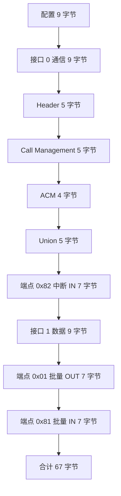
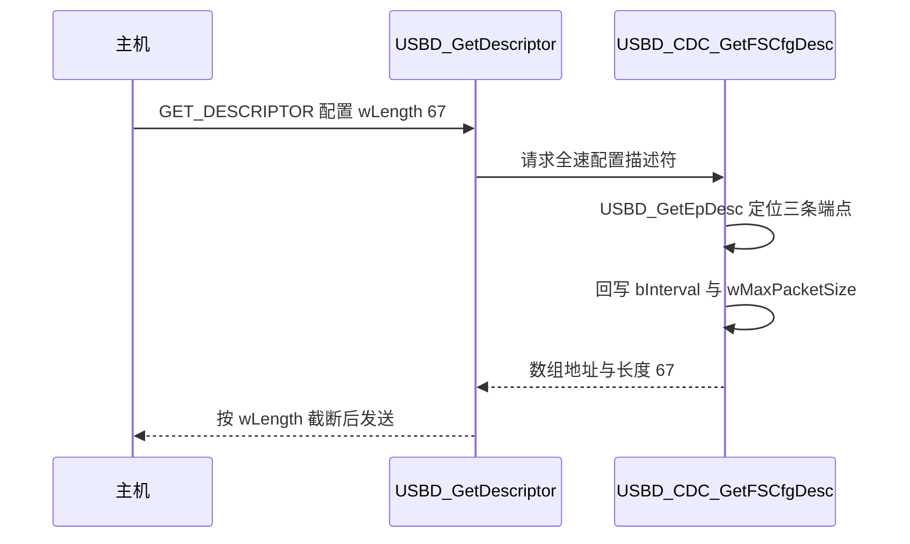
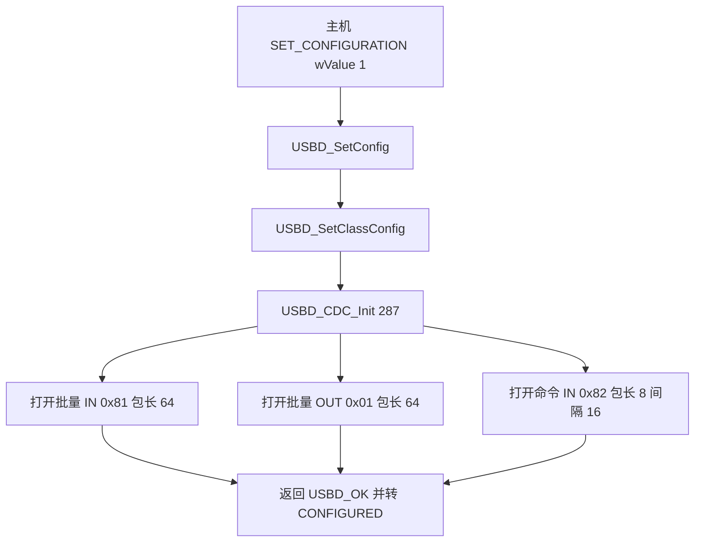

# 配置与接口描述符

配置描述符回答的是设备以哪种形态工作：它下面挂几个接口、耗电多少、这份配置编号是多少。接口描述符再往下分，每个接口代表一类功能，接口下面挂这个功能独占的端点。CDC 虚拟串口需要两个接口配合，一个管命令与状态，一个管载荷，两条链路合起来才是一条能用的串口。

本工程的这一整块共 67 字节，全部写在 CDC 类驱动 `usbd_cdc.c:168-265` 里，由 `USBD_CDC_GetFSCfgDesc()` 交给库。它同时是描述符与端点打开参数的来源：同一份数据既告诉主机端点长什么样，也决定设备侧 `USBD_CDC_Init()` 按什么参数打开端点。两端对不上时，大包传输先出问题。

本页按配置头、两个接口、四个功能描述符、三条端点的顺序走一遍字节布局，再说明主机取描述符时类驱动对数组做的运行期回写，最后列出这一块里几处已经确认的写法问题。整块长度与每一条的长度都能在源码里逐字节核对。

> 源码索引

| 路径 | 作用 |
| --- | --- |
| `.../Class/CDC/Src/usbd_cdc.c` | 配置描述符数组、`USBD_CDC_Init`、`USBD_CDC_GetFSCfgDesc` |
| `.../Class/CDC/Inc/usbd_cdc.h` | 端点地址、包长与间隔宏、整块长度宏 |
| `.../Core/Src/usbd_core.c` | `USBD_GetEpDesc` 定位端点、`USBD_SetClassConfig` 调类 Init |
| `.../Core/Src/usbd_ctlreq.c` | 接口请求分发、`USBD_SetConfig` |
| `.../Core/Inc/usbd_def.h` | `USBD_MAX_POWER`、`USBD_SELF_POWERED` |
| `USB_DEVICE/Target/usbd_conf.h` | `USBD_MAX_NUM_INTERFACES`、`USBD_SELF_POWERED` |
| `USB_DEVICE/App/usbd_desc.c` | 配置与接口字符串定义与回调 |

## 配置头固定 9 字节，整块长度写在 wTotalLength

配置描述符本身固定 9 字节，后面紧跟该配置下所有接口、功能与端点描述符。主机读配置时拿到的是整块，它用第一个字节里的 `wTotalLength` 知道这块有多长，因此一次控制传输就能取全，不需要按类型逐条请求。本工程配置头取值如下（`usbd_cdc.c:170-184`）。

| 偏移 | 字段 | 取值 | 含义 |
| --- | --- | --- | --- |
| 0 | `bLength` | 0x09 | 配置描述符长度 |
| 1 | `bDescriptorType` | 0x02 | 配置描述符类型 |
| 2 | `wTotalLength` 低字节 | 67 | 整块总长 |
| 3 | `wTotalLength` 高字节 | 0x00 | 与低字节合成 67 |
| 4 | `bNumInterfaces` | 0x02 | 两个接口 |
| 5 | `bConfigurationValue` | 0x01 | 配置编号 1 |
| 6 | `iConfiguration` | 0x00 | 无配置字符串 |
| 7 | `bmAttributes` | 0xC0 | 自供电 |
| 8 | `bMaxPower` | 0x32 | 最大取电 100 mA |

`wTotalLength` 与数组长度共用同一个宏 `USB_CDC_CONFIG_DESC_SIZ`，值为 67（`usbd_cdc.h:69`、`usbd_cdc.c:168`、`usbd_cdc.c:173`）。数组多大，整块就声明多大，两边由同一个常量约束。追加任何描述符都要同时改这个宏，否则主机按旧总长解析，多出来的字节落在整块之外。

`bMaxPower` 的单位是 2 mA，0x32 等于十进制 50，即 100 mA。宏 `USBD_MAX_POWER` 在 `usbd_def.h:81-83` 定义为 0x32，注释写明 100 mA。这个数字与主机能否直接供电有关，取电声明小于实际电流时主机可能在枚举后限流。

`bmAttributes` 由 `USBD_SELF_POWERED` 决定（`usbd_cdc.c:179-183`）。该宏在 `usbd_conf.h:76` 为 1，走 `#if` 分支取 0xC0。0xC0 的二进制是 1100 0000，第 6 位为 1 表示自供电，第 5 位为 0 表示不支持远程唤醒。数组里两个分支的注释都写成 Bus Powered，与实际取值不符，以取值为准。

各段长度相加可以复核总长：9 加 9 加 5 加 5 加 4 加 5 加 7 加 9 加 7 加 7，等于 67。这个加法在任何一次改描述符后都应重做一遍，它可以提前发现漏改的 `wTotalLength`。

## 两个接口如何拼出一条虚拟串口

CDC 的通信与数据功能分成两个接口，因为规范规定命令链路与数据链路各自成组。通信接口负责枚举阶段的类请求、线路状态与通知，数据接口只负责载荷。两个接口靠 Union 功能描述符关联，主机据此把它们当成同一个功能，否则会出现两个互不相关的接口。

### 通信接口 0 承担命令与状态

接口编号 0，一个端点，类为通信设备（`usbd_cdc.c:189-198`）。

| 字段 | 取值 | 含义 |
| --- | --- | --- |
| `bInterfaceNumber` | 0x00 | 接口 0 |
| `bAlternateSetting` | 0x00 | 无备用设置 |
| `bNumEndpoints` | 0x01 | 一个中断 IN 端点 |
| `bInterfaceClass` | 0x02 | 通信接口类 |
| `bInterfaceSubClass` | 0x02 | 抽象控制模型 |
| `bInterfaceProtocol` | 0x01 | 常用 AT 命令 |
| `iInterface` | 0x00 | 无接口字符串 |

### 数据接口 1 承担载荷

接口编号 1，两个批量端点，类为 CDC 数据（`usbd_cdc.c:237-246`）。

| 字段 | 取值 | 含义 |
| --- | --- | --- |
| `bInterfaceNumber` | 0x01 | 接口 1 |
| `bAlternateSetting` | 0x00 | 无备用设置 |
| `bNumEndpoints` | 0x02 | 一进一出一对批量端点 |
| `bInterfaceClass` | 0x0A | CDC 数据接口类 |
| `bInterfaceSubClass` | 0x00 | 无子类 |
| `bInterfaceProtocol` | 0x00 | 无协议 |
| `iInterface` | 0x00 | 无接口字符串 |

两个接口的 `bAlternateSetting` 都是 0，说明没有备用设置。带备用设置的接口可以在同一接口号下切换不同的端点组合，本工程用不到这一层。`bNumEndpoints` 是本接口独占的端点数，端点 0 不在此列。

## 四个类功能描述符跟着通信接口走

通信接口后面跟着四个类功能描述符，类型号都是 `CS_INTERFACE` 即 0x24，用子类型区分（`usbd_cdc.c:200-225`）。它们不是通用描述符，主机只有按 CDC 规范解析才会认出它们；解析时它们按位置归属于紧邻的接口 0。

| 子类型 | 名称 | 长度 | 关键字段 |
| --- | --- | --- | --- |
| 0x00 | Header | 5 | `bcdCDC` 为 0x0110，CDC 规范 1.10 |
| 0x01 | Call Management | 5 | `bmCapabilities` 为 0，`bDataInterface` 为 1 |
| 0x02 | ACM | 4 | `bmCapabilities` 为 0x02 |
| 0x06 | Union | 5 | 主接口 0，从接口 1 |

Header 声明设备实现的 CDC 规范版本，主机据此决定按哪版规范解析。Call Management 描述呼叫管理能力，`bmCapabilities` 为 0 表示呼叫管理由主机负责，`bDataInterface` 为 1 指出数据接口编号。ACM 的 `bmCapabilities` 为 0x02，声明设备支持线路编码相关请求的组合，而这组请求在本工程固件里是空实现，详见本单元《易错点与调试》。Union 把接口 0 与接口 1 关联成一个功能。

## 三条端点的方向、类型与包长

端点描述符各 7 字节（`usbd_cdc.c:227-264`），依次跟在数据接口与通信接口之后。

| 地址 | 方向 | 类型 | 包长 | `bInterval` | 用途 |
| --- | --- | --- | --- | --- | --- |
| 0x82 | IN | 中断 | 8 | 0x10 | 命令与通知 |
| 0x01 | OUT | 批量 | 64 | 0x00 | 主机到设备载荷 |
| 0x81 | IN | 批量 | 64 | 0x00 | 设备到主机载荷 |

方向由地址最高位给出，0x81 与 0x82 为 IN，0x01 为 OUT。传输类型由 `bmAttributes` 低两位给出，0x03 为中断，0x02 为批量。端点号取自地址低四位，0x81 与 0x01 是同一对端点号 1 的两个方向。

命令端点的包长 8 来自 `CDC_CMD_PACKET_SIZE`（`usbd_cdc.h:62`），`bInterval` 0x10 来自 `CDC_FS_BINTERVAL`（`usbd_cdc.h:58`）。全速下 `bInterval` 的单位是帧，一帧 1 ms，0x10 即 16 ms。批量端点的包长 64 来自 `CDC_DATA_FS_MAX_PACKET_SIZE`（`usbd_cdc.h:67`），批量端点无轮询间隔，`bInterval` 填 0。这三个宏把描述符里的数字与类驱动里的端点参数绑在一起。

## 主机取描述符时类驱动回写端点参数

主机请求配置描述符时，库调用类驱动的 `USBD_CDC_GetFSCfgDesc()`（`usbd_cdc.c:629-652`）。该函数先用 `USBD_GetEpDesc()` 在数组里定位三条端点描述符（`usbd_core.c:1157-1189`），再把 `wMaxPacketSize` 与 `bInterval` 写成当前速度对应的值，最后返回整块与长度。

回写发生在数组本身，属于对共享数据的运行期写入。全速下写回的值与数组初值相同，当前行为不变；若将来数组初值与速度参数不一致，主机每次取到的值以回写后的为准。这也是数组不能放进只读段的原因。

## 配置生效时打开哪些端点

`SET_CONFIGURATION` 之后库调用 `USBD_SetClassConfig()`（`usbd_core.c:465-496`），进而调用 `USBD_CDC_Init()`（`usbd_cdc.c:287-379`）。该函数按速度打开三条端点：批量 IN 用 `CDC_IN_EP` 与 64 字节（`usbd_cdc.c:332-335`），批量 OUT 用 `CDC_OUT_EP` 与 64 字节（`usbd_cdc.c:338-341`），命令 IN 用 `CDC_CMD_EP` 与 `CDC_CMD_PACKET_SIZE` 8 字节（`usbd_cdc.c:348-349`），并设置命令端点的 `bInterval`（`usbd_cdc.c:343-344`）。描述符里声明的参数与这里打开的端点参数一一对应，改描述符而不改这里会让两端不一致。

## 这一块里已经确认的写法问题

### 定义了字符串却没有索引指向

配置文件与接口字符串分别定义为 CDC Config 与 CDC Interface（`usbd_desc.c:70-71`），回调也齐全（`usbd_desc.c:336-366`）。但配置描述符的 `iConfiguration` 与两个接口的 `iInterface` 都填 0（`usbd_cdc.c:177`、`usbd_cdc.c:198`、`usbd_cdc.c:246`），主机不会去请求索引 4 与索引 5。索引 0 表示没有字符串，这两段字符串在当前配置下不生效。要让它们在设备管理器里显示，需要把对应字段改成 4 与 5。

### USBD_MAX_NUM_INTERFACES 的名字与用法不一致

`usbd_conf.h:66` 把 `USBD_MAX_NUM_INTERFACES` 定义为 1，而配置里声明了两个接口。该宏在库中只用于一处判断（`usbd_ctlreq.c:183`）：`if (LOBYTE(req->wIndex) <= USBD_MAX_NUM_INTERFACES)`。判断用的是接口号上界，值为 1 时允许接口号 0 与 1，恰好覆盖两个接口。把它当成接口数量改成 2 会让判断放宽到接口号 2；改成 0 会让接口 1 的类请求被拒绝。名称是数量，用法是接口号上界，改动前先看这行判断。

### 追加描述符时漏改总长

`wTotalLength` 由数组长度宏给出，追加描述符必须同时改 `USB_CDC_CONFIG_DESC_SIZ`，否则主机按错误总长解析，多出来的字节落在整块之外，接口与端点会读错位置。

### bmAttributes 的注释与取值不符

两个分支的注释都写 Bus Powered，取值为 0xC0 时表示自供电。判断供电方式看第 6 位，不看注释。

### 端点包长与端点描述符不一致

描述符声明 64 字节，类驱动打开端点时也用 64。若只改其中一处，主机按描述符分配缓冲，设备按实际值收发，大包会出错。命令端点的 8 与批量端点的 64 各自来自独立宏，改一个不要顺手改另一个。

## 小结

### 核心概念

- 配置描述符 9 字节，`wTotalLength` 给出整块长度 67，`bNumInterfaces` 为 2。
- 通信接口编号 0 类 0x02，数据接口编号 1 类 0x0A，两个接口靠 Union 功能描述符关联。
- 四个功能描述符类型号 0x24：Header、Call Management、ACM、Union。
- 三条端点：0x82 中断 IN 包长 8、0x01 批量 OUT 包长 64、0x81 批量 IN 包长 64。
- 命令端点 `bInterval` 0x10 在全速下为 16 ms。
- `SET_CONFIGURATION` 后 `USBD_CDC_Init()` 按描述符参数打开三条端点。
- 取描述符时类驱动会回写端点包长与间隔，数组不能放只读段。

### 设计权衡

| 决策 | 好处 | 代价 |
| --- | --- | --- |
| 配置整块放在类驱动里 | 描述符与端点打开参数集中在一处 | 换类要整体替换，不能只改设备描述符 |
| 运行期回写包长与间隔 | 同一份数组可服务全速与高速 | 每次请求都写共享数组，数组不能放只读段 |
| ACM 声明支持线路编码 | 与主机期望的虚拟串口能力一致 | 固件未解析对应请求，声明与实际不符 |
| 命令端点用中断传输 | 命令可及时上报，包长需求小 | 占用一个端点与一帧内的调度机会 |
| 两个接口靠 Union 关联 | 符合 CDC 规范，主机识别为一条串口 | 少一个功能描述符就无法拼成完整设备 |

## 练习

### 基础题

1. 写出配置描述符 9 个字段的取值，并说明 `wTotalLength` 为什么是 67。
2. 列出四个功能描述符的子类型号与关键字段。
3. 说明端点 0x82 的传输类型、方向、包长与轮询间隔。

### 挑战题

4. 在通信接口上再增加一个中断 IN 端点，写出需要追加的字节数，并指出 `wTotalLength`、`bNumEndpoints`、`USBD_MAX_NUM_INTERFACES` 是否要改。
5. 把 `USBD_SELF_POWERED` 改为 0，列出配置描述符与 `GET_STATUS` 返回值各发生什么变化。
6. 把三个字符串索引改成 4 与 5，说明主机侧会多出哪几次请求，以及回调链路上还需要确认什么。

## 附：本页引用的固件路径

| 路径 | 用途 |
| --- | --- |
| /home/wyx/rm/2026SentriOmeniGimbal/2026OmniSentryGimbal/Middlewares/ST/STM32_USB_Device_Library/Class/CDC/Src/usbd_cdc.c | 配置描述符数组（:168-265）、`USBD_CDC_Init`（:287-379）、`USBD_CDC_GetFSCfgDesc`（:629-652）、设备限定符（:117-129、:722-727） |
| /home/wyx/rm/2026SentriOmeniGimbal/2026OmniSentryGimbal/Middlewares/ST/STM32_USB_Device_Library/Class/CDC/Inc/usbd_cdc.h | 端点地址（:43-51）、包长与间隔宏（:57-74）、请求码（:80-88） |
| /home/wyx/rm/2026SentriOmeniGimbal/2026OmniSentryGimbal/Middlewares/ST/STM32_USB_Device_Library/Core/Src/usbd_core.c | `USBD_GetEpDesc`（:1157-1189）、`USBD_SetClassConfig`（:465-496） |
| /home/wyx/rm/2026SentriOmeniGimbal/2026OmniSentryGimbal/Middlewares/ST/STM32_USB_Device_Library/Core/Src/usbd_ctlreq.c | 接口请求分发（:167-230）、`USBD_SetConfig`（:723-812） |
| /home/wyx/rm/2026SentriOmeniGimbal/2026OmniSentryGimbal/Middlewares/ST/STM32_USB_Device_Library/Core/Inc/usbd_def.h | `USBD_MAX_POWER`（:81-83）、`USBD_SELF_POWERED`（:77-79） |
| /home/wyx/rm/2026SentriOmeniGimbal/2026OmniSentryGimbal/USB_DEVICE/Target/usbd_conf.h | `USBD_MAX_NUM_INTERFACES`（:66）、`USBD_SELF_POWERED`（:76） |
| /home/wyx/rm/2026SentriOmeniGimbal/2026OmniSentryGimbal/USB_DEVICE/App/usbd_desc.c | 配置与接口字符串定义（:70-71）、字符串回调（:336-366） |
