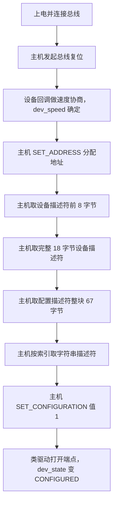
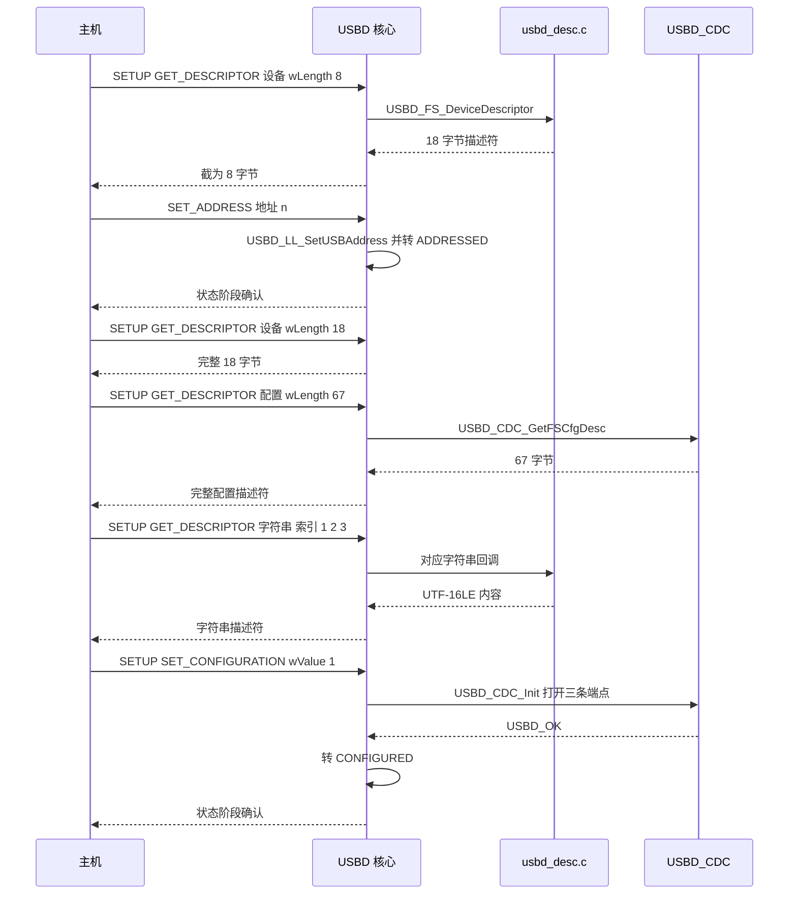
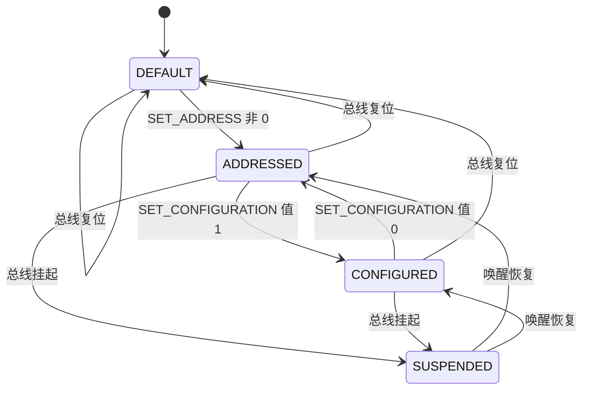

# 枚举流程

设备插入总线后，主机对它一无所知。枚举就是主机用一串控制传输问出设备的身份与能力，把设备从默认状态推进到可收发数据的状态。整个过程由主机发起，设备被动应答，每一步都通过端点 0 的 SETUP 阶段完成。前面两篇拆的是描述符的内容，接下来看这些描述符在什么时序下被请求，以及设备侧在哪一层回应。

设备侧的回应分三层：硬件中断把 SETUP 包收进控制器，HAL 与 USB 设备库把请求分派给标准请求处理函数，标准请求处理再调用描述符回调或类回调。任何一层没接好，主机看到的都是枚举中途停下。本工程的中断入口在 `Core/Src/stm32f4xx_it.c:331-337`，底层回调在 `USB_DEVICE/Target/usbd_conf.c`。

读完本页应当能回答三件事：枚举的主要阶段与先后顺序、每个阶段对应哪个库函数、以及主机停在哪一步时应当去查哪里。最后一节记录了任务描述里一个不存在的函数名，命名以类结构体里的指针为准。

> 源码索引

| 路径 | 作用 |
| --- | --- |
| `Core/Src/stm32f4xx_it.c` | `OTG_FS_IRQHandler` 中断入口 |
| `USB_DEVICE/Target/usbd_conf.c` | 复位、SETUP、数据阶段回调与回调注册 |
| `.../Core/Src/usbd_core.c` | `USBD_LL_SetupStage`、`USBD_LL_Reset`、`USBD_SetClassConfig` |
| `.../Core/Src/usbd_ctlreq.c` | 标准请求分派与处理 |
| `.../Core/Inc/usbd_def.h` | 设备状态常量 |
| `.../Class/CDC/Src/usbd_cdc.c` | CDC 类函数指针表与 `USBD_CDC_Init` |

## 枚举把设备从默认状态推到可收发

控制传输分三个阶段：SETUP 阶段传送 8 字节请求头，DATA 阶段按方向传数据，STATUS 阶段回一个空包确认。设备侧由中断驱动，每次硬件事件进入 `OTG_FS_IRQHandler()`，再交给 HAL 与 USB 设备库。请求头的 8 个字节里，`bmRequestType` 决定请求的收件人，`bRequest` 决定动作，`wValue` `wIndex` `wLength` 决定参数，库按这几项分派。

枚举的常见顺序是：上电连接、总线复位、速度协商、分配地址、读设备描述符前 8 字节、读完整 18 字节、读配置描述符整块、按索引读字符串、`SET_CONFIGURATION`。各阶段的先后顺序由主机决定，设备侧只按当前请求与 `dev_state` 回应。部分主机会先取 8 字节设备描述符再分配地址，部分主机在复位后直接分配地址，本工程对两种次序都能处理。

### 复位后速度协商，再回到默认状态

设备侧上拉 D+ 之后主机检测到连接并发起复位。复位事件由 HAL 回调 `HAL_PCD_ResetCallback()` 接手（`usbd_conf.c:193-215`）。回调先把控制器速度映射为库速度，调用 `USBD_LL_SetSpeed()`（`usbd_conf.c:211`），再调用 `USBD_LL_Reset()`（`usbd_conf.c:214`）。

`USBD_LL_Reset()` 把设备状态清回 `USBD_STATE_DEFAULT`，清空配置号与端点 0 状态，调用类的 `DeInit`，然后打开端点 0 的 OUT 与 IN 两个方向，包长取 `USB_MAX_EP0_SIZE` 64（`usbd_core.c:777-837`）。复位是枚举的起点，之后的每一步都建立在端点 0 已经可用这个前提上。

速度协商在同一回调里完成。`HAL_PCD_ResetCallback()` 读 `hpcd->Init.speed`，匹配 `PCD_SPEED_FULL` 时把库速度设为 `USBD_SPEED_FULL`，匹配 `PCD_SPEED_HIGH` 时设为 `USBD_SPEED_HIGH`（`usbd_conf.c:196-209`）。速度值写入 `pdev->dev_speed`（`usbd_core.c:845-851`），后续选择描述符版本与端点包长都读它。本工程在 `usbd_conf.c:337` 固定初始化为全速，因此走全速分支。

### 地址分配把设备推进到 ADDRESSED

主机发 `SET_ADDRESS`，库在 `USBD_SetAddress()` 里检查索引与长度，取 `wValue` 低 7 位作为地址，调用 `USBD_LL_SetUSBAddress()` 写进控制器（`usbd_ctlreq.c:682-714`、`usbd_conf.c:541-551`），然后把 `dev_state` 从 `DEFAULT` 改为 `ADDRESSED`。地址为 0 时状态退回 `DEFAULT`。这一步不涉及描述符，但后面所有按地址寻址的传输都依赖它。

### 设备描述符分两次取回

主机先请求 8 字节。库把 `wValue` 高字节 0x01 分派给 `USBD_GetDescriptor()`（`usbd_ctlreq.c:434-451`），取到 18 字节设备描述符后按主机 `wLength` 截断到 8 字节发出（`usbd_ctlreq.c:656-671`）。主机从第 8 字节读到 `bMaxPacketSize0`，再请求完整 18 字节。两次请求走同一条路径，区别只在 `wLength`，设备侧只有一份 18 字节数组。

### 配置描述符一次取回整块

主机用 `wValue` 高字节 0x02 请求配置。库调用已注册类的 `GetFSConfigDescriptor`（`usbd_ctlreq.c:453-482`），本工程即 `USBD_CDC_GetFSCfgDesc()`（`usbd_cdc.c:629-652`），返回 67 字节整块。主机也可能先请求 9 字节探总长，再请求完整块，两种情况都由 `wLength` 截断处理，类回调始终返回同一块数据。

### 字符串按索引逐个取

主机按设备描述符里的三个索引依次取厂商、产品、序列号字符串，通常还会先取索引 0 的语言 ID。库按 `wValue` 低字节选回调（`usbd_ctlreq.c:484-600`），回调内容见本单元《设备描述符与 VID-PID》与《USB 描述符体系》。回调返回的长度写进字符串描述符的 `bLength`。

### SET_CONFIGURATION 打开端点

主机发 `SET_CONFIGURATION`，`wValue` 为 1。库在 `USBD_SetConfig()` 里对 `ADDRESSED` 状态做处理：写 `dev_config`，调用 `USBD_SetClassConfig()`（`usbd_ctlreq.c:738-762`）。后者调用已注册类的 `Init`（`usbd_core.c:465-496`），CDC 类对应 `USBD_CDC_Init()`（`usbd_cdc.c:287-379`），打开三条端点并准备接收缓冲。全部成功之后状态改为 `CONFIGURED` 并回状态阶段。

## 一次完整枚举的 SETUP 往返

把上面的阶段按主机与设备的交互画出来，可以看到设备侧的每一次回应都由 SETUP 阶段触发，DATA 与 STATUS 阶段由库的状态机接手。

SETUP 阶段的 8 字节由硬件收进 `hpcd->Setup`，回调 `HAL_PCD_SetupStageCallback()` 把它交给 `USBD_LL_SetupStage()`（`usbd_conf.c:135-139`、`usbd_core.c:546-576`）。库在那里解析请求头并按收件人分派：设备请求进 `USBD_StdDevReq()`，接口请求进 `USBD_StdItfReq()`，端点请求进 `USBD_StdEPReq()`（`usbd_ctlreq.c:104-158`、`usbd_ctlreq.c:167-230`、`usbd_ctlreq.c:239-317`）。收件人来自 `bmRequestType` 的低 5 位，分派错了会把类请求当标准请求处理。

## 设备状态与挂起恢复

设备状态只有四个，状态常量定义在 `usbd_def.h:160-163`。枚举只走其中三个：复位回到 `DEFAULT`，`SET_ADDRESS` 进入 `ADDRESSED`，`SET_CONFIGURATION` 进入 `CONFIGURED`。挂起状态由总线事件触发，与枚举流程分开。

挂起时库把原状态存进 `dev_old_state` 再置为 `SUSPENDED`，恢复时写回原状态（`usbd_core.c:859-885`）。设备进入配置状态之后，主机侧看到的虚拟串口才可用。发送链路判断 `dev_state == USBD_STATE_CONFIGURED` 也依赖这一状态。

## 从硬件中断到库函数的调用链

把上面各节里出现的函数按层排开，可以看清一次枚举事件经过哪些代码。排查时按这张表自上而下定位，比从描述符数组开始猜要快。

| 层 | 位置 | 动作 |
| --- | --- | --- |
| 中断入口 | `stm32f4xx_it.c:331-337` | `OTG_FS_IRQHandler()` 调 `HAL_PCD_IRQHandler()` |
| 复位回调 | `usbd_conf.c:193-215` | 速度协商后调 `USBD_LL_Reset()` |
| SETUP 回调 | `usbd_conf.c:135-139` | 把 8 字节请求交给 `USBD_LL_SetupStage()` |
| 数据回调 | `usbd_conf.c:150-154`、`usbd_conf.c:165-169` | 交给 `USBD_LL_DataOutStage()` 与 `USBD_LL_DataInStage()` |
| 库分派 | `usbd_core.c:546-576` | 按收件人分派标准请求 |
| 标准请求 | `usbd_ctlreq.c:104-158` | 取描述符、设地址、设配置 |
| 类回调 | `usbd_cdc.c:287-379`、`usbd_cdc.c:432-527` | 打开端点、处理类请求 |

底层回调函数在 `usbd_conf.c:350-363` 通过 `HAL_PCD_RegisterCallback()` 注册到 HAL，只有在 `USE_HAL_PCD_REGISTER_CALLBACKS` 打开时走注册分支，否则用同名弱符号默认回调。核对回调有没有注册上，先看这个宏。

## 任务描述里那个不存在的 CDC_SetConfig

任务描述里把 `SET_CONFIGURATION` 对应的处理称作 CDC_SetConfig。这份库里没有这个名字的函数。`USBD_SetConfig()` 是设备级的标准请求处理（`usbd_ctlreq.c:723`），它通过 `USBD_SetClassConfig()` 调用类结构里的 `Init` 指针（`usbd_core.c:488-492`），CDC 类的 `Init` 指针指向 `USBD_CDC_Init()`（`usbd_cdc.c:143`、`usbd_cdc.c:287`）。配置生效的实际动作发生在这个函数里。命名对不上时以类结构体里的函数指针为准。

## 枚举相关的易错点

### 以为 8 字节与 18 字节是两条路径

两次请求都由 `USBD_GetDescriptor()` 处理，区别只是 `wLength`。设备描述符数组始终保持 18 字节，截断由库完成。不会因为先读了 8 字节就把数组改成 8 字节。

### 在复位回调里做耗时操作

`HAL_PCD_ResetCallback()` 运行在中断上下文。放入耗时操作会推迟 SETUP 响应，主机可能判定枚举失败。本工程该回调只做速度映射与库复位，没有别的工作。

### 状态判断缺失

发送链路只在 `hUsbDeviceFS.dev_state == USBD_STATE_CONFIGURED` 时才应发数据。枚举未完成时端点尚未打开，直接调发送会返回失败或忙。

### 地址大于 127

`USBD_SetAddress()` 要求 `wValue` 小于 128 且索引与长度为 0（`usbd_ctlreq.c:686`）。主机不会给出越界地址，手写测试工具时要注意这个约束。

### 只改描述符不改端点打开参数

描述符决定主机侧的期望，类驱动的 `Init` 决定设备侧的实际参数。两端要一致，否则大包传输会出错。这条与本单元《配置与接口描述符》里回写包长的那一节是同一个问题的两个侧面。

## 小结

### 核心概念

- 枚举由主机发起，设备通过端点 0 的控制传输被动应答。
- 复位后设备回到 `DEFAULT`，库打开端点 0 并取 64 字节包长，速度在同一次回调里确定。
- 地址分配把设备推进到 `ADDRESSED`，取描述符不改变状态。
- 主机通常先读 8 字节设备描述符拿到 `bMaxPacketSize0`，再读完整 18 字节。
- 配置描述符一次返回整块 67 字节，字符串按索引逐个取。
- `SET_CONFIGURATION` 触发类 `Init`，本工程为 `USBD_CDC_Init()`，成功后进入 `CONFIGURED`。
- 挂起只改状态，原状态存入 `dev_old_state`，恢复时写回。

### 设计权衡

| 决策 | 好处 | 代价 |
| --- | --- | --- |
| 描述符读取按 `wLength` 统一截断 | 8 字节与 18 字节共用一条路径 | 设备无法感知主机是试探还是取全量 |
| 状态机集中在库核心 | 各类设备行为一致 | 类驱动要严格按状态办事，越界请求被停机 |
| 类 `Init` 延迟到配置阶段 | 枚举期间不占用数据端点 | 配置失败时状态退回 `ADDRESSED`，主机需重试 |
| 挂起只改状态不重配端点 | 恢复快 | 挂起期间的端点状态要由应用自行确认 |
| 回调优先，弱符号兜底 | 不改 HAL 也能工作 | 注册开关关闭时回调表静默失效，排查要另查宏 |

## 练习

### 基础题

1. 按顺序列出枚举的主要 SETUP 请求，并标出哪一步让 `dev_state` 从 `ADDRESSED` 变为 `CONFIGURED`。
2. 说明主机为什么先读 8 字节设备描述符。
3. 写出从 `OTG_FS_IRQHandler()` 到 `USBD_LL_SetupStage()` 的调用链。

### 挑战题

4. 用调试器在 `USBD_SetConfig()` 与 `USBD_CDC_Init()` 下断点，记录一次完整枚举中两者被调用的次数与顺序。
5. 假设 `SET_CONFIGURATION` 值为 2，分析 `USBD_SetConfig()` 的判断路径与设备最终状态。
6. 把 `USBD_STATE_CONFIGURED` 判断去掉后直接调用发送函数，说明在枚举未完成时会走哪条失败路径。

## 附：本页引用的固件路径

| 路径 | 用途 |
| --- | --- |
| /home/wyx/rm/2026SentriOmeniGimbal/2026OmniSentryGimbal/Core/Src/stm32f4xx_it.c | `OTG_FS_IRQHandler`（:331-337） |
| /home/wyx/rm/2026SentriOmeniGimbal/2026OmniSentryGimbal/USB_DEVICE/Target/usbd_conf.c | 复位回调（:193-215）、SETUP 回调（:135-139）、数据回调（:150-169）、回调注册（:350-363）、`USBD_LL_SetUSBAddress`（:541-551）、初始化（:327-370） |
| /home/wyx/rm/2026SentriOmeniGimbal/2026OmniSentryGimbal/Middlewares/ST/STM32_USB_Device_Library/Core/Src/usbd_core.c | `USBD_LL_SetupStage`（:546-576）、`USBD_LL_Reset`（:777-837）、`USBD_SetClassConfig`（:465-496）、挂起恢复（:859-885） |
| /home/wyx/rm/2026SentriOmeniGimbal/2026OmniSentryGimbal/Middlewares/ST/STM32_USB_Device_Library/Core/Src/usbd_ctlreq.c | 设备请求分发（:104-158）、接口请求（:167-230）、端点请求（:239-317）、取描述符（:428-672）、设地址（:682-714）、设配置（:723-812） |
| /home/wyx/rm/2026SentriOmeniGimbal/2026OmniSentryGimbal/Middlewares/ST/STM32_USB_Device_Library/Core/Inc/usbd_def.h | 状态常量（:160-163）、`USB_MAX_EP0_SIZE`（:157） |
| /home/wyx/rm/2026SentriOmeniGimbal/2026OmniSentryGimbal/Middlewares/ST/STM32_USB_Device_Library/Class/CDC/Src/usbd_cdc.c | 类函数指针表（:141-164）、`USBD_CDC_Init`（:287-379）、`USBD_CDC_Setup`（:432-527） |
