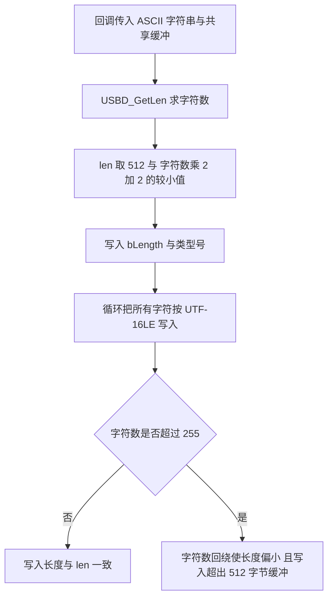
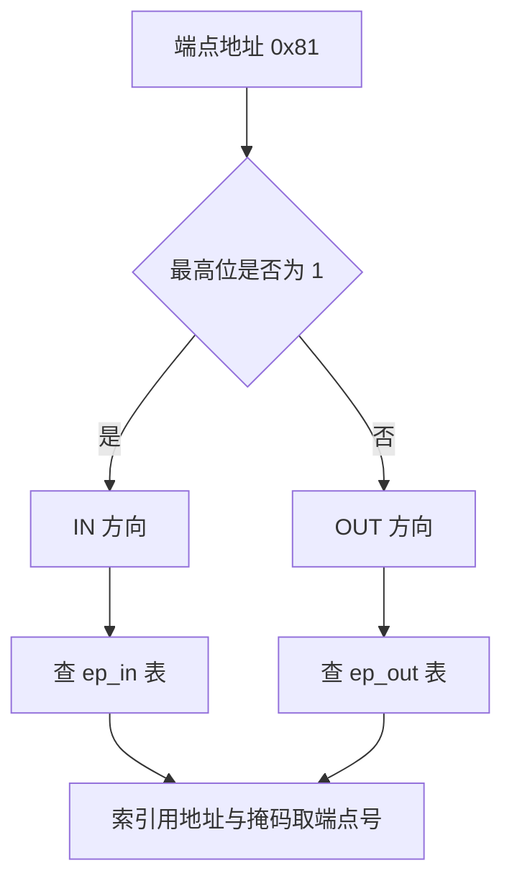
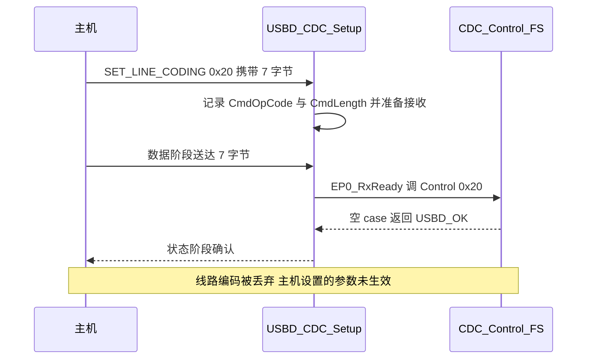

# 易错点与调试

描述符与枚举相关的问题有一个共同特征：多数不会在数据通路上立刻发作。描述符写错时设备仍可能枚举成功，只是在某个字段上表现异常；类请求被丢弃时载荷收发照常，只有依赖该请求的上位机出现异常。排查时按主机侧看到的现象与设备侧的字段逐项对照，比直接读代码更快。

本页把这一单元里已经确认的问题归成四类：长度类来自单字节字段与共享缓冲的边界，方向类来自端点地址的最高位，对齐类来自缓冲与结构体之间的强制转换，配置类来自几个同时控制多处行为的宏。最后两节给出打开日志、看设备状态与在主机侧读描述符的操作路径。

其中的潜在缺陷会明确标注触发条件与是否当前成立。已经确认的缺陷给出源码位置，属推断的部分会在句子里写明。

> 源码索引

| 路径 | 作用 |
| --- | --- |
| `USB_DEVICE/App/usbd_desc.c` | 描述符数组对齐、字符串缓冲、序列号数组 |
| `USB_DEVICE/App/usbd_cdc_if.c` | `CDC_Control_FS` 类请求回调 |
| `USB_DEVICE/Target/usbd_conf.h` | 字符串缓冲上限、调试等级、LPM 开关 |
| `USB_DEVICE/Target/usbd_conf.c` | 端点停机判断、低功耗开关、静态分配 |
| `USB_DEVICE/App/usb_device.c` | 设备句柄 `hUsbDeviceFS` |
| `.../Core/Src/usbd_ctlreq.c` | 字符串生成与长度计算、BOS 分支 |
| `.../Core/Src/usbd_core.c` | 端点描述符定位与端点下标掩码 |
| `.../Core/Inc/usbd_def.h` | 对齐宏、状态常量 |
| `.../Class/CDC/Src/usbd_cdc.c` | 类请求处理、配置描述符 |
| `.../Class/CDC/Inc/usbd_cdc.h` | 端点地址、句柄缓冲 |

## 这类问题的共同来源

长度类问题的根源是 USB 描述符里的长度字段多为单字节，而设备侧共用一块固定大小的缓冲。单字节能表达 0 到 255，缓冲是 512 字节，两者在正常内容下相安无事，一旦内容长度接近上限，长度字段会先回绕。方向类问题的根源是端点地址把一个方向位和四位端点号压在一个字节里，用地址当数组下标就出错。对齐类问题的根源是描述符缓冲是字节数组，库却按结构体访问它。配置类问题的根源是某个宏同时参与编译分支与运行期判断，只改一处就会让声明与实现分家。

## 字符串描述符的长度与共享缓冲

字符串描述符由 `USBD_GetString()` 生成（`usbd_ctlreq.c`）。流程是：先求 ASCII 字符数，算出 UTF-16LE 长度，写入 `bLength` 与类型号，再把每个字符与一个 0 字节交替写入缓冲。一个 ASCII 字符展开成两个字节，所以描述符长度等于字符数乘 2 再加 2，加上的 2 是 `bLength` 与 `bDescriptorType`。

两处细节需要单独指出。第一，`USBD_GetLen()` 的返回类型是 `uint8_t`（`usbd_ctlreq.c`），字符数到 256 会回绕。第二，`*len` 被限制在 512 以内，但后面的写入循环不检查这个上限，每个字符固定写两个字节。

现有字符串都很短，最长的是 STMicroelectronics，18 个字符，描述符长度等于 18 乘 2 加 2，即 38 字节，距离 512 很远，不会触发问题。上面第二条属潜在缺陷：一旦有人把厂商或产品字符串改得很长，长度字段与缓冲区都会出错。推断的触发条件是 ASCII 字符数超过 255，当前配置下不成立，改动字符串长度时需要重新核对。

所有字符串回调共用同一个缓冲 `USBD_StrDesc`，大小 512 字节（`usbd_desc.c`、`usbd_conf.h`）。序列号不占用这个缓冲，它有自己的 0x1A 字节数组（`usbd_desc.h`、`usbd_desc.c`）。共用一个缓冲意味着两次字符串请求不能同时进行，枚举是串行的，这一点不构成问题。

## 端点地址最高位是方向位

端点地址用一个字节表示，最高位是方向，低四位是端点号。中间三位保留。CDC 用了三条端点（`usbd_cdc.h`）：

| 地址 | 最高位 | 方向 | 端点号 | 用途 |
| --- | --- | --- | --- | --- |
| 0x81 | 1 | IN | 1 | 数据回传 |
| 0x01 | 0 | OUT | 1 | 数据下发 |
| 0x82 | 1 | IN | 2 | 命令与通知 |

0x81 与 0x01 是同一对端点号 1 的两个方向，靠最高位区分。库判断停机状态时按最高位选表（`usbd_conf.c`）：

写端点数组下标时容易直接用地址。库在别处用 `ep_addr & 0x0F` 或 `& 0x7F` 取端点号（`usbd_core.c`、`usbd_core.c`、`usbd_core.c`），把 0x81 直接当 1 使用会越界。判断方向用最高位，取号用低四位，两件事分开做。

## 描述符数组与结构体视图之间的对齐

描述符数组与端点结构体之间靠强制类型转换建立视图。`usbd_core.c` 的 `USBD_GetEpDesc()` 把配置描述符缓冲逐字节走一遍，遇到端点类型号就转成 `USBD_EpDescTypeDef *` 访问字段。这类转换要求地址对齐，否则多字节成员可能被拆成两次错位访问。

本工程的处理方式有两处。描述符数组用 `__ALIGN_BEGIN` 与 `__ALIGN_END` 包裹（`usbd_desc.c`、`usbd_desc.c`、`usbd_desc.c`、`usbd_desc.c`、`usbd_cdc.c`、`usbd_cdc.c`），宏在 `usbd_def.h` 按编译器展开为 4 字节对齐属性。CDC 句柄里的数据缓冲声明为 `uint32_t data[...]` 以强制 32 位对齐（`usbd_cdc.h`），静态分配器返回的是一段 `uint32_t` 数组（`usbd_conf.c`）。

去掉对齐声明后，GCC 在 Cortex-M4 上遇到非对齐的多字节访问可能触发硬件异常或读到错误值。改动描述符数组时不要动这两对宏，也不要把数组换成运行期分配的缓冲区。

## USBD_MAX_STR_DESC_SIZ 同时管缓冲与上限

`USBD_MAX_STR_DESC_SIZ` 在 `usbd_conf.h` 定义为 512，它同时决定共享缓冲大小（`usbd_desc.c`）与 `USBD_GetString()` 里的长度上限（`usbd_ctlreq.c`）。两个用途绑定在同一个宏上，改它等于同时改两处。

USB 字符串描述符的 `bLength` 是单字节，最大值 255。一个字符串最多约 126 个 UTF-16 字符。把宏改大不能突破 `bLength` 的上限，反而会放大上一节提到的写入越界范围，因为长度字段会先回绕而写入循环继续。需要更长的可读名称时，正确做法是缩短内容或拆成多个字符串索引，而不是调大缓冲。

## LPM 开关同时影响 bcdUSB 与 BOS

`USBD_LPM_ENABLED` 在 `usbd_conf.h` 为 0。它控制设备描述符里的 `bcdUSB` 与 BOS 描述符两处编译分支：

| 宏取值 | `bcdUSB` | 数组字节 | BOS 描述符 | 位置 |
| --- | --- | --- | --- | --- |
| 0 | 0x0200 | 0x00 0x02 | 不编译 | `usbd_desc.c` |
| 1 | 0x0201 | 0x01 0x02 | 编译并回调 | `usbd_desc.c`、`usbd_desc.c` |

库取描述符时，BOS 分支只在 `USBD_LPM_ENABLED` 或 `USBD_CLASS_BOS_ENABLED` 为 1 时才参与编译（`usbd_ctlreq.c`）。把宏改为 1 之后，设备对主机声明 USB 2.01 并提供 BOS，但底层 PCD 的 `lpm_enable` 仍固定为 `DISABLE`（`usbd_conf.c`），控制器侧并未启用 LPM。声明与控制器配置不一致，属配置错误，需要两处一起改。

## CDC_Control_FS 的空实现丢掉了哪些请求

主机的类请求最终进到 `CDC_Control_FS()`（`usbd_cdc_if.c`）。该函数对所有命令都是空 case，统一返回 `USBD_OK`。上层路径在 `USBD_CDC_Setup()` 与 `USBD_CDC_EP0_RxReady()`（`usbd_cdc.c`、`usbd_cdc.c`）。

主机发了什么、固件在哪一步丢掉，整理如下。

| 主机请求 | 编码 | 数据方向 | 固件行为 | 后果 |
| --- | --- | --- | --- | --- |
| `CDC_SET_LINE_CODING` | 0x20 | 主机到设备 7 字节 | 收到后空 case，参数不解析 | 波特率、数据位、校验设置不生效 |
| `CDC_GET_LINE_CODING` | 0x21 | 设备到主机 | 空 case，返回句柄里未更新的数据 | 主机读到全 0 或旧值 |
| `CDC_SET_CONTROL_LINE_STATE` | 0x22 | 无数据 | 空 case，DTR 与 RTS 被忽略 | 依赖 DTR 的上位机可能一直等待 |
| `CDC_SEND_BREAK` | 0x23 | 无数据 | 空 case | 断开信号不处理 |

对虚拟串口而言，载荷走批量端点，与线路编码无关，因此数据收发本身不受影响。虚拟串口的波特率由 USB 全速链路决定，改波特率不改变实际速率。受影响的只是依赖这些命令做流控或握手的上位机，它们可能超时或认为端口未就绪，这一条属推断，需在目标上位机上实测。

功能描述符里 ACM 的 `bmCapabilities` 为 0x02（`usbd_cdc.c`），声明设备支持线路编码相关请求。声明与空实现不一致。要让主机改参数生效，需要在 `CDC_SET_LINE_CODING` 分支里解析 7 字节并保存，在 `CDC_GET_LINE_CODING` 分支里回填。

## 打开日志、看状态、在主机侧读描述符

`USBD_DEBUG_LEVEL` 在 `usbd_conf.h` 为 0，三组日志宏都被展开为空（`usbd_conf.h`）。改成 1 打开 `USBD_UsrLog`，改成 2 或 3 再打开 `USBD_ErrLog` 与 `USBD_DbgLog`。日志走 `printf`，需要先接好输出通道，否则看不到内容。

设备句柄是 `hUsbDeviceFS`（`usb_device.c`）。枚举完成时 `hUsbDeviceFS.dev_state` 为 `USBD_STATE_CONFIGURED`（`usbd_def.h`）。发送链路也用它做条件判断，状态停在 `ADDRESSED` 说明 `SET_CONFIGURATION` 没有走完，通常是类 `Init` 返回了失败。

主机侧工具可以直接读出设备描述符与配置描述符。Windows 用设备管理器看设备名与硬件 ID，用 USB 树查看器看完整描述符；Linux 用 `lsusb -v` 或 usbmon。重点核对 `idVendor`、`idProduct`、`bcdUSB`、`wTotalLength` 与端点的 `wMaxPacketSize`。这些工具属通用手段，版本差异较大。

把常见现象与优先检查点对应起来：

| 现象 | 优先检查 |
| --- | --- |
| 主机完全不认设备 | `bMaxPacketSize0`、端点 0 打开是否成功、中断是否进入 |
| 设备名对但驱动装不上 | `idVendor` 与 `idProduct` 是否与 inf 一致 |
| 枚举到中途失败 | 配置描述符 `wTotalLength` 与实际字节数是否一致 |
| 打开串口后收不到数据 | `dev_state` 是否为 `CONFIGURED`、端点是否打开 |
| 改波特率无变化 | `CDC_Control_FS` 对应分支是否为空 |
| 字符串显示乱码或截断 | 字符串长度计算与 UTF-16LE 编码 |

## 小结

### 核心概念

- 字符串长度由 `USBD_GetString()` 计算，写入循环不检查 512 上限，超长字符串有越界风险。
- 端点地址最高位是方向，低四位是端点号，取数组下标不能直接用地址。
- 描述符数组与句柄缓冲都靠对齐声明支撑强制类型转换。
- `USBD_MAX_STR_DESC_SIZ` 同时管缓冲大小与长度上限，改大不能突破单字节 `bLength`。
- `USBD_LPM_ENABLED` 同时改 `bcdUSB` 与 BOS 编译，控制器 LPM 开关是另一处配置。
- `CDC_Control_FS()` 对所有类请求空实现，线路编码与控制线状态被丢弃。

### 设计权衡

| 决策 | 好处 | 代价 |
| --- | --- | --- |
| 字符串共用一个静态缓冲 | 省 RAM，生成逻辑集中 | 超长字符串越界，多个字符串不能同时缓存 |
| 线路编码请求空实现 | 数据通路简单，不占用解析状态 | 主机设置的参数不生效，声明与实现不符 |
| 描述符数组固定对齐 | 转换视图安全 | 改动数组布局要维持对齐与长度一致 |
| LPM 默认关闭 | 不引入低功耗挂起状态机 | 需要 LPM 时要同时改宏与控制器配置 |
| 调试日志默认关闭 | 不占用串口与代码空间 | 出问题时要先改宏并准备输出通道 |

## 练习

### 基础题

1. 说明 `USBD_GetString()` 里 `bLength` 的计算公式，并算出 STMicroelectronics 的描述符长度。
2. 写出端点地址 0x82 的方向、端点号与传输类型。
3. 列出 `USBD_LPM_ENABLED` 从 0 改为 1 时受影响的文件与位置。

### 挑战题

4. 把 `USBD_MAX_STR_DESC_SIZ` 改为 64，分析厂商字符串 STMicroelectronics 是否还能完整返回，并说明 `USBD_GetString()` 的行为。
5. 为 `CDC_SET_LINE_CODING` 与 `CDC_GET_LINE_CODING` 补上解析与回填，写出需要保存的字段，并说明如何与 ACM 功能描述符的声明保持一致。
6. 主机打开串口后依赖 DTR 才发数据，而 `CDC_SET_CONTROL_LINE_STATE` 是空实现，说明现象与可在固件侧做的两种改法。

## 附：本页引用的固件路径

| 路径 | 用途 |
| --- | --- |
| USB_DEVICE/App/usbd_desc.c | 对齐声明、`bcdUSB` 分支、BOS |
| USB_DEVICE/App/usbd_desc.h | 序列号长度 |
| USB_DEVICE/App/usbd_cdc_if.c | `CDC_Control_FS` |
| USB_DEVICE/Target/usbd_conf.h | `USBD_MAX_STR_DESC_SIZ`、`USBD_DEBUG_LEVEL`、`USBD_LPM_ENABLED`、日志宏 |
| USB_DEVICE/Target/usbd_conf.c | `USBD_LL_IsStallEP`、LPM 与低功耗开关、静态分配 |
| USB_DEVICE/App/usb_device.c | 设备句柄 |
| Middlewares/ST/STM32_USB_Device_Library/Core/Src/usbd_ctlreq.c | `USBD_GetString`、`USBD_GetLen`、BOS 分支 |
| Middlewares/ST/STM32_USB_Device_Library/Core/Src/usbd_core.c | `USBD_GetEpDesc`、端点下标 |
| Middlewares/ST/STM32_USB_Device_Library/Core/Inc/usbd_def.h | 对齐宏、状态常量 |
| Middlewares/ST/STM32_USB_Device_Library/Class/CDC/Src/usbd_cdc.c | `USBD_CDC_Setup`、`USBD_CDC_EP0_RxReady`、配置描述符 |
| Middlewares/ST/STM32_USB_Device_Library/Class/CDC/Inc/usbd_cdc.h | 端点地址、句柄缓冲 |
