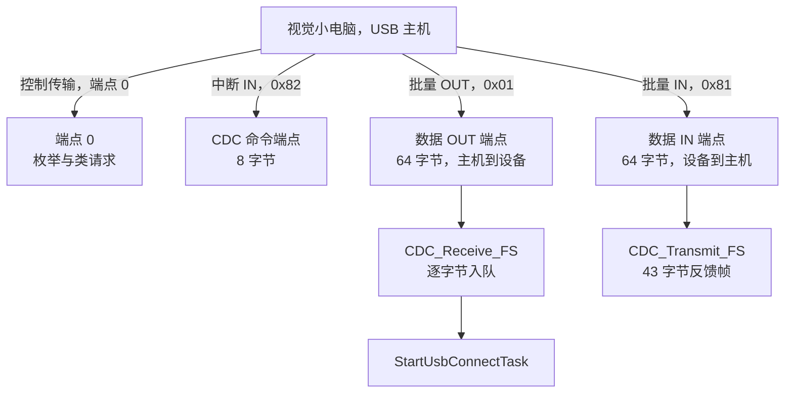
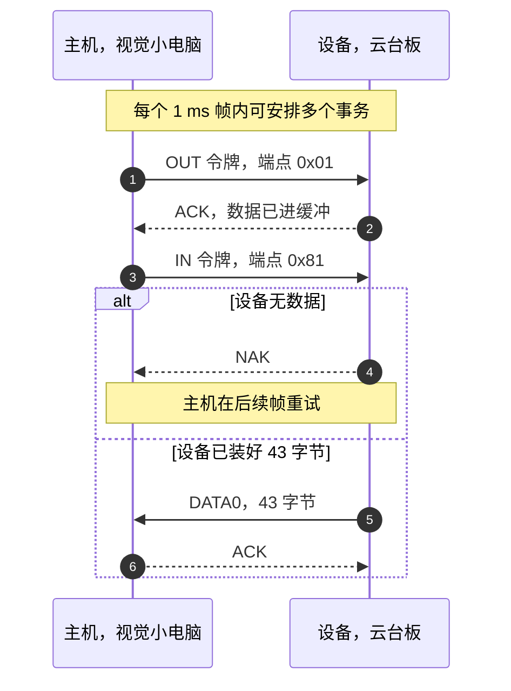
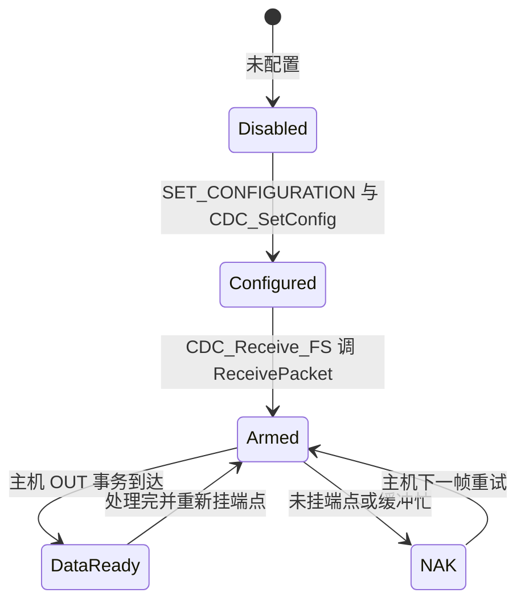

# USB 传输类型与端点

这一单元的对象是云台板固件 `/home/wyx/rm/2026SentriOmeniGimbal/2026OmniSentryGimbal`。视觉小电脑与云台板之间跑的是 USB CDC；主机怎么调度、端点怎么分工、一包能装多少字节，是通道本身要先说清的三件事。

协议帧在通道上怎么摆放在 `02-视觉链路帧的USB承载.md`，接收解析在 `03-USBDecode解帧实现.md`，任务节拍在 `04-收发频率与任务模型.md`。端点与缓冲的逐参数说明另见 `05-USB Device/01-CDC虚拟串口` 单元。

## 1. 主机轮询下设备只能应答

USB 是主从结构。枚举完成后，主机按自己的节拍发起所有事务，设备只能应答，不能主动发送。设备要送数据时，先把数据放进 IN 端点的发送缓冲，等主机来取；主机来取之前，数据一直挂着。

这种结构决定了 USB 的延迟模型：一个事务什么时候发生由主机排程决定，设备只能保证「数据准备好」这件事及时完成。全速设备的最小调度粒度是 1 ms 帧，所以设备侧再怎么优化，单次传输的等待时间下限也在帧的尺度上。

| 传输类型 | 带宽保证 | 延迟 | 典型用途 | 本项目是否使用 |
| --- | --- | --- | --- | --- |
| 控制 | 无，但主机必留带宽 | 由主机排程 | 枚举、类请求 | 使用（端点 0） |
| 中断 | 有带宽预留 | 有界，按 bInterval | 小数据、周期性状态 | 使用（CDC 命令端点 0x82） |
| 批量 | 无，带宽空闲时用 | 无上界 | 大数据、可靠性优先 | 使用（数据端点 0x81 / 0x01） |
| 等时 | 有带宽预留 | 有界 | 音视频，允许丢包 | 未使用 |

本项目选了批量端点承载视觉链路。理由是链路两端都不在乎几百微秒的抖动，但在乎整帧不能丢：批量传输自带重试与握手，等时传输没有。



## 2. 全速帧的 1 ms 节拍与 64 字节包上限

全速设备每 1 ms 一个帧，帧首是主机广播的 SOF 包。每个帧里塞进若干事务，一个事务由令牌包、数据包、握手包组成。设备侧能控制的只有数据包里的字节数。

| 参数 | 全速取值 | 出处 |
| --- | --- | --- |
| 帧周期 | 1 ms | USB 2.0 规范（手册值） |
| 控制端点 0 包上限 | 64 字节 | `USB_MAX_EP0_SIZE` |
| CDC 数据端点包上限 | 64 字节 | `usbd_cdc.h:67` |
| CDC 命令端点包上限 | 8 字节 | `usbd_cdc.h:62` |
| 命令端点轮询间隔 | 0x10，即 16 个帧 | `usbd_cdc.h:58` |

43 字节的反馈帧装得进一个 64 字节包，传输一次就发完。29 字节的接收帧同理。两边的帧都小于包上限，所以链路里不存在「一帧被拆成多个事务」的情况，帧边界与事务边界重合。

包上限还有一个不易察觉的作用：批量传输靠短包标记传输结束。一个刚好 64 字节的包不表示结束，主机还会再要一包；本项目的两帧都远小于 64 字节，不涉及这个问题。



## 3. 端点地址里的方向位与三条端点的分工

端点地址用一个字节表示，最低位是方向，高 4 位是端点号。0x81 是端点 1 的 IN 方向，0x01 是端点 1 的 OUT 方向，两者号相同、方向相反，各自独立。

IN 与 OUT 都以主机为参照：IN 是设备到主机，OUT 是主机到设备。固件里 `CDC_Receive_FS` 处理的是 OUT 数据，`CDC_Transmit_FS` 走的是 IN 端点，命名容易看反。

| 端点 | 地址 | 方向（相对主机） | 类型 | 本项目用途 |
| --- | --- | --- | --- | --- |
| 端点 0 | 0x00 / 0x80 | 双向 | 控制 | 枚举与 `CDC_Control_FS` 处理的类请求 |
| 端点 1 | 0x01 | OUT | 批量 | 接收 29 字节视觉帧 |
| 端点 1 | 0x81 | IN | 批量 | 发送 43 字节反馈帧 |
| 端点 2 | 0x82 | IN | 中断 | CDC 命令通知 |

三个端点的定义在库文件里，不在应用代码里：`CDC_IN_EP = 0x81U`、`CDC_OUT_EP = 0x01U`、`CDC_CMD_EP = 0x82U`，见 `Middlewares/ST/STM32_USB_Device_Library/Class/CDC/Inc/usbd_cdc.h:43-51`。

方向位与端点号共同决定 PCD 层操作哪一个寄存器组，也决定回调参数的含义：类层的 `DataOut` 与 `DataIn` 拿到的是端点号，方向由回调本身区分。把 0x81 与 0x01 理解成两条独立通道就够了，它们在硬件上是同一个端点号的两个方向，收发缓冲也各自独立。

## 4. OTG FS 的引脚、FIFO 与初始化顺序

USB 外设是 OTG FS，工作在设备模式，全速 12 Mbps。引脚复用见 `USB_DEVICE/Target/usbd_conf.c:79-91`：

| 信号 | 引脚 |
| --- | --- |
| USB_OTG_FS_DM | PA11 |
| USB_OTG_FS_DP | PA12 |

复用功能是 `GPIO_AF10_OTG_FS`，时钟在 `usbd_conf.c:91` 通过 `__HAL_RCC_USB_OTG_FS_CLK_ENABLE()` 打开。中断 `OTG_FS_IRQn` 的抢占优先级是 5（`usbd_conf.c:94-95`），与 CAN、串口、定时器中断同级；服务函数在 `Core/Src/stm32f4xx_it.c:331-337`：

```c
void OTG_FS_IRQHandler(void)
{
  HAL_PCD_IRQHandler(&hpcd_USB_OTG_FS);
}
```

优先级 5 与 FreeRTOS 的门槛一致。已完成文档里已经核实 `configLIBRARY_MAX_SYSCALL_INTERRUPT_PRIORITY = 5`，所以 USB 中断里调用 `xQueueSendFromISR` 是合法的。

设备模式下的收发 FIFO 从同一块 320 word 的 RAM 里切分，配置在 `usbd_conf.c:365-367`：

| FIFO | 大小 | 对应端点 |
| --- | --- | --- |
| RxFiFo | 0x80 = 128 word | 所有 OUT 端点共用 |
| TxFiFo(0) | 0x40 = 64 word | IN 端点 0 |
| TxFiFo(1) | 0x80 = 128 word | IN 端点 1，即 0x81 |

三个数相加 0x140 = 320 word，正好等于 OTG FS 的总容量（按 STM32F4 参考手册，属手册值）。命令端点 0x82 没有单独分配发送 FIFO，它每次只发 8 字节的类通知，共用端点 0 的空间。

初始化顺序上，`main.c:121` 调用 `MX_USB_DEVICE_Init()`，内部依次是 `USBD_Init`、`USBD_RegisterClass(&hUsbDeviceFS, &USBD_CDC)`、`USBD_CDC_RegisterInterface(&hUsbDeviceFS, &USBD_Interface_fops_FS)`、`USBD_Start`（`USB_DEVICE/App/usb_device.c:64-91`）。`main.c:121` 是第一次调用，`Core/Src/freertos.c:149` 在 `StartDefaultTask` 里还有第二次调用，即调度器启动之后又初始化了一次设备库。接收队列在 `MX_FREERTOS_Init()` 里创建（`freertos.c:114`），早于第二次初始化，所以 `CDC_Receive_FS` 判空的分支只在第一次初始化到队列创建之间的窗口里起作用（见 `05-USB Device/01-CDC虚拟串口` 单元）。

## 5. 批量端点的 NAK 与重新挂载

批量 OUT 端点在没有缓冲可收时返回 NAK。库里的做法是：`CDC_Receive_FS` 处理完这一包后，重新调用 `USBD_CDC_SetRxBuffer` 与 `USBD_CDC_ReceivePacket`，把端点重新挂上（`USB_DEVICE/App/usbd_cdc_if.c:276-278`）。少了这两行，主机下一包会一直收到 NAK。

同样的机制在发送方向是 `TxState`：`CDC_Transmit_FS` 检查 `hcdc->TxState`，非零说明上一包还没走完，直接返回 `USBD_BUSY`（`usbd_cdc_if.c:304-307`）。任务侧对返回值的处理是忙等加重试，见 `04-收发频率与任务模型.md`。



NAK 与错误状态要分开看。NAK 是流控信号，主机收到后会重试同一个事务，设备不会因此丢数据；STALL 才表示端点出错、需要主机干预。本工程没有进入 STALL 的路径，端点不可用时只会回 NAK，表现为主机反复重试而不是报错。调试时若在 USB 分析仪上看到大量 NAK，先查端点有没有重挂，再查主机是不是在高频轮询一个永远没有数据的 IN 端点。

## 6. 易错点

| 易错点 | 现象 | 对应位置 |
| --- | --- | --- |
| 把 IN 当成设备发送 | 端点方向判断反，收发代码互串 | `CDC_IN_EP = 0x81` 是设备到主机 |
| 忘记重新挂 OUT 端点 | 第一包之后的接收全部 NAK | `usbd_cdc_if.c:276-278` |
| 把 43 字节帧拆成多包理解 | 误以为有短包结束标志 | 两帧都小于 64 字节，一包发完 |
| 认为中断优先级可以随便设 | 在 USB 中断里调 FreeRTOS API 触发断言 | 优先级 5，等于门槛值 |
| 忽略主机不取数据的情况 | 以为 `CDC_Transmit_FS` 总能成功 | 忙时返回 `USBD_BUSY` |
| 把命令端点的 8 字节当成数据端点上限 | 误判链路吞吐 | 数据端点上限是 64 字节 |

## 7. 小结

核心概念：

| 概念 | 内容 |
| --- | --- |
| 调度模型 | USB 由主机调度，设备只在被访问时响应；全速帧周期 1 ms，决定了延迟下限 |
| 传输类型 | 四种传输类型里，本项目用到控制、中断、批量三种，视觉数据走批量 |
| 三条端点 | 0x82 发命令通知，0x01 收数据，0x81 发数据 |
| 包上限 | 全速下数据端点 64 字节、命令端点 8 字节；29 与 43 字节的帧都能一包发完 |
| 重挂要求 | 批量 OUT 端点处理完必须重新挂上，否则后续包全部 NAK |

设计权衡：

| 决策 | 选择 | 收益 | 代价 |
| --- | --- | --- | --- |
| 视觉链路传输类型 | 批量 | 自带重试，整帧可靠 | 无带宽保证，拥塞时延迟上升 |
| 端点划分 | 数据与命令分开 | 命令通知不被大数据包阻塞 | 多占一个端点与 8 字节包空间 |
| FIFO 分配 | Rx 128 / Tx0 64 / Tx1 128 word | 数据端点有足够发送空间 | 固定切分，不能按需调整 |
| 中断优先级 | 5 | 与 FreeRTOS 门槛一致，可调用内核 API | 与外设中断同级，抢占关系由硬件编号决定 |
| 包长 | 帧小于包上限 | 帧边界等于事务边界，解析简单 | 增加字段超过 64 字节就要改传输设计 |

## 8. 练习

基础题：

1. 说明 0x81 与 0x01 两个端点地址的差别，以及它们各自的数据方向。
2. 全速 USB 一个帧内最多能传多少个 43 字节的反馈帧？结合批量传输的调度给出结论。
3. 计算 `usbd_conf.c:365-367` 三块 FIFO 的总 word 数，与 OTG FS 的总容量比较。
4. `CDC_Transmit_FS` 返回 `USBD_BUSY` 时，`TxState` 处于什么状态？数据被丢弃了吗？

挑战题：

5. 若把反馈帧从 43 字节扩到 100 字节，链路上会出现什么变化？端点包上限需要调整吗？
6. `CDC_Receive_FS` 注释里提到，如果函数过早返回，会出现上一包还没发完就收下一包的情况。结合 `usbd_cdc_if.c:261-284` 说明本工程为什么不存在这个问题。
7. 命令端点的 bInterval 是 0x10，换算成时间是多少？如果把它改成 0x01，对总线负载有什么影响？

---

### 附：本页引用的固件路径

| 路径 | 用途 |
| --- | --- |
| `2026OmniSentryGimbal/USB_DEVICE/Target/usbd_conf.c` | OTG FS 引脚、时钟、NVIC 优先级（:79-95）、FIFO 分配（:365-367） |
| `2026OmniSentryGimbal/Core/Src/stm32f4xx_it.c` | `OTG_FS_IRQHandler`（:331-337） |
| `2026OmniSentryGimbal/USB_DEVICE/App/usb_device.c` | 设备库初始化链（:64-91） |
| `2026OmniSentryGimbal/USB_DEVICE/App/usbd_cdc_if.c` | 接收回调与重挂端点（:261-284）、发送与忙标志（:297-313） |
| `2026OmniSentryGimbal/Middlewares/ST/STM32_USB_Device_Library/Class/CDC/Inc/usbd_cdc.h` | 端点地址与包大小定义（:43-74） |
