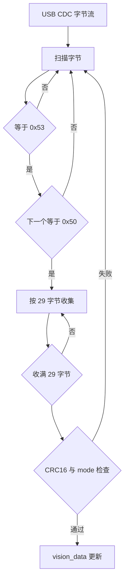
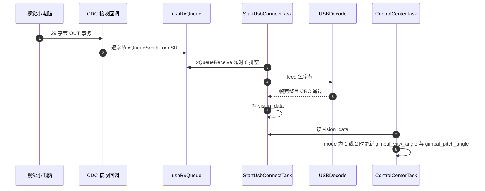

# 视觉链路帧的 USB 承载

本单元的对象是云台板固件 `/home/wyx/rm/2026SentriOmeniGimbal/2026OmniSentryGimbal` 与配套上位机脚本。协议文本在固件仓库根的 `云台串口协议.md`，固件实现分散在 `Communication/Inc/usb_protocol.h` 与 `Task/Inc/UsbConnectTask.h`。

通道本身的传输类型与端点分工在 `01-USB传输类型与端点.md`，接收状态机的逐行实现见 `03-USBDecode解帧实现.md`，上位机侧的完整拆解见 `04-串口通信与协议/06-上位机封包脚本` 单元。

## 1. 字节流上的定长加帧头分帧

USB CDC 对上位机呈现为一个 COM 口，对固件呈现为一个字节流。字节流没有消息边界，上位机一次 `write` 的 29 字节可能在设备侧被拆成两包，也可能与下一帧粘在一个包里。

本工程的分帧策略是定长加帧头：帧头固定为 `'S'` `'P'`（0x53 0x50），帧长固定为 29 或 43 字节，收到帧头后按固定长度取满再校验 CRC16（CRC 是按多项式除法算出的校验值，接收方重算并比对，用来发现传输过程中的位错误）。定长意味着解析器不需要长度域，代价是协议一旦加字段就要同时改两端。

| 链路方向 | 长度 | 帧头 | 校验 | 发送方 |
| --- | --- | --- | --- | --- |
| 视觉到云台 | 29 字节 | 0x53 0x50 | CRC16，覆盖前 27 字节 | 视觉小电脑 |
| 云台到视觉 | 43 字节 | 0x53 0x50 | CRC16，覆盖前 41 字节 | 云台板 |

两个方向的帧头相同而长度不同，所以解析器必须知道自己期望哪种帧长。固件的 `USBDecode` 只处理 29 字节的接收帧，43 字节的发送帧由 `USBProtocol::buildFrame` 组装。



## 2. 两种帧的逐字段布局

### 2.1 视觉到云台，29 字节

| 偏移 | 长度 | 类型 | 字段 | 说明 |
| --- | --- | --- | --- | --- |
| 0 | 1 | uint8 | head0 | 固定 0x53 |
| 1 | 1 | uint8 | head1 | 固定 0x50 |
| 2 | 1 | uint8 | mode | 0 不控制，1 控制不开火，2 控制且开火 |
| 3 | 4 | float | yaw | 目标 yaw 角，弧度 |
| 7 | 4 | float | yaw_vel | 目标 yaw 角速度 |
| 11 | 4 | float | yaw_acc | 目标 yaw 角加速度 |
| 15 | 4 | float | pitch | 目标 pitch 角，弧度 |
| 19 | 4 | float | pitch_vel | 目标 pitch 角速度 |
| 23 | 4 | float | pitch_acc | 目标 pitch 角加速度 |
| 27 | 2 | uint16 | crc16 | 小端，覆盖偏移 0 到 26 |

### 2.2 云台到视觉，43 字节

| 偏移 | 长度 | 类型 | 字段 | 说明 |
| --- | --- | --- | --- | --- |
| 0 | 1 | uint8 | head0 | 固定 0x53 |
| 1 | 1 | uint8 | head1 | 固定 0x50 |
| 2 | 1 | uint8 | mode | 0 空闲，1 自瞄，2 小符，3 大符 |
| 3 | 16 | float[4] | q | 四元数，顺序 w、x、y、z |
| 19 | 4 | float | yaw | 当前 yaw 角，弧度 |
| 23 | 4 | float | yaw_vel | 当前 yaw 角速度 |
| 27 | 4 | float | pitch | 当前 pitch 角，弧度 |
| 31 | 4 | float | pitch_vel | 当前 pitch 角速度 |
| 35 | 4 | float | bullet_speed | 当前弹速 |
| 39 | 2 | uint16 | bullet_count | 累计发射计数 |
| 41 | 2 | uint16 | crc16 | 小端，覆盖偏移 0 到 40 |

两张表与 `云台串口协议.md` 的字段表逐项对应，也与 `Task/Inc/UsbConnectTask.h` 的两个 `#pragma pack(1)` 结构体一致。字段顺序与类型一旦变动，三处必须同步：协议文本、结构体、上位机脚本的格式串。

接收帧在固件里就是一个 packed 结构体，偏移与上表一一对应：

```c
/* 摘录：Task/Inc/UsbConnectTask.h 的接收帧结构体 */
#pragma pack(1)
typedef struct {
    uint8_t  head0, head1, mode;              /* 偏移 0 到 2 */
    float    yaw, yaw_vel, yaw_acc;           /* 偏移 3 到 14 */
    float    pitch, pitch_vel, pitch_acc;     /* 偏移 15 到 26 */
    uint16_t crc16;                           /* 偏移 27，小端，覆盖 0 到 26 */
} vision_to_gimbal_t;                         /* 29 字节 */
#pragma pack()
```

## 3. CRC16 的实测参数与注释冲突

协议里没有写多项式，脚本注释也写错了一处。用 256 项表反推并逐个验证后的结论是：

| 参数 | 取值 | 证据 |
| --- | --- | --- |
| 标准多项式 | 0x1021 | 由反射式 0x8408 反推 |
| 反射式多项式 | 0x8408 | `Algorithm/Src/CRC16.cpp` 的表逐项匹配 |
| 初值 | 0xFFFF | 调用处传入，`usb_protocol.cpp`、`usb_decode.cpp` |
| 输入输出反射 | 是 | 表按低位先进生成 |
| 结果异或 | 0x0000 | 实现里没有异或步骤 |
| 校验值 | `crc16("123456789", 0xFFFF) = 0x6F91` | 实测，等价于 CRC-16/MCRF4XX |

`generate_gimbal_packet.py` 的注释写「多项式 0x8005，初始 0x0000 的表格」，两处都与代码不符：表与固件一致，初值取的是函数默认参数 0xFFFF。文档与代码冲突时以代码为准，这条要显式标出，属待现场确认项。

CRC 字段本身是小端：接收侧用 `reinterpret_cast` 直接读 packed 结构体的 `crc16` 成员，等价于 `data[27] | (data[28] << 8)`。

多项式是反推出来的，不是从文档读到的：拿固件表的前几项，假设标准形式为 0x1021、反射形式为 0x8408，按 LSB-first 重算一遍，与文件里的 256 项逐项比对，全部相同才成立。用同样的方法可以排除 0x8005 的反射形式 0xA001。上位机脚本里的表是同一张，两个方向的校验才能对上。

## 4. 固件发送侧的组帧与清零

`USBProtocol::buildFrame`（`Communication/Src/usb_protocol.cpp`）先填头部、模式、四元数、角度、弹速与计数，清零 `crc16` 后对前 41 字节算 CRC，再写回 `crc16`，返回 `GIMBAL_TO_VISION_LEN`。清零这一步对结果没有影响，因为 CRC 的覆盖范围本来就不含最后两字节，保留它是为了让结构体内容确定。

组帧顺序写成代码：

```cpp
/* 简化：USBProtocol::buildFrame 的组帧与回填 */
pkt.head0 = 0x53; pkt.head1 = 0x50;
pkt.mode  = mode;  /* 之后依次填四元数、角度、弹速与计数 */
pkt.crc16 = 0;     /* 先清零，避免残值参与运算 */
pkt.crc16 = crc16(reinterpret_cast<uint8_t*>(&pkt), GIMBAL_TO_VISION_LEN - 2);
return GIMBAL_TO_VISION_LEN;   /* 43 */
```

长度常量定义在 `Communication/Inc/usb_protocol.h`：`VISION_TO_GIMBAL_LEN = 29`、`GIMBAL_TO_VISION_LEN = 43`。`Task/Inc/UsbConnectTask.h` 的宏注释写着「修正：原 41 字节错误」，说明协议长度曾经被记成 41，43 才是当前值。`云台串口协议.md` 里的 43 字节与代码一致。

组帧的调用点在任务里，每轮发送前构造一次（`Task/Src/UsbConnectTask.cpp`）。传入的 `tx_pkt` 是全局变量，`buildFrame` 直接就地修改它，因此不存在额外拷贝；代价是同一块内存被写两次，先填数据再回填 CRC。若把清零 `crc16` 那一行删掉，在覆盖长度不变的前提下结果仍然正确，但一旦有人把长度改成 `sizeof(pkt)`，CRC 就会把上一帧的残值算进去。

## 5. 固件接收侧与上位机脚本的对齐

接收由 `USBDecode::feed` 按字节推进，细节写在 `03-USBDecode解帧实现.md`。这里只强调帧长的来源：它直接取 `VISION_TO_GIMBAL_LEN`，与结构体大小一致，改协议时改一个常量即可。

两条帧的字段顺序与固件结构体的声明顺序一致，这是直接映射能成立的前提。上位机若只按名字打包而不按顺序，CRC 仍然会通过，但解出的浮点会整体错位，属于最隐蔽的一类问题。



`generate_gimbal_packet.py` 用 `struct.pack('<3B6f', ...)` 组装 29 字节帧，格式串的含义是：小端、3 个单字节、6 个单精度浮点。`struct.pack('<H', crc)` 把 CRC 按小端追加。逐字段对照如下：

| 字段 | Python 格式 | C 类型 | 字节数 |
| --- | --- | --- | --- |
| head0、head1、mode | `3B` | `uint8_t[2]`、`uint8_t` | 3 |
| yaw 到 pitch_acc | `6f` | 6 个 `float` | 24 |
| crc16 | `H` | `uint16_t` | 2 |

总数 3 + 24 + 2 = 29，与固件常量一致。C 结构体用 `__attribute__((packed))` 或 `#pragma pack(1)` 抹掉默认对齐，Python 侧的紧凑 `struct` 才能与之逐字节对齐。

表里的六条可以归成两类：前三条是布局类问题（对齐、覆盖范围、字节序），后三条是协作类问题（帧长约定、同步方式、注释可信度）。布局类问题靠逐字节复算能定位，协作类问题必须两端一起看。

## 6. 易错点

| 易错点 | 现象 | 对应位置 |
| --- | --- | --- |
| 依赖默认结构体对齐 | 字段偏移错位，CRC 覆盖到填充字节 | `usb_protocol.h` 的 packed 声明 |
| CRC 覆盖范围差一字节 | 偶发校验失败，且只在部分数据下出现 | 发送 41 字节，接收 27 字节 |
| 大小端写反 | CRC 字段对不上，浮点全为乱值 | 两侧都用小端 |
| 把 43 字节帧交给 29 字节解析器 | 解析器永远等不满或错位 | `USBDecode` 只认 29 |
| 只改一侧帧长 | 上位机与固件不同步，全帧丢弃 | 常量与脚本各有一份 |
| 相信脚本注释里的多项式 | 用 0x8005 复核，结果对不上 | 实测是 0x1021 反射形式 |

## 7. 小结

核心概念：

| 概念 | 内容 |
| --- | --- |
| 分帧 | USB CDC 是字节流，本工程用固定帧长加 `'S'` `'P'` 帧头做分帧 |
| 两个方向 | 视觉到云台 29 字节，云台到视觉 43 字节，帧头相同 |
| CRC 参数 | 实测是 CRC-16/MCRF4XX，反射式多项式 0x8408，初值 0xFFFF，校验值 0x6F91 |
| 三方对齐 | 两侧字段表、固件结构体与上位机脚本的偏移逐项一致，共 29 与 43 字节 |
| 注释冲突 | 脚本注释里的多项式与初值都不成立，以代码与实测为准 |

设计权衡：

| 决策 | 选择 | 收益 | 代价 |
| --- | --- | --- | --- |
| 分帧方式 | 定长加帧头 | 不需要长度域与转义 | 加字段必须同时改两端 |
| 校验 | CRC16 覆盖除校验字段外的全部字节 | 检错能力强，覆盖头与数据 | 每帧多 2 字节，解析多一次查表 |
| 字节序 | 全部小端 | 与 STM32 原生一致，可直接映射结构体 | 与网络序习惯相反，跨平台要显式处理 |
| 模式字段 | 1 字节枚举 | 语义简单，便于上层分支 | 取值非法时只能整帧丢弃 |
| 结构体映射 | packed 直接 reinterpret_cast | 无需逐字段拷贝 | 依赖编译器扩展，偏移不能自动检查 |

## 8. 练习

基础题：

1. 写出 29 字节帧里 CRC16 的覆盖范围，并说明为什么最后一字节的偏移是 26。
2. `struct.pack('<3B6f', ...)` 一共产生多少字节？与 C 结构体大小比较。
3. 43 字节帧里 `q` 占多少字节？它与 `yaw`、`pitch` 的字段类型相同吗？
4. 若把 mode 从 1 改成 3，固件侧会发生什么？分别从 `USBDecode` 与 `ControlCenterTask` 的角度回答。

挑战题：

5. 脚本注释写 0x8005、初值 0x0000，实测是 0x1021 反射形式、初值 0xFFFF。说明这两处差异各自会让校验值变成什么，并给出验证脚本的思路。
6. 假设视觉小电脑把 43 字节帧误发给云台板，`USBDecode` 的状态机会怎么走？会不会长期卡死？
7. 如果要求帧里增加一个 8 字节的时间戳，且不能改包上限，说明需要同时改动的固件常量、结构体与上位机脚本位置。

---

### 附：本页引用的固件路径

| 路径 | 用途 |
| --- | --- |
| `2026OmniSentryGimbal/Communication/Inc/usb_protocol.h` | 帧头、两个长度常量、两个枚举、两个 packed 结构体 |
| `2026OmniSentryGimbal/Communication/Src/usb_protocol.cpp` | `buildFrame` 组装与 CRC 计算 |
| `2026OmniSentryGimbal/Communication/Src/usb_decode.cpp` | 接收侧解帧与 CRC 校验 |
| `2026OmniSentryGimbal/Algorithm/Src/CRC16.cpp` | 256 项表与查表算法 |
| `2026OmniSentryGimbal/Task/Inc/UsbConnectTask.h` | 打包结构体与长度宏 |
| `2026OmniSentryGimbal/generate_gimbal_packet.py` | 上位机封包脚本与 CRC 表 |
| `2026OmniSentryGimbal/云台串口协议.md` | 协议字段表与错误处理约定 |
