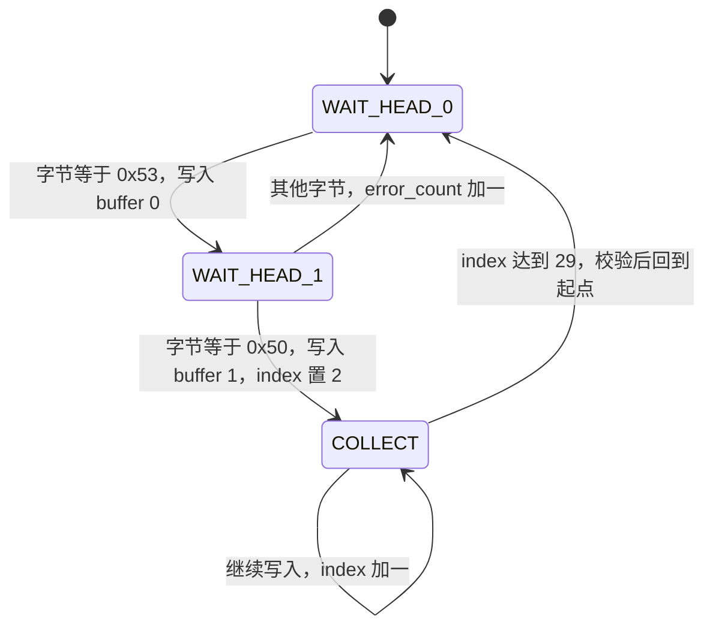
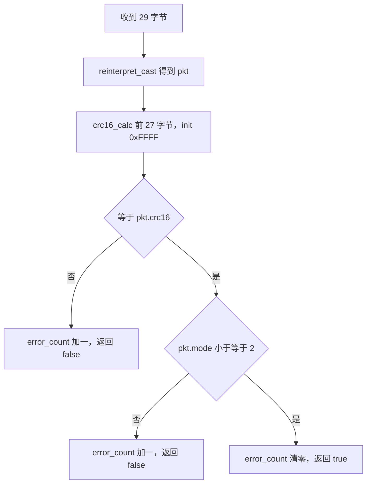

# USBDecode 解帧实现

本单元的对象是云台板固件 `/home/wyx/rm/2026SentriOmeniGimbal/2026OmniSentryGimbal`，实现文件 `Communication/Src/usb_decode.cpp`（123 行），接口在 `Communication/Inc/usb_decode.h`。

CRC16 的参数细节与上位机脚本的对照写在 `04-串口通信与协议/06-上位机封包脚本` 单元，帧的字段布局见 `02-视觉链路帧的USB承载.md`，解析结果进入任务后的走向见 `04-收发频率与任务模型.md`。

## 1. 三态状态机各管一件事

从 `CDC_Receive_FS` 出来的是没有边界的字节序列，解析器要做三件事：找到帧头、按固定长度取满一帧、确认这帧可用。本实现把前两件事拆成三个状态，第三件事放在收满 29 字节之后一次性完成。

| 状态 | 职责 | 出口条件 |
| --- | --- | --- |
| `WAIT_HEAD_0` | 找 `'S'`（0x53） | 当前字节等于 0x53 |
| `WAIT_HEAD_1` | 确认 `'P'`（0x50） | 等于 0x50 则进入收集，否则退回起点并计一次错误 |
| `COLLECT` | 收满 29 字节 | `index_ >= VISION_TO_GIMBAL_LEN` |

状态机只需要一个字节的输入，因此它可以被任意粒度的调用驱动：中断里、任务里，甚至离线回放一段抓包。当前固件把调用放在任务里，是为了让解析时间可控。

解析器只认一种帧长。43 字节的反馈帧由固件自己发出，不经过这个解析器，所以不存在两种长度混在一个状态机里的问题。



之所以要三个状态而不是两个，是因为帧头是两个字节。只用一个「等 0x53」状态无法确认第二个字节是 0x50 还是另一帧的 0x53，把判断压进收集阶段会让缓冲区起点不确定。拆成两个状态后，每个状态只判断一个字节，逻辑与协议表一一对应，代价是帧头失配时要退回并计一次错误。

## 2. feed 的三个分支与重同步代价

### 2.1 全局对象与构造

`Communication/Src/usb_decode.cpp` 定义一个全局实例：

```cpp
USBDecode usb_decoder;
```

`Task/Src/UsbConnectTask.cpp` 通过 `extern USBDecode usb_decoder;` 引用它。构造函数（`usb_decode.cpp`）把状态置为 `WAIT_HEAD_0`，`index_` 与 `error_count_` 清零。缓冲区长度就是帧长常量：

```cpp
uint8_t buffer_[USBProtocol::VISION_TO_GIMBAL_LEN];   // usb_decode.h
```

feed 的返回值被任务用来决定是否读取 packet()，因此它在「收满且合法」与「未收满」之外还要区分「收满但不合法」。三者都返回 false，任务只会在 true 时更新 vision_data。

### 2.2 前两个分支只搬一个字节

`feed(uint8_t byte)` 返回 `bool`，表示这一字节之后是否解析到完整合法帧。前两个分支各只搬一个字节：`WAIT_HEAD_0` 命中 0x53 后写入 `buffer_[0]` 并转到 `WAIT_HEAD_1`；`WAIT_HEAD_1` 命中 0x50 后写入 `buffer_[1]`，把 `index_` 置 2 并转入 `COLLECT`（`usb_decode.cpp`）。

帧头不匹配时退回 `WAIT_HEAD_0` 并把 `error_count_` 加一。退回时不再用当前字节重新判断是否为 0x53。字节序列 `0x53 0x53 0x50` 里的第二个 0x53 会被丢掉，这一帧要到下一帧才能重新同步。

`COLLECT` 分支只做累加与判满（`usb_decode.cpp`）：

```cpp
case State::COLLECT:
    buffer_[index_++] = byte;
    if (index_ >= USBProtocol::VISION_TO_GIMBAL_LEN) {
        state_ = State::WAIT_HEAD_0;
        index_ = 0;
        ...
```

判满之后立刻复位状态与下标，随后才做校验。校验失败时解析器已经回到等帧头的状态，残帧不会带进下一轮。

状态与下标都放在对象成员里而不是局部变量，是因为 `feed` 每次只处理一个字节，调用之间必须保留进度。中断只负责把字节送进队列，调用 `feed` 的其实是任务，所以这些成员不存在跨上下文并发访问的问题。

## 3. 收满之后的 CRC16 与 mode 双重把关

第一条是 CRC16（`usb_decode.cpp`）：

```cpp
uint16_t calc = crc16_calc(buffer_, USBProtocol::VISION_TO_GIMBAL_LEN - 2, 0xFFFF);
if (calc == pkt.crc16) { ... }
```

覆盖长度 27 字节，初值 0xFFFF，用的是 `Algorithm/Src/CRC16.cpp` 的反射式查表（标准多项式 0x1021，反射形式 0x8408）。`pkt.crc16` 由 packed 结构体直接读出，按小端解释，等价于 `buffer_[27] | (buffer_[28] << 8)`。

第二条是模式范围（`usb_decode.cpp`）：`pkt.mode <= 2` 才接受。协议里 0、1、2 分别是不控制、控制不开火、控制且开火，其他取值视为错误。这一条挡住的是 CRC 正确但语义非法的帧。

| 检查 | 条件 | 失败后果 |
| --- | --- | --- |
| CRC16 | 前 27 字节的查表结果等于帧内字段 | `error_count_` 加一，返回 false |
| mode 范围 | `mode <= 2` | `error_count_` 加一，返回 false |



mode 的合法范围写在解析器里，而不是写成一张枚举表。如果上层协议把模式扩展到 3 或 4，这里必须同步放宽，否则新模式的帧会被静默丢弃，现象是上位机发送成功、vision_data 却停留在旧值。

两道检查的顺序固定：先 CRC 后 mode。CRC 便宜，查表 27 次；mode 判断只读一个字节。反过来先判 mode 会让坏帧更早退出，但 CRC 已经算完，省不下时间。当前顺序在语义上也更自然：先确认字节没被破坏，再确认字段合法。

## 4. error_count 只反映近期质量

`error_count_` 的用法是累计错误、成功清零：帧头失配、CRC 失败、mode 非法各自加一（`usb_decode.cpp、95、101`），一次成功解析把它清零（`usb_decode.cpp`）。

解析失败有两种来源：字节在链路上被破坏，或字节根本没到齐。前者 CRC 会失败，后者会在收集阶段凑出错误的字节组合，同样以 CRC 失败收场。要区分它们，只能把队列水位与错误计数放在一起看：水位顶到 128 的是后一种，水位正常而错误计数增长的是前一种。

清零发生在解析成功之后，而不是失败之后，因此一次成功就能把之前的连续错误全部抹掉。

这个字段回答的是最近一串字节里有没有持续出错，不适合当累计计数器用。接口上的 `errorCount()` 与 `resetErrorCount()`（`usb_decode.h`）全工程没有调用点，属于留给调试的接口。

要观察链路质量，`error_count_` 只提供连续性的信息。想统计历史错误率，需要在解析成功与失败两处各加一个单调递增的计数，两者相除才是有意义的比例；只在失败处累加、成功处清零的写法无法累计。

## 5. packed 结构体直接映射的前提

`usb_decode.cpp` 用一次 `reinterpret_cast` 把 29 字节缓冲区当成 `USBProtocol::VisionToGimbal`：

```cpp
const auto& pkt = *reinterpret_cast<const USBProtocol::VisionToGimbal*>(buffer_);
```

解析器不检查字段的物理合理性，例如四元数是否归一化、弹速是否为正。这类判断需要协议之外的知识，放在解析器里会让它承担过多职责；当前把它们留给上层和离线脚本。

这样做的前提是结构体定义里有 `__attribute__((packed))`（`Communication/Inc/usb_protocol.h`），否则编译器插入填充字节，偏移与协议表不再对应。缓冲区长度与结构体大小都由 `VISION_TO_GIMBAL_LEN` 决定，两边不会脱节。

文件里保留了另一种写法，被注释掉的手动解析函数 `parse_vision_to_gimbal_manual`（`usb_decode.cpp`）。它逐字段 `memcpy`，本可以避开对齐问题，但把 CRC 读成 `(data[27] << 8) | data[28]`，即大端，与协议不符；紧随其后的注释又写出了小端写法并留下需要确认的字样。该函数没有调用点，生效的是 `reinterpret_cast` 那条路径。

换一个角度看这三态设计：它把「同步」与「收集」分成两段，同步阶段的输入是一个字节，收集阶段的输入是一帧。改动重同步策略时只需要动前两个状态，收集与校验不受影响；反过来，如果想增加第二种帧长，收集阶段的判据就要带上帧类型，三个状态也要相应扩展。

## 6. 易错点

| 易错点 | 现象 | 对应位置 |
| --- | --- | --- |
| 帧头失配后不重判当前字节 | 连续两个 0x53 时跳过该帧的帧头 | `usb_decode.cpp` |
| 把 CRC 覆盖长度写成 29 | 校验永远不过 | 覆盖长度是 27 |
| CRC 初值传 0 | 校验值与上位机对不上 | 两侧都是 0xFFFF |
| 相信被注释的手动解析 | 按大端复核 CRC，结论矛盾 | 以 packed 映射为准 |
| 结构体去掉 packed | 偏移错位，浮点全乱 | `usb_protocol.h` |
| 把 error_count 当累计错误率 | 数字总在 0 附近，看不出历史 | 成功即清零 |
| 认为 mode 检查多余 | 放行非法模式，上层分支落到默认值 | `usb_decode.cpp` |

以上七条里，前四条都会让帧被拒收，后三条只是观测方式不当。改动解析器时先确认自己动的是哪一类，避免把观测问题当成协议问题来改参数。

## 7. 小结

核心概念：

| 概念 | 内容 |
| --- | --- |
| 三个状态 | 等 0x53、等 0x50、按 29 字节收集 |
| 收满即复位 | 收满一帧后先复位状态再校验，残帧不会跨帧累积 |
| 两道检查 | CRC16（前 27 字节、初值 0xFFFF）与 mode 范围 |
| 错误计数 | `error_count_` 累计错误、成功清零，只反映近期链路质量 |
| 字段解析 | 依赖 packed 结构体直接映射，注释里的手动解析写法字节序有误且无调用点 |

设计权衡：

| 决策 | 选择 | 收益 | 代价 |
| --- | --- | --- | --- |
| 帧长 | 由 `VISION_TO_GIMBAL_LEN` 单一常量决定 | 缓冲区与结构体不会脱节 | 改协议要动同一个常量 |
| 字段解析 | reinterpret_cast 到 packed 结构体 | 无逐字段拷贝，代码短 | 依赖编译器扩展 |
| 帧头失配处理 | 退回等 0x53，不重判当前字节 | 逻辑简单 | 连续头字节会丢一帧 |
| 语义检查 | 额外判断 mode 范围 | 拦住 CRC 正确的非法帧 | 模式取值扩展时要同步改这里 |
| 错误统计 | 成功清零 | 反映近期质量 | 无法统计历史错误率 |

## 8. 练习

基础题：

1. 画出字节序列 `0x53 0x53 0x50` 进入 `feed` 后的状态变化，并说明哪一帧被跳过。
2. CRC16 的覆盖长度是多少？为什么不是 29？
3. `error_count_` 在一次成功解析后变成多少？为什么这样设计？
4. 结构体去掉 `packed` 后，`yaw` 字段的偏移会变成多少？

挑战题：

5. 若把 `WAIT_HEAD_1` 失败分支改成用当前字节重新判断是否为 0x53，说明对连续帧头场景的影响。
6. 给定一帧字节，说明如何用 `crc16_calc` 与上位机脚本交叉验证校验值，并指出两边初值必须一致的原因。
7. `packet()` 又做了一次 `reinterpret_cast`（`usb_decode.cpp`），与 `feed` 里那次相比，有没有额外风险？

---

### 附：本页引用的固件路径

| 路径 | 用途 |
| --- | --- |
| `2026OmniSentryGimbal/Communication/Inc/usb_decode.h` | 状态枚举、缓冲区长度、错误计数接口 |
| `2026OmniSentryGimbal/Communication/Src/usb_decode.cpp` | 状态机、校验与映射 |
| `2026OmniSentryGimbal/Communication/Inc/usb_protocol.h` | 帧头常量与 packed 结构体 |
| `2026OmniSentryGimbal/Algorithm/Src/CRC16.cpp` | 反射式查表算法 |
| `2026OmniSentryGimbal/Task/Src/UsbConnectTask.cpp` | 解析器调用点与结果使用 |
