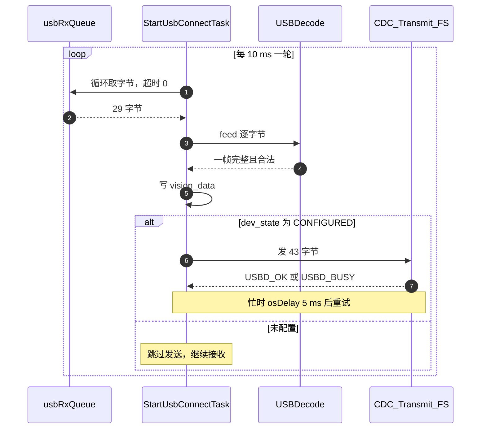
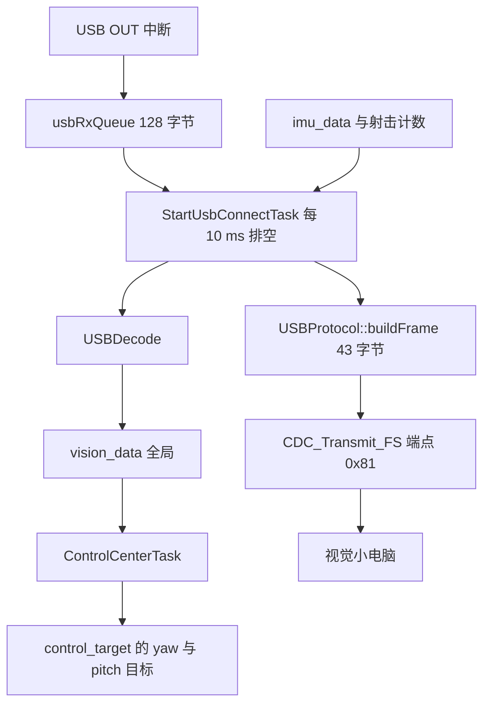

# 收发频率与任务模型

本单元的对象是云台板固件 `/home/wyx/rm/2026SentriOmeniGimbal/2026OmniSentryGimbal`，主要文件是 `Task/Src/UsbConnectTask.cpp`（182 行）与 `Core/Src/freertos.c`。

接收侧的解析实现见 `03-USBDecode解帧实现.md`，发送侧在类库里的提交与完成路径见 `04-发送链路与忙等待.md`（`05-USB Device/01-CDC虚拟串口` 单元）。同一份代码放到时间轴上看，要回答谁触发、多久一次、卡在哪里三个问题。

## 1. 接收事件驱动与发送定时的不对称

USB 链路两个方向由两套不同的机制驱动，这一点比记住周期数字更重要。

接收方向是事件驱动的：主机什么时候发数据不可预知，数据到了就进中断，中断只把字节塞进队列，解析在任务里做。发送方向是定时的：任务按固定周期组装一帧，主动尝试发送。

| 方向 | 触发源 | 频率 | 阻塞点 |
| --- | --- | --- | --- |
| 视觉到云台 | USB OUT 中断 | 由视觉侧决定，最高每帧一包 | 队列满时静默丢弃 |
| 云台到视觉 | 任务内的 10 ms 判据 | 100 Hz | 上一包未发完时忙等 |

发送周期与已完成文档的口径一致：`docs/01-FreeRTOS/01-任务与调度/01-任务与调度基础.md` 把视觉小电脑的收发包描述为 100 Hz，对应这里的 `current_time - last_send_time >= 10`（`UsbConnectTask.cpp`）。

## 2. 任务创建：栈、优先级与名字截断

任务类是 `StartUsbConnectTask : TaskBase`（`Task/Inc/UsbConnectTask.h`）。实例化与启动在文件末尾：

```cpp
static StartUsbConnectTask usbconnectTask;

void StartUsbConnectTask_Init() {
  usbconnectTask.start((char *) "StartUsbConnectTask", 2048, osPriorityNormal);
}
```

栈 2048 是 word 单位，Cortex-M4 上一个 word 4 字节，即 8 KB。优先级 `osPriorityNormal`，在 CMSIS-OS2 到 FreeRTOS 的映射里等于优先级 3。启动调用点在 `Core/Src/freertos.c`。

| 参数 | 取值 | 说明 |
| --- | --- | --- |
| 任务名 | StartUsbConnectTask | 22 个字符，超过 16 字节的名字缓冲 |
| 栈 | 2048 word | 8 KB |
| 优先级 | osPriorityNormal | 映射到 FreeRTOS 优先级 3 |
| 周期 | osDelay(10) | 10 ms |

任务名长度与截断在 `docs/01-FreeRTOS/01-任务与调度/01-任务与调度基础.md` 里已有结论：`pcTaskName` 是 16 字节，长名字只显示前 15 个字符加结束符。

## 3. 接收侧排空队列与逐字节喂帧

`run()` 每轮开头排空队列（`UsbConnectTask.cpp`）：

```cpp
while (xQueueReceive(usbRxQueue, &byte, 0) == pdTRUE) {
    if (usb_decoder.feed(byte)) {
        const auto& pkt = usb_decoder.packet();
        vision_data.mode = pkt.mode;
        ...
    }
}
```

超时参数是 0，表示不等待：有多少取多少，取完继续往下走。队列由 `CDC_Receive_FS` 在中断里填充，深度 128 字节（`freertos.c`）。一个 29 字节的帧需要 29 次入队；两个 USB 包之间任务只要排空一次就能跟上。队列溢出的场景写在 `05-易错点与调试.md`。

队列句柄在 `freertos.c` 定义、`freertos.c` 创建为 `xQueueCreate(128, sizeof(uint8_t))`。`UsbConnectTask.cpp` 与 `usbd_cdc_if.c` 各自 `extern` 引用同一个对象。

## 4. 发送侧的两层条件与忙等重试

发送被两层条件包住（`UsbConnectTask.cpp`）：先判断设备处于已配置状态，再判断距上次发送满 10 ms。

```cpp
if (hUsbDeviceFS.dev_state == USBD_STATE_CONFIGURED) {
    uint32_t current_time = HAL_GetTick();
    if (current_time - last_send_time >= 10) {
        last_send_time = current_time;
        ...
        while (CDC_Transmit_FS(...) == USBD_BUSY) { osDelay(5); }
    }
}
```

`dev_state` 判断挡住的是主机还没配置或已断开的情况，此时设备没有可用端点。`USBD_STATE_CONFIGURED` 由设备库在枚举完成后设置。

忙等循环的处理是：返回 `USBD_BUSY` 就 `osDelay(5)` 后重试，直到发出去。10 ms 周期内最多等几次，实际风险是视觉端长时间不读数据时任务被拖住；拖住期间接收也停摆，因为收发在同一个任务里。



## 5. 视觉数据到控制目标的映射链

接收到的帧写进全局 `VisionToGimbalData vision_data`（`UsbConnectTask.cpp`），结构体定义在 `Task/Inc/UsbConnectTask.h`。消费它的是控制中心任务：

| 条件 | 动作 | 出处 |
| --- | --- | --- |
| `vision_data.mode` 为 1 或 2 | `gimbal_yaw_angle` 取 yaw、`gimbal_pitch_angle` 取 pitch，弧度转度 | `ControlCenterTask.cpp` |
| 遥控器通道参与 | 在视觉目标上叠加 `dbus.ch[1] * 0.001f` 与 `dbus.ch[0] * 0.001f` | `ControlCenterTask.cpp` |
| `vision_data.mode` 为 2 | 置 `friction_ready`，允许摩擦轮启动 | `ControlCenterTask.cpp` |
| `dbus.s2 == 1` 且 `friction_ready` | 击发条件之一 | `ControlCenterTask.cpp` |

发送方向的数据来自 IMU 与射击计数：`imu_data.gimbal_yaw_total_angle`、`imu_data.roll`、`imu_data.gyro[2]`、`imu_data.gyro[0]`、`AmmoSpeed`、`TotalAmmoShooted`（`UsbConnectTask.cpp`）。四元数由 `eulerToQuaternion()` 从欧拉角构造（`UsbConnectTask.cpp`）。

这里有一处遗留问题：调用 `eulerToQuaternion` 时把 `imu_data.roll` 同时传给了第二、第三个参数，而函数内部按 yaw、pitch、roll 解释入参。注释写明板子的 roll 角对应云台的 pitch，所以前两个参数是有意为之，但第三个参数再传一次 roll 使输出四元数的 roll 分量失去意义。这条按代码可观察行为记录，实际取向待现场确认。



## 6. 带宽与队列余量的定量核算

按 10 ms 周期发送 43 字节，一帧含 41 字节有效载荷与 2 字节校验。仅算应用数据：

$$R = \frac{43 \times 8}{10\,\text{ms}} = 34.4\ \text{kbit/s}$$

全速 USB 的理论带宽是 12 Mbit/s，这个占用率不到 0.3%。接收方向的速率由视觉侧决定，不做高频重发时同样远低于上限。

队列一侧的余量更关键：队列深度 128 字节，一个 USB 包最多 64 字节，所以任务只要能在一个包的时间内被调度一次就不会积压。若任务因为忙等发送而延后，第二个包到达时队列可能接近满，第三个包开始丢字节。

## 7. 易错点

| 易错点 | 现象 | 对应位置 |
| --- | --- | --- |
| 认为接收也在 10 ms 节拍上 | 以为 10 ms 才收一次，误判丢帧 | 接收是中断入队、任务排空 |
| 忽略 dev_state 判断 | 未枚举完成就发送，返回失败 | `UsbConnectTask.cpp` |
| 把 `osDelay(10)` 当成精确 10 ms | 发送周期实际大于 10 ms | 周期含任务执行时间 |
| 在任务里忙等发送 | 视觉端不取数据时接收也停 | `UsbConnectTask.cpp` |
| 任务名超过 16 字节 | 调试器里名字被截断 | 任务名 22 字符 |
| 认为 vision_data 直接就是控制目标 | 找不到赋值链 | 中间隔着 ControlCenterTask |
| 忽略四元数构造的实参重复 | 以为四元数包含真实 roll | `UsbConnectTask.cpp` |

## 8. 小结

核心概念：

| 概念 | 内容 |
| --- | --- |
| 两个节奏 | 接收事件驱动，发送 10 ms 定时，两个方向节奏不同 |
| 任务参数 | 任务是 `StartUsbConnectTask`，栈 2048 word，优先级 `osPriorityNormal`，周期 10 ms |
| 收发路径 | 接收在任务里排空 128 字节队列并逐字节喂解析器；发送受 `dev_state` 与 10 ms 双条件约束 |
| 数据流向 | 视觉数据写入 `vision_data`，由控制中心任务按 mode 取值映射到控制目标 |
| 相互影响 | 发送侧忙等会让接收一起延后，两者在同一个任务里 |

设计权衡：

| 决策 | 选择 | 收益 | 代价 |
| --- | --- | --- | --- |
| 收发合并 | 同一个任务 | 只需一套栈，逻辑紧凑 | 发送忙等会阻塞接收 |
| 接收入队 | 中断逐字节入队、任务排空 | 中断里只做入队，时间可控 | 队列满时静默丢字节 |
| 发送周期 | 10 ms | 100 Hz，够视觉使用，带宽占用极低 | 周期含任务执行时间，不精确 |
| 发送重试 | 忙等加 osDelay(5) | 实现简单，不丢帧 | 极端情况下拖住整个任务 |
| 数据传递 | 全局 vision_data | 无锁、无拷贝 | 依赖控制中心任务的调用时机 |

## 9. 练习

基础题：

1. 计算 43 字节帧在 10 ms 周期下的应用层比特率，并与全速 USB 带宽比较。
2. 任务名是 22 个字符，`pcTaskName` 是 16 字节，调试器里会显示成什么？
3. `xQueueReceive` 的超时参数传 0 与传 `portMAX_DELAY`，行为差别是什么？
4. 视觉数据在什么条件下会影响 `control_target` 的 yaw 与 pitch？

挑战题：

5. 若把队列深度从 128 改成 256，能解决哪类丢包？还有哪类问题解决不了？
6. 说明把发送拆到独立任务后的收益与代价，至少给出一条栈与优先级上的具体影响。
7. 视觉侧停止读取时，`CDC_Transmit_FS` 会持续返回 `USBD_BUSY`。推演 100 ms 后 `last_send_time` 与接收路径的状态，并说明恢复条件。

---

### 附：本页引用的固件路径

| 路径 | 用途 |
| --- | --- |
| `2026OmniSentryGimbal/Task/Src/UsbConnectTask.cpp` | 任务主循环、收发逻辑 |
| `2026OmniSentryGimbal/Task/Inc/UsbConnectTask.h` | 任务类、协议结构体与常量 |
| `2026OmniSentryGimbal/Core/Src/freertos.c` | 队列创建与任务启动 |
| `2026OmniSentryGimbal/Task/Src/ControlCenterTask.cpp` | 视觉数据到控制目标的映射 |
| `2026OmniSentryGimbal/USB_DEVICE/App/usbd_cdc_if.c` | 中断入队与发送接口 |
| `docs/01-FreeRTOS/01-任务与调度/01-任务与调度基础.md` | 任务名截断与优先级的既有结论 |
