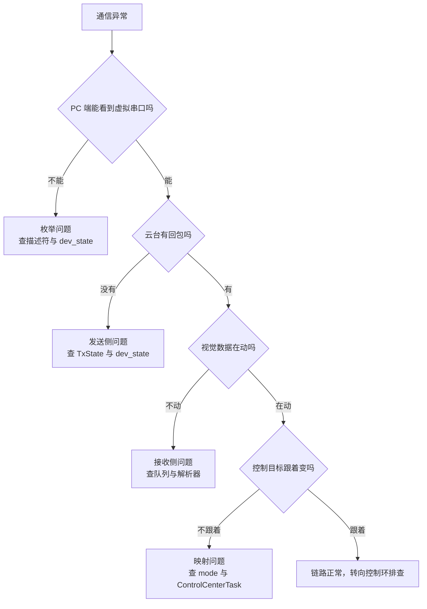
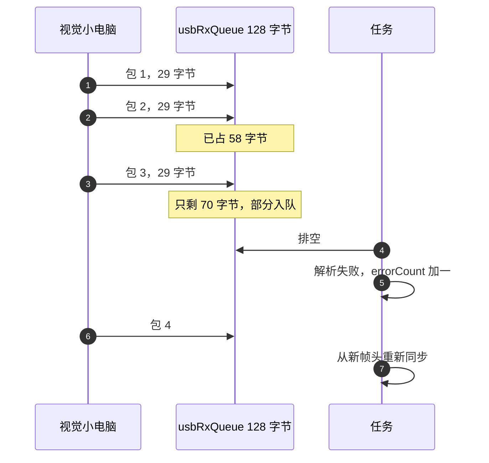

# USB 视觉链路的易错点与分诊

「05-USB Device / 03-USB协议收发」三个方向的现场问题汇总在这里，源码对象仍是云台板固件 `/home/wyx/rm/2026SentriOmeniGimbal/2026OmniSentryGimbal`。

通道与端点见 `01-USB传输类型与端点.md`，帧格式与 CRC 参数见 `02-视觉链路帧的USB承载.md`，状态机见 `03-USBDecode解帧实现.md`，任务节拍见 `04-收发频率与任务模型.md`。

## 1. 可观测的七个量

排查 USB 链路之前，先明确有哪些量可以取。设备侧能直接读的内存量不多，但够用。

| 观测量 | 取法 | 正常表现 | 位置 |
| --- | --- | --- | --- |
| 设备状态 | `hUsbDeviceFS.dev_state` | 枚举后为 `USBD_STATE_CONFIGURED` | `usb_device.c` |
| 发送端点忙标志 | `hcdc->TxState` | 空闲为 0，发送中非 0 | `usbd_cdc_if.c` |
| 解析错误计数 | `usb_decoder.errorCount()` | 持续成功解析时回到 0 | `usb_decode.cpp` |
| 队列积压 | `uxQueueMessagesWaiting(usbRxQueue)` | 通常接近 0 | `freertos.c` |
| 接收缓冲 | `UserRxBufferFS` | 每次重挂后由库改写 | `usbd_cdc_if.c` |
| 视觉数据 | `vision_data` 七个字段 | mode 与上位机发送值一致 | `UsbConnectTask.cpp` |
| 控制目标 | `control_target.gimbal_yaw_angle` 等 | AI 模式下跟随 vision_data | `ControlCenterTask.cpp` |

七个量里只有 dev_state 与 errorCount() 有接口，其余靠调试器直接读内存。表里的位置是变量或函数的定义点，不是赋值点；例如 usbd_cdc_if.c 是缓冲数组的定义，其内容由库层在每次重挂时改写。

队列积压这一项需要自己加临时打印，固件里没有现成接口。其它几项都是全局变量，调试器直接看即可。

设备侧看不到主机的发送动作，所以「回调没命中」不能直接推出发送侧有问题，还需要在主机侧确认写入是否成功。

队列水位的读法有两种：`uxQueueMessagesWaiting()` 返回当前消息数，适合调试器里调用一次；直接读 TCB 里的 `uxMessagesWaiting` 字段更快，但要注意它在中断里会被更新，单次读到的值可能已经过期。两种做法都只用于观察，不要把它当成控制量。



## 2. 按现象分诊的对照表

| 现象 | 可能原因 | 定位手段 | 源码位置 |
| --- | --- | --- | --- |
| PC 端看不到 COM 口 | 引脚复用或时钟未开；设备库未启动；USB 线只有供电 | 查 `dev_state`，用示波器看 DP 上拉 | `usbd_conf.c` |
| 能看到 COM 口但没有数据 | 未 `SET_CONFIGURATION`；端点未挂；上位机没发 | 读 `dev_state` 与 `errorCount()` | `usbd_cdc_if.c` |
| 偶尔丢帧，重发就好 | 队列 128 字节溢出；任务被发送忙等拖住 | 加打印看 `uxQueueMessagesWaiting` | `freertos.c`、`UsbConnectTask.cpp` |
| 帧头正确但校验总不过 | CRC 覆盖范围或初值不对；结构体未 packed | 用上位机脚本同参数复算 | `usb_decode.cpp` |
| 数据看着像浮点数错位 | 结构体对齐不同；大小端不一致 | 打印 `sizeof` 与逐字节偏移 | `usb_protocol.h` |
| mode 一直为 0 | 上位机发 0；解析被 mode 检查丢弃 | 打印原始 29 字节 | `usb_decode.cpp` |
| 发送不出去且任务卡顿 | 视觉端不取数据，`USBD_BUSY` 循环 | 看 `TxState` 与任务运行周期 | `UsbConnectTask.cpp` |
| 控制目标跳到固定值 | mode 为 2 时摩擦轮与击发条件被满足 | 看 `friction_ready` 与 `dbus.s2` | `ControlCenterTask.cpp` |

分诊表里的每一条都能用现有全局变量验证，不需要新增调试接口；如果需要临时打印，注意不要在中断里做格式化输出。现象描述尽量用看得见的东西表达，例如「PC 端看不到 COM 口」而不是「枚举失败」，前者才能指导下一步查什么。

分诊表按现象分组，不按文件分组，目的是让现场先锁定层，再去翻代码。表中每一行的定位手段都只读全局变量或打一次临时打印，不需要重新烧写逻辑。

分诊表与典型问题之间是互补关系：分诊表按现象给出第一落点，典型问题解释这些现象背后的机理。现场时间有限时先走分诊表，锁定层之后再读对应小节，避免一上来就逐行读状态机。

## 3. 四类典型问题

### 3.1 队列溢出导致的帧错位

队列深度 128 字节，一个 USB 包最多 64 字节。任务若因发送忙等被延后，两个包就接近填满队列，第三个包开始丢字节。丢的是中间字节，`USBDecode` 的状态机不会知道，它只会把残缺的字节当成数据收集，直到长度够了做 CRC 校验并失败。

失败之后解析器回到等帧头状态，下一帧可以重新同步。所以现象是偶发丢帧而不是永久卡死。



把队列深度翻倍能吸收更长的阻塞，但只要任务周期与到达率不匹配，溢出只是被推迟；可行的解法是让排空频率高于最坏到达速率。

任务侧的一次循环把排空与发送串在一起，这正是两个问题会互相牵连的原因：

```c
/* 简化：任务里先排空队列，再尝试发送 */
while (xQueueReceive(usbRxQueue, &byte, 0) == pdTRUE) {
    decoder.feed(byte);              /* 逐字节推进状态机 */
}
if (CDC_Transmit_FS(buf, len) == USBD_BUSY) {
    osDelay(5);                      /* 主机没取走上一帧，任务被拖在这里 */
    return;                          /* 接收排空一并被推迟，队列开始积压 */
}
```

### 3.2 发送端忙等拖住接收

`CDC_Transmit_FS` 在上一包未完成时返回 `USBD_BUSY`，任务用 `osDelay(5)` 重试。视觉端不读数据时重试会一直持续，同一任务里的接收排空也被推迟。判断依据是任务的实际周期被拉长，而 `vision_data` 的更新时间间隔变大。

判断忙等是否真的发生了，可以看 CDC_Transmit_FS 的返回值序列：连续多次 USBD_BUSY 说明主机没有及时取走上一帧，而不是发送代码本身有问题。

### 3.3 结构体对齐导致的字段错位

29 与 43 字节的长度来自 packed 结构体。把 `__attribute__((packed))` 去掉后，结构体在 32 位目标上会按 4 字节对齐，长度变成 32 与 44（本机 gcc 实测）。此时 `VISION_TO_GIMBAL_LEN` 仍写 29，解析器收满 29 字节就交给 `reinterpret_cast`，读到的是错误布局。

打包结构体在本工程有两份定义，一份在 usb_protocol.h，一份在 UsbConnectTask.h。去掉 packed 只要漏掉任一份，对应路径就会读到错误布局，所以改动时要两份一起看。

```c
/* 示意：packed 与否决定字段偏移 */
#pragma pack(1)
typedef struct { uint8_t head[3]; float v[6]; uint16_t crc; } pkt_t;  /* 29 字节，crc 在偏移 27 */
#pragma pack()
/* 去掉 packed 后编译器按 4 字节对齐插入填充，长度变 32，crc 偏移不再是 27 */
```

### 3.4 死代码里的错误字节序

`parse_vision_to_gimbal_manual` 把 CRC 读成大端，注释里又写着小端写法。它是被注释掉的历史实现，改动或复用时容易照抄。生效路径是 packed 结构体直接映射，按小端。

注释里的正确写法与生效路径一致，说明作者当时已经发现大端读法是错的；把这段代码当作参考实现是常见误用。

## 4. 从枚举到映射的六步排查顺序

1. 先确认枚举：`dev_state` 是否为 `USBD_STATE_CONFIGURED`。不是就先查描述符与硬件。
2. 再看接收是否进入：加打印统计 `CDC_Receive_FS` 被调用的次数。
3. 再看队列是否溢出：打印 `uxQueueMessagesWaiting` 的峰值。
4. 再看解析是否成功：读 `errorCount()`，成功解析会清零，持续非零说明在丢帧。
5. 再看 CRC：用上位机脚本对同一串字节复算，确认覆盖范围与初值。
6. 最后看映射：确认 `vision_data.mode` 与 `control_target` 的变化符合预期。

这个顺序的价值在于每一步都能排除掉一类原因，不用在描述符、解析、任务调度之间反复切。

第 3 步的水位要连续采样，单次读到的值通常接近 0，看不出突发；第 4 步的错误计数同样要看趋势而不是瞬时值。

六步里前两步与第五步最常被跳过。跳过枚举检查会让人在解析器里找硬件问题，跳过回调命中检查会让人怀疑 CRC 参数，跳过复算则容易把队列丢包误判成校验写错。每一步都留下一个可证伪的观测值，比反复改代码试更快。

## 5. 易错点汇总

| 易错点 | 现象 | 对应位置 |
| --- | --- | --- |
| 用 PC 端串口助手发 43 字节帧 | 解析器按 29 字节收，永远对不上 | `USBDecode` 只认接收帧 |
| 把 CRC 覆盖长度写成整帧 | 校验恒失败 | `usb_decode.cpp` |
| 忽略队列容量 | 偶发丢帧且查不到原因 | `freertos.c` |
| 用 `errorCount()` 当累计错误数 | 数字总在 0 附近 | 成功即清零 |
| 认为发送失败会重发整帧 | 丢的是这一次发送机会 | `UsbConnectTask.cpp` |
| 改动 `VISION_TO_GIMBAL_LEN` 只改一处 | 缓冲区或结构体大小脱节 | `usb_protocol.h` |
| 在中断里做长耗时处理 | 顶到 NAK（设备回复主机的「暂不可收」握手），主机重试 | `usbd_cdc_if.c` |
| 忽略 `dev_state` | 未枚举就发送，返回值被当成成功 | `UsbConnectTask.cpp` |

排查时还有一个常被忽略的分界：设备侧看得见的量只能证明「字节有没有到设备」，不能证明「主机有没有发」。两者都不确定时，先在主机侧用抓包或串口助手确认发送动作，再回到设备侧看回调，否则容易把上位机的问题当成固件问题。

八条里有三条与帧长绑定有关（覆盖长度、整帧、常量只改一处），说明解析层的问题大多可以归结到长度与字节序两个词上，排查时先查这两项最快。

## 6. 小结

核心概念：

| 概念 | 内容 |
| --- | --- |
| 排查顺序 | 从枚举状态开始，按接收、队列、解析、校验、映射的顺序推进 |
| 队列溢出现象 | 表现为偶发丢帧，原因是丢字节造成帧错位，而不是解析器卡死 |
| 任务耦合 | 发送忙等与接收在同一任务，发送受阻会连带推迟接收 |
| 帧长绑定 | 帧长与结构体布局绑定，改一处必须同改另一处 |
| 历史实现 | 被注释的历史实现保留了错误的字节序，复用时要先核对协议 |

设计权衡：

| 决策 | 选择 | 收益 | 代价 |
| --- | --- | --- | --- |
| 错误处理 | 丢帧后靠帧头重新同步 | 不需要重传协议 | 每帧都要等下一个帧头 |
| 队列深度 | 128 字节 | 省 RAM，够两包 | 任务偶尔迟延就丢字节 |
| 错误统计 | 成功清零 | 反映近期质量 | 无法统计历史总量 |
| 调试接口 | 保留 `errorCount()` 等未调用接口 | 需要时直接接上 | 平时无人使用，容易失效 |
| 解析器职责 | 只做分帧与校验 | 边界清晰 | 语义错误只能上层发现 |

五条权衡里有两条直接决定现场表现：队列深度决定能吸收多长的阻塞，错误计数方式决定能不能看到历史的错误率。

## 7. 练习

基础题：

1. 队列深度 128 字节时，最多能缓存几个完整的 64 字节包？剩余字节能做什么？
2. `errorCount()` 在一次成功解析后为 0，说明它记录的是什么量？
3. 去掉 packed 后结构体长度变成 32 与 44，解析器会读到错误的哪个字段？
4. 为什么发送失败不会导致整帧数据丢失，而是丢一次发送机会？

挑战题：

5. 设计一个能区分「队列溢出」与「CRC 参数写错」的最小实验，说明观测量的阈值。
6. 若把接收解析拆到独立的高优先级任务，说明对丢帧率的预期影响与新增的同步问题。
7. 给定一段 29 字节的十六进制数据，写出用上位机脚本与固件解析函数交叉验证 CRC 的步骤，并说明两者结果不一致时优先查什么。

---

### 附：本页引用的固件路径

| 路径 | 用途 |
| --- | --- |
| `2026OmniSentryGimbal/Core/Src/freertos.c` | 队列创建与任务启动 |
| `2026OmniSentryGimbal/Task/Src/UsbConnectTask.cpp` | 收发循环、忙等、vision_data |
| `2026OmniSentryGimbal/Communication/Src/usb_decode.cpp` | 解析状态机与 error_count |
| `2026OmniSentryGimbal/USB_DEVICE/App/usbd_cdc_if.c` | 接收入队与发送接口 |
| `2026OmniSentryGimbal/Task/Src/ControlCenterTask.cpp` | 视觉数据到控制目标 |
| `2026OmniSentryGimbal/USB_DEVICE/App/usb_device.c` | `hUsbDeviceFS` 定义 |
