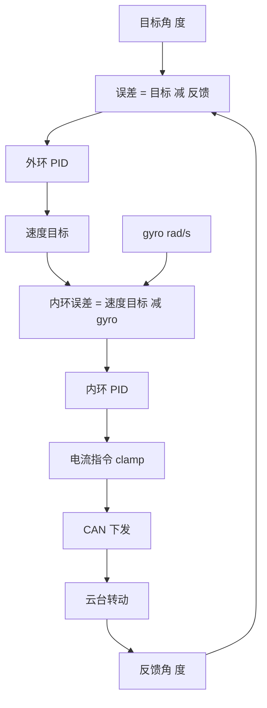
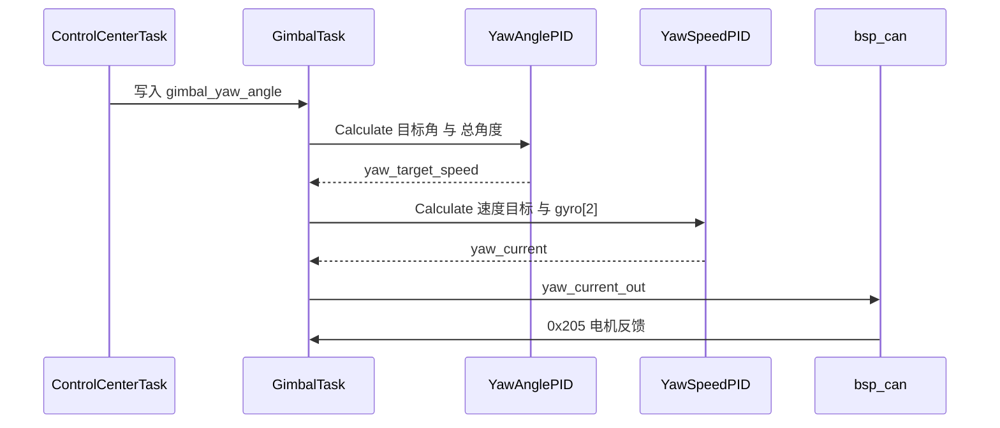

# 角度环的作用与量纲

云台要把光学或弹道方向稳定在目标角上，直接下发电流无法完成这件事：电流决定力矩，力矩经减速器与负载折算后影响角速度，角速度再积分成角度。角度环把角度误差换算成速度目标，速度环把速度目标换算成电流指令。两级各自闭环，中间以速度目标连接。

## 1. 位置量换成速度量

角度环是串级结构的外环。被控量是角度，操纵量是速度目标，不是电流。

外环用角误差而不是角速度误差，是因为最终要稳定的是指向角：角度误差直接对应需要补掉的转角，角速度误差只反映当前转得多快，无法判断指向是否已经到位。

| 层次 | 输入 | 反馈 | 输出 | 单位量级 |
| --- | --- | --- | --- | --- |
| 角度外环 | 目标角 | 当前角 | 速度目标 | 角度单位 |
| 速度内环 | 速度目标 | 当前角速度 | 电流指令 | 电流编码值 |
| 执行器 | 电流指令 | 电机反馈 | 力矩、转速 | CAN 帧 |

外环的输入与反馈必须是同一种单位，否则误差没有物理意义。$e = \theta_{ref} - \theta_{fb}$ 里两个量若一个用度、一个用弧度，减法得到的数不对应任何真实角度。

连续域 PID 输出写作

$$u(t) = K_p e(t) + K_i \int_0^t e(\tau)\,d\tau + K_d \frac{de(t)}{dt}$$

$u$ 的量纲由 $e$ 与三个增益共同决定。$e$ 取角度时，$u$ 是“角度乘增益”的数值，只有在定义上把它当作速度目标，内环才有可比较的参考量。

离散实现按采样周期累加：

$$u_n = K_p e_n + K_i \sum_{j=0}^{n} e_j \, dt + K_d \frac{e_n - e_{n-1}}{dt}$$

$dt$ 出现在积分与微分两处，采样周期变化会同时改变这两个通道的等效强度。

把被控量从角度换成速度目标，让两级控制器各自工作在合适的量纲上：外环的输出直接成为内环的输入，中间不需要再插一层轨迹规划。代价是外环的输出限幅同时决定了内环能达到的最大速度。

外环把角度误差按增益换算成速度目标，量纲从度变成度每秒；内环再把速度误差换算成电流。量纲是否对齐，决定了整条链路能否用一组增益描述。

## 2. 量纲对齐

内环把外环输出当作速度参考。参考值与反馈值必须能相减：

$$e_{speed} = u_{angle} - \omega_{fb}$$

$\omega_{fb}$ 取自 IMU 角速度，单位是 rad/s；$u_{angle}$ 由角度误差乘增益得到，数值上接近“度乘增益”。两边单位不同，等式只在把换算系数并入 $K_p$ 之后才近似成立。本工程正是这样做：$K_p = 60$ 同时承担比例增益与度到 rad/s 的换算，换算比约 57.3。

| 量 | 本工程单位 | 来源 |
| --- | --- | --- |
| 目标角 `control_target.gimbal_yaw_angle` | 度 | `ControlCenterTask.cpp`，视觉弧度乘 `RAD_TO_DEG` |
| 反馈角 `imu_data.gimbal_yaw_total_angle` | 度 | `ImuTask.cpp` 累加得到 |
| 外环输出 `yaw_target_speed` | 数值，按 rad/s 使用 | `GimbalTask.cpp` |
| 内环反馈 `imu_data.gyro[2]` | rad/s | `ImuTask.cpp`，BMI088 原始值 |
| 内环输出 `yaw_current` | 电流编码值 | `GimbalTask.cpp` |
| 电流限幅 | ±50000 | `GimbalTask.cpp` |

度与弧度的换算关系：

$$1\ \text{rad} = 57.29578\ \text{deg}$$

外环若把输出解释成 deg/s，内环要先把它乘 $1/57.29578$ 才能与 gyro 相减。本工程省略了这一步，换算隐含在增益里，属待核实项。



## 3. 角度到速度的物理含义

比例项可以看成弹簧：

$$u = K_p e$$

$e$ 越大，目标速度越大；角度误差归零，速度目标也归零。微分项提供阻尼，抑制过零时的振荡。积分项消除稳态偏置，代价是引入相位滞后与积分饱和风险。

三个增益的量纲不统一。$K_d$ 的单位是“输出每（误差每秒）”，$K_i$ 的单位是“输出每（误差乘秒）”。把三者当成独立旋钮的前提是采样周期固定。

对惯量 $J$、阻尼 $b$ 的简化云台模型 $J\ddot{\theta} + b\dot{\theta} = \tau$，内环近似把角速度跟踪成 $\omega \approx u_{angle}$，外环闭环变成一阶系统：

$$\dot{\theta} = K_p(\theta_{ref} - \theta)$$

时间常数为 $1/K_p$，量纲上要求 $K_p$ 是“每秒”。本工程把度与 rad/s 的换算吸收进 $K_p$ 后，这个时间常数只对特定单位组合成立。

## 4. 外环实例与输出流向

### 4.1 外环实例与调用

`GimbalTask.cpp` 构造 `YawAnglePID(60.0f, 0.000f, 0.3f, 200000.0f, 180.0f)`，源码里的构造 `PitchAnglePID(1.0f, 0.1f, 0.01f, 10000.0f, 5000.0f)`，源码里的紧接着把 `maxIntegral` 改成 1000。

yaw 外环在源码里调用：

```cpp
float yaw_target_speed = YawAnglePID.Calculate(
 control_target.gimbal_yaw_angle,
 imu_data.gimbal_yaw_total_angle,
 dt
);
```

pitch 外环在源码里调用 `Calculate_with`，反馈是 `imu_data.roll`。

这里调用的是基类 `PidBase::Calculate`，并没有调用 `AnglePID::calculate`。`handleZeroCross` 在运行路径上没有被执行，输入直接按浮点角度参与运算。

### 4.2 反馈角的产生

`ImuTask.cpp` 把 IMU 的 yaw 角按 ±180 度展开后累加：

```cpp
float delta_actual = imu_data.yaw - prev_actual_yaw;
if (delta_actual > 180.0f) delta_actual -= 360.0f;
else if (delta_actual < -180.0f) delta_actual += 360.0f;
gimbal_yaw_total += delta_actual;
```

累加值在源码里写入 `imu_data.gimbal_yaw_total_angle`，单位是度。外环反馈来自姿态解算，不来自电机编码器。编码器计数只用于底盘侧的 `yaw_motor_5.total_angle`。

### 4.3 输出流向

外环输出交给内环，内环输出经限幅后写全局变量：



电流值在源码里限幅到 ±50000 后写入全局 `yaw_current_out`，由 `ControlCenterTask.cpp` 打包进 CAN 帧。pitch 侧走 LK 电机，输出在源码里限幅到 ±30000 并叠加一项重力前馈。

## 5. 易错点

| # | 易错点 | 表现 | 位置 |
| --- | --- | --- | --- |
| 1 | 目标角与反馈角单位不一致 | 误差量级错误 | `GimbalTask.cpp`、`ImuTask.cpp` |
| 2 | 外环输出与内环反馈单位不一致 | 度与 rad/s 直接相减，靠 $K_p$ 吸收 | `GimbalTask.cpp` |
| 3 | 把外环输出当电流 | 量级到 200000，直接下发会超出编码范围 |—|
| 4 | 只调 $K_p$ 不看 `dt` | 采样周期变化后等效增益漂移 |—|
| 5 | 认为角度反馈来自编码器 | 云台用的是 IMU 姿态角 | `ImuTask.cpp` |

## 6. 小结

### 核心概念

- 外环：角误差进，速度目标出；内环：速度误差进，电流指令出。
- 外环输入与反馈必须同单位，本工程两者都是度。
- 外环输出与内环反馈在单位上不闭合，换算系数隐含在 $K_p$ 里。
- 云台角度反馈来自 IMU 累加角，编码器计数用于底盘侧。
- 积分项消除稳态误差，也是饱和风险的主要来源。

### 设计权衡

| 权衡点 | 本工程选择 | 收益与代价 |
| --- | --- | --- |
| 外环输出量纲 | 沿用内环数值、不显式换算 | 少一次乘法；代价是单位含义模糊，调参依赖经验 |
| 反馈来源 | IMU 姿态角 | 直接闭环真实指向；代价是引入姿态解算延迟 |
| 增益分配 | $K_p$ 吞掉度与弧度换算 | 代码短；代价是参数不可跨平台移植 |
| 角度限幅 | 任务内常量 30 与 -20 | 便于现场改；代价是与注释不一致 |

## 7. 练习

### 基础题

1. 写出角度环与速度环的输入、反馈、输出，并标注单位。
2. 已知 $K_p = 60$、误差 10 度，求比例项输出，再换算成 rad/s 下的等效值。
3. 说明 $K_i$ 与 $K_d$ 的量纲，$dt$ 从 1 ms 改成 2 ms 后两者等效强度如何变化。

### 挑战题

4. 在 `GimbalTask.cpp` 前后各加一次度到 rad/s 的换算，使内外环单位闭合，推导 $K_p$ 的等效取值。
5. 把角度反馈从 IMU 累加角换成编码器总角度，列出量纲、分辨率与跨零处理上的全部改动点。
6. 用一阶模型推导角度环 P 控制下的闭环时间常数，说明它与速度内环带宽的匹配关系。

### 附：本页引用的固件路径

| 路径 | 用途 |
| --- | --- |
| `2026OmniSentryGimbal/Task/Src/GimbalTask.cpp` | 外环实例与调用 |
| `2026OmniSentryGimbal/PID/PidBase.h` | `Calculate` 与 `Calculate_with` |
| `2026OmniSentryGimbal/PID/Inc/angle_pid.h` | `AnglePID` 声明 |
| `2026OmniSentryGimbal/Task/Src/ImuTask.cpp` | 反馈角产生 |
| `2026OmniSentryGimbal/Message_Bus/message_bus.h` | `imu_data` 与 `control_target` 定义 |

