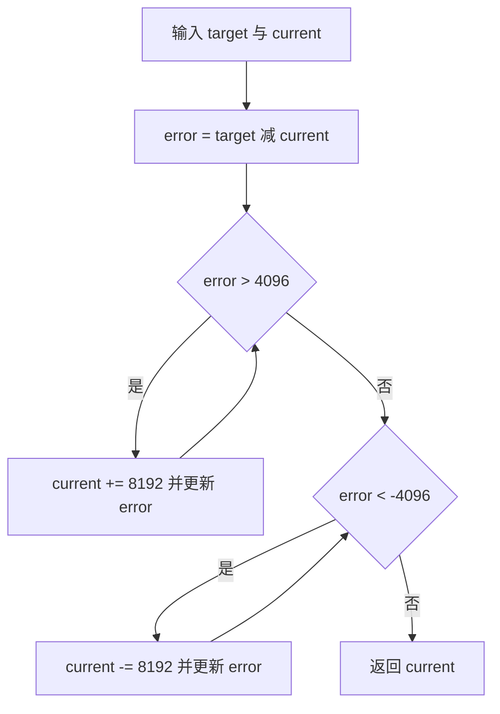
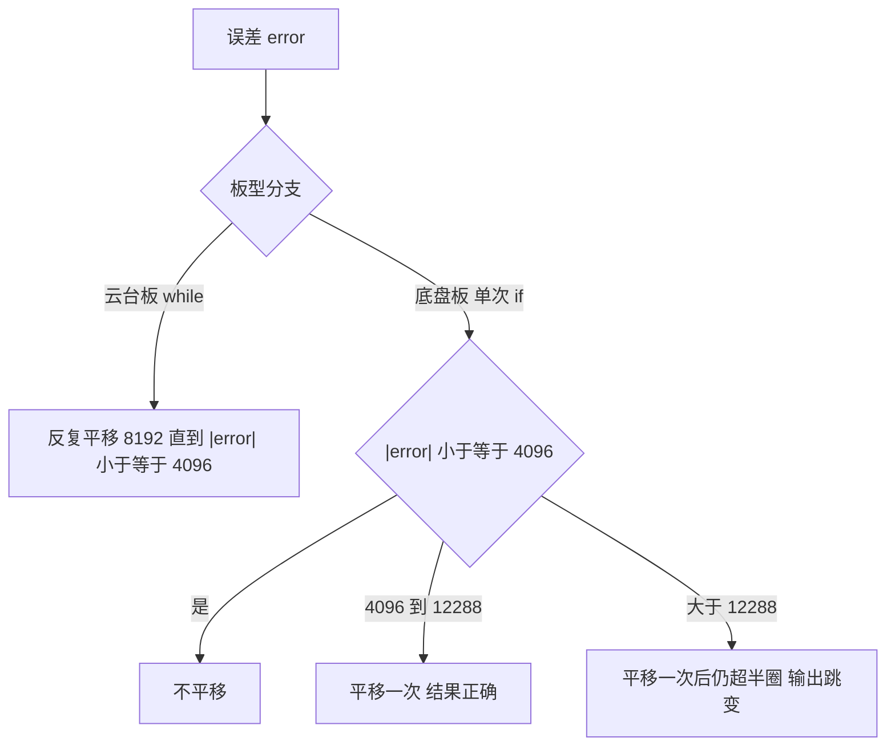
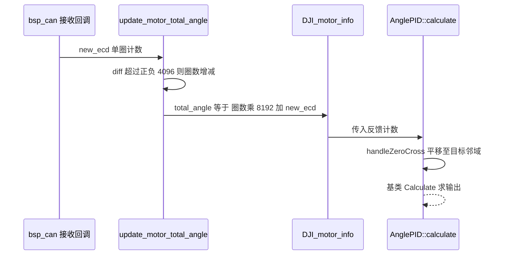

# 跨零处理与最近路径

编码器读数在 0 到 8191 之间循环，目标角与反馈角各自落在某个圈内。两者直接相减得到的差不一定是最近的转动量：目标 100、反馈 8100 时，原始差是 -8000，实际只需正向转 192。跨零处理把其中一个操作数平移到另一个的邻域，再送去相减。

## 1. 周期量的等价表示

角度满足周期性：

$$\theta \equiv \theta + k \cdot 2\pi, \quad k \in \mathbb{Z}$$

换算到编码器计数，一个周期是 8192 个计数。目标与前一次反馈在同一实数轴上的表示相差任意整数个周期，两者描述同一个物理角度。控制器需要的是其中差最小的那一对表示。

设目标计数为 $\theta_T$，反馈计数为 $\theta_C$，平移量取 $k \cdot 8192$，误差为

$$e(k) = \theta_T - (\theta_C + k \cdot 8192)$$

最近路径要求 $|e(k)|$ 最小。对连续取值的 $k$，解为

$$k^{*} = \operatorname{round}\!\left(\frac{\theta_T - \theta_C}{8192}\right)$$

平移后 $e(k^{*}) \in [-4096, 4096]$。这段区间覆盖半个圆周，任意两个角度都能在其中找到一对等价表示。

| 符号 | 含义 | 本工程取值 |
| --- | --- | --- |
| 周期 $N$ | 一圈的计数 | 8192 |
| 半周期 | 最大可分辨误差 | 4096 |
| 平移量 | 每次跨越的周期 | ±8192 |
| 结果误差范围 | 最近路径的界限 | -4096 到 4096 |

## 2. 8192 与 4096 的来源

两个数字来自编码器分辨率与半圈划分。

`bsp_can.cpp` 的 `update_motor_total_angle` 把圈数与单圈计数合成累计角度：

```cpp
motor->total_angle = motor->round_count * (int32_t)8192 + (int32_t)new_ecd;
```

圈计数在差值超过半圈时增减，阈值就是 ±4096：

```cpp
int32_t diff = (int32_t)new_ecd - (int32_t)motor->last_angle;
if (diff > 4096) motor->round_count--;
else if (diff < -4096) motor->round_count++;
```

底盘板 `UsbConnectTask.cpp:209` 用 `180.0f / 4096.0f` 把计数换算成角度，反证 4096 计数对应 180 度、8192 计数对应 360 度。

8192 计数每圈属项目约定。DJI M3508 反馈的角度字段为 0 到 8191，工程把 8192 当作一圈，是否对应关节轴一圈取决于 19:1 减速比与标定方式。按现有代码读，8192 表示被控轴转过一圈；该说法在电机手册层面需要按实际传动核对，列为待确认。

## 3. 最近路径算法

`handleZeroCross` 用循环或条件判断实现平移。云台板用 while：

```cpp
int32_t AnglePID::handleZeroCross(int32_t target, int32_t current) {
    int32_t error = target - current;
    while (error > 4096) {
        current += 8192;
        error = target - current;
    }
    while (error < -4096) {
        current -= 8192;
        error = target - current;
    }
    return current;
}
```

循环每轮把误差缩小一个周期。误差大于 4096 时加一圈，误差小于 -4096 时减一圈，退出条件是 $|e| \le 4096$。



### 3.1 边界值 4096

判断用的是严格大于与严格小于。误差恰好等于 4096 时不平移，恰好等于 -4096 时也不平移。两个边界处置相同，条件本身对称。

$e = 4096$ 时，$e - 8192 = -4096$，两种表示到目标的距离相等，都是半圈。算法保留未平移的一种。结果误差的取值集合是 $[-4096, 4096]$，共 8193 个整数值，比半圈多一个。多出的那个点正是这个平局点。

### 3.2 while 与单次 if 的差别

底盘板把循环换成单次条件判断：

```cpp
int32_t error = target - current;
if (error > 4096) {
    current += 8192;
} else if (error < -4096) {
    current -= 8192;
}
return current;
```

单次平移后误差变成 $e \mp 8192$，落在 $[-4096, 4096]$ 的条件是

$$|e| \le 4096 + 8192 = 12288$$

换算成圈数，单次版本只覆盖 1.5 圈以内的偏移。初始误差超过 12288 计数时，一次平移后仍然超出半圈，函数返回的等价角不是最近的，外环会朝较远方向转动。

| 偏移范围 | 云台 while | 底盘单次 if |
| --- | --- | --- |
| 0 到 4096 | 不平移，正确 | 不平移，正确 |
| 4097 到 12288 | 平移一次，正确 | 平移一次，正确 |
| 12289 及以上 | 平移多次，正确 | 平移一次后仍超半圈，错误 |



## 4. 本工程的跨零实现

### 4.1 AnglePID 与运行路径

`AnglePID::calculate` 在 `angle_pid.cpp:7-11`：先调 `handleZeroCross`，再用平移后的反馈调用基类 `Calculate`，返回 `int16_t`。

云台板 `GimbalTask.cpp:61-65` 与 `:85-89` 调用的是基类 `Calculate` 与 `Calculate_with`，参数是浮点角度。`handleZeroCross` 位于私有段（`angle_pid.h:20`），只有 `AnglePID::calculate` 能触发它。两条运行路径都绕开了该函数，编码器计数的跨零处理在云台控制里没有被执行。

C 封装 `angle_pid_calculate` 会走这条路径，但全工程没有调用点。云台板只在 `angle_pid.cpp:41-43` 定义它，底盘板同样只在 `:33-35` 定义。

### 4.2 另一处跨零：姿态角累加

`ImuTask.cpp:86-94` 在角度域做同类处理，阈值是 ±180 度：

```cpp
float delta_actual = imu_data.yaw - prev_actual_yaw;
if (delta_actual > 180.0f) delta_actual -= 360.0f;
else if (delta_actual < -180.0f) delta_actual += 360.0f;
gimbal_yaw_total += delta_actual;
```

这里也是单次判断，且输入是相邻两帧的差，通常在几度以内，不会触发阈值。它与编码器域的 `handleZeroCross` 属于两个独立的跨零实现，阈值单位分别是度与计数。

### 4.3 累计角的数据类型

两块板的 `DJI_motor_info.total_angle` 都是 `int16_t`（`bsp_can.h:17`），而 `handleZeroCross` 的形参是 `int32_t`。把 `int16_t` 传进按值接收的 `int32_t` 形参会做符号扩展，累计角超过 ±32767 计数时在源端已经回绕，跨零函数拿到的是回绕后的值。底盘侧 `yaw_motor_5.total_angle` 经 `ControlCenterTask.cpp:93` 参与差运算，实际可用的连续范围约 ±4 圈。



## 5. 易错点

| # | 易错点 | 表现 | 位置 |
| --- | --- | --- | --- |
| 1 | 认为两板跨零实现相同 | 底盘只平移一次，大偏移下选错方向 | `chassis PID/Src/angle_pid.cpp:14-22` |
| 2 | 把 8192 当成角度 | 8192 是一圈计数，不是角度值 | `bsp_can.cpp:544` |
| 3 | 认为边界 4096 会触发平移 | 判断是严格大于，等于时不平移 | 云台 `angle_pid.cpp:20-27` |
| 4 | 认为 -4096 与 4096 处置不同 | 两处条件对称，均为严格比较 | 同上 |
| 5 | 忽略累计角是 `int16_t` | 超过约 4 圈在源端回绕 | `bsp_can.h:17` |
| 6 | 以为云台控制走了跨零函数 | 任务调用基类 `Calculate`，函数未执行 | `GimbalTask.cpp:61-65` |

## 6. 小结

### 核心概念

- 角度是周期量，直接相减可能得到绕远路的差。
- 最近路径在 $k \cdot 8192$ 的整数平移里取 $|e|$ 最小的一组表示。
- 8192 是每圈计数，4096 是半圈，两者来自编码器分辨率与工程约定。
- 云台板循环平移可覆盖任意偏移，底盘板单次平移只覆盖 1.5 圈。
- 误差恰为 ±4096 时算法不平移，两个边界处置一致。

### 设计权衡

| 权衡点 | 本工程选择 | 收益与代价 |
| --- | --- | --- |
| 平移方式 | 云台循环、底盘单次 | 循环范围无限制；代价是每轮多一次比较，单次省指令但范围受限 |
| 周期常量 | 直接写 8192 与 4096 | 直观；代价是与编码器分辨率、减速比耦合，换电机需改代码 |
| 边界判据 | 严格比较 | 结果误差恰为半圈时保留原表示；代价是存在 8193 个取值、边界行为需要额外说明 |
| 角度域展开 | IMU 侧再写一次 ±180 判断 | 各自独立、改动局部；代价是同一逻辑出现两份 |

## 7. 练习

### 基础题

1. 目标 100、反馈 8100，用最近路径求平移量与最终误差。
2. 写出 $k^{*}$ 的表达式，并验证它等价于循环平移。
3. 误差等于 4096 时函数返回什么，平移与不平移两种结果到目标各多远。

### 挑战题

4. 构造一个初始误差使底盘单次版本返回错误等价角，并算出外环会朝哪个方向转。
5. 把 8192 改写为可配置的分辨率参数，列出需要同步修改的所有位置。
6. 设计一个测试用例集，覆盖 $|e|$ 为 0、4095、4096、4097、12288、12289 六种情形，对两板实现给出预期。

### 附：本页引用的固件路径

| 路径 | 用途 |
| --- | --- |
| `2026OmniSentryGimbal/PID/Src/angle_pid.cpp` | 云台板 while 版跨零处理（`:7-30`） |
| `2026OmniSentryChassis/PID/Src/angle_pid.cpp` | 底盘板单次 if 版跨零处理（`:7-22`） |
| `2026OmniSentryGimbal/PID/Inc/angle_pid.h` | `handleZeroCross` 声明（`:20`） |
| `2026OmniSentryGimbal/BSP/Src/bsp_can.cpp` | 累计角合成与半圈阈值（`:556-585`） |
| `2026OmniSentryChassis/BSP/Src/bsp_can.cpp` | 底盘累计角合成（`:519-548`） |
| `2026OmniSentryChassis/BSP/Inc/bsp_can.h` | `total_angle` 为 `int16_t`（`:17`） |
| `2026OmniSentryChassis/Task/Src/UsbConnectTask.cpp` | 180 除以 4096 的换算（`:208-210`） |
| `2026OmniSentryGimbal/Task/Src/ImuTask.cpp` | 姿态角的 ±180 度展开（`:86-94`） |

