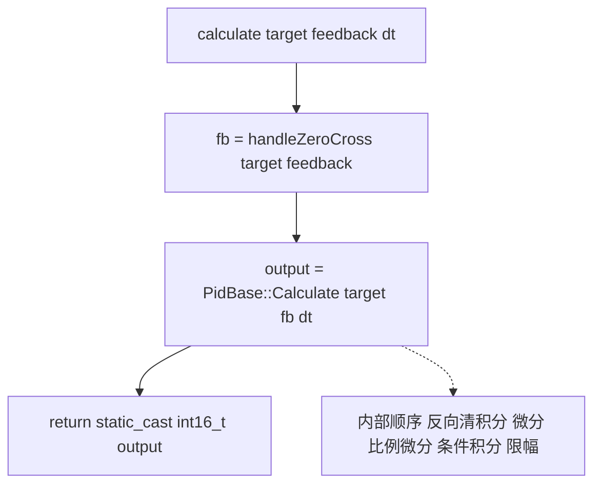
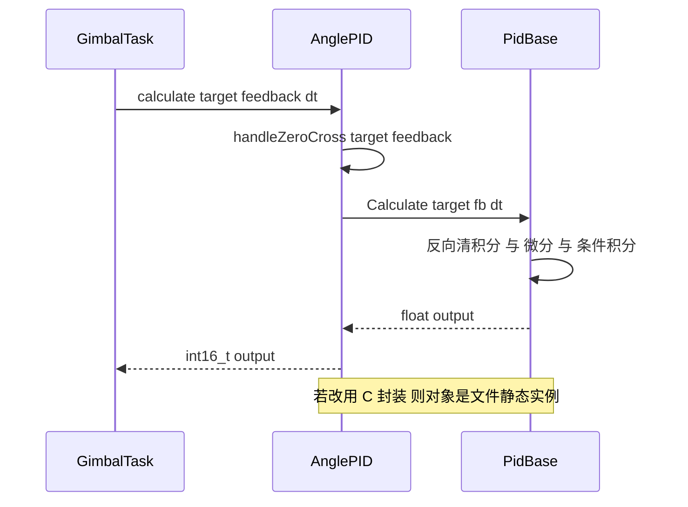

# AnglePID 实现

`AnglePID` 在 `PidBase` 之上加了两件事：把整数角度平移后再相减，把浮点输出压成 `int16_t`。类的接口只有两个成员函数，其余全部继承。两板的 `angle_pid.cpp` 只在跨零函数上不同。

## 1. 派生与复用

`AnglePID` 继承 `PidBase`，不重写 `Calculate`，只新增一个整数接口。构造参数沿基类的五个：$K_p$、$K_i$、$K_d$、输出限幅、积分限幅。

| 成员 | 归属 | 作用 |
| --- | --- | --- |
| `Kp`、`Ki`、`Kd` | 基类 | 三项增益 |
| `maxOutput` | 基类 | 输出限幅 |
| `maxIntegral` | 基类 | 积分限幅 |
| `integral`、`prevError`、`prevTarget` | 基类 | 状态量 |
| `calculate` | 派生类 | 整数角接口，返回 `int16_t` |
| `handleZeroCross` | 派生类私有 | 最近等价角 |

`using PidBase::PidBase;`（`angle_pid.h`）把基类构造函数透传过来，派生类不再重复写初始化列表。

基类提供两套计算：`Calculate`（`PidBase.h`）在输出饱和时停积分，`Calculate_with`无条件积分后再限幅。`AnglePID::calculate` 内部调用 `Calculate`。

## 2. calculate 的三行

云台板 `angle_pid.cpp`：

```cpp
int16_t AnglePID::calculate(int32_t target, int32_t feedback, float dt) {
 int32_t fb = handleZeroCross(target, feedback);
 float output = Calculate(static_cast<float>(target), static_cast<float>(fb), dt);
 return static_cast<int16_t>(output);
}
```

三行的分工：

| 动作 | 关键点 |
| --- | --- |
| 跨零处理 | 只平移反馈，目标保持原值 |
| 调用基类 | 两个整数先转成 `float` |
| 截断返回 | 浮点直接转 `int16_t` |

目标不平移而反馈平移，两者之差等于平移后的最近路径误差。若两边都平移，误差会互相抵消，跨零处理失去作用。



基类 `Calculate` 的内部顺序在 `PidBase.h`：误差、反向清积分、微分、比例与微分求和、输出未饱和才累加积分、加积分、限幅、保存状态。角度环没有改变这个顺序。

派生而不重写 `Calculate`，目的是复用基类的浮点计算与限幅逻辑，只在整数角度这一层做适配。新增接口先把两个整数角度折算到最近路径，再送进基类，基类看到的始终是小量。

两板的 `angle_pid.cpp` 只在跨零函数上不同，移植边界因此被压缩到一个函数里。

## 3. int16_t 截断

`static_cast<int16_t>(output)` 做的是浮点到整数的转换，方向是向零取整：

$$\operatorname{trunc}(x) = \begin{cases} \lfloor x \rfloor & x \ge 0 \\ \lceil x \rceil & x < 0 \end{cases}$$

$5000.9$ 变成 5000，$-5000.9$ 变成 -5000。小数部分直接丢弃，不四舍五入。

`int16_t` 的取值范围是 -32768 到 32767。`output` 超出这个范围时，浮点到整数的转换在 C++ 中属于未定义行为，实际结果依赖编译器与优化级别，可能回绕成大负数。

C 封装的静态实例参数是 `maxOutput = 5000`，输出被限幅在 ±5000，落在 `int16_t` 范围内，截断安全。云台任务里的 `YawAnglePID` 构造参数是 `maxOutput = 200000`，若把它的调用换成 `AnglePID::calculate`，输出会远超 32767，返回的 `int16_t` 不可用。

| 实例 | maxOutput | 输出范围 | 转 int16_t |
| --- | --- | --- | --- |
| C 封装 `angle_pid` | 5000 | -5000 到 5000 | 安全 |
| 任务 `YawAnglePID` | 200000 | -200000 到 200000 | 超出范围，未定义行为 |
| 任务 `PitchAnglePID` | 10000 | -10000 到 10000 | 安全 |

`dt` 以 `float` 传入，误差与微分都在 `float` 上算。`int32_t` 角度先经 `static_cast<float>` 转换，超过 $2^{24}$ 的整数无法在 `float` 中精确表示，本工程的累计角远小于该值，此路不影响。

## 4. 跨零函数的接口

`handleZeroCross(int32_t target, int32_t current)` 返回平移后的当前角，不返回值就直接暴露给外部。它是私有成员（`angle_pid.h`），外部只能通过 `calculate` 间接使用。

云台板用 while 循环平移，底盘板用单次 if。两板签名相同，差异只在函数体，见跨零单元。

## 5. C 封装

`angle_pid.cpp` 末尾用 `extern "C"` 包一层，供 C 调用：

```cpp
extern "C" {
 static AnglePID angle_pid(15.0f, 0.8f, 0.08f, 5000.0f, 5000.0f);
 void angle_pid_clear() { angle_pid.Clear(); }
 int16_t angle_pid_calculate(int32_t target, int32_t actual_angle, float dt) {
 return angle_pid.calculate(target, actual_angle, dt);
 }
}
```

静态实例在文件作用域内构造一次，`angle_pid_clear` 调基类 `Clear`，只清 `integral` 与 `prevError`（`PidBase.h`），不清 `prevTarget`。`angle_pid_calculate` 转发到 `calculate`。

上一组参数以注释形式保留：`2.0f / 0.0f / 0.1f / 5000.0f / 5000.0f`（云台板与底盘板各有一份）。当前生效的是 `15.0f / 0.8f / 0.08f / 5000.0f / 5000.0f`（云台板与底盘板各有一份）。

全工程没有 `angle_pid_calculate` 的调用点。grep 结果只有定义与声明两处，两个板都是如此。运行中的角度控制由任务自己构造 `AnglePID` 实例完成，C 封装属预留接口或历史残留。



## 6. 两板差异

| 项目 | 云台板 | 底盘板 |
| --- | --- | --- |
| `handleZeroCross` | while 循环平移 | 单次 if 与 else if |
| 文件行数 | 44 | 36 |
| C 封装参数 | 15、0.8、0.08、5000、5000 | 同左 |
| `PidBase` 成员可见性 | public，任务可直接改 `maxIntegral` | protected，外部不可直接改 |
| 运行路径是否调用跨零 | 否，任务调基类 `Calculate` | 底盘任务未使用 `AnglePID` |

`PidBase.h` 的成员在云台板是 public（源码里的 `//protected:` 被注释），在底盘板是 protected。云台任务 `GimbalTask.cpp` 直接写 `PitchAnglePID.maxIntegral = 1000`，依赖这一点才能编译。

## 7. 易错点

| # | 易错点 | 表现 | 位置 |
| --- | --- | --- | --- |
| 1 | 忽略返回类型 | 输出大于 32767 时截断或未定义 | `angle_pid.cpp` |
| 2 | 以为截断会四舍五入 | 向零取整，小数被丢弃 | 同上 |
| 3 | 目标与反馈都平移 | 误差抵消，跨零失效 |—|
| 4 | 以为 C 封装在跑 | 全工程无调用点 |—|
| 5 | 调 `Clear` 后以为状态全清 | `prevTarget` 保留，反向清积分判据可能沿用旧值 | `PidBase.h` |
| 6 | 跨板复制代码 | 两板跨零实现不同，`PidBase` 可见性也不同 | `angle_pid.cpp`、`PidBase.h` |

## 8. 小结

### 核心概念

- `AnglePID` 继承 `PidBase`，构造参数透传，接口只多一个整数 `calculate`。
- 三行实现是跨零、调基类、截断。
- 只有反馈被平移，目标保持原值。
- `float` 转 `int16_t` 向零取整，超范围属未定义行为。
- C 封装用文件静态实例，实际无调用点。

### 设计权衡

| 权衡点 | 本工程选择 | 收益与代价 |
| --- | --- | --- |
| 返回类型 | `int16_t` | 直接对接电流编码；代价是输出被限在 ±32767，限制了外环增益 |
| 构造复用 | `using PidBase::PidBase` | 不重复初始化；代价是派生类不能改默认状态量 |
| 跨零私有化 | 只有 `calculate` 可触发 | 接口干净；代价是任务若直接调基类就绕过跨零，且不易察觉 |
| C 封装静态实例 | 文件内构造一次 | C 侧调用方便；代价是与任务实例状态不共享，且当前无人调用 |

## 9. 练习

### 基础题

1. 写出 `calculate` 三行的职责，说明为什么只平移反馈。
2. 计算 `static_cast<int16_t>(5000.9f)` 与 `static_cast<int16_t>(-5000.9f)` 的结果。
3. `Clear` 之后哪些成员被清零，哪些保留。

### 挑战题

4. 把 `calculate` 的返回类型改成 `float` 并同步调用方，分析对 `YawAnglePID` 的影响。
5. 让 `handleZeroCross` 在误差恰为 4096 时选择平移，写出改动并说明对边界取值集合的影响。
6. 设计一个方案，让任务里的 `AnglePID` 实例与 C 封装的静态实例共享状态，列出线程安全上的注意点。

### 附：本页引用的固件路径

| 路径 | 用途 |
| --- | --- |
| `2026OmniSentryGimbal/PID/Src/angle_pid.cpp` | 云台板实现与 C 封装 |
| `2026OmniSentryChassis/PID/Src/angle_pid.cpp` | 底盘板实现 |
| `2026OmniSentryGimbal/PID/Inc/angle_pid.h` | 类声明与 C 接口 |
| `2026OmniSentryGimbal/PID/PidBase.h` | 构造函数、`Clear`、两套计算 |
| `2026OmniSentryChassis/PID/PidBase.h` | 成员为 protected 的基类 |

