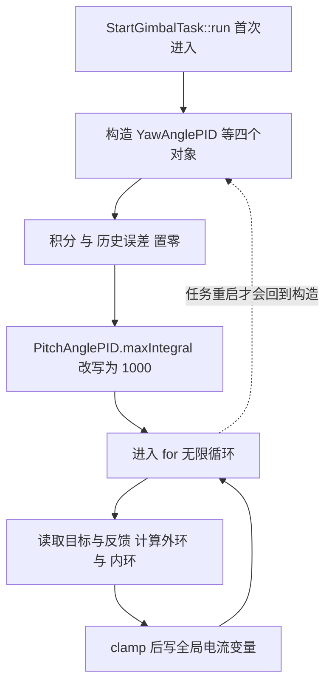
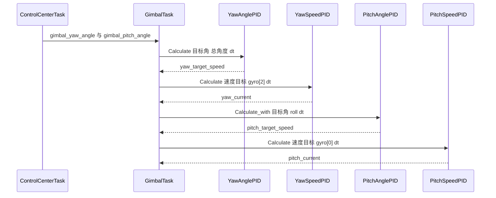

# 本项目角度环参数

云台角度环的实例全部在 `StartGimbalTask::run` 内部构造，参数以构造实参硬编码。yaw 与 pitch 的增益、限幅、积分上限各不相同，任务里还有一处构造后直接改写。

角度环的参数一般按「先比例、再微分、最后才动积分」的顺序整定：把 $K_p$ 加到开始等幅振荡后回退一半，再用 $K_d$ 压超调；积分只用于消除持续静差，很多角度环干脆不要它，因为姿态解算本身会估计零偏，积分反而容易在限幅时引发回摆。整定过程要同时盯三件事：输出限幅是否长期贴边、微分是否在噪声上被放大、以及代码里的 $dt$ 是否等于真实调度周期——等效积分增益与 $dt$ 成正比、微分增益与之成反比，周期写错等于把两套参数一起改掉。下面这些数字是这套方法的产物，先看方法，数字只作例证。

## 1. 实例与参数

`GimbalTask.cpp` 一次构造四个控制器：

| 控制器 | $K_p$ | $K_i$ | $K_d$ | `maxOutput` | `maxIntegral` |
| --- | --- | --- | --- | --- | --- |
| `YawAnglePID` | 60.0 | 0.000 | 0.3 | 200000 | 180 |
| `YawSpeedPID` | 20.0 | 0.0 | 0.000 | 1000000 | 20000 |
| `PitchAnglePID` | 1.0 | 0.1 | 0.01 | 10000 | 5000 |
| `PitchSpeedPID` | 40.0 | 0.0 | 0.0 | 30000 | 20000 |

`PitchAnglePID` 在下一行被改写：

```cpp
PitchAnglePID.maxIntegral = 1000;
```

构造参数 5000 被 1000 覆盖，实际生效的是 1000。这行能编译，依赖云台板 `PidBase.h` 把成员放在 public 段（源码里的 `//protected:` 被注释）。底盘板同一基类是 protected，同样写法会编译失败。

yaw 的 $K_i = 0$，积分增量恒为 0，`maxIntegral = 180` 对 yaw 不产生作用。pitch 的 $K_i = 0.1$，积分上限从 5000 降到 1000 会更快进入饱和。

## 2. 每个参数的作用

| 参数 | 作用 | 取值过大 | 取值过小 |
| --- | --- | --- | --- |
| $K_p$ | 把角度误差换成速度目标 | 过零振荡、超调 | 响应慢、稳态误差大 |
| $K_i$ | 消除稳态偏置 | 积分饱和、回摆 | 残差长期存在 |
| $K_d$ | 提供阻尼 | 放大噪声、抖动 | 过零振荡 |
| `maxOutput` | 速度目标上限 | 内环输入过大 | 外环受限、响应变慢 |
| `maxIntegral` | 积分上限 | 饱和后退出慢 | 消差能力弱 |

### 2.1 yaw 参数

$K_p = 60$、$K_i = 0$、$K_d = 0.3$。去掉积分说明稳态误差靠速度内环的积分承担；微分相对比例很小，$K_d/K_p = 0.005$ 秒，对应约 5 ms 的微分作用时间。

取误差 10 度，比例项贡献

$$K_p e = 60 \times 10 = 600$$

若误差在一个控制周期内从 10 度降到 9 度，$de/dt = -1000$ 度每秒，微分项贡献 $0.3 \times (-1000) = -300$，两项相加约 300。

### 2.2 pitch 参数

$K_p = 1$ 比 yaw 小两个数量级，$K_i = 0.1$ 比 yaw 大，$K_d = 0.01$。pitch 走 LK 电机，负载含重力矩，任务在输出端补了一项 $(-\text{roll}) \times 20$ 的前馈，并在超出限幅时清积分。

## 3. dt 与实际周期

`GimbalTask.cpp` 定义

```cpp
float dt = 0.001f; // 1ms控制周期
```

循环末尾 源码里的是 `osDelay(2)`，注释仍写 1 ms。若任务周期按 2 ms 计，传入的 `dt` 只有实际值的一半。

微分项按定义计算：

$$D = K_d \frac{e_n - e_{n-1}}{dt}$$

$dt$ 写小一半，$D$ 被放大一倍。积分项：

$$I_n = I_{n-1} + K_i e_n \, dt$$

$dt$ 写小一半，每轮积分增量减半。微分被高估、积分被低估，两者误差方向相反。任务若真是 1 ms 触发，则 `dt` 与 `osDelay` 至少有一处是错的，需按实际调度周期核实。

| 项目 | 代码值 | 若实际周期 2 ms |
| --- | --- | --- |
| `osDelay` | 2 | 一致 |
| 注释 | 1 ms | 不一致 |
| $D$ 的等效强度 | 按 1 ms | 高估 2 倍 |
| $I$ 的等效强度 | 按 1 ms | 低估 2 倍 |

## 4. 对象作用域与初始化

四个控制器在 `for (;;)` 之前构造，进入循环后不再重建。构造发生在任务体首次执行时，构造函数的初始化列表把 `integral` 与 `prevError` 置零（`PidBase.h`），`prevTarget` 由类内默认值置零。

`for` 循环永不退出，只要任务不重启，对象只构造一次。若任务被删除后重新创建，`run` 再次进入，四个对象的积分与历史误差全部归零。

对象作用域限于 `run`，外部函数无法访问，因此没有统一的 `Clear` 入口。任务在源码里直接写 `PitchAnglePID.integral = 0`，绕过 `Clear`，也就不会清 `prevError` 与 `prevTarget`。



## 5. 输出链路

两个外环的输出都交给同轴速度环：



yaw 输出在源码里限幅到 ±50000 后写 `yaw_current_out`，pitch 输出在源码里限幅到 ±30000 并叠加前馈后写 `pitch_current_out`。两个全局变量由 `ControlCenterTask.cpp` 下发。

## 6. C 封装参数没有落到运行路径

`PID/Src/angle_pid.cpp` 里的静态实例参数是 `15.0f / 0.8f / 0.08f / 5000.0f / 5000.0f`（云台板与底盘板各有一份），上一组 `2.0f / 0.0f / 0.1f / 5000.0f / 5000.0f` 被注释。

| 实例 | 位置 | 参数 | 是否被调用 |
| --- | --- | --- | --- |
| C 封装 `angle_pid` | `angle_pid.cpp` | 15、0.8、0.08、5000、5000 | 否 |
| 任务 `YawAnglePID` | `GimbalTask.cpp` | 60、0.000、0.3、200000、180 | 是 |
| 任务 `PitchAnglePID` | `GimbalTask.cpp` | 1、0.1、0.01、10000、5000→1000 | 是 |

底盘板没有 `GimbalTask.cpp`，30 个 cpp 中不存在该文件。底盘 `AnglePID` 实例只有 C 封装里这一个，同样无调用点。底盘的角度相关控制走 `ChassisTask.cpp` 的 `follow.Calculate(0, fmodf(delta_angel, 2\pi), dt)`，对象是 `SpeedPID`，输入是 `yaw_motor_5.total_angle` 换算来的弧度。

## 7. 注释与常量不一致

`GimbalTask.cpp`：

```cpp
const float pitch_angle_limit_max = 30.0f; // Pitch最大角度 +20度
const float pitch_angle_limit_min = -20.0f;// Pitch最小角度 -10度
```

注释写 +20 与 -10，实际限幅是 30 与 -20。限幅判据写在代码里，超限时把 `control_target.gimbal_pitch_angle` 截断到常量值。以代码为准，注释属笔误。

## 8. 易错点

| # | 易错点 | 表现 | 位置 |
| --- | --- | --- | --- |
| 1 | 拿构造参数当实际积分上限 | pitch 的 5000 被 1000 覆盖 | `GimbalTask.cpp` |
| 2 | `dt` 与 `osDelay` 取其一当准 | 微分被高估、积分被低估 |—|
| 3 | 以为参数可在别处修改 | 对象作用域限于 `run` |—|
| 4 | 直接写 `integral` 代替 `Clear` | `prevError` 与 `prevTarget` 未清 | `PidBase.h` |
| 5 | 按注释读 pitch 限幅 | 实际是 30 与 -20 |—|
| 6 | 以为 C 封装参数在起作用 | 无调用点 | `angle_pid.cpp` |
| 7 | 以为底盘也跑角度环 | 底盘无 `GimbalTask.cpp`，无 `AnglePID` 实例 | 底盘仓库 |

## 9. 小结

### 核心概念

- 四个控制器在 `run` 内构造，积分与历史状态在任务启动时归零。
- yaw 用 $K_p = 60$、$K_i = 0$、$K_d = 0.3$，pitch 用 $K_p = 1$、$K_i = 0.1$、$K_d = 0.01$。
- pitch 的 `maxIntegral` 从 5000 被改写为 1000，yaw 的 `maxIntegral = 180` 因 $K_i = 0$ 不起作用。
- `dt = 0.001f` 与 `osDelay(2)` 不一致，微分与积分偏差方向相反。
- C 封装参数无调用点，底盘板无角度环运行实例。

### 设计权衡

| 权衡点 | 本工程选择 | 收益与代价 |
| --- | --- | --- |
| 参数位置 | 任务内硬编码 | 阅读集中；代价是无法在线调、无法跨任务共享 |
| 构造时机 | `run` 首帧 | 状态自动归零；代价是任务重启即丢历史 |
| 积分上限改写 | 直接赋值 public 成员 | 一行生效；代价是构造参数失去意义、与底盘板不兼容 |
| 前馈叠加 | 输出端加 $-\text{roll} \times 20$ | 补偿重力矩；代价是前馈增益硬编码，与 PID 输出耦合 |

## 10. 练习

### 基础题

1. 列出四个控制器的五元参数，标出被改写的一个。
2. 误差 10 度、误差变化率 -1000 度每秒时，yaw 的比例项与微分项各是多少。
3. 计算 $dt = 0.001$ 与真实周期 0.002 下微分项的比值。

### 挑战题

4. 把 `dt` 改成运行期测量值，说明需要改动的位置与对积分、微分的影响。
5. 把控制器对象提到文件作用域并加 `Clear` 接口，列出对任务重启语义的改变。
6. 由 `PitchAnglePID.maxIntegral = 1000` 与输出限幅 10000 估算积分饱和后退出所需的最小误差与时间。

### 附：本页引用的固件路径

| 路径 | 用途 |
| --- | --- |
| `2026OmniSentryGimbal/Task/Src/GimbalTask.cpp` | 参数、`dt`、限幅与输出 |
| `2026OmniSentryGimbal/PID/PidBase.h` | 构造与状态初始化 |
| `2026OmniSentryGimbal/PID/Src/angle_pid.cpp` | C 封装静态实例 |
| `2026OmniSentryChassis/PID/Src/angle_pid.cpp` | 底盘板同名实例 |
| `2026OmniSentryChassis/Task/Src/ChassisTask.cpp` | 底盘角度相关控制用 `SpeedPID` |
| `2026OmniSentryGimbal/Task/Src/ControlCenterTask.cpp` | 目标角来源与电流下发 |

