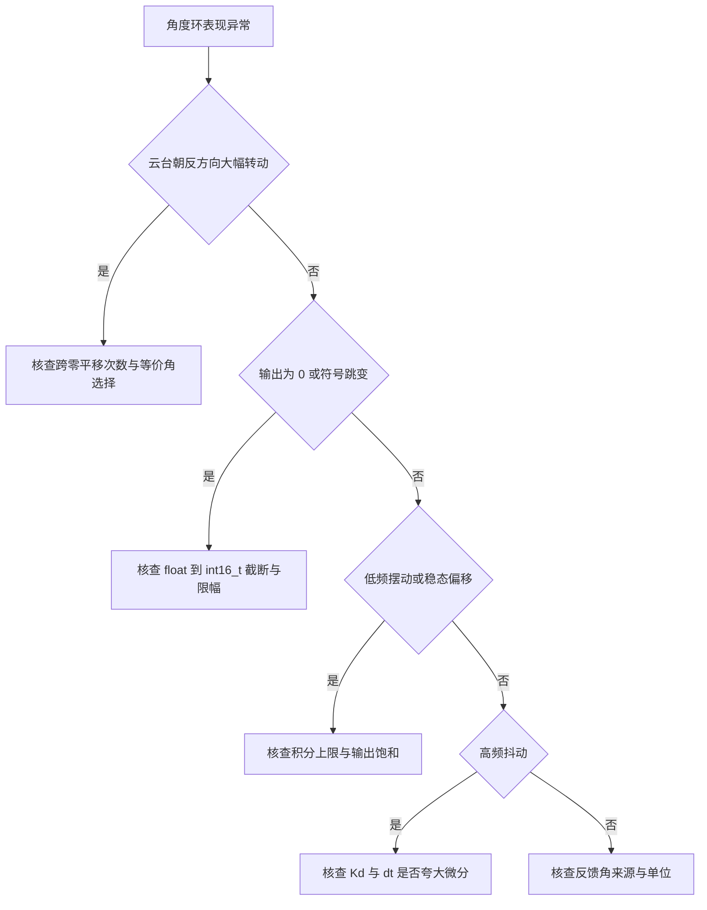
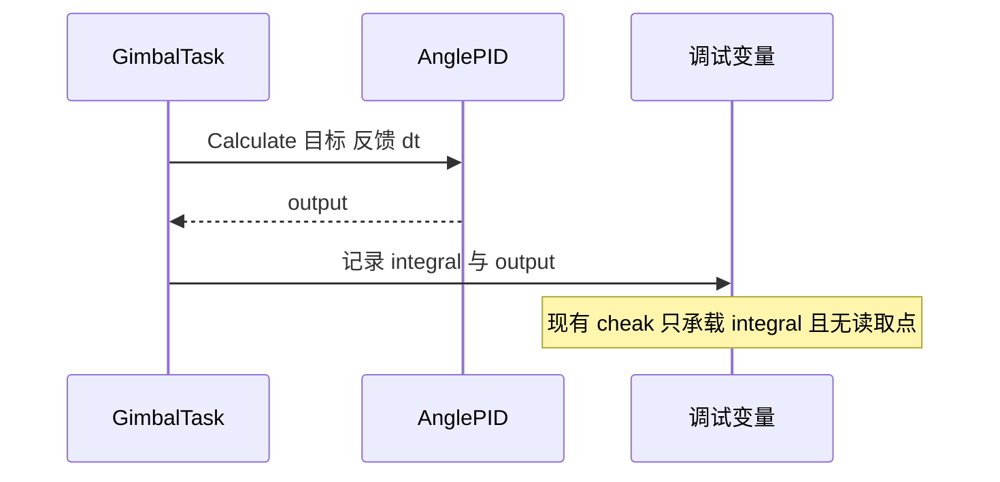
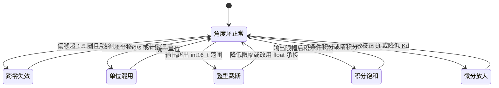

# 角度环易错点与调试

角度环的异常在表面上都表现为抖动、偏置或反向转动，根因分散在跨零、单位、数据类型、积分与调度周期五处。逐项排除比反复调参有效。

## 1. 症状与根因

| # | 症状 | 根因 | 位置 |
| --- | --- | --- | --- |
| 1 | 云台朝远离目标的方向转动 | 跨零只平移一次，大偏移下选错等价角 | 底盘 `PID/Src/angle_pid.cpp:14-22` |
| 2 | 误差量级异常、始终不收敛 | 目标用度、反馈用计数或弧度 | `GimbalTask.cpp:61-65`、`ImuTask.cpp:100` |
| 3 | 输出突变为大负数 | `float` 转 `int16_t` 超出范围 | `GimbalTask.cpp:79` |
| 4 | 过零振荡、低频摆动 | 积分饱和，退出慢 | `GimbalTask.cpp:32`、`PidBase.h:44-47` |
| 5 | 高频抖动、噪声明显 | 微分被夸大，`dt` 偏小 | `GimbalTask.cpp:37`、`:100` |
| 6 | 改参数无效 | 对象在 `run` 内构造，外部无引用 | `GimbalTask.cpp:27-34` |
| 7 | 限幅与实际不符 | 注释写 +20 与 -10，代码是 30 与 -20 | `:40-41` |
| 8 | 以为跨零在生效 | 任务调用基类 `Calculate`，未走 `handleZeroCross` | `:61-65`、`:85-89` |



## 2. 跨零漏处理

底盘板单次 if 版只覆盖 1.5 圈以内的偏移。初始误差超过 12288 计数时，一次平移后误差仍大于半圈，函数返回的等价角指向较远方向，外环推动云台绕远路。

排查方法：在 `handleZeroCross` 入口记录 `target`、`current`、平移前后的 `error`。若入口 `|error|` 大于 12288 而出口仍大于 4096，即命中该问题。

云台板的 while 版没有这个范围限制。云台任务的运行路径不调用该函数，跨零问题只可能在 C 封装被启用后出现。

## 3. 单位与换算

三套单位同时存在：

| 域 | 单位 | 出现位置 |
| --- | --- | --- |
| 姿态角 | 度 | `imu_data.roll`、`gimbal_yaw_total_angle` |
| 角速度 | rad/s | `imu_data.gyro` |
| 编码器 | 计数，8192 每圈 | `total_angle`、`handleZeroCross` |

外环误差是度，内环反馈是 rad/s，两者相减少了 57.3 的换算。编码器域用 8192 计数表示一圈，换算成度要乘 $360/8192$，即 $0.043945$ 度每计数。底盘 `UsbConnectTask.cpp:209` 用 `180/4096`，等价于同一换算。

排查方法：在单帧内打印目标角、反馈角、外环输出与内环反馈，检查四者数量级。目标角通常在 ±180 度内，gyro 在个位数 rad/s 量级，若外环输出与之相差数十倍，单位链有问题。

## 4. int16_t 截断

`AnglePID::calculate` 返回 `int16_t`，范围 -32768 到 32767。两个地方存在风险。

`GimbalTask.cpp:79`：

```cpp
yaw_current_out = (int16_t)clamp(yaw_current, -50000.0f, 50000.0f);
```

限幅上限 50000 超出 `int16_t` 上限。`yaw_current` 落在 32768 到 50000 之间时，浮点到 `int16_t` 的转换超出可表示范围，结果依赖编译器，常见表现是回绕。把限幅改成 32767 以内，或先用 `float` 承接再判断。

`GimbalTask.cpp:98`：

```cpp
pitch_current_out = (int16_t)clamp(pitch_current, -30000.0f, 30000.0f) + (-imu_data.roll) * 20;
```

限幅 30000 本身在范围内，加上前馈项后可能越过 32767。前馈项在限幅之后相加，不受限幅约束。

C 封装的静态实例 `maxOutput = 5000`，输出不超范围。任务里的 `YawAnglePID` 构造 `maxOutput = 200000`，若改用 `AnglePID::calculate`，返回值必然溢出。

## 5. 积分与状态

`PidBase::Calculate` 只在输出未饱和时累加积分（`PidBase.h:44-47`）。角度环超过限幅时，任务在 `GimbalTask.cpp:45-47` 直接把 `PitchAnglePID.integral` 写零。这比条件积分更直接，但绕过 `Clear`，`prevError` 与 `prevTarget` 保留旧值。

`prevTarget` 参与反向清积分的判据（`PidBase.h:33-35`），目标正负切换时清零积分。清积分后 `prevTarget` 仍保留旧符号，下一次调用仍可能触发反向清零，属预期之外的重复清零。

pitch 的 `maxIntegral` 从 5000 改写为 1000。积分上限越小，饱和退出的时间越短，消差能力越弱。判断积分是否饱和：看 `integral` 是否长期贴住 ±`maxIntegral`，同时输出贴住 `maxOutput`。

## 6. 参数作用域与调度

四个控制器在 `run` 内构造，函数外无法访问。运行中改参数只能通过任务内代码，或把对象提升为成员。参数在任务重启时会重新初始化。

`dt = 0.001f` 与 `osDelay(2)` 不一致。用 DWT 或调试变量记录循环入口时间戳，可以确定真实周期。若真实周期是 2 ms，微分项被放大一倍、积分增量被缩小一半。

五类根因的证据分散在不同位置：跨零要看角度差，单位要看换算系数，截断要看返回类型，积分要看限幅与饱和，调度要看实际周期。先把症状归到其中一类，再去读对应代码，比反复调参有效。

## 7. 调试探针

`GimbalTask.cpp:22` 定义全局 `float cheak`，`:90` 每轮赋值为 `PitchAnglePID.integral`，全工程无其它读取点。它承载的是积分值，但没有人消费。

有效的探针应同时暴露目标、反馈、误差、积分与输出，并带时间戳。单看积分无法区分饱和与增益问题，单看输出无法区分限幅与计算问题。





## 8. 排查顺序

1. 确认反馈角来源与单位，先排除单位混用。
2. 记录入口误差，判断是否超过半圈，再判断跨零是否被触发。
3. 检查输出数值是否越过 `int16_t` 范围与限幅。
4. 观察积分是否贴住上限，区分饱和与增益不足。
5. 用时间戳确认实际周期，再动 $K_d$。
6. 最后才调增益，且一次只改一个。

## 9. 小结

### 核心概念

- 五类根因：跨零漏处理、单位混用、整型截断、积分饱和、微分放大。
- 底盘单次跨零只覆盖 1.5 圈，云台 while 无此限制，但运行路径未调用。
- yaw 电流限幅 50000 超过 `int16_t` 上限，转换超范围属未定义行为。
- `dt` 写小一半会同时放大微分、缩小积分。
- 任务内构造的对象无法在外部调参或清零，探针需要自己加。

### 设计权衡

| 权衡点 | 本工程选择 | 收益与代价 |
| --- | --- | --- |
| 跨零实现 | 两板不同 | 各自适配；代价是复制代码时容易带错版本 |
| 输出类型 | `int16_t` | 对接电流编码；代价是限幅必须小于 32767 |
| 积分清零 | 饱和时直接写成员 | 见效快；代价是绕过 `Clear`，历史误差保留 |
| 调试探针 | 只有 `cheak` | 改动小；代价是信息量不足，排查靠外部工具 |

## 10. 练习

### 基础题

1. 列出角度环五类根因，各给一个源码位置。
2. 计算 4096 计数对应多少度，8192 计数对应多少度。
3. 说明 `pitch_current_out` 表达式里前馈项为什么不受限幅约束。

### 挑战题

4. 构造一个初始误差使底盘单次跨零返回错误等价角，并预测云台转向。
5. 设计一组调试变量，能在一帧内区分跨零失效、单位混用与积分饱和。
6. 把 yaw 电流限幅改为 32767 以内并保留原有响应，分析对云台最大角速度的影响。

### 附：本页引用的固件路径

| 路径 | 用途 |
| --- | --- |
| `2026OmniSentryGimbal/Task/Src/GimbalTask.cpp` | 限幅、积分清零、探针与 `dt`（`:22-98`） |
| `2026OmniSentryGimbal/PID/PidBase.h` | 条件积分与反向清积分（`:33-47`） |
| `2026OmniSentryGimbal/PID/Src/angle_pid.cpp` | 跨零与截断（`:7-30`） |
| `2026OmniSentryChassis/PID/Src/angle_pid.cpp` | 底盘单次跨零（`:14-22`） |
| `2026OmniSentryChassis/Task/Src/UsbConnectTask.cpp` | 计数到角度的换算（`:208-210`） |
| `2026OmniSentryGimbal/Task/Src/ImuTask.cpp` | 反馈角与姿态展开（`:86-100`） |

