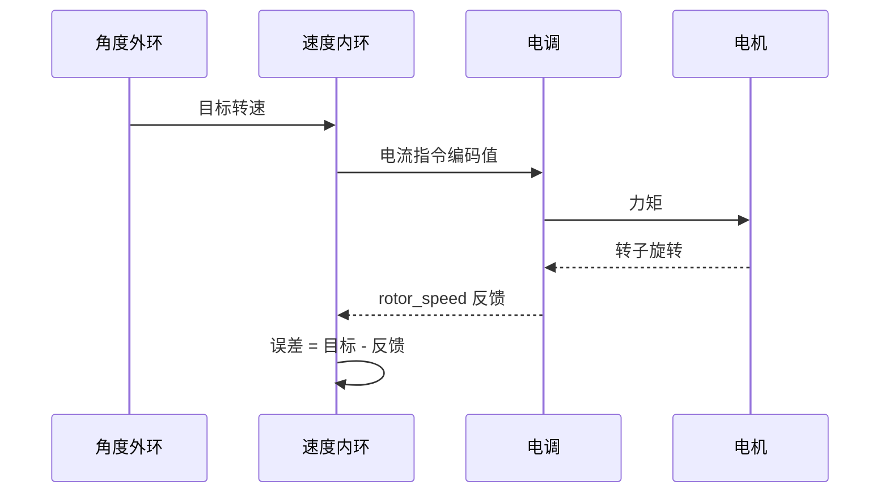
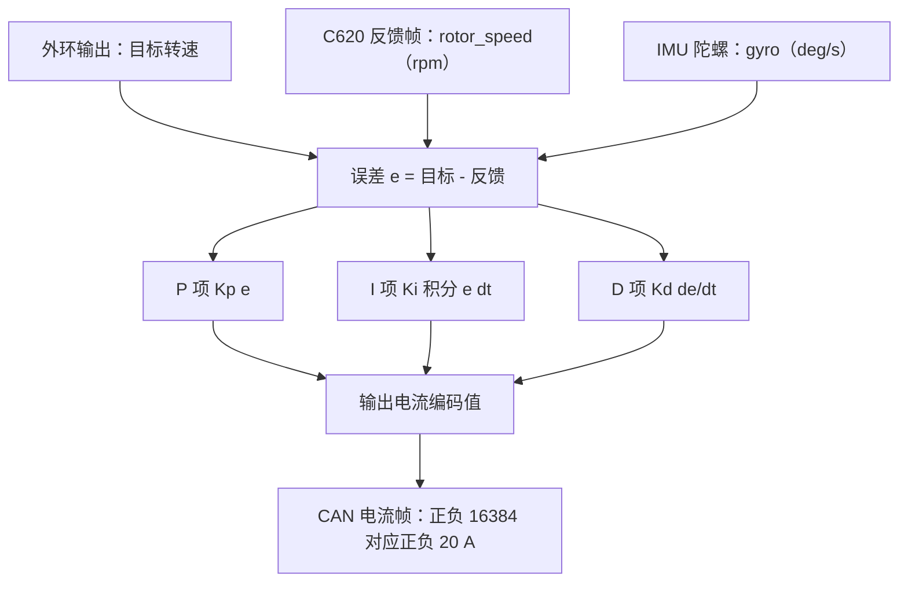

# 速度环的作用与量纲

速度环是串级控制的内层。外环给出一组目标转速，速度环用电机反馈的实测转速求出误差，输出一路电流指令。云台板的 FireTask 与 GimbalTask 共用同一份 SpeedPID 代码，反馈量却分别来自 C620 电调反馈帧与 IMU 陀螺：前者是转速（rpm），后者是角速度（deg/s）。同一段控制代码接上两组不同单位，限幅数值的含义也跟着变。

量纲先定死，再谈参数。本文先把速度环的输入、反馈、输出三端各属于哪一组单位写清楚，给出 rpm、deg/s、编码计数三者之间的换算式，再对照 FireTask 与 GimbalTask 的六个实例，说明哪些数值可以直接比较、哪些不能互借。最后给出一组换算算例，用具体数字说明跨单位复用同一组增益的后果。

本文涉及的源码位置都可以在固件仓库里核对，涉及手册的部分会单独标出依据。

> 源码索引

| 路径 | 作用 |
| --- | --- |
| `Task/Src/FireTask.cpp` | 四个速度环实例、rpm 目标、前馈与差值环 |
| `Task/Src/GimbalTask.cpp` | 两个速度环实例、deg/s 反馈与输出转换 |
| `PID/Src/speed_pid.cpp` | 速度环实现与三处限幅 |
| `PID/Inc/speed_pid.h` | SpeedPID 类声明与两个构造函数 |
| `BSP/Src/bsp_can.cpp` | rotor_speed 解析与电流帧打包 |
| `BSP/Inc/bsp_can.h` | DJI_motor_info 结构定义 |

## 速度环在串级里被控的是什么

角度外环的输出是期望转速，速度内环的输出是电流指令。电流经电调转成力矩，力矩作用在负载上产生转速。速度环把被控对象从电流到转速这一段包起来，使外环近似面对一个转速源，外环只需要处理角度与转速的关系。

两层的任务不同：外环管位置，内环管速度。内环带宽高于外环，外环的阶跃在内环看来接近恒定目标。速度环单独运行时，被跟踪量就是任务直接给出的转速，不涉及外环。云台板的 yaw 与 pitch 走串级，FireTask 的摩擦轮与拨弹盘走单速度环。

速度环内部的运算对所有实例是同一套：误差等于目标减反馈，再按比例、积分、微分三项合成输出。差别只在误差与反馈的物理量。下图把两条反馈来源与同一个误差节点画在一起，可以看到单位的分叉发生在进入误差之前。

## rpm、deg/s 与编码计数三种量纲

同一台 3508，转速有三种写法，数值相差几十到上百倍。选错一种，参数的物理含义就完全不同。

| 量纲 | 定义 | 与 1 rpm 的关系 |
| --- | --- | --- |
| 转子 rpm | 每分钟转数，C620 反馈帧直接给出 | 1 |
| deg/s | 每秒角度，IMU 陀螺与角度环输出使用 | 6 |
| 编码计数/s | 8192 计数对应转子一圈 | 约 136.533 |

以 3508 转子一圈 8192 计数、C620 反馈为转子转速为前提，换算关系是：

$$1\ \text{rpm} = \frac{360}{60}\ \text{deg/s} = 6\ \text{deg/s}$$

$$\text{counts/s} = \text{rpm} \times \frac{8192}{60} \approx 136.533\ \text{rpm}$$

第一条的系数 6 来自一分钟 60 秒与一圈 360 度的比值。第二条的系数约 136.533 来自一圈 8192 计数除以 60 秒，单位是每转计数除以秒。两个系数都是常数，与具体转速无关，所以换算只需乘一个数。

3508 的减速比约为 $3591/187 \approx 19.2$，输出轴转速是转子转速的 $1/19.2$。C620 反馈帧里的 rotor_speed 是转子转速，输出轴转速需要再除一次减速比。这一条按 C620 手册，未在本工程实测。

## 目标、反馈、输出各自走哪个量纲

速度环的三个端口各自有单位，不能互相代入。下表把每个端口对应到项目里的量与代码位置。

| 通道 | 项目中的量 | 单位 | 代码位置 |
| --- | --- | --- | --- |
| 目标 | 任务常量或角度环输出 | rpm 或 deg/s | FireTask.cpp、GimbalTask.cpp |
| 反馈 | 电调反馈或 IMU 陀螺 | rpm 或 deg/s | bsp_can.cpp、GimbalTask.cpp |
| 输出 | 速度环返回值 | 电流编码值 | speed_pid.cpp |
| 误差限幅 | error_max_ / error_min_ | 与误差同单位 | speed_pid.cpp |
| 输出限幅 | maxOutput | 电流编码值 | speed_pid.cpp |
| 积分限幅 | maxIntegral | 电流编码值 | speed_pid.cpp |

误差限幅与误差同单位，输出限幅与积分限幅与输出同单位。三者的数值不能互借：把误差限幅的 250 填进输出限幅，等于把电流上限压到 250 编码值；反过来把 8000 填进误差限幅，摩擦轮的误差限幅就永远不会触发。

## 输出端的电流编码量程

DJI C620 电调的电流指令范围是 $-16384 \sim 16384$，对应 $-20 \sim 20$ A，超出部分按边界处理。速度环输出直接进入这个编码域，输出限幅的物理上限就是这个量程。云台板的发送函数（bsp_can.cpp）不做二次钳位，把 `int16_t` 形参按大端写入 8 字节数据段。

编码值到安培的换算按线性比例：16384 对应 20 A，则 8000 对应约 9.77 A，6000 对应约 7.32 A。该换算是按 C620 手册的满量程比例得到，未在本工程用电流钳实测。

## FireTask 三个环走 rpm，GimbalTask 两个环走 deg/s

### FireTask：两个摩擦轮与拨弹盘

FireTask.cpp 就地构造四个 SpeedPID。摩擦轮与拨弹盘的反馈都是 3508 的 rotor_speed，单位为 rpm；目标写成 `5500`、`-5500`、`1000` 与 `-1000`，与反馈同单位。

| 控制器 | 目标 | 反馈来源 |
| --- | --- | --- |
| motor_LEFT_PID | 5500 | motor_1.rotor_speed，0x201，bsp_can.cpp |
| motor_RIGHT_PID | -5500 | motor_2.rotor_speed，0x202，bsp_can.cpp |
| motor_SUPPLY_PID | 正负 1000 | motor_6.rotor_speed，0x206，bsp_can.cpp |
| diffPID | 0 | motor_1 与 motor_2 的转速和，FireTask.cpp |

四个环的目标与反馈都在 rpm 域内，差值环的被控量是两个转速的和，单位仍是 rpm。摩擦轮的目标一正一负，理想和的绝对值很小，差值环负责把这个和压向零。

### GimbalTask：yaw 与 pitch 走 deg/s

GimbalTask.cpp 的 YawSpeedPID 反馈是 `imu_data.gyro[2]`，GimbalTask.cpp 的 PitchSpeedPID 反馈是 `imu_data.gyro[0]`，单位都是 deg/s。两者的目标来自各自角度环的输出（GimbalTask.cpp、85-89），角度误差以度为单位，角度环输出换算成角速度后也是 deg/s。整条链路自洽，不需要 rpm 换算。

GimbalTask.cpp 保留了把电机 rpm 乘系数换成 deg/s 的注释，其中换算语句已被注释掉。反馈源换成陀螺后，这段说明与实现脱节，属残留注释。读到它时以代码为准。

## 同一组限幅数值在两个任务上含义不同

FireTask 的四个环误差限幅分别是 250、2500、150 rpm，单位随该环的反馈走；GimbalTask 两个环的误差限幅取默认的 1000，单位是 deg/s。把后者换算成 rpm 是 166.7，与摩擦轮的 250 落在同一数量级，但两者的被控对象与惯量完全不同。比较参数时先统一单位，再看数值。

| 环 | 误差限幅 | 换算成 rpm |
| --- | --- | --- |
| motor_LEFT_PID | 250 rpm | 250 |
| motor_SUPPLY_PID | 2500 rpm | 2500 |
| diffPID | 150 rpm | 150 |
| YawSpeedPID | 1000 deg/s | 166.7 |
| PitchSpeedPID | 1000 deg/s | 166.7 |

误差限幅的另一个作用是限制微分冲击，它卡在误差进入比例与微分运算之前，推导与算例见本单元《误差限幅与输出限幅》。

## 数值换算与跨单位复用增益的后果

把常用转速按两个系数换算，得到下表。

| 输入 | 换算结果 |
| --- | --- |
| 5500 rpm | 33000 deg/s |
| 5500 rpm | 750933 counts/s |
| 5500 rpm 在 1 ms 内的计数 | 750.9 |
| 5500 rpm 在 10 ms 内的计数 | 7509 |
| 3000 deg/s | 500 rpm |
| 100 deg/s | 16.67 rpm |

这张表说明跨单位复用 Kp 的后果：同一个 `20` 配 rpm 与配 deg/s，等效刚度相差 6 倍。云台的速度环误差以 deg/s 计，同样一个 Kp 会让输出对角度误差的敏感度是摩擦轮的 6 倍。参数从一块板搬到另一块板时，先换算单位再填数值。

## 量纲混用相关的易错点

| # | 易错点 | 表现或后果 | 源码位置 |
| --- | --- | --- | --- |
| 1 | rpm 与 deg/s 混用 | 目标与反馈单位不一致，稳态偏差恒为非零值 | FireTask.cpp、GimbalTask.cpp |
| 2 | 把 rotor_speed 当输出轴转速 | 数值偏大约 19.2 倍，目标转速设置失真 | bsp_can.cpp |
| 3 | 输出当安培读 | 8000 只是编码值，实际电流约 9.77 A | bsp_can.cpp |
| 4 | 用 int16_t 承接超过 32767 的输出 | 云台 yaw 先钳到正负 50000 再转 int16_t，越界值翻转符号 | GimbalTask.cpp |
| 5 | 把角度环输出当 rpm | 云台速度环目标实为 deg/s，配 rpm 参数会整体偏软或偏硬 | GimbalTask.cpp |
| 6 | 误差限幅按输出量程取值 | error_max_ 与误差同单位，取 250 对应 250 rpm 或 250 deg/s | speed_pid.cpp |

## 小结

### 核心概念

- 速度环的输入是目标转速、反馈是实测转速、输出是电流编码值，三者各自有单位。
- 3508 走 rpm，IMU 陀螺走 deg/s，$1\ \text{rpm} = 6\ \text{deg/s}$，编码计数换算系数约 136.533。
- 误差限幅与误差同单位，输出限幅与积分限幅与电流编码值同单位。
- C620 电流编码量程为正负 16384，对应正负 20 A。
- 云台两个速度环的目标与反馈都取自角度与陀螺链路，单位一致；FireTask 三个速度环都走 3508 的 rpm。
- rotor_speed 是转子转速，输出轴转速还需除以约 19.2 的减速比。

### 设计权衡

| 权衡点 | 本工程的选择 | 收益与代价 |
| --- | --- | --- |
| 反馈统一用 rpm | FireTask 三环与差值环同源 | 参数可直接比大小；代价是无法直接与 IMU 角度环串联 |
| 云台速度环用 deg/s | 与陀螺、角度环同源 | 省去换算；代价是 Kp 数值不能跨环照搬 |
| 输出留到发送前才转 int16_t | 保留浮点中间量 | 便于限幅与叠加；代价是类型转换点多，易越界 |
| 误差限幅单独设 | 7 参数构造 | 可按执行器区分；代价是单位随目标变化，跨环不能复用 |

## 练习

### 基础题

1. 把 8000 rpm 换算成 deg/s、counts/s 与 1 ms 周期内的计数。
2. 说明差值与角度环输出分别属于哪一组单位，为什么差值的低通滤波系数与单位无关。
3. 写出 C620 电流编码值 8000 对应的安培数，并说明该换算是按手册还是按实测。

### 挑战题

4. 云台 pitch 速度环反馈改用 3508 的 rotor_speed 后，为保持等效刚度，Kp 应取多少。
5. 设计一层单位适配函数，把 `(target_rpm, feedback_rpm)` 与 `(target_degs, feedback_degs)` 统一成内部 deg/s，列出需要改动的调用点。
6. 分析 GimbalTask.cpp 的 `clamp` 与强制类型转换顺序对越界输出的影响，给出一种不溢出的写法。

## 附：本页引用的固件路径

| 路径 | 用途 |
| --- | --- |
| `/home/wyx/rm/2026SentriOmeniGimbal/2026OmniSentryGimbal/Task/Src/FireTask.cpp` | 四个速度环实例与 rpm 目标 |
| `/home/wyx/rm/2026SentriOmeniGimbal/2026OmniSentryGimbal/Task/Src/GimbalTask.cpp` | 两个速度环实例与 deg/s 反馈 |
| `/home/wyx/rm/2026SentriOmeniGimbal/2026OmniSentryGimbal/PID/Src/speed_pid.cpp` | 速度环实现 |
| `/home/wyx/rm/2026SentriOmeniGimbal/2026OmniSentryGimbal/BSP/Src/bsp_can.cpp` | rotor_speed 解析与电流帧打包 |
| `/home/wyx/rm/2026SentriOmeniGimbal/2026OmniSentryGimbal/BSP/Inc/bsp_can.h` | DJI_motor_info 结构 |
