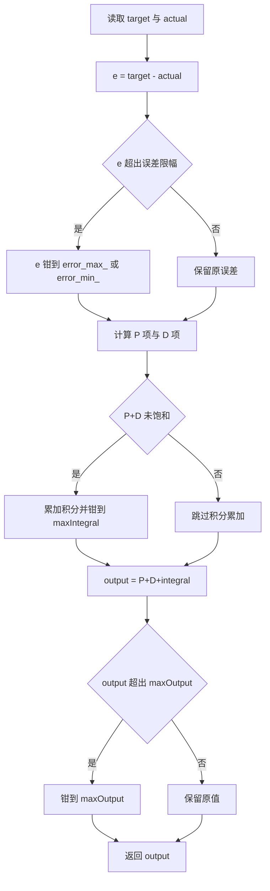
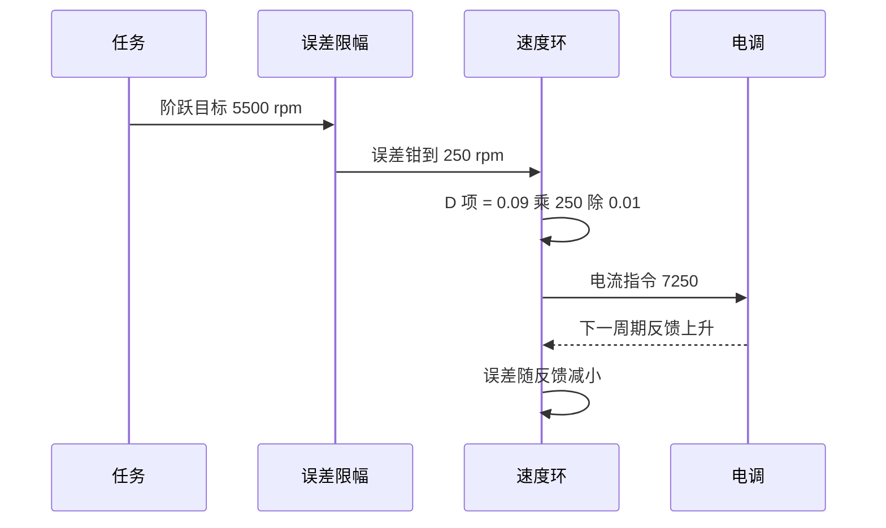

# 误差限幅与输出限幅

速度环里有两处钳位常被当成同一件事。误差限幅卡在误差进入比例项与微分项之前，挡的是目标阶跃造成的微分冲击；输出限幅卡在控制器出口，挡的是执行器的物理上限。两者的量纲、触发条件和数值量级都不同，混用会让参数失去意义。

云台板六个速度环同时用到这两处限幅，数值从 150 到 30000 不等。误差限幅与误差同单位，所以摩擦轮上的 250 是 250 rpm，云台环上的 1000 是 1000 deg/s；输出限幅与电流编码值同单位，物理上限由 C620 的 16384 决定。

本文先讲清两处钳位分别挡什么、公式怎么推，再用三个算例把数值走一遍，然后落到 `speed_pid.cpp:59-110` 的代码与六个环的参数表，最后说明前馈叠加为什么落在限幅之外。

> 源码索引

| 路径 | 作用 |
| --- | --- |
| `PID/Src/speed_pid.cpp` | 误差限幅、条件积分与输出限幅 |
| `PID/Inc/speed_pid.h` | 两个构造函数与 `error_max_` 字段 |
| `Task/Src/FireTask.cpp` | 四个速度环参数与前馈叠加 |
| `Task/Src/GimbalTask.cpp` | 两个 5 参数速度环 |
| `BSP/Src/bsp_can.cpp` | 电流帧打包与 16384 量程使用 |

## 两处钳位挡的不是同一件事

误差限幅限制的是 $e = target - actual$ 的取值范围，钳位发生在微分与比例运算之前。输出限幅限制的是 $K_p e + K_i \int e\,dt + K_d \dot e$ 的结果，钳位发生在控制器返回值之前。一个在入口，一个在出口，中间还隔着条件积分的判断。

| 项目 | 误差限幅 | 输出限幅 |
| --- | --- | --- |
| 作用对象 | 误差 e | 控制器输出 |
| 单位 | 与目标、反馈同单位 | 与输出（电流编码值）同单位 |
| 源码字段 | error_max_ / error_min_ | maxOutput |
| 挡的对象 | 目标突变、量测跳变 | 执行器物理上限 |
| 触发条件 | 瞬时误差超出设定区间 | 控制器算出的电流超出量程 |
| 典型值 | 250 rpm、2500 rpm、150 rpm | 8000、30000、300 |

两处钳位的先后顺序可以从代码流程看出来。误差先被钳位，P 与 D 用钳位后的误差计算；P 与 D 的和决定是否累加积分；三项相加之后才做输出钳位。

## 误差限幅如何压住微分冲击

离散微分项写成：

$$\dot e_k = \frac{e_k - e_{k-1}}{dt}$$

目标阶跃时 $e_k$ 与 $e_{k-1}$ 相差整个阶跃量，微分项被放大 $1/dt$ 倍。误差先钳位后，相邻两次进入微分的误差差值的上界是：

$$\left|e_k - e_{k-1}\right| \le \text{error\_max} - \text{error\_min}$$

因此微分项被限制在 $(\text{error\_max} - \text{error\_min})/dt$ 以内。比例项同时被压到 $K_p \cdot \text{error\_max}$。误差限幅对积分项也有影响：积分累加的是钳位后的误差，大误差下的积分增速被同步压低。

三个式子串起来说明一件事：误差限幅不是只保护 D 项，它同时改变 P 与 I 在阶跃瞬间的取值。限幅值取小了，阶跃响应的前期输出被整体压低；取大了，微分冲击照旧顶到输出限幅。

## 三个算例

### 算例一：目标阶跃的第一次输出

取 motor_LEFT_PID 的参数（FireTask.cpp:31）：$K_p = 20$、$K_i = 0.11$、$K_d = 0.09$、误差限幅 $\pm 250$、输出限幅 $\pm 8000$。目标从 0 跳到 5500 rpm，反馈仍为 0，$dt = 0.01$ s，$prevError = 0$。

| 步骤 | 无限幅 | 有误差限幅 |
| --- | --- | --- |
| 误差 e | 5500 | 250 |
| P 项 $K_p e$ | 110000 | 5000 |
| D 项 $K_d (e - e_{prev})/dt$ | 49500 | 2250 |
| P+D | 159500 | 7250 |
| 是否累加积分 | 否，P+D 已饱和 | 是，累加 0.275 |
| 输出限幅后 | 8000 | 7250.275 |

无限幅时第一次输出就被输出限幅压到 8000，P 与 D 的真实值没有出现在输出里。误差限幅把第一次输出降到 7250 附近，P 与 D 都还在线性区工作，目标阶跃的响应变得可预测。D 项从 49500 降到 2250，比例约 22 倍。

### 算例二：输出限幅宽于执行器量程

取 motor_SUPPLY_PID 的参数（FireTask.cpp:35）：$K_p = 25$、$K_i = 0.01$、$K_d = 0$、误差限幅 $\pm 2500$、输出限幅 $\pm 30000$。目标 1000 rpm，反馈 0，误差 1000 未触及误差限幅。

| 步骤 | 数值 |
| --- | --- |
| P 项 | 25000 |
| D 项 | 0 |
| P+D | 25000 |
| 是否累加积分 | 是，累加 0.1 |
| maxOutput 限幅后 | 25000.1 |
| C620 实际量程 | $\pm 16384$ |

控制器自认的量程是 30000，电调能接受的是 16384。25000 落在两者之间，PID 认为输出仍在线性区，电调侧已经达到电流上限。输出限幅值比执行器量程宽时，控制器会失去对饱和状态的感知，条件积分抗饱和的判据（speed_pid.cpp:84）也不再准确。

### 算例三：误差限幅与输出限幅量级倒挂

取 diffPID 的参数（FireTask.cpp:38）：$K_p = 15$、误差限幅 $\pm 150$、输出限幅 $\pm 300$。误差限幅放开时 P 项可达 $15 \times 150 = 2250$，是输出限幅的 7.5 倍。误差绝对值超过 $300/15 = 20$ rpm 后，输出恒为 $\pm 300$，差值环退化为阈值切换。这一条按参数推算，未实测。

## 两处限幅在代码里的位置

| 环节 | 代码 | 说明 |
| --- | --- | --- |
| 取误差 | speed_pid.cpp:60 | `float error = target - actual` |
| 误差限幅 | speed_pid.cpp:63-67 | 上钳 error_max_、下钳 error_min_ |
| 微分 | speed_pid.cpp:75-78 | 用钳位后的误差，dt 为 0 时置 0 |
| P+D | speed_pid.cpp:81 | 比例与微分相加 |
| 条件积分 | speed_pid.cpp:84-92 | P+D 未饱和才累加并钳到 maxIntegral |
| 输出限幅 | speed_pid.cpp:97-101 | 对称钳到 $\pm$ maxOutput |
| 限幅初始化 | speed_pid.cpp:12、17 | maxOutput 取 max_out 与 min_out 的绝对值较大者 |
| 5 参数默认误差限幅 | speed_pid.cpp:33-34 | error_max_ 1000、error_min_ -1000 |

输出限幅在构造函数里先被对称化：speed_pid.cpp:12 与 :17 都取两值的绝对值较大者，钳位在 speed_pid.cpp:97-101 用 $\pm$ maxOutput 执行。传入非对称量程时，正负方向都会被放宽到较大的一侧，min_out 不单独参与限幅，推导见本单元《SpeedPID 实现》。

## 六个环的限幅参数对照

| 控制器 | 误差限幅 | 输出限幅 | 积分限幅 |
| --- | --- | --- | --- |
| motor_LEFT_PID | $\pm 250$ rpm | $\pm 8000$ | 1000 |
| motor_RIGHT_PID | $\pm 250$ rpm | $\pm 8000$ | 1000 |
| motor_SUPPLY_PID | $\pm 2500$ rpm | $\pm 30000$ | 1000 |
| diffPID | $\pm 150$ rpm | $\pm 300$ | 1000 |
| YawSpeedPID | $\pm 1000$ deg/s | 1000000 | 20000 |
| PitchSpeedPID | $\pm 1000$ deg/s | 30000 | 20000 |

YawSpeedPID 与 PitchSpeedPID 走 5 参数构造，误差限幅取默认值，积分限幅取构造第 5 参数。$\pm 1000$ deg/s 相当于 $\pm 166.7$ rpm，对云台速度环来说很少触发。两个环的 Ki 都是 0，积分限幅虽然填了 20000，积分项恒为 0，不参与运算。

## 前馈叠加在输出限幅之外

FireTask.cpp:49-50 把前馈 `feed_forward_left` 与 PID 输出相加后再赋给电流变量。前馈不经过 speed_pid.cpp:97-101 的钳位，也不受 maxOutput 约束。前馈为 500，与限幅 8000 相比占用 6.25%，量级可接受，但叠加后的总量可能超过 8000。

限幅之后的输出才是速度环的返回值，前馈与差值环的叠加发生在返回值之外。要让总输出受约束，需要在任务层叠加之后再做一次钳位，或者把前馈纳入 PID 内部。

## 与限幅有关的易错点

| # | 易错点 | 表现或后果 | 源码位置 |
| --- | --- | --- | --- |
| 1 | 认为 min_out 参与输出限幅 | 构造函数对 max_out 与 min_out 取绝对值较大者，输出上下限对称 | speed_pid.cpp:17 |
| 2 | 用误差限幅代替输出限幅 | 大误差下微分仍可能把输出顶到 maxOutput | speed_pid.cpp:84 |
| 3 | 输出限幅宽于执行器量程 | PID 认为在线性区，电调已饱和，条件积分判据失效 | FireTask.cpp:35 |
| 4 | 误差限幅与输出限幅量级倒挂 | $K_p \times$ error_max 远大于 maxOutput 时退化为阈值控制 | FireTask.cpp:38 |
| 5 | 前馈绕过输出限幅 | 叠加后总量可能超出 maxOutput | FireTask.cpp:49-50 |
| 6 | 误差限幅单位按输出量程取 | 云台两环限幅是 deg/s，FireTask 三环是 rpm | speed_pid.cpp:33-34 |
| 7 | 忽略限幅后的误差被写入 prevError | 下一次微分基于钳位误差，D 项长期被削 | speed_pid.cpp:104 |

## 小结

### 核心概念

- 误差限幅作用在比例与微分之前，把相邻误差差值的上界压到 $\text{error\_max} - \text{error\_min}$，从而限制微分冲击。
- 输出限幅作用在控制器出口，物理上限由 C620 的 $\pm 16384$ 编码量程决定。
- 误差限幅与误差同单位，输出限幅与电流编码值同单位。
- 条件积分在 P+D 未饱和时累加，限幅值宽于执行器量程时该判据失效。
- 前馈叠加在限幅之后，不受 maxOutput 约束。
- 输出限幅在构造函数里被对称化，min_out 不单独限制负方向。

### 设计权衡

| 权衡点 | 本工程的选择 | 收益与代价 |
| --- | --- | --- |
| 误差限幅可配 | 7 参数构造按环单独设定 | 摩擦轮与拨弹盘可分别限制；代价是每个环都要重新估量级 |
| 输出限幅取绝对值对称 | 取 max_out 与 min_out 绝对值较大者 | 代码简单；代价是单向执行器无法单独设限 |
| 积分限幅固定 1000 | 7 参数构造硬编码 | 摩擦轮的 1000 与 8000 同量级；代价是 YawSpeedPID 的 1000 相对 1000000 几乎不起作用 |
| 前馈独立于 PID | 直接与返回值相加 | 不占用 PID 增益；代价是总输出可能越过 maxOutput |

## 练习

### 基础题

1. 取 motor_LEFT_PID 参数，计算目标从 0 跳到 5500 rpm 时第一次输出的 P、D、积分与总量。
2. 说明输出限幅 30000 与 C620 量程 16384 之间的差对应多少安培，该换算是按手册还是按实测。
3. 写出误差限幅为 $\pm 250$、$dt = 0.01$ s 时微分项的绝对值上界。

### 挑战题

4. 把 motor_SUPPLY_PID 的输出限幅改成 16384，分析拨弹盘在堵转工况下条件积分判据的变化。
5. 给出 diffPID 的线性区宽度（$|e| \le \text{maxOutput}/K_p$），并说明低通滤波后有效误差如何影响这个宽度。
6. 设计一个顺序：先做误差限幅、再做前馈、最后统一输出限幅，写出改动点与对现有四个速度环的影响。

## 附：本页引用的固件路径

| 路径 | 用途 |
| --- | --- |
| `/home/wyx/rm/2026SentriOmeniGimbal/2026OmniSentryGimbal/PID/Src/speed_pid.cpp` | 误差限幅、条件积分与输出限幅（:59-110） |
| `/home/wyx/rm/2026SentriOmeniGimbal/2026OmniSentryGimbal/PID/Inc/speed_pid.h` | 两个构造函数与 error_max_ 字段（:15-35） |
| `/home/wyx/rm/2026SentriOmeniGimbal/2026OmniSentryGimbal/Task/Src/FireTask.cpp` | 四个速度环参数与前馈叠加（:25-70） |
| `/home/wyx/rm/2026SentriOmeniGimbal/2026OmniSentryGimbal/Task/Src/GimbalTask.cpp` | 两个 5 参数速度环（:29-34） |
| `/home/wyx/rm/2026SentriOmeniGimbal/2026OmniSentryGimbal/BSP/Src/bsp_can.cpp` | 电流帧打包与 16384 量程使用（:139-163） |
