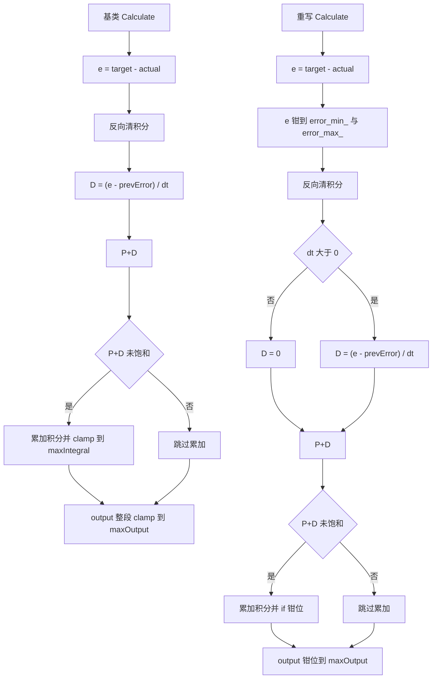
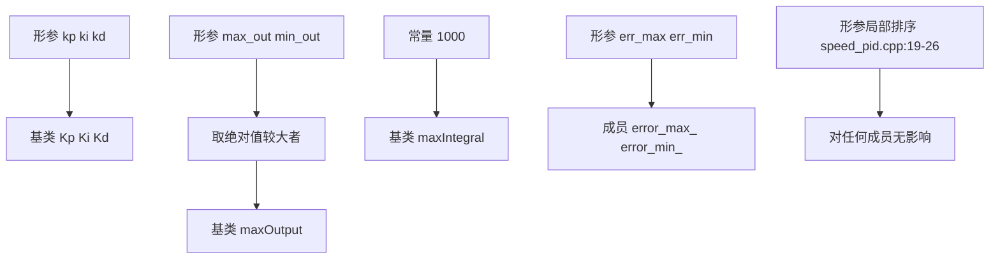

# SpeedPID 实现

SpeedPID 在 PidBase 之上加了一层误差限幅，并重写 Calculate。两个构造函数分管不同调用方式：7 参数版给 FireTask 用，5 参数版给云台任务与 C 接口用。构造函数里有一处对形参排序的代码，以及一个被硬编码的积分限幅常量，两者都会影响对参数的理解。

底盘板与云台板各有一份 speed_pid.cpp，两文件只差几行。云台板保留积分钳位，底盘板把同一段钳位注释掉了；底盘板的 PidBase 也没有重写版的 `Calculate_with`，成员可见性从 public 改成 protected。同名文件在两块板上不保证行为一致。

本文按构造函数、重写 Calculate、两板差异的顺序走一遍代码，重点是那些从参数名看不出来的语义：第 5 个参数是积分限幅而不是输出下限，输出限幅被强制对称，prevError 存的是钳位后的误差。

> 源码索引

| 路径 | 作用 |
| --- | --- |
| `PID/Src/speed_pid.cpp` | 云台板速度环实现 |
| `PID/Inc/speed_pid.h` | 类声明与 C 接口 |
| `PID/PidBase.h` | 基类 Calculate 与 Calculate_with |
| `Task/Src/FireTask.cpp` | 四个七参数实例 |
| `Task/Src/GimbalTask.cpp` | 两个五参数实例 |
| 底盘板同名文件 | 积分钳位被注释的对照版本 |

## PidBase 之上补了哪两件事

PidBase 提供通用的比例、积分、微分与条件积分抗饱和。SpeedPID 增加两件事：误差进入运算前先钳位；微分对 $dt = 0$ 做保护。其余限幅、反向清积分、状态保存的逻辑与基类一致。

两条流程的骨架相同，差别集中在三处：重写版在误差处插入了钳位，在微分前加了 `dt` 判断，在积分累加后用 if 分支而不是 `clamp()` 做钳位。这三处的语义差别在下面的对照表里逐项列出。

## 七参数构造函数逐行

| 行号 | 代码 | 语义 |
| --- | --- | --- |
| speed_pid.cpp:9-11 | 形参 `(kp, ki, kd, max_out, min_out, err_max, err_min)` | 前五项与基类相关，后两项只用于误差限幅 |
| speed_pid.cpp:12 | `PidBase(kp, ki, kd, fmax(fabs(max_out), fabs(min_out)), 1000.0f)` | 基类成员初始化，输出限幅取两值绝对值较大者，积分限幅固定 1000 |
| speed_pid.cpp:13-14 | `error_max_(err_max), error_min_(err_min)` | 直接存形参，未排序 |
| speed_pid.cpp:17 | `maxOutput = fmax(fabs(max_out), fabs(min_out))` | 与初始化列表重复赋值 |
| speed_pid.cpp:19-26 | `if (max_out >= min_out) ... else 交换` | 操作形参局部变量，对成员无影响 |

输出限幅的推导：源码只保留两值的绝对值较大者，钳位在 speed_pid.cpp:97-101 用 $\pm$ maxOutput 对称执行。写成公式：

$$\text{maxOutput} = \max\left(|max\_out|,\ |min\_out|\right)$$

当 $max\_out = 8000$、$min\_out = -8000$ 时结果为 8000；当 $max\_out = 100$、$min\_out = -5000$ 时结果为 5000，正方向也被放宽到 5000。传入的非对称量程在进入构造函数后即被对称化，min_out 不再单独参与限幅。

speed_pid.cpp:19-26 的排序分支在语义上是无效代码：$max\_out$ 与 $min\_out$ 是值传递的形参，交换只影响函数体内这两个局部变量，之后没有任何读取点。成员 maxOutput 已在 speed_pid.cpp:12 与 :17 定好。

## 五参数构造函数把第 5 参当积分限幅

speed_pid.cpp:30-36 透传 `(kp, ki, kd, max_out, max_iout)` 给基类，第 5 个形参的名字是 max_iout，进入基类后作为 maxIntegral。误差限幅取默认值 1000 与 -1000（speed_pid.cpp:33-34）。

GimbalTask.cpp:29 与 :34 使用这个版本，所以两个云台速度环的输出限幅分别等于 1000000 与 30000，积分限幅分别等于 20000 与 20000，误差限幅都是 $\pm 1000$。5 参数版没有输出下限形参，输出限幅只由第 4 参决定。

## 重写 Calculate 与基类的对照

| 环节 | PidBase::Calculate | SpeedPID::Calculate |
| --- | --- | --- |
| 误差限幅 | 无 | speed_pid.cpp:63-67 钳到 error_max_ 与 error_min_ |
| 反向清积分 | PidBase.h:33-35 | speed_pid.cpp:70-72，条件相同 |
| 微分 | PidBase.h:38，无 dt 判断 | speed_pid.cpp:75-78，dt 不大于 0 时置 0 |
| P+D | PidBase.h:41 | speed_pid.cpp:81，表达式相同 |
| 积分累加条件 | PidBase.h:44-47 | speed_pid.cpp:84-92，条件相同，钳位改 if/else |
| 积分钳位量 | 构造参数 max_iout | 七参数版固定 1000 |
| 输出钳位 | PidBase.h:52 `clamp()` | speed_pid.cpp:97-101 if/else，等价 |
| 写入 prevError 的值 | 原始误差 | 钳位后的误差（speed_pid.cpp:104） |

两处差异会改变数值。微分基于钳位误差，D 项被压小；prevError 存入钳位误差，误差从限幅区回到线性区的那一拍，微分基于上一拍的钳位值计算，会产生一次额外跳变。

条件积分的判据是 P+D 的结果，不含积分项。积分在 $|K_p e + K_d \dot e| < \text{maxOutput}$ 时持续累加，直到触及 maxIntegral。这意味着积分自身把输出顶到限幅之后，判据仍然认为系统在线性区，积分会继续增长。

## 误差限幅在构造时不排序

七参数构造直接把 `err_max` 与 `err_min` 写入成员，不排序；`setErrorLimits`（speed_pid.cpp:39-47）才做排序。若构造时传入 $err\_max = 100$、$err\_min = 200$，Calculate 的两个分支会让任何 $e < 200$ 的误差被抬到 200，误差放大而不是缩小。本工程的四个 FireTask 速度环都按 $err\_max > 0 > err\_min$ 传入，不触发该问题。

排序缺失的后果不限于数值偏大。误差被抬到 200 之后，比例项与积分项都按放大后的误差计算，输出比不设误差限幅时还要大，限幅从保护变成了放大器。核对参数时先确认 `err_max` 大于 `err_min`。

## 云台板与底盘板的同名文件差异

| 项目 | 云台板 | 底盘板 |
| --- | --- | --- |
| speed_pid.cpp 行数 | 124 | 123 |
| 积分 if 钳位 | 保留（:87-91） | 注释掉（:86-90） |
| 基类 Calculate_with | 有（PidBase.h:63-91） | 无 |
| 基类成员可见性 | public（PidBase.h:92-98） | protected（PidBase.h:63-69） |

底盘板的积分只在 P+D 未饱和时累加，累加后不做上界钳位。若长时间处于小误差、P+D 未饱和的工况，积分会随 $K_i e\,dt$ 一直累积，只能靠输出限幅把它压回去。云台板的同一段代码保留钳位，七参数实例的积分被限制在 1000 以内。这一条由两文件逐行对照得到。

成员可见性的差异还有一个直接后果：云台任务可以直接写 `maxIntegral`（GimbalTask.cpp:32），底盘板把成员放到 protected 之后，外部代码不能这样做。基类 `Calculate_with` 只在云台板存在，云台 pitch 外环用的无条件积分来自它。

## 调用点与未使用接口

| 实例 | 构造方式 | 位置 |
| --- | --- | --- |
| motor_LEFT_PID | 七参数 | FireTask.cpp:31 |
| motor_RIGHT_PID | 七参数 | FireTask.cpp:33 |
| motor_SUPPLY_PID | 七参数 | FireTask.cpp:35 |
| diffPID | 七参数 | FireTask.cpp:38 |
| YawSpeedPID | 五参数 | GimbalTask.cpp:29 |
| PitchSpeedPID | 五参数 | GimbalTask.cpp:34 |
| speed_pid 静态实例 | 五参数 | speed_pid.cpp:114，全工程无调用点 |

`speed_pid_clear`（speed_pid.cpp:116-118）与 `speed_pid_calculate`（speed_pid.cpp:120-123）是 C 封装，本工程没有任何调用点。任务里直接持有 SpeedPID 对象，C 封装处于未使用状态。`setErrorLimits` 与 `getErrorMax` / `getErrorMin` 同样无调用点。

## 实现细节上的易错点

| # | 易错点 | 表现或后果 | 源码位置 |
| --- | --- | --- | --- |
| 1 | 认为构造函数会排序误差限幅 | 只有 setErrorLimits 排序，构造传入倒序会放大误差 | speed_pid.cpp:13-14、39-47 |
| 2 | 认为 min_out 单独限制负方向 | 输出钳位对称，取绝对值较大者 | speed_pid.cpp:17、97-101 |
| 3 | 把 maxIntegral 当构造参数 | 七参数版硬编码 1000，五参数版才从第 5 参传入 | speed_pid.cpp:12、32 |
| 4 | 漏看底盘注释掉的积分钳位 | 两板同名文件行为不同 | speed_pid.cpp:86-90 |
| 5 | 以为基类有 dt 保护 | dt 保护只在重写版 | PidBase.h:38、speed_pid.cpp:76 |
| 6 | 用 clamp 与 if/else 的差异解释结果 | 两者语义相同，不构成行为差异 | speed_pid.cpp:97-101 |
| 7 | 忽略 prevError 存的是钳位误差 | 限幅释放后微分出现额外跳变 | speed_pid.cpp:104 |

## 小结

### 核心概念

- 七参数构造把输出限幅对称化为两值绝对值的较大者，积分限幅固定 1000。
- speed_pid.cpp:19-26 对形参的排序不影响任何成员。
- 五参数构造透传第 5 参作为积分限幅，误差限幅默认 $\pm 1000$。
- 重写 Calculate 在基类流程上插入误差限幅与 dt 保护，prevError 保存钳位后的误差。
- 七个调用点里六个在用，`speed_pid` 静态实例与两个 C 封装无调用点。
- 底盘板注释掉了积分钳位，两板在长时小误差工况下的积分行为不同。

### 设计权衡

| 权衡点 | 本工程的选择 | 收益与代价 |
| --- | --- | --- |
| 输出限幅对称化 | 取绝对值较大者 | 接口可接收非对称量程；代价是方向性限幅丢失 |
| 积分限幅硬编码 1000 | 七参数版固定 | 摩擦轮与拨弹盘免配置；代价是输出量程大的环几乎不受积分限幅约束 |
| 误差限幅不进排序 | 构造直接存 | 省一次判断；代价是调用方必须自查顺序 |
| 两版 Calculate 并存 | 基类与派生各一份 | 派生版可按需改；代价是 dt 保护、积分钳位等细节在两处不一致 |
| 底盘注释积分钳位 | 保留未限幅积分 | 减少一次比较；代价是抗饱和依赖条件积分与输出限幅 |

## 练习

### 基础题

1. 写出七参数构造函数对 maxOutput 与 maxIntegral 的赋值，并说明 min_out 的作用。
2. 对照 PidBase.h:29-61 与 speed_pid.cpp:59-110，列出重写版多出的三处判断。
3. 说明 `setErrorLimits` 与七参数构造在排序行为上的差别。

### 挑战题

4. 给七参数构造函数加上误差限幅排序，使构造倒序时行为与 setErrorLimits 一致。
5. 把底盘板的积分钳位恢复并给出 maxIntegral 的取值建议，说明它与 maxOutput 的量级关系。
6. 设计单元测试：对同一组输入分别调用基类与派生版 Calculate，列出可以暴露 prevError 钳位差异的输入序列。

## 附：本页引用的固件路径

| 路径 | 用途 |
| --- | --- |
| `/home/wyx/rm/2026SentriOmeniGimbal/2026OmniSentryGimbal/PID/Src/speed_pid.cpp` | 云台板速度环实现（:9-124） |
| `/home/wyx/rm/2026SentriOmeniGimbal/2026OmniSentryGimbal/PID/Inc/speed_pid.h` | 类声明与 C 接口（:12-48） |
| `/home/wyx/rm/2026SentriOmeniGimbal/2026OmniSentryGimbal/PID/PidBase.h` | 基类 Calculate 与 Calculate_with（:15-98） |
| `/home/wyx/rm/2026SentriOmeniChassis/2026OmniSentryChassis/PID/Src/speed_pid.cpp` | 底盘板速度环实现，积分钳位被注释（:86-90） |
| `/home/wyx/rm/2026SentriOmeniChassis/2026OmniSentryChassis/PID/PidBase.h` | 底盘板基类，无 Calculate_with，成员 protected（:63-69） |
| `/home/wyx/rm/2026SentriOmeniGimbal/2026OmniSentryGimbal/Task/Src/FireTask.cpp` | 四个七参数实例（:31-38） |
| `/home/wyx/rm/2026SentriOmeniGimbal/2026OmniSentryGimbal/Task/Src/GimbalTask.cpp` | 两个五参数实例（:29-34） |
