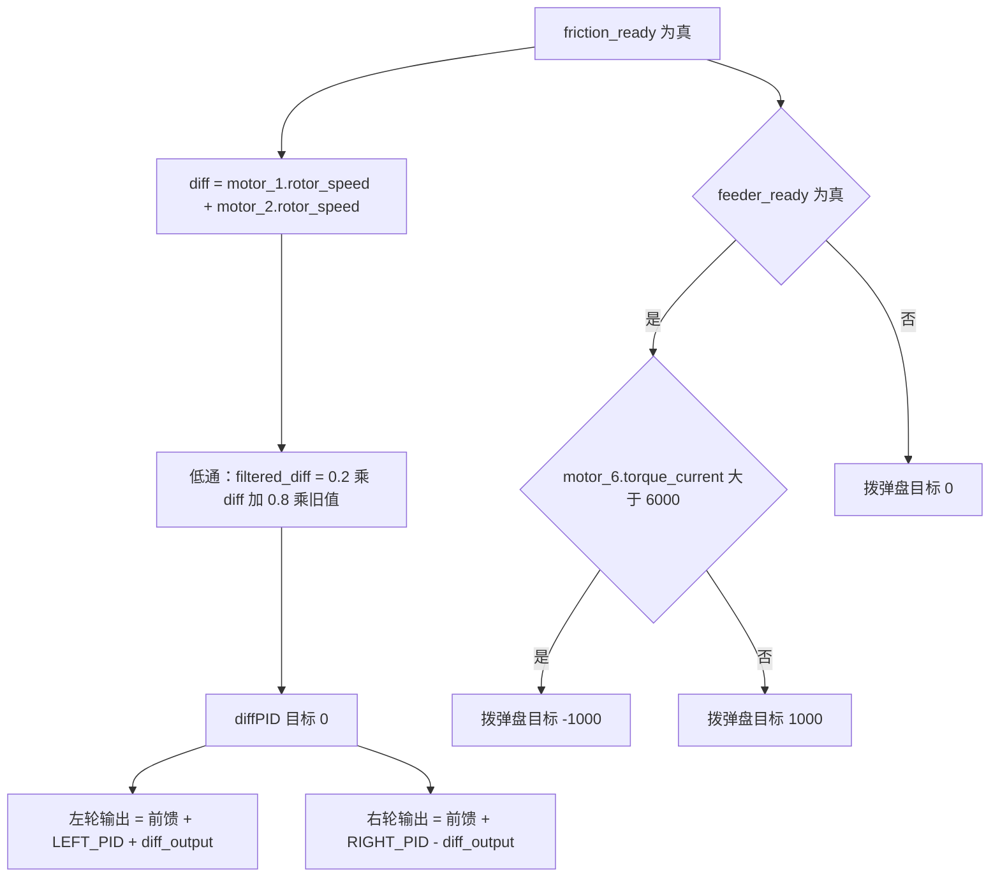
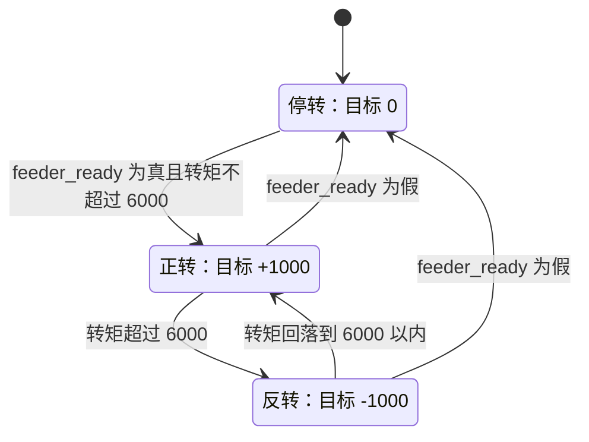

# 本项目速度环参数

云台板的 FireTask 与 GimbalTask 一共实例化六个 SpeedPID：四个在 FireTask 中驱动左摩擦轮、右摩擦轮、拨弹盘和两轮转速差，两个在 GimbalTask 中作为 yaw 与 pitch 的速度内环。参数全部写在任务函数栈上，没有集中在配置文件里。

速度环的被控对象是「电流到转速」这条通道，带宽通常低于角度环，因此整定顺序是内环先、外环后：先把内环调成快速且不超调的一阶响应，再合上外环一起看。速度环一般保留比例项，静差用积分补；微分项要慎用，因为转速多来自编码器差分，本身带量化噪声，再微分等于放大噪声。还要先统一量纲：同一个 $K_p$ 在 rpm 与 deg/s 两种反馈下数值不可比，跨环比较参数之前先对齐单位。

六个环里，前四个走 rpm，后两个走 deg/s，单位的分界在任务之间。FireTask 的三个执行器环各自带前馈或阈值逻辑，差值环的被控量是两个摩擦轮转速的和，反馈在进入 PID 前先过一次低通。GimbalTask 的两个内环只留了比例项，Ki 与 Kd 都是 0。

本文给出六个环的完整参数表，推导差值滤波的时间常数，说明拨弹盘的换向判据为什么属于任务层而不是 PID，最后把输出变量的类型转换链走一遍。参数表、前馈叠加与差值滤波是理解这块控制的主要入口。

> 源码索引

| 路径 | 作用 |
| --- | --- |
| `Task/Src/FireTask.cpp` | 四个实例、前馈、差值滤波与换向逻辑 |
| `Task/Src/GimbalTask.cpp` | 两个云台内环与出口限幅 |
| `PID/Src/speed_pid.cpp` | 七参数与五参数构造 |
| `Task/Src/ControlCenterTask.cpp` | 电流输出打包与 osDelay |
| `BSP/Src/bsp_can.cpp` | motor_1、motor_2、motor_6 的反馈解析 |

## 六个实例按任务分成两组

| 实例 | 任务 | 用途 |
| --- | --- | --- |
| motor_LEFT_PID | FireTask | 左摩擦轮转速闭环 |
| motor_RIGHT_PID | FireTask | 右摩擦轮转速闭环 |
| motor_SUPPLY_PID | FireTask | 拨弹盘转速闭环 |
| diffPID | FireTask | 两摩擦轮转速和的闭环 |
| YawSpeedPID | GimbalTask | yaw 速度内环 |
| PitchSpeedPID | GimbalTask | pitch 速度内环 |

摩擦轮与拨弹盘的反馈都来自 3508 的 rotor_speed，单位为 rpm；云台两个内环的反馈来自 IMU 陀螺，单位为 deg/s。差值环被控量是两个摩擦轮转速的代数和，反馈在进入 PID 前先过一次低通。六个实例都是函数内的局部对象，生命周期与任务一致。

## 前馈 500 分担稳态电流

FireTask.cpp 定义 `feed_forward_left = 1000 * 0.5 = 500` 与 `feed_forward_right = -500`。前馈是一个与误差无关的常值电流，用来抵消摩擦轮克服弹丸阻力所需的稳态电流，让 PID 的积分不必从零爬升。合成式写成：

$$u_{left} = u_{ff} + \text{LEFT\_PID}(5500,\ \omega_1,\ dt) + u_{diff}$$

$$u_{right} = -u_{ff} + \text{RIGHT\_PID}(-5500,\ \omega_2,\ dt) - u_{diff}$$

两式里前馈对左轮为正、对右轮为负，差值环输出对左轮为正、对右轮为负。前馈方向与摩擦轮的目标方向一致，差值环方向则保证一台增一台减。

FireTask.cpp 的注释把 0.5 称为假设系数，没有标定来源。前馈量 500 与摩擦轮输出限幅 8000 相比占 6.25%。前馈不经过 PID 内部的输出限幅，叠加后的总量可以超过 8000。

## 差值环与 0.2 的一阶低通

左右摩擦轮的目标方向相反：motor_1 目标 5500 rpm，motor_2 目标 -5500 rpm。两轮转速的代数和理想值为零，差值环把这个和作为被控量：

$$d_k = \omega_{1,k} + \omega_{2,k}$$

速度和的原始值带有编码器量化噪声，先做一阶低通（FireTask.cpp）：

$$y_k = \alpha d_k + (1 - \alpha) y_{k-1}, \qquad \alpha = 0.2$$

把 $\alpha$ 与采样周期 $T_s$ 对应到一阶惯性环节，时间常数与截止频率为：

$$\tau = T_s \frac{1 - \alpha}{\alpha} = 4 T_s, \qquad f_c = \frac{1}{2\pi\tau}$$

| 取值 | 时间常数 $\tau$ | 截止频率 $f_c$ |
| --- | --- | --- |
| $T_s = 0.01$ s（代码传入的 dt） | 0.04 s | 3.98 Hz |
| $T_s = 0.001$ s（osDelay(1) 对应的实际周期） | 0.004 s | 39.8 Hz |

滤波后的 $y_k$ 进入 diffPID，目标取 0。diff_output 在左轮上相加、在右轮上相减（FireTask.cpp），一台增一台减，转速和不变而转速差被压低。差值环的时间常数与 dt 是否一致直接相关，两行算例按公式推算，未实测。

`filtered_diff` 只在 `friction_ready` 为真时更新（FireTask.cpp），停火期间保持旧值，没有复位逻辑。重新使能后的第一次输出基于停火前的滤波状态。

## 拨弹盘的转矩阈值换向

拨弹盘的目标不是固定值：feeder_ready 为真时，用 motor_6.torque_current 是否超过 6000 在两个目标之间切换（FireTask.cpp）；feeder_ready 为假时目标置 0（FireTask.cpp）。

torque_current 是 C620 反馈的转矩电流编码值，正负 16384 对应正负 20 A，6000 对应约 7.32 A。这一换向判据在 PID 之外，属于任务层的阈值逻辑，按手册换算，未实测。换向瞬时 PID 的状态没有清，`prevError` 与积分沿用上一状态。

## FireTask 四个环的完整参数

| 参数 | motor_LEFT_PID | motor_RIGHT_PID | motor_SUPPLY_PID | diffPID |
| --- | --- | --- | --- | --- |
| kp | 20 | 20 | 25 | 15 |
| ki | 0.11 | 0.11 | 0.01 | 0.5 |
| kd | 0.09 | 0.09 | 0 | 0.05 |
| max_out | 8000 | 8000 | 30000 | 300 |
| min_out | -8000 | -8000 | -30000 | -300 |
| err_max | 250 | 250 | 2500 | 150 |
| err_min | -250 | -250 | -2500 | -150 |
| maxIntegral | 1000 | 1000 | 1000 | 1000 |
| 目标 | 5500 rpm | -5500 rpm | 1000 或 -1000 rpm | 0 |
| 反馈 | motor_1.rotor_speed | motor_2.rotor_speed | motor_6.rotor_speed | filtered_diff |
| 实例位置 | FireTask.cpp | FireTask.cpp | FireTask.cpp | FireTask.cpp |

maxIntegral 一列都是 1000，来自七参数构造函数的硬编码（speed_pid.cpp），不是传入值。四个环的误差限幅都是 rpm，与各自的反馈同单位。

## GimbalTask 两个内环只留比例

| 参数 | YawSpeedPID | PitchSpeedPID |
| --- | --- | --- |
| kp | 20 | 40 |
| ki | 0 | 0 |
| kd | 0 | 0 |
| max_out | 1000000 | 30000 |
| max_iout | 20000 | 20000 |
| err_max / err_min | $\pm 1000$（默认） | $\pm 1000$（默认） |
| 目标 | YawAnglePID 输出 | PitchAnglePID 输出 |
| 反馈 | imu_data.gyro[2] | imu_data.gyro[0] |
| 实例位置 | GimbalTask.cpp | GimbalTask.cpp |

两个实例都走五参数构造，第 5 参是积分限幅 max_iout，不是输出下限。YawSpeedPID 的内部输出限幅为 1000000，远高于实际输出；两个环的 Ki 都是 0，积分项恒为 0，20000 的积分限幅不参与运算。实际约束来自出口处的 `clamp(\pm 50000)`（GimbalTask.cpp）。PitchSpeedPID 的内部限幅 30000 与出口 `clamp(\pm 30000)`（GimbalTask.cpp）一致。这两条按参数与代码推算。

## 输出变量的类型转换链

FireTask.cpp 把三个输出声明为 `int`，赋值来自浮点表达式，先截断成整数；ControlCenterTask.cpp 再以实参传给 `int16_t` 形参。这条链上发生了两次收窄：浮点到整数的截断，整数到 16 位的转换。

GimbalTask 的 yaw 输出先 `clamp(\pm 50000)` 再转 `int16_t`（GimbalTask.cpp），50000 超过 32767，越界值在转换时翻转符号。pitch 侧在 `clamp(\pm 30000)` 之后又叠加了重力前馈 $(-\text{imu\_data.roll}) \times 20$（GimbalTask.cpp），叠加发生在限幅之外，pitch 输出上界因此不是 30000。

## 参数与合成方式相关的易错点

| # | 易错点 | 表现或后果 | 源码位置 |
| --- | --- | --- | --- |
| 1 | 把云台五参数的第 5 参当输出下限 | 它是积分限幅 max_iout | speed_pid.cpp |
| 2 | 认为 YawSpeedPID 受 1000000 限幅约束 | 出口限幅 50000 先起作用，内部输出限幅几乎不触发 | GimbalTask.cpp |
| 3 | 忽略前馈在限幅之外 | 左轮总输出可超过 8000 | FireTask.cpp |
| 4 | 认为拨弹盘换向是 PID 行为 | 判据是任务层的 torque_current 阈值 | FireTask.cpp |
| 5 | 假设差值滤波状态在停火时清零 | filtered_diff 只在 friction_ready 为真时更新，停火期间保持旧值 | FireTask.cpp |
| 6 | 用 dt 与 osDelay 的任意一个算滤波时间常数 | 两者相差 10 倍，截止频率从 3.98 Hz 变到 39.8 Hz | FireTask.cpp |
| 7 | float 赋给 int 变量 | 输出先被截断成整数，再传入 int16_t | FireTask.cpp、ControlCenterTask.cpp |

## 小结

### 核心概念

- 六个 SpeedPID 全部就地实例化，参数分散在 FireTask 与 GimbalTask。
- 摩擦轮用前馈加 PID，前馈 500，叠加在输出限幅之外。
- 差值环被控量是两轮转速和，反馈先过 $\alpha = 0.2$ 的一阶低通，输出在左右轮反号叠加。
- 拨弹盘目标由 feeder_ready 与 torque_current 阈值共同决定。
- 云台两个内环的 Ki 为 0，积分限幅 20000 不参与运算，出口限幅分别为 50000 与 30000。
- 差值滤波的时间常数随 dt 在 0.04 s 与 0.004 s 之间变化，取决于采用哪一个周期。

### 设计权衡

| 权衡点 | 本工程的选择 | 收益与代价 |
| --- | --- | --- |
| 参数写在任务内 | 无集中配置 | 就地可读；代价是六个环的数值无法统一比较与复用 |
| 差值用软件闭环 | diffPID 加低通 | 不必改动机械；代价是滤波引入相位滞后，且滤波器无复位 |
| 拨弹盘阈值换向 | torque_current 超过 6000 | 实现简单；代价是阈值需按弹种标定，且换向瞬时 PID 状态未清 |
| YawSpeedPID 大输出限幅 | 1000000 | 不限制 PID 内部；代价是内环抗饱和失效，靠出口钳位兜底 |
| 前馈取常数 | 500 与 -500 | 减少积分爬升；代价是无标定来源，转速变化时补偿不准 |

## 练习

### 基础题

1. 列出六个 SpeedPID 的 kp 与 max_out，并标出单位。
2. 用 $\alpha = 0.2$ 与 $T_s = 0.001$ s 计算差值滤波的截止频率。
3. 说明 6000 的 torque_current 阈值对应多少安培，并标注依据。

### 挑战题

4. 为差值滤波器增加复位逻辑，说明在 friction_ready 由假变真时复位与否对第一次 diff_output 的影响。
5. 把前馈改成按目标转速线性插值的 $u_{ff}(\omega)$，给出标定实验方案。
6. 重排 GimbalTask.cpp，使重力前馈进入限幅范围，并分析对 pitch 输出上界的影响。

## 附：本页引用的固件路径

| 路径 | 用途 |
| --- | --- |
| `/home/wyx/rm/2026SentriOmeniGimbal/2026OmniSentryGimbal/Task/Src/FireTask.cpp` | 四个实例、前馈、差值滤波与换向逻辑 |
| `/home/wyx/rm/2026SentriOmeniGimbal/2026OmniSentryGimbal/Task/Src/GimbalTask.cpp` | 两个云台内环与出口限幅 |
| `/home/wyx/rm/2026SentriOmeniGimbal/2026OmniSentryGimbal/PID/Src/speed_pid.cpp` | 七/五参数构造 |
| `/home/wyx/rm/2026SentriOmeniGimbal/2026OmniSentryGimbal/Task/Src/ControlCenterTask.cpp` | 电流输出打包与 osDelay |
| `/home/wyx/rm/2026SentriOmeniGimbal/2026OmniSentryGimbal/BSP/Src/bsp_can.cpp` | motor_1、motor_2、motor_6 的 rotor_speed 与 torque_current 解析 |
