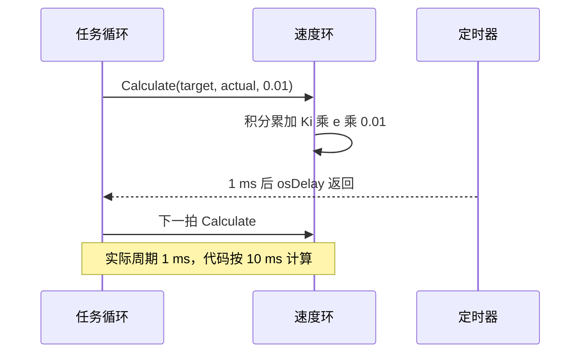
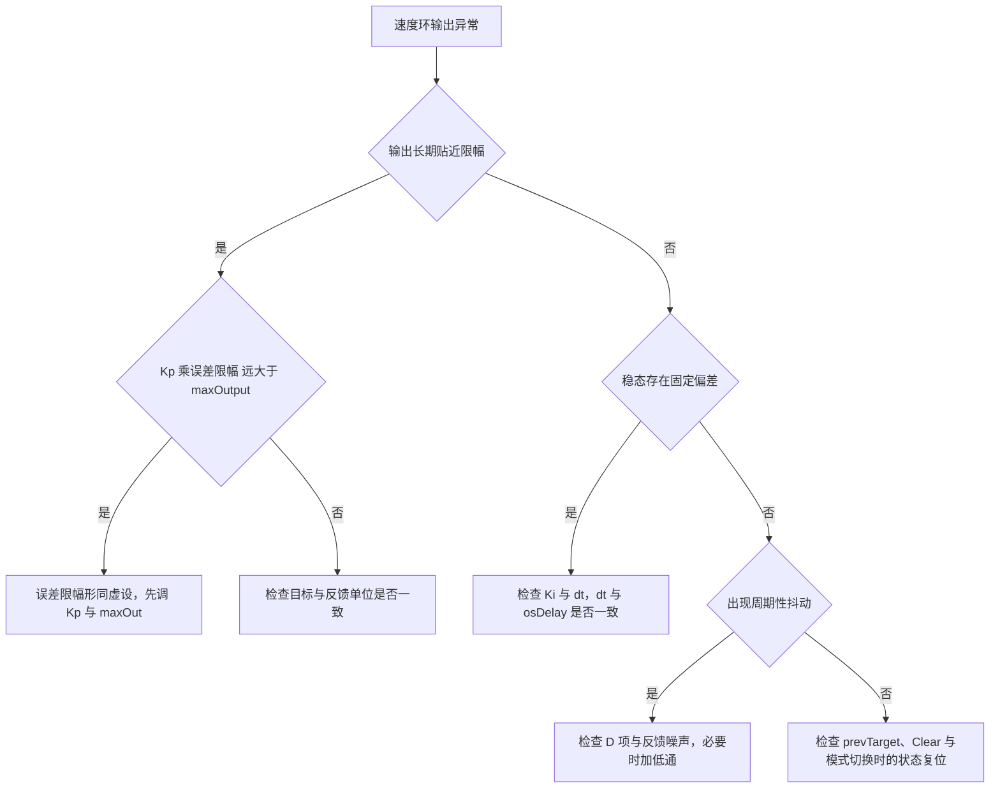

# 速度环的易错点与调试

速度环的多数异常可以归到四类：时间基准不对、单位不对、限幅量级不对、状态没有复位。四类问题的现象不同，排查顺序也不同。时间基准错会同时影响积分与微分，且方向相反；单位错表现为稳态偏差或跨板手感差异；限幅量级错让输出长期贴边；状态残留则在模式切换时冒一次尖峰。

本文先给分类与判据，再用比值与倍数把偏差量化，然后落到本工程的证据行号与两板差异，最后给一份从现象出发的排查清单。涉及实际周期的估算会说明它的假设，属于按代码推算的部分会标注待实测。

> 源码索引

| 路径 | 作用 |
| --- | --- |
| `Core/Inc/FreeRTOSConfig.h` | 节拍定义 |
| `Task/Src/FireTask.cpp` | dt、osDelay 与差值滤波器 |
| `Task/Src/GimbalTask.cpp` | dt、osDelay 与输出转换 |
| `PID/PidBase.h` | Clear 与条件积分 |
| `PID/Src/speed_pid.cpp` | 限幅与构造 |
| 底盘板同名文件 | 被注释的积分钳位 |

## 四类异常与它们的根因

| 类别 | 典型现象 | 根因 |
| --- | --- | --- |
| 时间基准 | 积分收敛快慢与整定值不符，微分噪声被放大或压制 | 代码 dt 与 osDelay 周期不一致 |
| 单位 | 稳态存在固定偏差，或增益手感与另一块板完全不同 | 目标与反馈分属 rpm 与 deg/s |
| 限幅量级 | 输出长期贴限幅，或积分限幅从不触发 | 误差限幅、积分限幅、输出限幅三者比例失配 |
| 状态残留 | 切换模式或换向后出现一次尖峰 | Clear 未复位 prevTarget，滤波器未复位 |

## dt 与 osDelay 的周期差如何缩放增益

FreeRTOS 的节拍由 Core/Inc/FreeRTOSConfig.h:64 定义，configTICK_RATE_HZ 为 1000，一个 tick 等于 1 ms。osDelay 的参数以 tick 计。速度环传入的 dt 是一个独立常量，两者不自动对齐。

设代码传入 $dt_{code}$、任务实际周期 $T_s$，积分每拍的累加量是 $K_i e\,dt_{code}$，单位时间内的积分速率为：

$$\text{rate} = K_i e \frac{dt_{code}}{T_s}$$

等效积分增益被缩放 $dt_{code}/T_s$ 倍。微分项按 $dt_{code}$ 求斜率，与真实斜率的关系是：

$$\dot e_{code} = \frac{\Delta e}{dt_{code}} = \dot e_{true}\frac{T_s}{dt_{code}}$$

| 任务 | 代码 dt | osDelay | 实际周期 | 等效积分倍数 | 等效微分倍数 |
| --- | --- | --- | --- | --- | --- |
| FireTask | 0.01 s（FireTask.cpp:47 等） | osDelay(1)（:70） | 1 ms | 10 | 0.1 |
| GimbalTask | 0.001 s（GimbalTask.cpp:37） | osDelay(2)（:100） | 2 ms | 0.5 | 2 |

FireTask 的积分比整定意图快 10 倍，微分被压到 0.1 倍；GimbalTask 的积分慢一半，微分放大 2 倍。两处注释都写 1 ms（GimbalTask.cpp:37、:100），与实际节拍不符。上表的实际周期只按 osDelay 估算，未计入任务执行时间与调度延迟，属按代码推算，待实测。

## 单位与限幅量级的量化对照

FireTask 三个速度环的目标与反馈都用 3508 的 rotor_speed（rpm），GimbalTask 两个速度环的目标来自角度环、反馈来自 IMU 陀螺（deg/s）。同一个 Kp 数值在两个任务上的物理含义不同，$1\ \text{rpm} = 6\ \text{deg/s}$，跨任务照搬增益会带来 6 倍刚度差。误差限幅同理：$\pm 250$ 在摩擦轮上是 250 rpm，在云台环上换成 250 deg/s（约 41.7 rpm）。

输出上限与积分上限的比值决定积分能否在输出饱和前用尽：

| 控制器 | maxIntegral | maxOutput | 比值 | 后果 |
| --- | --- | --- | --- | --- |
| motor_LEFT_PID | 1000 | 8000 | 12.5% | 积分在输出线性区内可用 |
| motor_SUPPLY_PID | 1000 | 30000 | 3.3% | 积分作用被压缩 |
| diffPID | 1000 | 300 | 333% | 积分上限高于输出上限，积分在输出钳位后仍可继续累积 |
| YawSpeedPID | 20000 | 1000000 | 2% | 内部几乎不饱和，Ki 为 0，积分限幅不参与 |
| PitchSpeedPID | 20000 | 30000 | 66.7% | Ki 为 0，积分项恒为 0，比值不参与运算 |

云台两个环的 Ki 都是 0，积分项恒为 0，表中的积分限幅只作为构造参数存在。diffPID 的一行需要单独看：积分上限 1000 大于输出上限 300，条件积分的判据只看 $K_p e + K_d\dot e$（speed_pid.cpp:84），不含积分项。P+D 很小时积分仍会向 1000 累积，输出被 300 钳住而积分状态继续增大。这一条按参数推算。

## 状态残留来自哪里

PidBase::Clear（PidBase.h:23-26）只把 integral 与 prevError 置零，prevTarget 不动。清零之后的第一次 Calculate，微分项用 $prevError = 0$ 计算，会产生一次与当前误差同量级的微分尖峰；反向清积分的判据仍读取旧的 prevTarget（PidBase.h:33）。速度环没有调用 Clear，但同一份基类被角度环与温度环共用，该行为会跨环出现。

另一处残留是差值滤波器。`filtered_diff` 只在 `friction_ready` 为真时更新（FireTask.cpp:45），停火期间保持旧值。重新使能后的第一次 diff_output 基于旧状态，若停火前后转速差变化较大，这一拍会给出偏离的输出。

## 从现象入手的排查决策树

## 证据行号与两板差异

| 判据 | 证据 | 位置 |
| --- | --- | --- |
| 节拍 1000 Hz | configTICK_RATE_HZ 为 1000 | Core/Inc/FreeRTOSConfig.h:64 |
| FireTask 周期 | osDelay(1) | FireTask.cpp:70 |
| FireTask 的 dt | 各 Calculate 传入 0.01f | FireTask.cpp:47、49、50、53、56、59、65、66、67 |
| GimbalTask 周期 | osDelay(2) | GimbalTask.cpp:100 |
| GimbalTask 的 dt | dt = 0.001f | GimbalTask.cpp:37 |
| 输出限幅对称化 | maxOutput 取绝对值较大者 | speed_pid.cpp:17 |
| 条件积分判据 | 判断 P+D 是否饱和 | speed_pid.cpp:84 |
| 底盘 speed_pid 积分限幅缺失 | 钳位代码被注释 | chassis speed_pid.cpp:86-90 |

| 项目 | 云台板 | 底盘板 | 影响 |
| --- | --- | --- | --- |
| 速度环积分钳位 | 保留 | 注释（:86-90） | 长时小误差下底盘积分无上界 |
| 基类 Calculate_with | 存在 | 不存在 | 云台 pitch 外环可用无条件积分 |
| 基类成员可见性 | public | protected | 云台任务可直接写 maxIntegral（GimbalTask.cpp:32） |
| 角度环跨零处理 | while 多次平移 | 单次 if/else | 角度环单元展开 |

## 现象与判据清单

| # | 易错点 | 判据与表现 | 位置 |
| --- | --- | --- | --- |
| 1 | dt 与 osDelay 不一致 | FireTask 积分快 10 倍，GimbalTask 慢一半 | FireTask.cpp:70、GimbalTask.cpp:100 |
| 2 | 注释中的 1 ms 当实际周期 | 两处注释都写 1 ms，实际分别是 1 ms 与 2 ms | GimbalTask.cpp:37、:100 |
| 3 | rpm 与 deg/s 混用 | 云台误差限幅 1000 deg/s 被当成 rpm 读 | speed_pid.cpp:33-34 |
| 4 | min_out 当独立限幅 | 输出上下限对称，取绝对值较大者 | speed_pid.cpp:17 |
| 5 | maxIntegral 与 maxOutput 量级错配 | diffPID 的 1000 大于 300，积分可越过输出上限累积 | FireTask.cpp:38 |
| 6 | 条件积分只看 P+D | 积分自身把输出顶到限幅后仍继续累加 | speed_pid.cpp:84 |
| 7 | 底盘积分限幅被注释 | 积分无上界，仅靠输出限幅兜底 | chassis speed_pid.cpp:86-90 |
| 8 | Clear 不复位 prevTarget | 清零后首拍微分出现尖峰 | PidBase.h:23-26、:38 |
| 9 | 滤波器状态跨模式保持 | filtered_diff 停火期间保留旧值 | FireTask.cpp:45 |
| 10 | 输出转 int16_t 越界 | 50000 超过 32767，转换翻转符号 | GimbalTask.cpp:79 |

## 怎样确认上面的推算

前面的实际周期是按 osDelay 参数估算的，没有计入任务执行时间与调度延迟。要把它变成实测值，分三步量：

第一步量周期。在 FireTask 循环首尾各取一次计数，用 DWT 或 FreeRTOS 的 `xTaskGetTickCount()`，连续采 100 拍取平均，得到 $T_s$。有了它就能算 $dt_{code}/T_s$。

第二步量积分。把目标阶跃固定，记录输出从零上升到 maxOutput 所需的拍数。积分主导段里每拍增量约为 $K_i e\,dt_{code}$，与实测拍数结合可以反推等效积分增益。

第三步量滤波。给转速和一个人为阶跃，记录 filtered_diff 从旧值走到新值 63% 所需的拍数，乘以 $T_s$ 得到时间常数，与 $4 T_s$ 对照。

| 观测量 | 放置位置 | 采样方式 |
| --- | --- | --- |
| 实际周期 | FireTask 循环首尾 | 计数差，取 100 拍平均 |
| 积分增益 | 速度环返回值 | 固定目标阶跃，记拍数与输出 |
| 滤波时间常数 | filtered_diff | 人为阶跃，记 63% 上升拍数 |
| 输出越界 | GimbalTask 出口 | 记录钳位前后的值 |

三处观测都不需要改动控制逻辑，只在循环里加观测点。观测值要写入不会被链接器回收的存储，具体做法见 01-FreeRTOS 单元关于 `Debug_vars` 的记录。以上三步在台架上完成，属于待实测项。

四类异常里，前两类可以直接用量出来的数字确认，限幅量级与状态残留只能从参数与代码读出来。核对参数时按本单元《本项目速度环参数》的表逐项对。

## 小结

### 核心概念

- 时间基准错误会同时缩放积分与微分，方向相反，靠调增益无法同时修好两者。
- 单位错误表现为稳态偏差或跨板手感差异，先核对目标与反馈的来源。
- 限幅量级要看三个数的比例，条件积分判据不含积分项，积分可能在输出饱和后继续增长。
- Clear 不复位 prevTarget，清零后首拍微分会跳。
- 两板的积分钳位行为不同，同名文件不能假设行为一致。
- 差值滤波器无复位，停火期间保留旧状态。

### 设计权衡

| 权衡点 | 本工程的选择 | 收益与代价 |
| --- | --- | --- |
| 任务内写死 dt | 常量传参 | 不必读时钟；代价是与 osDelay 容易脱节 |
| 条件积分用 P+D 判据 | 沿用基类 | 实现简单；代价是积分自身饱和不被感知 |
| 积分限幅固定 1000 | 七参数构造硬编码 | 多数环免配置；代价是与大输出环的量级失配 |
| 两板各自维护 speed_pid.cpp | 未做条件编译 | 修改局部化；代价是行为差异难以发现 |
| 无 C 封装调用 | 任务内实例化 | 状态随任务栈；代价是缺少统一的调试入口 |

## 练习

### 基础题

1. 用 $dt_{code}/T_s$ 计算 FireTask 与 GimbalTask 的等效积分倍数，并说明微分倍数的方向。
2. 列出 diffPID 的三个限幅值，判断哪一个最先触发。
3. 说明 Clear 之后首拍微分项的表达式，并给出误差与尖峰量的关系。

### 挑战题

4. 把两个任务的 dt 改成读取实际周期（如 DWT 计时或 vTaskDelayUntil 的固定周期），写出改动点与验证方法。
5. 为条件积分增加输出含积分项的饱和判据，分析对 diffPID 积分累积的影响。
6. 设计一组台架实验，分别标定 FireTask 的等效积分增益与差分滤波截止频率，列出观测量与采样方式。

## 附：本页引用的固件路径

| 路径 | 用途 |
| --- | --- |
| `/home/wyx/rm/2026SentriOmeniGimbal/2026OmniSentryGimbal/Core/Inc/FreeRTOSConfig.h` | 节拍定义（:64） |
| `/home/wyx/rm/2026SentriOmeniGimbal/2026OmniSentryGimbal/Task/Src/FireTask.cpp` | dt、osDelay 与滤波器（:45-70） |
| `/home/wyx/rm/2026SentriOmeniGimbal/2026OmniSentryGimbal/Task/Src/GimbalTask.cpp` | dt、osDelay 与输出转换（:37、:79、:100） |
| `/home/wyx/rm/2026SentriOmeniGimbal/2026OmniSentryGimbal/PID/PidBase.h` | Clear 与条件积分（:23-47） |
| `/home/wyx/rm/2026SentriOmeniChassis/2026OmniSentryChassis/PID/Src/speed_pid.cpp` | 被注释的积分钳位（:86-90） |
