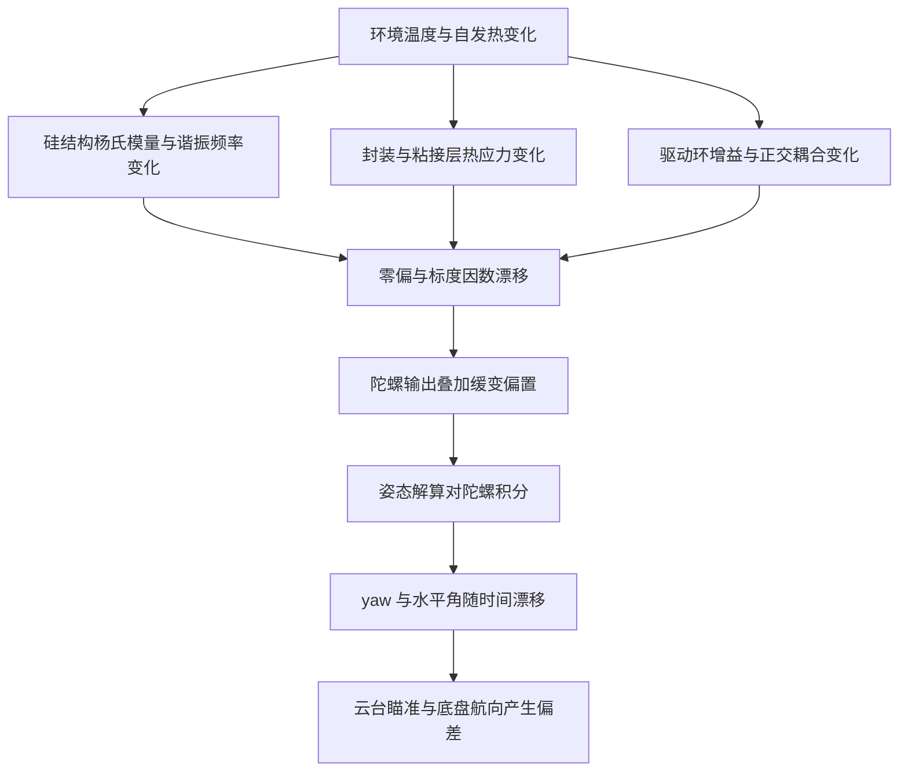
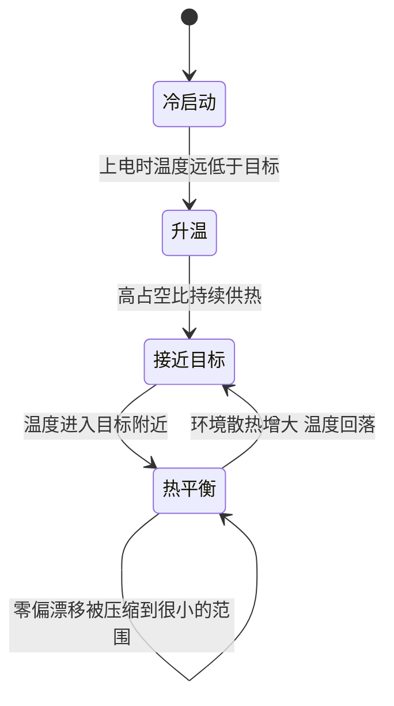

# IMU 温控的必要性

哨兵机器人的 yaw 角靠陀螺积分维持，陀螺零偏的缓慢变化会随时间累加成角度漂移。温度是零偏漂移的主要外因之一，把 IMU 稳定在一个高于环境的目标温度，可以减小这项漂移。温控本身不提高陀螺的瞬时精度，它处理的是几分钟到几十分钟尺度上的偏移。

本工程没有专门的温度标定流程，温控的目标是让 IMU 处在恒温附近，零偏仍由融合算法与上电零点处理。目标温度取 45 °C，高于常见室温又留出到器件上限的裕量。

本文说明零偏漂移的来源与积分放大效应、45 °C 这个取值怎么定，再列出温控回路在 IMU 任务里的调用位置与温度读数的换算链。涉及器件机理的部分按手册与通用模型，未在本工程实测，文内会逐处标注。

> 源码索引

| 路径 | 作用 |
| --- | --- |
| `PID/Inc/temp_pid.h` | 温度环声明与目标温度默认值 |
| `PID/Src/temp_pid.cpp` | 单向 PID 实现 |
| `Task/Src/ImuTask.cpp` | 温控调用、温度上传与循环延时 |
| `BMI088/Src/BMI088.cpp` | 温度读取与换算 |
| `BMI088/BMI088config.h` | 温度换算常数 |
| `BMI088/Src/ImuTempControl.cpp` | PID 到 PWM 的桥接 |
| `Core/Src/tim.c` | TIM10 配置 |
| `Core/Src/main.c` | 时钟树与 APB2 分频 |

## 陀螺零偏为什么不能只当噪声处理

陀螺输出的模型可以写成

$$\omega_{meas} = \omega_{true} + b(T) + n$$

其中 $b(T)$ 是随温度变化的零偏，$n$ 是随机噪声。姿态解算对角速度积分：

$$\theta(t) = \int_0^t \omega_{meas}\,d\tau = \int_0^t \omega_{true}\,d\tau + \int_0^t b(T(\tau))\,d\tau + \int_0^t n\,d\tau$$

三项里目标项是真实角度，后两项是误差。随机噪声的积分按 $\sqrt{t}$ 增长，零偏的积分按 $t$ 线性增长。短时间看，零偏项很快超过噪声项：

| 零偏 | 积分 10 s | 积分 60 s | 积分 600 s |
| --- | --- | --- | --- |
| 0.005 °/s | 0.05° | 0.3° | 3° |
| 0.05 °/s | 0.5° | 3° | 30° |

表中的零偏量级用于说明积分放大的斜率，BMI088 的具体温度系数以器件手册为准，本工程没有做温度与零偏的标定。手册与厂商应用笔记把 MEMS 陀螺的零偏温度漂移归到三类来源：硅的杨氏模量随温度变化、封装与粘接层的热应力、驱动环增益与正交耦合的温漂。（按手册与通用机理，未在本工程实测。）

## 温漂从哪里来

硅 MEMS 陀螺用科里奥利力把驱动模态的振动耦合到检测模态，检测信号的幅值正比于驱动速度幅值与角速度。温度改变以下几个环节：

| 环节 | 温度的影响 | 对零偏的作用 |
| --- | --- | --- |
| 硅结构 | 杨氏模量随温度下降，谐振频率偏移 | 驱动幅值与标度因数变化 |
| 封装 | 芯片、基板、粘接层热膨胀系数不同 | 结构内应力改变，零偏平移 |
| 驱动环 | 自动增益控制随温度调整驱动幅值 | 标度因数与零偏同向漂移 |
| 正交耦合 | 驱动到检测的机械耦合随应力变化 | 表现为零偏的附加项 |

这些项在出厂时被标定过一部分，剩余部分随单板装配、点胶与热历史变化，同一型号不同板子的温漂曲线并不一致，靠固定补偿难以覆盖。加速度计同样存在零偏与标度因数的温漂，它影响水平姿态而不是 yaw 积分，机理相近。

陀螺的量程与灵敏度配置写在寄存器里，属于数字量，不随温度变化；变化的是模拟前端、机械结构与封装应力。因此温度补偿不能靠改寄存器配置解决，只能在温度上做文章或者事后建模。

## 目标温度 45 °C 的取舍

温控的目标是把 IMU 维持在恒定温度，取多少与器件上限、环境范围、加热功率和热设计都有关。45 °C 高于常见室温，又留出较大裕量到器件上限，是这类板卡常用的折中。

| 取值方向 | 好处 | 代价 |
| --- | --- | --- |
| 目标高，例如 50 至 60 °C | 与环境温差大，环境波动被衰减得更多 | 加热功率上升，器件长期高温，焊点与塑料件的热应力累积 |
| 目标低，例如 35 °C | 加热功率小，器件温升少 | 夏季高温环境可能超过目标，温控失去调节能力 |
| 目标 45 °C | 兼顾常见环境、功率与寿命 | 极高温环境仍可能顶到上限，且需要持续供热 |

温度稳定减少的是缓变漂移，随机噪声与快变误差不受影响。温度稳定的另一面是热梯度：加热电阻与 IMU 之间如果存在温差，稳定的是电阻附近的温度，芯片实际温度仍会随环境微调。这一项与加热电阻的布局强相关，未在本工程实测。

恒温带来另一个好处：融合算法里的上电零点标定在固定温度下进行，标定条件与运行条件更接近，零点残差更小。反过来，如果上电时温度还在爬升，零点标定与后续运行的温差会引入偏差。

## 恒温把漂移压到什么量级

零偏对温度的敏感度以 °/s/°C 计量，具体值以器件手册为准。按通用量级取 0.01 °/s/°C：环境波动 5 °C 时零偏随环境变化 0.05 °/s，积分 60 s 得到 3°；温控把芯片温度波动压到 0.5 °C，同样 60 s 的误差降到 0.3°。两个数字都按线性模型推算，未在本工程实测。

| 芯片温度波动 | 零偏波动（0.01 °/s/°C） | 积分 60 s 的误差 |
| --- | --- | --- |
| 5 °C | 0.05 °/s | 3° |
| 0.5 °C | 0.005 °/s | 0.3° |

这张表说明温控的收益来自压缩温度波动幅度，而不是消除零偏本身。温控稳定后仍存在一个由目标温度决定的固定零偏，它属于上电零点标定要处理的部分；温控只保证这个零偏在运行过程中不再变化。

反过来说，如果温控精度不足，芯片温度在目标附近仍有几度起伏，收益会打折。判断温控是否有效，看的是长时间尺度上 yaw 漂移的斜率，而不是短时抖动。

## 温控回路在本工程的调用位置

| 项目 | 位置 | 说明 |
| --- | --- | --- |
| 目标温度默认值 | `PID/Inc/temp_pid.h` | 成员 `target_temp` 初始值 45.0 |
| 运行期目标 | `Task/Src/ImuTask.cpp` | `ImuTempControl_Update(45, temp, 0.001f)`，字面量 45 |
| 温度读取 | `BMI088/Src/BMI088.cpp` | 读 `BMI088_TEMP_M` 与 `BMI088_TEMP_L` 并做 11 位补码扩展 |
| 温度换算 | `BMI088/Src/BMI088.cpp` | `real_.temp = raw * 0.125 + 23.0` |
| 换算常数 | `BMI088/BMI088config.h` | `BMI088_TEMP_FACTOR 0.125f` 与 `BMI088_TEMP_OFFSET 23.0f` |
| 温度上传 | `Task/Src/ImuTask.cpp` | `imu_data.temperature = temp` |
| PWM 初始化 | `Task/Src/ImuTask.cpp` | `ImuTempControl_Init()`，内部启动 TIM10 通道 1 |
| TIM10 参数 | `Core/Src/tim.c` | `Prescaler = 0`、`Period = 4999`，PWM1 模式 |
| 温控更新 | `BMI088/Src/ImuTempControl.cpp` | 每个周期算 PID 并写比较值 |

IMU 任务的循环末尾是 `DWT_Delay_ms(1)`（`Task/Src/ImuTask.cpp`），循环体还要完成 SPI 读取与姿态解算，实际周期略大于 1 ms，而传给温控的 `dt` 固定为 0.001f。温度环的时间常数在秒级，这一偏差的影响小于速度环，但积分项的数值仍会随之偏移。

关于定时器的既有结论：`Core/Src/tim.c` 的 `PSC=0`、`ARR=4999`，配 APB2 定时器时钟 168 MHz，得到 33.6 kHz 的 PWM；`Core/Src/main.c` 的 APB2 分频为 2，PCLK2 为 84 MHz，定时器时钟是它的两倍。这一路 PWM 的推导在文档 `02-STM32 与 HAL/02-定时器与PWM/02-PWM原理与配置.md` 里已经给出，本单元第 4 篇只讨论占空比换算。

## 温度读数经过了哪些换算

原始温度是 11 位有符号值，从两个寄存器字节拼出来，再做补码扩展，最后按线性关系换成摄氏度。换算常数在 `BMI088/BMI088config.h`，代码里的表达式在 `BMI088/Src/BMI088.cpp`。

$$T = 0.125 \times R + 23.0$$

$R$ 是补码扩展后的整数，$0.125$ 是每 LSB 对应的摄氏度，$23.0$ 是零点偏移。读数误差会直接变成温度环的目标偏差，所以这条链上的每一步都要核对，细节见本单元《易错点与调试》。

### 换算例

| 原始码 R | 温度 |
| --- | --- |
| 0 | 23.0 °C |
| 176 | 45.0 °C |
| 200 | 48.0 °C |

$R = 0$ 时温度等于偏移量 23.0 °C，这是这条线性关系的零点。$R$ 每增加 8，温度上升 1 °C，目标 45 °C 对应 $R = 176$。这三个数按公式推算，用于核对换算量级。

## 温控相关的易错点

| # | 易错点 | 表现 | 依据 |
| --- | --- | --- | --- |
| 1 | 认为温控能消除随机噪声 | 温控后 yaw 仍会抖动 | 噪声项与零偏项来源不同 |
| 2 | 把 45 当成寄存器配置 | 45 只是 PID 目标字面量 | `Task/Src/ImuTask.cpp` |
| 3 | 忽略温度读数的单位 | 原始值要乘 0.125 再偏移 23 | `BMI088/Src/BMI088.cpp` |
| 4 | 认为目标温度越高越好 | 加热功率与热应力上升 | 第 3 节的取舍 |
| 5 | 用环境温度代替芯片温度 | 稳定的是加热电阻附近 | 热梯度，未实测 |

## 小结

### 核心概念

- 陀螺零偏随温度漂移，经过积分变成线性增长的角度误差，温控把这项缓变漂移压小。
- 漂移来源集中在硅结构、封装应力、驱动环增益与正交耦合，单板差异使其难以用固定补偿覆盖。
- 本工程的目标温度是 45 °C，来自 `target_temp` 的默认值与 `ImuTask` 传入的字面量。
- 温度在 `BMI088.cpp` 里按 0.125 °C/LSB、23 °C 零点换算成摄氏度，再传给温度环。
- 温控只改善缓变漂移，随机噪声与快变误差仍由融合算法处理。
- IMU 任务的温控按 1 ms 标称周期调用，dt 传 0.001f，实际周期略大。

### 设计权衡

| 权衡点 | 本工程的选择 | 收益与代价 |
| --- | --- | --- |
| 是否温控 | 加热到恒定温度 | 压小温漂；代价是持续耗电与热设计复杂度 |
| 目标温度 | 45 °C | 兼顾功率与环境覆盖；代价是高温环境可能失去调节余量 |
| 温度标定 | 不做温度与零偏的标定 | 省去标定工装；代价是补偿依赖融合算法与上电零点 |
| 温控执行器 | 单路加热电阻 | 电路最简；代价是只能升温，见本单元《只能加热的单向 PID》 |

## 练习

### 基础题

1. 用第 1 节的公式，计算零偏为 0.02 °/s 时积分 30 s 与 300 s 的角度误差。
2. 列出温度影响陀螺输出的三个环节，各写一句对零偏的贡献方式。
3. 说明 45 °C 目标在冬季室温 10 °C 与夏季室温 40 °C 两种环境下的调节余量差别。

### 挑战题

4. 设计一个只用 `imu_data.temperature` 与陀螺静止读数的温度与零偏标定流程，说明采样时长与温区划分。
5. 若加热电阻与 IMU 芯片之间存在 2 °C 稳态温差，分析对 45 °C 目标的实际影响，并给出减小温差的结构或控制方案。
6. 目标温度改成 40 °C 后，估算所需稳态加热功率的变化方向，并说明对 `maxOutput` 饱和概率的影响。

## 附：本页引用的固件路径

| 路径 | 用途 |
| --- | --- |
| `/home/wyx/rm/2026SentriOmeniGimbal/2026OmniSentryGimbal/PID/Inc/temp_pid.h` | `target_temp` 默认 45 |
| `/home/wyx/rm/2026SentriOmeniGimbal/2026OmniSentryGimbal/Task/Src/ImuTask.cpp` | 温控调用与温度上传 |
| `/home/wyx/rm/2026SentriOmeniGimbal/2026OmniSentryGimbal/BMI088/Src/BMI088.cpp` | 温度读取与换算 |
| `/home/wyx/rm/2026SentriOmeniGimbal/2026OmniSentryGimbal/BMI088/BMI088config.h` | 温度换算常数 |
| `/home/wyx/rm/2026SentriOmeniGimbal/2026OmniSentryGimbal/BMI088/Src/ImuTempControl.cpp` | PID 到 PWM 的桥接 |
| `/home/wyx/rm/2026SentriOmeniGimbal/2026OmniSentryGimbal/Core/Src/tim.c` | TIM10 配置 |
| `/home/wyx/rm/2026SentriOmeniGimbal/2026OmniSentryGimbal/Core/Src/main.c` | 时钟树分频 |
