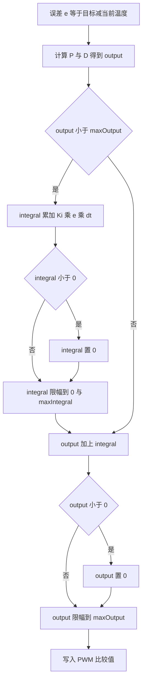
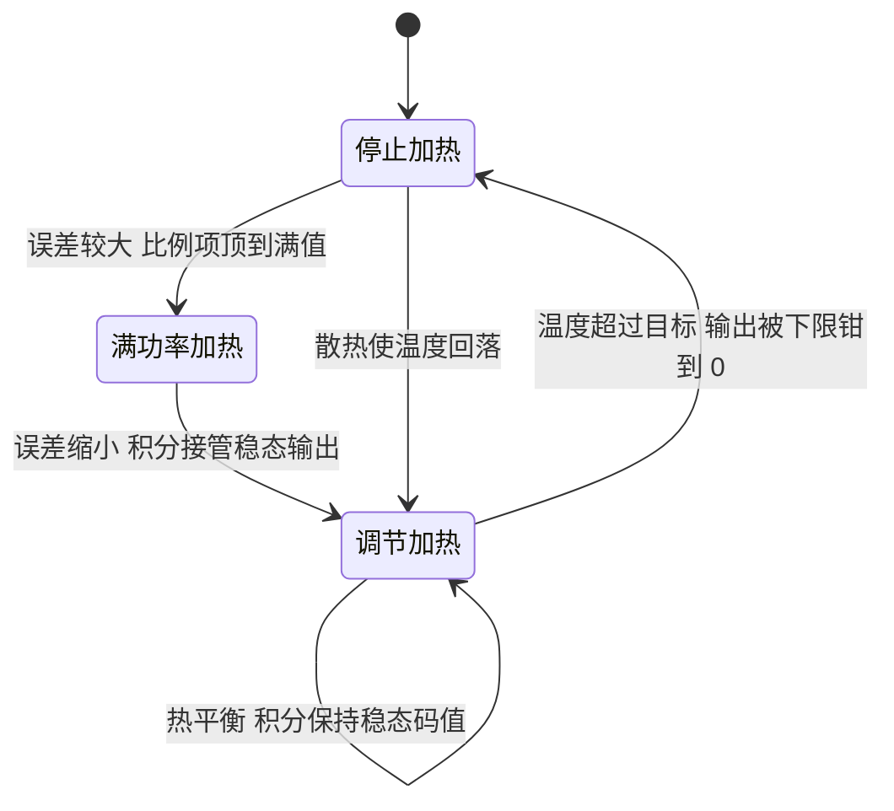

# 只能加热的单向 PID

温度环的执行器是一支加热电阻，电流流过时放热，板上没有制冷元件。输出为负在物理上没有对应动作，温度环因此把积分项与输出都限制在非负区间。这条约束来自执行器能力在控制器里的直接投影，不属于软件风格选择。

单向带来两个后果。第一，低于目标时能主动升温，高于目标时只能停止加热等自然散热，降温段完全开环。第二，积分项只需要向正方向累积一个维持目标的恒定分量，越过目标之后它必须能被迅速拉回来，否则恢复会被拖长。

本文先写出集总热容模型与热平衡方程，说明积分项为什么是不可省的，再解释积分下限钉在 0 的作用，然后列出两个下限在 `temp_pid.cpp` 里的实现位置与参数，最后给出积分爬升速度的量级估算。

> 源码索引

| 路径 | 作用 |
| --- | --- |
| `PID/Src/temp_pid.cpp` | 单向积分的累加、下限与输出限幅 |
| `PID/Inc/temp_pid.h` | 类声明与 C 接口 |
| `PID/PidBase.h` | 双向基类的抗饱和对照 |
| `BMI088/Src/ImuTempControl.cpp` | PID 输出的消费点 |
| `Task/Src/ImuTask.cpp` | 调用周期与目标实参 |

## 加热电阻没有反向动作

普通位置环或速度环的执行器是双向的，电机可以正转也可以反转，电流指令有正有负。温度环的执行器只有加热：

| 量 | 双向环 | 温度环 |
| --- | --- | --- |
| 执行器 | 电机、舵机 | 加热电阻 |
| 正输出 | 加速、正转 | 加热 |
| 负输出 | 减速、反转 | 没有对应动作，只能等自然散热 |
| 平衡手段 | 正负输出都能调 | 只在温度低于目标时供热 |

把输出下限设成 0 来自执行器的物理边界。温度高于目标时，系统只能停止加热，靠向环境的散热把温度拉回来，回落的快慢由热时间常数决定，控制器在这段时间里不起作用。

## 集总热容与热平衡方程

把加热电阻与 IMU 看成一个集总热容 $C$，与环境的等效热阻为 $R_{th}$，环境温度 $T_{amb}$，加热功率 $P_{in}$，则

$$C\frac{dT}{dt} = P_{in} - \frac{T - T_{amb}}{R_{th}}$$

左边是热容吸收的功率，右边是加热功率减去向环境散失的功率。加热功率与 PID 输出 $u$ 成正比，满输出 $u_{max}$ 对应最大功率 $P_{max}$：

$$P_{in} = \frac{u}{u_{max}} P_{max}$$

稳态时 $dT/dt = 0$，把目标温度 $T^*$ 代入得到维持目标所需的恒定输出：

$$u_{ss} = \frac{u_{max}}{P_{max}} \cdot \frac{T^* - T_{amb}}{R_{th}}$$

目标高于环境时 $u_{ss} > 0$。这一项与误差无关，只与环境温度、热阻和满功率有关。环境越冷，热阻越大，维持目标所需的输出越大。把 $u_{ss}$ 写成占空比形式，它就是稳态占空比 $D_{ss} = u_{ss}/u_{max}$。

## 积分项提供比例项给不出的稳态分量

比例项在误差为零时输出为零，单靠比例项无法维持 $u_{ss}$，会留下稳态误差。积分项累计误差：

$$I(t) = K_i \int_0^t e(\tau)\,d\tau, \qquad e = T^* - T$$

温度低于目标时 $e > 0$，$I$ 上升，输出增加；温度高于目标时 $e < 0$，$I$ 下降，输出减少。系统在 $e = 0$ 处平衡，此时 $u = I = u_{ss}$，误差为零。积分项提供了比例项给不出的恒定分量，稳态误差因此被消除。

若只用比例项，平衡点的误差必须满足 $K_p e = u_{ss}$，即 $e = u_{ss}/K_p$。取 $K_p = 1600$ 与 $u_{ss} = 1000$，稳态误差约 0.625 °C。积分项把这项误差压到零，代价是响应变慢。

## 积分下限为什么钉在 0

积分下限设在 0 的依据是 $u_{ss} > 0$。如果允许 $I$ 取负值，温度冲过目标后 $I$ 会一路减到很大的负数；等温度回落到目标以下，$I$ 要从这个负值爬回 $u_{ss}$，输出被下限钳在 0 的这段时间里没有加热，恢复被拖长。把下限钉在 0，过冲后 $I$ 最多减到 0，恢复路径最短。

积分下限与输出下限都钳到 0，但它们作用在不同变量上。输出下限只保证送出的控制量非负；积分下限保证内部状态不向负方向堆积。去掉其中一个，另一个不会自动补上。

## 三种饱和不是一回事

| 现象 | 判据 | 单向环的后果 |
| --- | --- | --- |
| 积分饱和 | `integral` 触及 `maxIntegral` | 误差反向时积分仍维持大输出，退饱和慢 |
| 输出饱和 | `output` 触及 `maxOutput` | 占空比满值，温度继续上升 |
| 执行器下限 | `integral` 或 `output` 触到 0 | 加热停止，只能被动散热 |

本工程参数里 `maxIntegral` 是 4400，`maxOutput` 是 4500（`PID/Src/temp_pid.cpp`）。积分项单独存在时最多 4400，占满输出的 97.8%，加不上比例项也不会超过 4500，积分本身不能把输出顶到满值；输出饱和主要来自比例项。

积分上限 4400 与输出上限 4500 的比值接近 1，意味着积分几乎可以在输出线性区内单独把输出推到接近满值。温度环的稳态工作点通常落在中低占空比，这个上限只在极端工况下起作用。

## 两个下限在代码里的位置

| 实现点 | 位置 | 代码 |
| --- | --- | --- |
| 积分累加条件 | `PID/Src/temp_pid.cpp` | `if (output < maxOutput)` |
| 积分下限 | `PID/Src/temp_pid.cpp` | `if (integral < 0) integral = 0;` |
| 积分上限 | `PID/Src/temp_pid.cpp` | `clamp(integral, 0.0f, maxIntegral)` |
| 输出下限 | `PID/Src/temp_pid.cpp` | `if (output < 0) output = 0;` |
| 输出限幅 | `PID/Src/temp_pid.cpp` | `clamp(output, 0.0f, maxOutput)` |
| 参数 | `PID/Src/temp_pid.cpp` | `TempPID(1600.0f, 0.2f, 0.0f, 4500.0f, 4400.0f)` |

积分的累加条件检查的是 `output < maxOutput`，这里的 `output` 是比例加微分的结果，还没有加积分。该条件只检查上界，没有检查下界，与基类 `PidBase::Calculate` 两端的检查（`PID/PidBase.h`）不同。在单向环里负输出没有意义，这个差别不引入额外问题。

## 积分爬升速度与积分时间

每次调用积分增加 $K_i e\,dt$，1 kHz 调用时每秒增加 $K_i e$，代入 $K_i = 0.2$：

$$\frac{dI}{dt} = 0.2\,e \quad (\text{输出码值每秒})$$

误差 1 °C 时积分每秒变化 0.2 个码值。若维持目标需要约 1000 码值的稳态输出，从零爬到这个值需要约 5000 s。（按参数推算，未实测。）这说明积分项的修正很慢：瞬态靠比例项，积分只负责长时间尺度上的稳态微调。等价地，积分时间 $T_i = K_p/K_i = 1600/0.2 = 8000$ s，与上面的量级一致。

比例系数 $K_p = 1600$ 时，1 °C 误差对应 1600 码值，比例项在误差 $4500/1600 = 2.8125$ °C 处把输出顶到满值。误差大于这个值时 `output` 已经达到或超过 `maxOutput`，积分停止累加，这是条件积分式的抗饱和。误差小于 2.8125 °C 时，即使总输出已经因为积分而饱和，积分仍会继续累加，这一段的抗饱和只在比例与微分上起作用。

## 热时间常数决定了单向环的节奏

集总模型里热时间常数为 $\tau_{th} = C R_{th}$。加热电阻与 IMU 的尺寸小、热容小，热阻由空气与安装方式决定，这类结构的时间常数通常在数十秒到数分钟量级（按结构与通用热设计估算，未在本工程实测）。$\tau_{th}$ 决定了三件事：

| 现象 | 与 $\tau_{th}$ 的关系 |
| --- | --- |
| 升温到目标 | 高功率下约数个 $\tau_{th}$ |
| 过冲后回落 | 只能靠自然散热，时间尺度与 $\tau_{th}$ 同量级 |
| 积分时间 | 需远大于 $\tau_{th}$，本工程为 8000 s |

积分时间 8000 s 远大于升温所需的时间，这解释了温度环为什么很少出现大幅过冲：升温的几十秒里积分只积累了少量码值，不足以把输出推到过冲。反过来，如果为了加快响应把 $K_i$ 调大，积分时间接近 $\tau_{th}$，过冲就会出现。

## 单向环相关的易错点

| # | 易错点 | 表现 | 位置 |
| --- | --- | --- | --- |
| 1 | 把 `maxIntegral` 当成输出上限 | 把 4400 理解成占空比满量程 | `PID/Src/temp_pid.cpp` |
| 2 | 认为积分下限可以省去 | 过冲后积分变负，恢复被拖长 | `PID/Src/temp_pid.cpp` |
| 3 | 认为输出下限能替代积分下限 | 输出被钳到 0，但积分仍是负值 | `PID/Src/temp_pid.cpp` |
| 4 | 用双向环的参数整定经验套温度环 | 积分时间 8000 s，响应远慢于电机环 | `PID/Src/temp_pid.cpp` |
| 5 | 认为只有加热就一定有过冲振荡 | 热容与热阻很大，过冲幅度取决于增益 | 第 2 节 |
| 6 | 认为抗饱和检查覆盖全部输出区间 | 误差小于 2.8125 °C 时积分仍累加 | `PID/Src/temp_pid.cpp` |

## 小结

### 核心概念

- 温度环的执行器只能加热，负输出没有物理动作，积分与输出都必须限制在非负区间。
- 热平衡给出维持目标所需的恒定输出 $u_{ss}$，积分项负责提供这个分量，稳态误差在 $e = 0$ 处被消除。
- 积分下限钉在 0 的作用是让过冲后的退饱和路径最短，避免积分在负区间堆积。
- 本工程的积分累加条件是 `output < maxOutput`，只用比例与微分的值判断，不含积分本身。
- $K_i = 0.2$、1 kHz 调用下积分爬升为 0.2 码值每秒每摄氏度，积分时间约 8000 s。
- 积分上限 4400 与输出上限 4500 接近，积分几乎可以单独把输出推到接近满值。
- 热时间常数决定升温与回落的时间尺度，积分时间需要远大于它。

### 设计权衡

| 权衡点 | 本工程的选择 | 收益与代价 |
| --- | --- | --- |
| 积分下限 | 强制 0 | 恢复快；代价是失去主动反向调节，只能等散热 |
| 输出下限 | 强制 0 | 与执行器能力一致；代价是降温段完全开环 |
| 抗饱和判据 | 只用上界 `output < maxOutput` | 代码简短；代价是积分接近饱和时保护不完全 |
| 积分增益 | $K_i = 0.2$ | 稳态微调平滑；代价是消除稳态误差需要数十分钟 |
| 积分上限 | 4400 | 留出比例项工作区间；代价是与输出上限接近，区分度低 |

## 练习

### 基础题

1. 写出热平衡方程，推导 $u_{ss}$ 的表达式，并说明它为什么必须大于 0。
2. 把 `PID/Src/temp_pid.cpp` 的积分下限删掉，描述温度从过冲到回落的过程中积分与输出的变化。
3. 用 $K_p = 1600$、$K_i = 0.2$ 计算积分时间，并说明它与 1 kHz 调用频率无关的原因。

### 挑战题

4. 假设稳态输出需要 1500 码值，用第 3.2 节的爬升速度估算从零建立该输出的时间，并给出缩短时间的两种参数改动及其副作用。
5. 把积分下限从 0 改成一个小正数，分析对稳态误差与过冲的影响。
6. 设计一个带输出饱和反馈的抗饱和方案，使积分在总输出饱和时也停止累加，并写出与现有代码的差异。

## 附：本页引用的固件路径

| 路径 | 用途 |
| --- | --- |
| `/home/wyx/rm/2026SentriOmeniGimbal/2026OmniSentryGimbal/PID/Src/temp_pid.cpp` | 单向积分的实现 |
| `/home/wyx/rm/2026SentriOmeniGimbal/2026OmniSentryGimbal/PID/Inc/temp_pid.h` | 类声明与 C 接口 |
| `/home/wyx/rm/2026SentriOmeniGimbal/2026OmniSentryGimbal/PID/PidBase.h` | 双向基类的抗饱和对照 |
| `/home/wyx/rm/2026SentriOmeniGimbal/2026OmniSentryGimbal/BMI088/Src/ImuTempControl.cpp` | PID 输出的消费点 |
