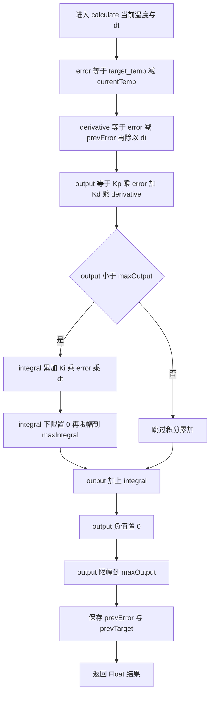
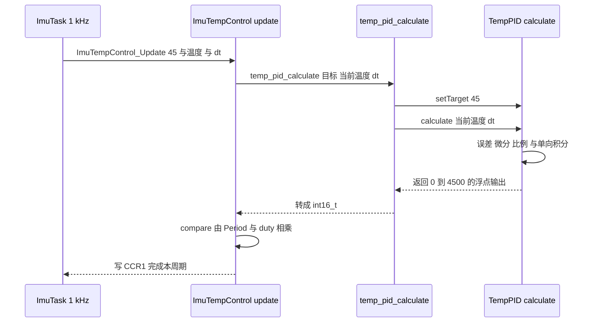

# TempPID 实现逐行

温度环只有一个类 `TempPID`，它继承 `PidBase`，但计算函数叫 `calculate`，基类叫 `Calculate`。两个名字只差一个字母的大小写，参数个数也不同，这决定了温度环不会走基类的双向逻辑。C++ 判断覆盖看的是函数名加参数列表，两者都要一致，所以 `calculate` 只是派生类新加的方法。

这条实现路径有一个直接后果：只有在 `TempPID` 对象上直接调用 `calculate` 才走单向逻辑，通过 `PidBase` 指针或引用调用 `Calculate` 会执行双向版本。温度环唯一的调用点写在 C 封装 `temp_pid_calculate` 里，它持有具体对象，不存在走错的风险；但这个结构决定了它不能被放进多态容器。

本文沿着 `PID/Src/temp_pid.cpp` 的执行顺序逐句拆解，说明 C 封装 `temp_pid_calculate` 的调用链与返回类型，再解释默认目标为什么改不动、基类的反向清积分判据为什么不会触发。

> 源码索引

| 路径 | 作用 |
| --- | --- |
| `PID/Src/temp_pid.cpp` | 计算函数逐行拆解对象与唯一实例 |
| `PID/Inc/temp_pid.h` | 类声明与 C 接口 |
| `PID/PidBase.h` | 基类双向实现 |
| `BMI088/Src/ImuTempControl.cpp` | 唯一调用点 |
| `Task/Src/ImuTask.cpp` | 目标与 dt 的实参来源 |

## calculate 与 Calculate 只差大小写

`TempPID` 声明的是 `calculate(float, float)`，基类声明的是 `Calculate(float, float, float)`：

| 项 | 基类 | 温度环 |
| --- | --- | --- |
| 函数名 | `Calculate` | `calculate` |
| 参数个数 | 3，目标、反馈、dt | 2，当前温度、dt |
| 目标来源 | 调用时传入 | 成员 `target_temp` |
| 输出范围 | $[-maxOutput, maxOutput]$ | $[0, maxOutput]$ |
| 积分范围 | $[-maxIntegral, maxIntegral]$ | $[0, maxIntegral]$ |

基类的虚函数表里只有 `Calculate`，`TempPID` 没有覆盖它，只是新加了一个不同名的函数。通过 `PidBase` 指针或引用调用 `Calculate`，执行的是双向版本；只有对 `TempPID` 对象直接调用 `calculate`，才会走单向逻辑。

派生类还写了 `using PidBase::PidBase;`（`PID/Inc/temp_pid.h`），把基类的五参数构造函数透传下来，所以 `TempPID(1600.0f, 0.2f, 0.0f, 4500.0f, 4400.0f)` 可以照常构造。透传只继承构造函数，不改变两个计算函数的关系。

## 逐行拆解 calculate

| 代码 | 作用 |
| --- | --- |
| `setTarget(float t)` | 把参数写入成员 `target_temp` |
| `float TempPID::calculate(float currentTemp, float dt)` | 单向温控入口，不含目标参数 |
| `float error = target_temp - currentTemp;` | 误差定义与基类一致，都是目标减反馈 |
| `float derivative = (error - prevError) / dt;` | 微分用差分除以 `dt`，没有滤波 |
| `float output = Kp * error + Kd * derivative;` | 先算比例与微分，此时不含积分 |
| `if (output < maxOutput) {` | 条件积分，只判断上界 |
| `integral += Ki * error * dt;` | 积分累加 |
| `if (integral < 0) integral = 0;` | 积分下限，禁止负积分 |
| `integral = clamp(integral, 0.0f, maxIntegral);` | 积分上限，复用 `magictools.h` 的 `clamp` |
| `output += integral;` | 比例微分结果与积分相加 |
| `if (output < 0) output = 0;` | 输出下限 |
| `output = clamp(output, 0.0f, maxOutput);` | 输出上限 |
| `prevError = error; prevTarget = target_temp;` | 保存状态，供下次微分与基类判据使用 |
| `return output;` | 返回浮点输出 |
| `static TempPID temp_pid(1600.0f, 0.2f, 0.0f, 4500.0f, 4400.0f);` | 唯一的温度环实例 |
| `temp_pid_clear()` | 调基类虚函数 `Clear()`，清积分与前次误差 |
| `temp_pid_calculate(...)` | C 封装，先 `setTarget` 再 `calculate`，返回 `int16_t` |

基类版本（`PID/PidBase.h`）在同一位置做的是对称限幅，并且没有这两行单向下限，积分累加条件是 `output < maxOutput && output > -maxOutput`。两版的差异集中在目标来源、积分下限与输出下限三处。

逐行看下来，这个函数的运算顺序是：误差、微分、比例加微分、条件积分、输出相加、下限、上限、存状态、返回。积分累加发生在输出相加之前，判断条件用的是不含积分的中间量。

## 构造函数透传与实例

`using PidBase::PidBase;` 让 `TempPID` 继承基类的五参数构造函数，五个参数依次是 $K_p$、$K_i$、$K_d$、maxOutput、maxIntegral。温度环唯一的实例是文件作用域的 `static` 对象（`PID/Src/temp_pid.cpp`），参数为 1600、0.2、0、4500、4400，其中 $K_d = 0$，微分项在这组参数下恒为 0。

实例是 `static`，生命周期与程序一致，状态在两次调用之间保持。C 封装通过它读写积分与 `prevError`，不存在多个温度环对象争用状态的情况。

## 调用链只有一条

温度环只有一条运行期调用链，唯一调用点是 `BMI088/Src/ImuTempControl.cpp`：

`temp_pid_calculate` 每个周期都调用一次 `setTarget`。`ImuTask` 传入的实参是字面量 45（`Task/Src/ImuTask.cpp`），它的优先级高于 `temp_pid.h` 的成员默认值：改默认值不会影响运行期目标，要改目标必须改调用点或让调用点传入变量。

`setTarget` 写入 `target_temp` 后，`calculate` 末尾把它存进 `prevTarget`。基类的反向清积分判据是 `(prevTarget * target) < 0`（`PID/PidBase.h`），温度环的目标恒为正的 45，该判据不会触发，所以温度环不会走基类的反向清积分分支。

## 声明与接口

| 项 | 位置 | 内容 |
| --- | --- | --- |
| 类声明 | `PID/Inc/temp_pid.h` | 继承 `PidBase`，成员 `target_temp` |
| 构造函数透传 | `PID/Inc/temp_pid.h` | `using PidBase::PidBase;` |
| 目标默认值 | `PID/Inc/temp_pid.h` | `float target_temp = 45.0f;` |
| `calculate` 声明 | `PID/Inc/temp_pid.h` | `float calculate(float currentTemp, float dt);` |
| C 接口 | `PID/Inc/temp_pid.h` | `temp_pid_clear()` 与 `int16_t temp_pid_calculate(...)` |
| 基类虚函数 | `PID/PidBase.h` | `virtual float Calculate(float, float, float)` |

`TempPID::calculate` 返回 `float`，C 封装 `temp_pid_calculate` 返回 `int16_t`（`PID/Inc/temp_pid.h`），赋值与返回时按整数截断。单向输出落在 $[0, 4500]$，`int16_t` 的量程足够，截断只丢掉小数部分，不产生回绕。

## 与基类的数值对照

取一组输入走两版函数：$K_p = 1600$、$K_i = 0.2$、$K_d = 0$、maxOutput 4500、maxIntegral 4400，目标 45、当前温度 40、$dt = 0.001$、积分初值 0、prevError 0。

| 项 | 单向 calculate | 双向 Calculate |
| --- | --- | --- |
| error | 5 | 5 |
| derivative | 0 | 0 |
| P+D | 8000 | 8000 |
| 积分累加 | 跳过，8000 不小于 4500 | 跳过，8000 也不小于 4500 |
| 输出钳位 | 下限后仍 8000，再上限到 4500 | 上限到 4500 |
| 本次输出 | 4500 | 4500 |

这组输入下两版结果相同，差异出现在误差为负的工况：当前温度 50、目标 45 时，单向版误差为 -5，输出被下限钳到 0；双向版输出为 -4500。温度高于目标时只有单向版符合物理约束。数值按代码与参数推算，未实测。

## 实现细节上的易错点

| # | 易错点 | 表现 | 位置 |
| --- | --- | --- | --- |
| 1 | 以为 `calculate` 覆盖了基类 `Calculate` | 名字大小写与参数都不同，虚表里仍是基类版本 | `PID/Inc/temp_pid.h`、`PID/PidBase.h` |
| 2 | 通过 `PidBase` 指针调用 | 走双向版本，输出可为负，积分下限失效 | `PID/PidBase.h` |
| 3 | 改 `temp_pid.h` 的默认目标 | 每周期被 `setTarget(45)` 覆盖，运行期目标不变 | `PID/Src/temp_pid.cpp`、`Task/Src/ImuTask.cpp` |
| 4 | 认为返回类型是浮点 | C 接口声明 `int16_t`，小数被截断 | `PID/Inc/temp_pid.h` |
| 5 | 认为 `Clear()` 会清目标 | `Clear()` 只清积分与前次误差，不清 `target_temp` | `PID/PidBase.h` |
| 6 | 认为微分项经过滤波 | 代码直接差分，温度读数上的量化跳变会放大 | `PID/Src/temp_pid.cpp` |
| 7 | 认为实例是局部对象 | 它是文件作用域 `static`，状态跨调用保持 | `PID/Src/temp_pid.cpp` |

## 小结

### 核心概念

- `TempPID::calculate` 与基类 `Calculate` 同名不同大小写、参数也不同，不构成覆盖，虚表里只有基类版本。
- `using PidBase::PidBase;` 透传五参数构造函数，温度环实例在 `temp_pid.cpp` 建立。
- 目标温度来自成员 `target_temp`，默认 45.0，运行期被 `setTarget` 覆盖为 `ImuTask` 传入的 45。
- `calculate` 的控制流是误差、微分、比例微分、单向积分、输出下限、输出限幅，末尾返回浮点值。
- C 封装 `temp_pid_calculate` 是温度环的全工程唯一调用入口，返回 `int16_t`。
- 目标恒为正，基类反向清积分判据在温度环上不会触发。
- 实例是文件作用域 static，状态唯一，不能并行支持第二路温控。

### 设计权衡

| 权衡点 | 本工程的选择 | 收益与代价 |
| --- | --- | --- |
| 与基类的关系 | 新增不同名函数 | 逻辑与双向环解耦；代价是失去多态统一调用 |
| 目标来源 | 成员变量加 `setTarget` | 支持运行期改目标；代价是默认值被调用点覆盖 |
| 微分实现 | 直接差分，不加滤波 | 代码最简；代价是温度量化噪声被放大 |
| 返回类型 | C 接口用 `int16_t` | 与 PWM 比较值的整数语义一致；代价是小数被截断 |
| 实例作用域 | 文件内 static | 状态唯一、无需传参；代价是不能并行跑第二路温控 |

## 练习

### 基础题

1. 写出基类与派生类两个函数的完整签名，说明哪一个在虚函数表里。
2. 按 `PID/Src/temp_pid.cpp` 的计算顺序，列出误差为 1 °C、`dt = 0.001`、积分初值为 0 时的比例项、微分项与积分增量。
3. 说明 `temp_pid_calculate` 每个周期调用 `setTarget` 的作用，以及它与一次性设置目标的差别。

### 挑战题

4. 把 `TempPID::calculate` 改名成 `Calculate` 并调整参数列表以覆盖基类，列出需要同步修改的调用点与潜在风险。
5. 给温度环加一个 `PidBase*` 指针数组，说明用该数组调用计算函数时会得到什么行为，并给出修正方案。
6. 在 `calculate` 的微分项前加一阶低通，写出差分方程并分析它对温度响应速度与噪声的影响。

## 附：本页引用的固件路径

| 路径 | 用途 |
| --- | --- |
| `/home/wyx/rm/2026SentriOmeniGimbal/2026OmniSentryGimbal/PID/Src/temp_pid.cpp` | 逐行拆解对象 |
| `/home/wyx/rm/2026SentriOmeniGimbal/2026OmniSentryGimbal/PID/Inc/temp_pid.h` | 类声明与 C 接口 |
| `/home/wyx/rm/2026SentriOmeniGimbal/2026OmniSentryGimbal/PID/PidBase.h` | 基类双向实现 |
| `/home/wyx/rm/2026SentriOmeniGimbal/2026OmniSentryGimbal/BMI088/Src/ImuTempControl.cpp` | 唯一调用点 |
| `/home/wyx/rm/2026SentriOmeniGimbal/2026OmniSentryGimbal/Task/Src/ImuTask.cpp` | 目标与 dt 的实参来源 |
