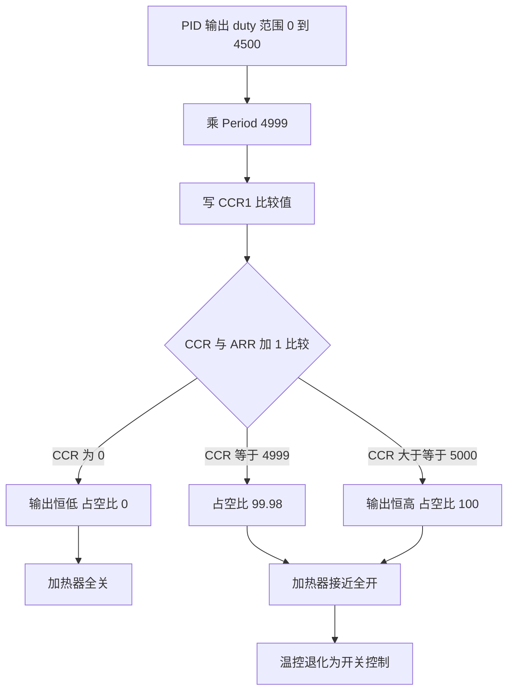
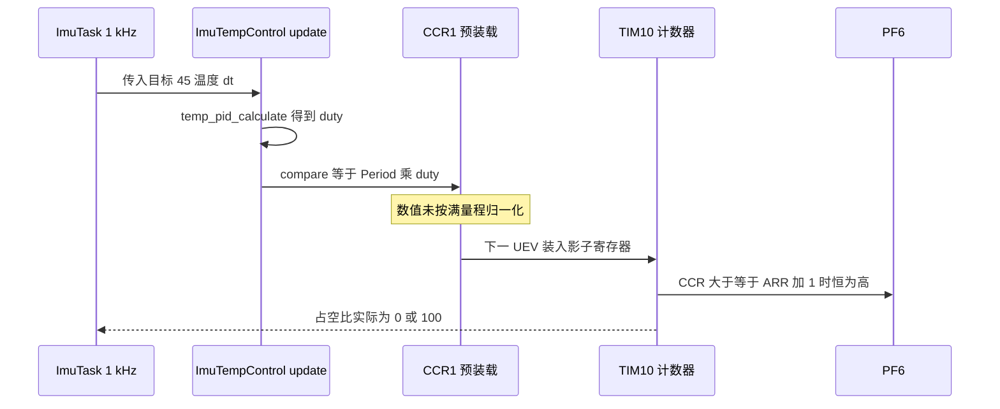

# PWM 占空比换算

温度环算出的是 [0, 4500] 的浮点输出，硬件要的是 TIM10 通道 1 的比较值。两者之间少一次按满量程归一化的换算，代码把 PID 输出直接乘了周期值，比较值在第二个非零输出码上就超过了 ARR，PWM 恒定满占空比，温度环退化成开关控制。这已经不止是精度问题：连续调节器被换成了通断控制器。

正确的关系分两步：先把 PID 输出按 $u_{max}$ 归一化到 [0, 1]，再乘以满量程计数 $ARR+1$。任何一步缺失，比较值与 ARR 的量纲就对不上。代码里 `compare = Period * duty` 同时缺了归一化和那个加一。

本文先给出 ARR、PSC、CCR 的分工与定时器频率公式，把 84 MHz 与 168 MHz 的区别讲清，再分析这处换算错误、退化后的实际行为，最后给出修正写法与三条验证方法。

> 源码索引

| 路径 | 作用 |
| --- | --- |
| `BMI088/Src/ImuTempControl.cpp` | 占空比换算的错误位置 |
| `BMI088/Inc/ImuTempControl.h` | 温控类接口 |
| `PID/Src/temp_pid.cpp` | 输出满量程 4500 |
| `PID/Inc/temp_pid.h` | C 接口返回类型 |
| `Core/Src/tim.c` | TIM10 的 PSC、ARR 与通道配置 |
| `Core/Src/main.c` | 时钟树与 APB2 分频 |
| `Task/Src/ImuTask.cpp` | 1 kHz 调用点 |

## ARR、PSC 与 CCR1 的分工

边沿对齐、向上计数的定时器用三个寄存器决定波形：

| 寄存器 | 作用 | 本工程的值 |
| --- | --- | --- |
| `PSC` | 计数时钟分频，计数时钟为 $f_{CK\_PSC}/(PSC+1)$ | 0 |
| `ARR` | 自动重装值，数一个周期计到 ARR | 4999 |
| `CCR1` | 通道 1 的比较值 | 运行期由 PID 输出换算 |

PWM1 模式下输出为高的条件是 $CNT < CCR$，一周期共 $ARR+1$ 个计数。比较值与占空比的关系是

$$D = \frac{CCR}{ARR+1}$$

比较值等于 0 时输出恒低，等于或大于 $ARR+1$ 时输出恒高，两端都不再是调制波形。$ARR$ 与 $ARR+1$ 的差别是 4999 与 5000，对应 0.02% 的满量程误差；在归一化正确的写法里，用错哪一个都会让占空比在满输出处差一点。

## 时钟树把 84 MHz 变成 168 MHz

定时器的输入时钟由总线时钟与 APB 预分频共同决定。APB 预分频不为 1 时，定时器时钟是总线时钟的两倍。本工程的时钟链（`Core/Src/main.c:169-185`）：

| 节点 | 值 | 来源 |
| --- | --- | --- |
| HSE | 12 MHz | 外部晶振 |
| PLLM、PLLN、PLLP | 6、168、2 | `main.c:169-171` |
| SYSCLK 与 HCLK | 168 MHz | 12/6 乘 168/2 |
| APB1、APB2 分频 | 4、2 | `main.c:184-185` |
| PCLK1、PCLK2 | 42 MHz、84 MHz | HCLK 分频 |
| APB2 定时器时钟 | 168 MHz | 两倍 PCLK2 |

PWM 频率与占空比：

$$f_{PWM} = \frac{f_{CK\_PSC}}{(PSC+1)(ARR+1)}, \qquad D = \frac{CCR}{ARR+1}$$

代入 $f_{CK\_PSC} = 168$ MHz、$PSC = 0$、$ARR = 4999$：

$$f_{PWM} = \frac{168 \times 10^6}{5000} = 33.6\ \text{kHz}, \qquad T_{PWM} = 29.76\ \mu\text{s}$$

84 MHz 是 APB2 的总线时钟，定时器看到的计数时钟是它的两倍。把 84 MHz 直接代进频率公式会得到 16.8 kHz，这是把总线时钟当成定时器时钟的结果。33.6 kHz 高于音频范围，开关周期 29.76 微秒远短于加热回路的热时间常数，调制是有效的。

## 正确的换算式应当先归一化

PID 输出 $u$ 的取值范围是 $[0, u_{max}]$，其中 $u_{max} = 4500$，对应 `TempPID` 构造参数的第四个实参（`PID/Src/temp_pid.cpp:41`）。把 $u$ 线性映射到 $[0, ARR+1]$：

$$CCR = (ARR+1) \cdot \frac{u}{u_{max}} = 5000 \cdot \frac{u}{4500}$$

代码里实际写的是 $CCR = ARR \cdot u = 4999 u$（`BMI088/Src/ImuTempControl.cpp:18`）。两式的量纲不同：正确式先归一化再乘满量程，得到计数；代码式把两个纯数直接相乘，得到的量同时含有计数与 PID 码值两种单位。

从量纲上看，正确式里 $u/u_{max}$ 是无量纲比值，乘上计数得到计数；代码式左边是计数，右边是计数乘码值，等式本身不成立。这类错误在编译期不会报错，两个操作数都是整数时照常相乘。

## duty 大于等于 2 就饱和

两个 `uint32_t` 相乘是整数运算，`htim_->Init.Period` 为 4999，`duty` 为 PID 返回的整数码值。代入上表的参数：

| `duty` | 代码 compare = 4999 乘 duty | $CCR/(ARR+1)$ | 实际占空比 |
| --- | --- | --- | --- |
| 0 | 0 | 0 | 0% |
| 1 | 4999 | 4999/5000 | 99.98% |
| 2 | 9998 | 大于 1 | 100% |
| 1125 | 5623875 | 大于 1 | 100% |
| 2250 | 11247750 | 大于 1 | 100% |
| 4500 | 22495500 | 大于 1 | 100% |

比较值在 `duty = 2` 时就超过 $ARR+1 = 5000$，输出恒为高。唯一没有饱和的非零码值是 `duty = 1`，它给出 99.98% 的占空比。温度环的输出是连续量，实际运行时 `duty` 取 0 与取大于 1 的整数两种状态，加热器表现为全开或全关，PID 的连续调节能力被丢掉。（按代码推导，未在硬件上实测。）



## 修正写法与替代方案

把归一化补回换算，并让满量程与 PID 的 `maxOutput` 一致：

```cpp
// 建议写法，尚未合入仓库
void ImuTempControl::update(float targetTemp, float currentTemp, float dt) {
    int16_t duty = temp_pid_calculate(targetTemp, currentTemp, dt);
    const uint32_t counts = htim_->Init.Period + 1;   // 5000，满量程计数
    const uint32_t umax = 4500;                       // 与 TempPID 的 maxOutput 一致
    uint32_t compare = counts * static_cast<uint32_t>(duty) / umax;
    __HAL_TIM_SET_COMPARE(htim_, channel_, compare);
}
```

另一种做法是把 PID 的输出定义成 [0, 1]，即构造参数改成 `maxOutput = 1.0f`、`maxIntegral` 取约 0.978，此时 `compare = (Period + 1) * duty` 天然正确，代价是 `int16_t` 的返回类型要改成浮点或放大后的整数。

两种写法都要把满量程常数与 PID 的 `maxOutput` 绑在一起。当前它们分别写在 `ImuTempControl.cpp` 与 `temp_pid.cpp` 两个文件里，改一处而漏另一处会让占空比整体缩放。



## 本工程 CCR1 的写法与量纲

| 项 | 位置 | 内容 |
| --- | --- | --- |
| TIM10 时钟与周期 | `Core/Src/tim.c:43-45` | `Prescaler = 0`、`Period = 4999` |
| PWM 模式 | `Core/Src/tim.c:56-58` | `TIM_OCMODE_PWM1`、`Pulse = 0`、高电平有效 |
| 引脚 | `Core/Src/tim.c:101-108` | PF6 复用 `GPIO_AF3_TIM10` |
| 占空比换算 | `BMI088/Src/ImuTempControl.cpp:18` | `compare = static_cast<uint32_t>(htim_->Init.Period * duty)` |
| 写寄存器 | `BMI088/Src/ImuTempControl.cpp:20` | `__HAL_TIM_SET_COMPARE(htim_, channel_, compare)` |
| 输出满量程 | `PID/Src/temp_pid.cpp:41` | `maxOutput = 4500.0f` |
| 时钟树 | `Core/Src/main.c:169-185` | PLL 与 APB2 分频 |

两处实现细节需要单独记下。第一，`duty` 的声明是 `uint32_t`，来源是返回 `int16_t` 的 `temp_pid_calculate`（`BMI088/Src/ImuTempControl.cpp:16`）；当前 PID 保证输出非负，一旦输出为负，转成无符号会得到一个很大的数。第二，`compare` 读的是 `htim_->Init.Period`，这是初始化结构体里的值；如果运行期用 `__HAL_TIM_SET_AUTORELOAD` 改了 ARR，`Init.Period` 不会同步更新，换算仍按旧值。要读实时 ARR 应当用 `__HAL_TIM_GET_AUTORELOAD`。（按 HAL 宏的实现推导。）

## 三条验证方法

验证都需要硬件或调试通道：

| 方法 | 步骤 | 判据 |
| --- | --- | --- |
| 寄存器回读 | 在 `update` 后打印 `__HAL_TIM_GET_COMPARE(&htim10, TIM_CHANNEL_1)` | 当前代码在 `duty 大于等于 2` 时应读到大于等于 9998 |
| 示波器 | 探 PF6，测高电平宽度 | 当前代码非零输出时高电平约 29.76 微秒；修正且 `duty = 2250` 时约 14.88 微秒 |
| 强制码值 | 临时把 `duty` 固定成 2250 | 期望 50% 占空比，修正前恒为 100% |

以上判据按代码与公式推导得出，实际波形待在板子上确认。

## 换算相关的易错点

| # | 易错点 | 表现 | 位置 |
| --- | --- | --- | --- |
| 1 | 把 84 MHz 当成定时器时钟 | 频率算成 16.8 kHz | `Core/Src/main.c:184-185` |
| 2 | 用 `Period` 而不是 `Period + 1` | 满量程少一个计数，偏差 0.02% | `BMI088/Src/ImuTempControl.cpp:18` |
| 3 | 忘记除以 PID 满量程 | 比较值超 ARR，占空比饱和 | `BMI088/Src/ImuTempControl.cpp:18` |
| 4 | 认为 `duty = 4500` 才饱和 | 实际 `duty 大于等于 2` 就饱和 | 量纲错误一节 |
| 5 | 用 `Init.Period` 读实时 ARR | 改 ARR 后换算用旧值 | `BMI088/Src/ImuTempControl.cpp:18` |
| 6 | 无符号承接可能为负的输出 | 负值回绕成很大的比较值 | `BMI088/Src/ImuTempControl.cpp:16` |
| 7 | 只改 `maxOutput` 不改换算 | 满量程常数与 PID 输出范围脱钩 | `PID/Src/temp_pid.cpp:41` |

## 小结

### 核心概念

- PWM 频率是 $f_{CK\_PSC}/((PSC+1)(ARR+1))$，本工程为 168 MHz 除以 5000，得到 33.6 kHz。
- 84 MHz 是 PCLK2，APB2 定时器时钟是它的两倍；两处不能混用。
- 占空比是 $CCR/(ARR+1)$，满量程计数是 $ARR+1 = 5000$，不是 `ARR`。
- 代码的 `compare = Period * duty` 缺少按 `maxOutput = 4500` 的归一化，`duty 大于等于 2` 时比较值超过 ARR 加 1，输出恒高。
- 温度环实际只有全开与全关两种状态，PID 退化成开关控制，结论按代码推导，待在硬件上实测。
- 正确写法是 `compare = (Period + 1) * duty / 4500`，或把 PID 输出定义成 [0, 1]。

### 设计权衡

| 权衡点 | 本工程的选择 | 收益与代价 |
| --- | --- | --- |
| 输出量纲 | PID 输出 0 到 4500 的码值 | 与 `int16_t` 返回一致；代价是消费端必须知道满量程 |
| 换算位置 | 放在 `ImuTempControl::update` | PWM 与 PID 解耦；代价是满量程常数在另一个文件里 |
| 比较值来源 | 结构体 `Init.Period` | 读取方便；代价是运行期改 ARR 后不同步 |
| 调制方式 | PWM 连续调节，代码退化为开关 | 硬件支持连续；代价是归一化缺失把连续能力浪费掉 |
| 修正方案 | 补归一化或改 PID 输出量纲 | 前者改动小；后者接口更自洽但返回类型要改 |

## 练习

### 基础题

1. 用频率与占空比公式计算 `ARR = 4999`、`CCR = 1250` 时的占空比与高电平时间。
2. 写出 `duty = 1125` 时正确换算式与代码式给出的比较值，并对比各自的占空比。
3. 说明 `duty = 1` 时占空比是 99.98% 而不是 100% 的原因。

### 挑战题

4. 把 TIM10 的 PSC 从 0 改成 167，保持 ARR 不变，计算新的 PWM 频率，并说明对加热电路开关损耗的影响。
5. 设计一个只在软件层验证换算式的方法，不接示波器，只借助 `CCR1` 与 `CNT` 的回读或定时器中断采样。
6. 把 `TempPID` 的输出改成 [0, 1]，列出需要同步修改的参数、返回类型与换算代码，并分析量化误差。

## 附：本页引用的固件路径

| 路径 | 用途 |
| --- | --- |
| `/home/wyx/rm/2026SentriOmeniGimbal/2026OmniSentryGimbal/BMI088/Src/ImuTempControl.cpp` | 占空比换算的错误位置（:11-21） |
| `/home/wyx/rm/2026SentriOmeniGimbal/2026OmniSentryGimbal/BMI088/Inc/ImuTempControl.h` | 温控类接口 |
| `/home/wyx/rm/2026SentriOmeniGimbal/2026OmniSentryGimbal/PID/Src/temp_pid.cpp` | 输出满量程 4500（:41） |
| `/home/wyx/rm/2026SentriOmeniGimbal/2026OmniSentryGimbal/PID/Inc/temp_pid.h` | C 接口返回类型 |
| `/home/wyx/rm/2026SentriOmeniGimbal/2026OmniSentryGimbal/Core/Src/tim.c` | TIM10 的 PSC、ARR 与通道配置（:43-108） |
| `/home/wyx/rm/2026SentriOmeniGimbal/2026OmniSentryGimbal/Core/Src/main.c` | 时钟树与 APB2 分频（:169-185） |
| `/home/wyx/rm/2026SentriOmeniGimbal/2026OmniSentryGimbal/Task/Src/ImuTask.cpp` | 1 kHz 调用点（:46） |
