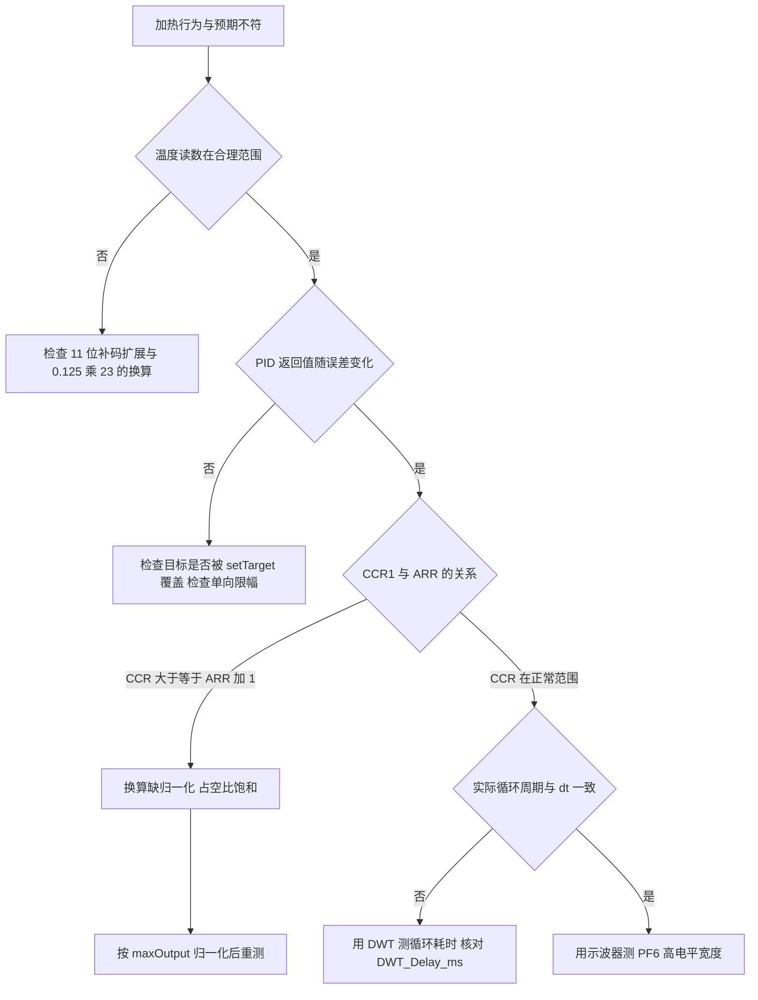
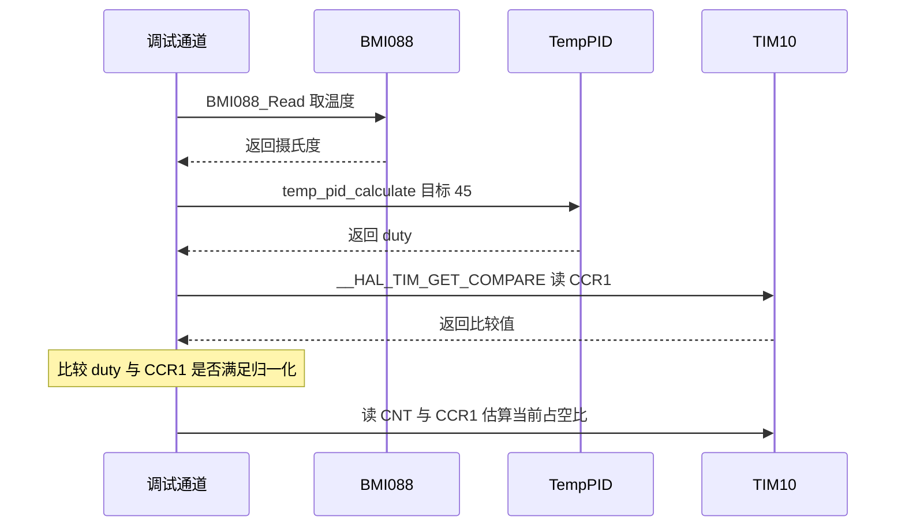

# 温度环易错点与调试

温度环的链路短：读温度、算 PID、写比较值，三段各有一个容易出错的量。前几篇分析过的量纲错误、单向限幅与函数选择，最终都表现为加热行为与预期不符。因为链路短，逐段验证的成本很低，排查时按环节定位比按现象猜测更快。

四类错误里，量纲错误的影响最大：它把一个连续调节器变成开关调节器，后面的整定与限幅都在错误的基础上进行，只看温度曲线容易被误判成整定问题。限幅、时间、单位三类错误的症状各有特征，可以据此分开。

本文先把错误按来源分类，给出每一项的源码位置与症状，再给出从温度读数到 PWM 波形的排查顺序与临时观测方法。涉及现场差异的部分会标出待确认。

> 源码索引

| 路径 | 作用 |
| --- | --- |
| `BMI088/Src/ImuTempControl.cpp` | 比较值换算与 PWM 输出 |
| `BMI088/Inc/ImuTempControl.h` | 温控类声明与死成员 |
| `BMI088/Src/BMI088.cpp` | 温度读取与换算 |
| `BMI088/BMI088config.h` | 温度换算常数 |
| `PID/Src/temp_pid.cpp` | 单向限幅与参数 |
| `PID/PidBase.h` | 双向基类对照 |
| `Task/Src/ImuTask.cpp` | 调用周期与实参 |
| `Core/Src/tim.c` | TIM10 周期配置 |

## 错误按出错环节分成四类

温度环的问题可以按出错环节分成四类，排查时先定位到环节，再往里看具体行：

| 类别 | 出错环节 | 典型症状 |
| --- | --- | --- |
| 量纲 | PID 输出到比较值的换算 | 加热只有全开与全关，温度在目标附近来回 |
| 限幅 | 单向环的积分与输出下限 | 过冲后长时间不再加热，或者积分反向堆积 |
| 时间 | 调用周期与 `dt` 实参 | 积分与微分的数值随实际周期偏移 |
| 单位 | 温度原始值到摄氏度 | 目标判断整体偏移，加热常开或常关 |

四类错误的观测点不同：量纲看 `CCR1` 与 `ARR` 的关系，限幅看 PID 输出与积分变量，时间看循环实际耗时，单位看温度读数。先把读数确认可信，再往控制器与执行器走。

## 量纲错误如何把 PID 变成开关

PID 输出 `duty` 的范围是 $[0, 4500]$，比较值的满量程是 $ARR+1 = 5000$。代码写成 $CCR = ARR \cdot duty$（`BMI088/Src/ImuTempControl.cpp:18`），`duty = 2` 时比较值已经超过 5000，占空比恒为 100%。温度低于目标时输出非零，加热全开；温度高于目标时输出被钳到 0，加热全关。表现是温度围绕目标做较大幅度的开关振荡，而不是平滑收敛。

这一现象与整定不当造成的振荡外观相似，区别在周期性：量纲错误下占空比只有两个取值，温度的上升与下降几乎是恒速的斜线；整定不当的振荡幅度随增益变化，波形更接近正弦。

## 两个下限作用在不同变量上

积分下限（`PID/Src/temp_pid.cpp:22`）与输出下限（`:29`）作用在不同变量上。去掉积分下限后，输出下限仍会把加热限制在非负，但积分变量本身会跑到很大的负值；温度回落后，积分要穿过这段负值才能重新给出正输出，加热出现明显的死区。只看输出寄存器，这两个下限都会被同一条 `if (output < 0)` 掩盖，容易误以为积分下限多余。

判断积分是否堆积，要直接观察 `integral` 变量，而不是看输出。输出被钳在 0 时，积分可能正处在数百的负值上。

## dt 与实际周期的差

IMU 任务每次循环调用温控时传 `0.001f`（`Task/Src/ImuTask.cpp:46`），循环末尾用 `DWT_Delay_ms(1)`（`:111`）延时，循环体还要完成 SPI 读取、融合与角度换算。实际周期等于 1 ms 加循环体耗时，恒大于 1 ms。积分增量按 `dt` 算，实际调用间隔更大，积分等效增益偏高；微分项除以 `dt`，等效增益也偏高。温度环的时间常数在秒级，偏差的影响比速度环小，但在长时间的积分上仍会累积。（按代码推导，未实测循环体耗时。）

这里与速度环有一个差别：IMU 任务用的是 `DWT_Delay_ms` 忙等，不是 FreeRTOS 的 `osDelay`，所以周期不依赖调度器，但也不受调度器对齐。

## 温度读数经过三步换算

原始温度是 11 位有符号值：先按 `(buf[0] << 3) | (buf[1] >> 5)` 组合（`BMI088/Src/BMI088.cpp:142`），再对大于 1023 的值减 2048 做补码扩展（`:145-148`），最后换算成摄氏度：

$$T = 0.125 \times R + 23.0$$

其中 $R$ 是补码扩展后的 11 位值，$0.125$ 与 $23.0$ 来自 `BMI088/BMI088config.h:193-194`。少乘 $0.125$ 会让读数放大到 8 倍，少加 $23.0$ 会让读数整体偏低 23 °C。两种情况都会让温控在错误的温度上工作。

三处都影响最后的摄氏度，但影响方式不同：漏掉补码扩展只在负温区出错，漏乘 $0.125$ 让所有读数等比放大，漏加 $23.0$ 让所有读数平移。排查时先看室温下的读数是否接近实测值，就能区分平移与缩放。

## 十三项错误清单

| # | 错误 | 症状 | 源码位置 |
| --- | --- | --- | --- |
| 1 | 比较值未按满量程归一化 | `duty` 大于等于 2 时占空比 100% | `BMI088/Src/ImuTempControl.cpp:18` |
| 2 | 积分下限改成允许负值 | 过冲后长时间不加热 | `PID/Src/temp_pid.cpp:22` |
| 3 | 输出下限缺失 | 比较值被无符号转换放大 | `PID/Src/temp_pid.cpp:29`、`ImuTempControl.cpp:16` |
| 4 | `dt` 与实际周期不一致 | 积分与微分等效增益偏移 | `Task/Src/ImuTask.cpp:46`、`:111` |
| 5 | 温度换算漏乘 0.125 或漏加 23 | 读数整体缩放或偏移 | `BMI088/Src/BMI088.cpp:162` |
| 6 | 把 `maxIntegral` 当占空比上限 | 误以为 4400 是输出满量程 | `PID/Src/temp_pid.cpp:41` |
| 7 | 改 `temp_pid.h:20` 的默认目标 | 运行期被 `setTarget(45)` 覆盖 | `PID/Src/temp_pid.cpp:48`、`ImuTask.cpp:46` |
| 8 | 通过基类指针调用计算函数 | 走双向版本，负输出与负积分出现 | `PID/Inc/temp_pid.h:17`、`PidBase.h:29` |
| 9 | 无符号承接 PID 输出 | 负值回绕成很大的比较值 | `BMI088/Src/ImuTempControl.cpp:16` |
| 10 | 运行期改 ARR 后仍用 `Init.Period` | 换算按旧周期 | `BMI088/Src/ImuTempControl.cpp:18` |
| 11 | `temp_pid_clear()` 后以为目标也复位 | 目标仍是上一次的值 | `PID/PidBase.h:23-26` |
| 12 | 误以为 `init()` 里有引脚操作 | 当前源码只有 `HAL_TIM_PWM_Start` | `BMI088/Src/ImuTempControl.cpp:11-13` |
| 13 | 误以为成员 `targetTemp_` 保存目标 | 该成员未被读，目标由参数传入 | `BMI088/Inc/ImuTempControl.h:23` |

第 12 项是一处文档与代码的不一致：其他文档里出现过 `GPIOG6`、`GPIOH11` 的拉高操作，当前两块板仓库的 `init()` 里没有这两行，以当前源码为准，差异待现场确认。第 13 项的 `targetTemp_` 初始化为 0，`update` 只用形参 `targetTemp`，这个成员是死代码。

## 从温度读数到波形的排查路径



### 排查顺序的两个前提

第一条前提是温度读数可信。读数的三步换算都在 `BMI088.cpp` 与 `BMI088config.h` 里，改动其中任何一步都会让整个目标判断偏移，先把它排除再往控制器走。

第二条前提是比较值的量纲。`CCR1` 与 $ARR+1$ 的关系决定了 PID 输出有没有被正确映射，这一步不确认，后面的整定与限幅都建立在饱和输出上。两条前提都满足后再看周期与波形。

## 临时观测点的放置

仓库里没有温度环的调试输出，需要临时加打印或借助调试器读寄存器。下面这段只用于定位，不属于当前仓库实现：

```cpp
// 临时观测，用于定位量纲与单位问题
float temp_now = 0.0f;
BMI088_Read(gyro, accel, &temp_now);                 // 读真实温度
int16_t duty = temp_pid_calculate(45.0f, temp_now, 0.001f);
uint32_t ccr = __HAL_TIM_GET_COMPARE(&htim10, TIM_CHANNEL_1);
DebugUART_Printf("T=%.2f duty=%d ccr=%lu\r\n", temp_now, duty, ccr);
```

温度读数用于核对单位链；`duty` 用于确认 PID 输出落在 $[0, 4500]$；`ccr` 与 $ARR+1 = 5000$ 比较，用于确认量纲。三者一起看，可以把错误定位到某一段。



## 调试相关的易错点

| # | 易错点 | 表现 | 位置 |
| --- | --- | --- | --- |
| 1 | 只测温度不测比较值 | 温度能到目标附近，但过程是开关振荡，误判为整定问题 | `BMI088/Src/ImuTempControl.cpp:18` |
| 2 | 用 `CNT` 的瞬时值判断占空比 | 单次采样落在高电平或低电平，得不出占比 | `Core/Src/tim.c:43-45` |
| 3 | 把 `maxOutput` 与 `maxIntegral` 混用 | 归一化时除错满量程 | `PID/Src/temp_pid.cpp:41` |
| 4 | 认为温度环也有 `osDelay` 周期 | IMU 任务用 `DWT_Delay_ms` 忙等，不是调度延时 | `Task/Src/ImuTask.cpp:111` |
| 5 | 用环境温度代替加热区温度 | 目标看起来总也达不到 | 热梯度，未实测 |
| 6 | 改了 `temp_pid.h` 默认目标却看不到变化 | 运行期被调用点的 45 覆盖 | `Task/Src/ImuTask.cpp:46` |

## 小结

### 核心概念

- 温度环的问题按量纲、限幅、时间、单位四类定位，量纲错误会把 PID 退化成开关控制。
- 积分下限与输出下限作用在不同变量上，输出钳位掩盖不了积分的负值堆积。
- 温度读数经过 11 位补码扩展、乘 0.125、加 23 三步，任何一步缺失都会让目标判断整体偏移。
- `dt` 固定为 0.001f，实际周期由 `DWT_Delay_ms(1)` 与循环体耗时决定，恒大于 1 ms。
- 改目标要改 `Task/Src/ImuTask.cpp:46` 的实参，`temp_pid.h` 的默认值在运行期被覆盖。
- 调试时同时看温度、PID 输出与 `CCR1`，三者合起来才能把错误定位到具体环节。

### 设计权衡

| 权衡点 | 本工程的选择 | 收益与代价 |
| --- | --- | --- |
| 调试输出 | 无内置打印，靠调试器或临时加码 | 不占运行开销；代价是排查需要改代码 |
| 时间基准 | `DWT_Delay_ms` 忙等 | 不依赖调度器；代价是实际周期大于设定值 |
| 满量程常数 | 4500 写在 PID 构造参数里 | 参数集中；代价是消费端必须复制这个常数 |
| 目标设置 | 运行期由调用点传入 | 可在线修改；代价是默认值容易被误改 |
| 温度观测点 | 复用 `imu_data.temperature` | 上位机可见；代价是看不到 PID 内部量 |

## 练习

### 基础题

1. 把温度读数故意乘 8 与故意减 23，各描述一次温控的行为差异。
2. 写出用 `CCR1` 与 `CNT` 判断当前占空比时需要连续采样的次数与理由。
3. 列出把 `dt` 从 0.001f 改成 0.0012f 后，积分项与微分项各发生什么变化。

### 挑战题

4. 设计一个不接示波器的占空比测量方案，用定时器更新中断在若干个周期内统计高电平计数。
5. 给温度环加一个超温保护，在 IMU 温度超过 60 °C 时强制关闭 PWM，写出需要修改的函数与返回路径。
6. 把十三项错误按调试成本排序，给出前四项的验证顺序与判据。

## 附：本页引用的固件路径

| 路径 | 用途 |
| --- | --- |
| `/home/wyx/rm/2026SentriOmeniGimbal/2026OmniSentryGimbal/BMI088/Src/ImuTempControl.cpp` | 比较值换算与 PWM 输出 |
| `/home/wyx/rm/2026SentriOmeniGimbal/2026OmniSentryGimbal/BMI088/Inc/ImuTempControl.h` | 温控类声明与死成员 |
| `/home/wyx/rm/2026SentriOmeniGimbal/2026OmniSentryGimbal/PID/Src/temp_pid.cpp` | 单向限幅与参数 |
| `/home/wyx/rm/2026SentriOmeniGimbal/2026OmniSentryGimbal/PID/Inc/temp_pid.h` | 接口与目标默认值 |
| `/home/wyx/rm/2026SentriOmeniGimbal/2026OmniSentryGimbal/PID/PidBase.h` | 双向基类对照 |
| `/home/wyx/rm/2026SentriOmeniGimbal/2026OmniSentryGimbal/Task/Src/ImuTask.cpp` | 调用周期与实参 |
| `/home/wyx/rm/2026SentriOmeniGimbal/2026OmniSentryGimbal/BMI088/Src/BMI088.cpp` | 温度读取与换算 |
| `/home/wyx/rm/2026SentriOmeniGimbal/2026OmniSentryGimbal/BMI088/BMI088config.h` | 温度换算常数 |
| `/home/wyx/rm/2026SentriOmeniGimbal/2026OmniSentryGimbal/Core/Src/tim.c` | TIM10 周期配置 |
