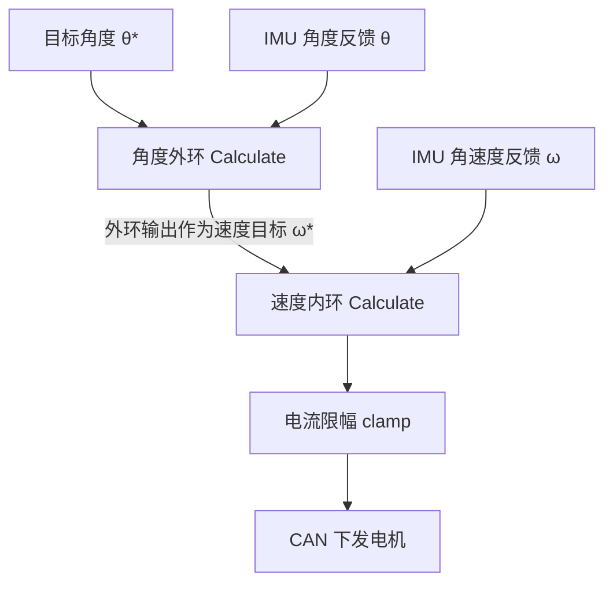
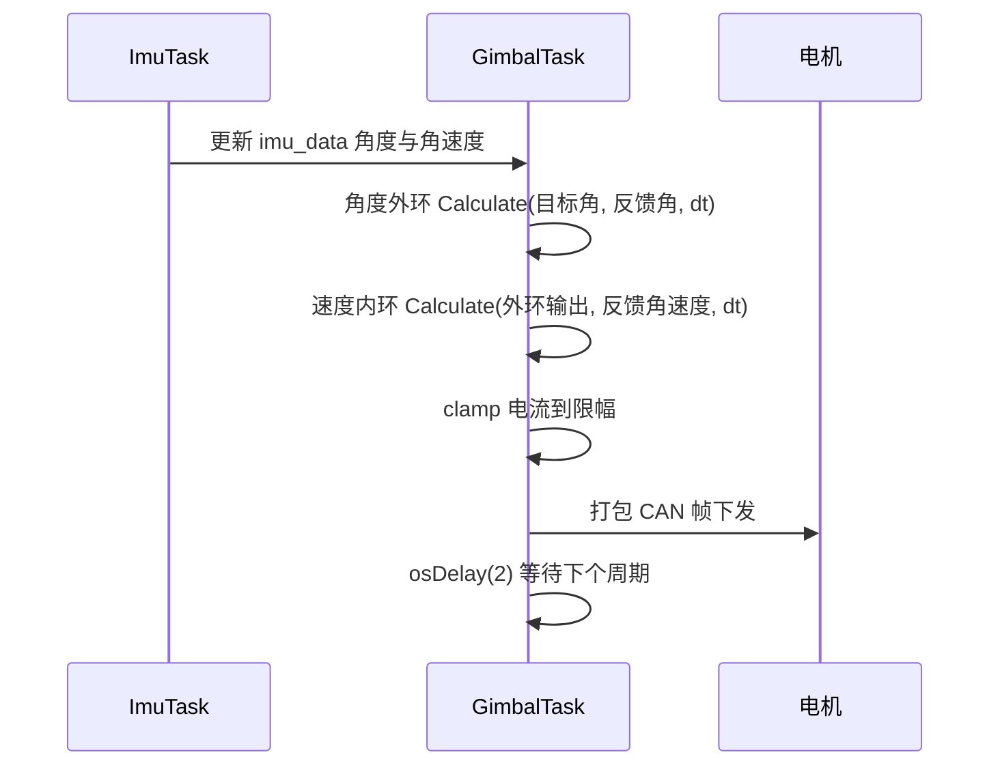

# 串级PID结构

云台既要跟踪目标角度，又要抵抗摩擦与线缆扰动，单个 PID 很难同时满足。本工程把偏航与俯仰各拆成两级：角度外环算目标角速度，速度内环算电流指令。两级在同一个任务里顺序执行，共用一个 `dt`，也共用同一个采样时刻。

拆两级的依据是中间状态可测。陀螺仪直接给出角速度，而角度是角速度的积分；把可测的中间量做成内环，扰动先在这里被抑制，剩下的角度偏差才进入外环。外环因此不必处理高频扰动，只需要修最终位置。

本文先给出串联的传递关系与两条约束（带宽比、采样周期），再对照 `GimbalTask.cpp` 的调用点说明本工程怎么落地，最后指出这里用同一个周期跑两环带来的限制。

> 源码索引

| 路径 | 作用 |
| --- | --- |
| `Task/Src/GimbalTask.cpp` | 两轴四级控制器的创建与调用 |
| `PID/PidBase.h` | 角度外环与速度内环共用的基类实现 |
| `PID/Inc/angle_pid.h` | `AnglePID` 与跨零处理接口 |
| `PID/Inc/speed_pid.h` | `SpeedPID` 声明与误差限幅接口 |
| `PID/Src/speed_pid.cpp` | 速度内环实现 |

## 单环为什么不够用

串级控制把两个控制器相连，外环的输出就是内环的目标值。被控量与执行器之间隔着一层中间状态：

| 层级 | 被控量 | 控制器输入 | 控制器输出 |
| --- | --- | --- | --- |
| 外环 | 角度 $\theta$ | 角度误差 $e_\theta$ | 目标角速度 $\omega^*$ |
| 内环 | 角速度 $\omega$ | 速度误差 $e_\omega$ | 电流或力矩指令 |

外环不直接碰执行器，只决定内环该用多快的速度转。内环负责让真实角速度跟住这个目标。外部扰动先在内环里被抑制，剩余部分才以角度误差的形式进入外环。

角速度对时间积分得到角度：

$$ \theta(t) = \theta(0) + \int_{0}^{t} \omega(\tau) \, d\tau $$

电流指令经电机力矩常数与转动惯量先产生角加速度，再积分得到角速度，二次积分得到角度。速度是对象中更靠前的状态量，陀螺仪也能直接测。内环稳住的正是这个中间状态，外环再去修正最终角度。

如果只用一个角度环，控制器要同时兼顾位置误差的长期修正与扰动的即时抑制，增益被两种需求拉扯：增益高则扰动抑制好但容易振荡，增益低则平稳但抗扰弱。串级把这两种需求分到两层，各自独立整定。

## 内环只取比例校正时的闭环传递

记内环被控对象为积分环节 $G(s) = K_t / (J s)$，$K_t$ 是力矩常数，$J$ 是折算到电机轴上的转动惯量。内环只取比例校正 $K_{p,i}$ 时，闭环传递为

$$ G_{i}(s) = \frac{K_t K_{p,i}}{J s + K_t K_{p,i}} = \frac{1}{\tau_i s + 1}, \qquad \tau_i = \frac{J}{K_t K_{p,i}} $$

外环看到的对象就是这个一阶惯性环节再串一个积分 $1/s$：

$$ G_{o}(s) = G_{i}(s) \cdot \frac{1}{s} = \frac{1}{s(\tau_i s + 1)} $$

外环设计时把 $G_i(s)$ 近似成 1，成立的代价是内外环时间尺度必须分开。若 $\tau_i$ 与外环的响应时间接近，近似失效，两环会互相耦合，表现为低频振荡或外环输出被内环的相位滞后拖入正反馈。

由 $\tau_i = J/(K_t K_{p,i})$ 可以看出，内环增益越高，等效惯性时间越小，外环越容易把它当成瞬时跟随。增益的上限由噪声决定，这一点在下一节展开。

## 带宽比与采样周期的两条约束

经验上内环带宽取外环的 3 到 10 倍：

$$ \omega_{b,i} \approx (3 \sim 10)\, \omega_{b,o} $$

带宽比越小，外环越容易看到内环的滞后；越大，内环增益越高，对噪声与采样抖动越敏感。陀螺仪噪声会被内环微分项放大，上限由此决定。

采样周期还有独立约束。为了不把内环自身的动态混叠掉，采样频率通常取内环带宽的 10 到 20 倍：

$$ f_{s,i} \ge (10 \sim 20)\, f_{b,i} $$

按带宽比 3 到 10 反推，内环采样周期大致应取外环的 1/3 到 1/10。本工程两环在同一任务、同一 `dt` 下执行，采样周期没有分开，带宽差只能靠增益制造。

## 一个带宽数字的例子

以内环时间常数 $\tau_i = 15$ ms 为例，闭环带宽近似 $1/(2\pi\tau_i) \approx 10.6$ Hz。按 5 倍带宽比，外环带宽约 2.1 Hz。

两个环都用时间常数口径衡量，避免频率与时间混用。一阶惯性环节的带宽与时间常数互为倒数关系 $f_b = 1/(2\pi\tau)$，响应时间按 $4\tau$ 估计（到达终值约 98% 的量级），这是本节统一使用的口径。

| 量 | 取值 | 计算 |
| --- | --- | --- |
| 内环时间常数 | 15 ms | 由 $J/(K_t K_{p,i})$ 决定 |
| 内环带宽 | 10.6 Hz | $1/(2\pi\tau_i)$ |
| 外环带宽 | 2.1 Hz | 内环的 1/5 |
| 外环时间常数 | 75.8 ms | $1/(2\pi \times 2.1\ \text{Hz})$ |
| 外环响应时间 | 约 0.30 s | $4\tau_o = 4 \times 75.8\ \text{ms}$ |
| 采样频率 | 500 Hz | 2 ms 周期 |
| 采样比 | 47 | $f_s / f_{b,i}$ |

采样比 47 高于 10 到 20 倍的要求，采样周期这一项不构成限制；实际的约束来自带宽比，它由增益决定。$\tau_i$ 的取值属假设，需用阶跃实测替换。

## 角度外环先把跨零误差摊平

角度反馈是 0 到 360 度的循环量，目标与反馈靠近零点两侧时，直接相减会得到接近 360 度的误差，控制器会命令反方向转一整圈。`AnglePID` 在调用基类之前先把两者归到同一圈内（`PID/Inc/angle_pid.h`），误差绝对值因此不超过 180 度。

| 情形 | 目标 | 反馈 | 直接相减 | 跨零处理后 |
| --- | --- | --- | --- | --- |
| 普通 | 90 | 80 | 10 | 10 |
| 跨零 | 1 | 359 | -358 | 2 |
| 反向跨零 | 359 | 1 | 358 | -2 |

外环输出的速度目标因此不会因为一圈的跳变而突变。内环接收的是角速度，属于连续量，不需要这层处理。跨零处理后的误差以浮点进入基类，后续的比例、积分与微分运算与其它环一致。

### 两类约束的检查顺序

整定串级时先看采样周期是否满足 10 到 20 倍，这一项不达标则内环自身动态被混叠，后面调增益没有意义。采样达标后再看带宽比，通过内环增益把 $\tau_i$ 压到外环响应时间的十分之一以内。本工程的采样项有较大余量，带宽比是主要工作点。

## 本工程两轴四级控制器

`Task/Src/GimbalTask.cpp` 的 `run()` 在栈上创建四个控制器，随后每次循环依次调用：

| 环路 | 控制器 | 反馈量 | 输出去向 | 源码位置 |
| --- | --- | --- | --- | --- |
| 偏航角度外环 | `YawAnglePID` | `imu_data.gimbal_yaw_total_angle` | 速度目标 | `GimbalTask.cpp` |
| 偏航速度内环 | `YawSpeedPID` | `imu_data.gyro[2]` | 电流 | `GimbalTask.cpp` |
| 俯仰角度外环 | `PitchAnglePID` | `imu_data.roll` | 速度目标 | `GimbalTask.cpp` |
| 俯仰速度内环 | `PitchSpeedPID` | `imu_data.gyro[0]` | 电流 | `GimbalTask.cpp` |

偏航外环的输出直接接到内环的目标端，中间没有单位换算，见源码里的两处。这要求外环输出与陀螺仪角速度同量纲；工程里两者都按度制理解。俯仰侧同样如此，区别在俯仰外环用的是 `Calculate_with`，积分无条件累加，偏航外环用 `Calculate`，积分有条件累加，这一差别在《积分饱和与抗饱和策略》里展开。

调用顺序是先外环后内环。反过来先跑内环，内环就会用上一周期的外环输出，等效多出一拍延迟，而这一拍在串级里直接削减相位裕度。

## 声明周期与实际调度周期的偏差

源码里的把 `dt` 写成 `0.001f`，注释记为 1 ms；循环末尾却是 `osDelay(2)`，注释仍写 1 ms。声明周期与实际调度周期不一致，属真实缺陷。积分项按 `dt` 线性缩放，实际周期翻倍会让积分累积速度减半；微分项除以 `dt`，同一个偏差会让它翻倍。定量影响见 `05-易错点与调试.md`。

两环共用 `dt`，带宽分离全部落在增益上。偏航侧 `YawAnglePID` 的比例增益 60、`YawSpeedPID` 的比例增益 20，二者量纲不同，不能直接比较数值大小。判断带宽是否分开，要看角速度环的闭环响应时间是否远小于角度环的响应时间，这需要阶跃实测，本工程没有留下实测记录。

## 串级结构相关的易错点

| # | 易错点 | 表现 | 位置 |
| --- | --- | --- | --- |
| 1 | 内外环 `dt` 混用 | 两环用同一个 `dt`，实际调度周期与声明值不符 | `GimbalTask.cpp` |
| 2 | 外环输出量纲与内环目标量纲不一致 | 未做单位换算，靠增益掩盖比例错误 |—|
| 3 | 内外环调用顺序颠倒 | 内环先用上一周期的外环输出，等效多一拍延迟 |—|
| 4 | 认为带宽比越大越好 | 内环增益受陀螺仪噪声限制，过高会抖动 | 属经验约束，待实测 |
| 5 | 外环没有输出限幅 | 外环输出被内环误当大速度目标，饱和后积分累积 | `GimbalTask.cpp` |
| 6 | 把两环的 Kp 数值直接比大小 | 两者量纲不同，数值不可比 |—|

## 小结

### 核心概念

- 串级把角度外环与速度内环相连，外环输出即内环目标。
- 内环带宽取外环的 3 到 10 倍，外环才能把内环近似成 1。
- 内环采样频率取自身带宽的 10 到 20 倍，两环周期分离与带宽分离配合使用。
- 本工程两环共用一个 `dt`，带宽差只能靠增益制造。
- 调用顺序先外环后内环，颠倒会引入一拍额外延迟。
- 实际调度周期是 `osDelay(2)`，声明 `dt = 0.001f`，两者不符。

### 设计权衡

| 权衡点 | 本工程的选择 | 收益与代价 |
| --- | --- | --- |
| 两环同任务同周期 | 在同一 `for` 循环里顺序调用 | 无需额外任务与共享内存；内环带宽只能靠增益拉开，延迟固定一拍 |
| 外环输出当内环目标 | 采用 | 结构简单、量纲自洽；外环必须自带输出限幅，否则内环目标失真 |
| 角度反馈用 `roll` | 由板子安装方向决定 | 省一次坐标变换；依赖安装不变，属待现场确认 |
| 采样周期声明为常量 | `dt = 0.001f` | 调用简洁；与实际 `osDelay(2)` 脱节 |
| 外环积分方式两轴不同 | 偏航条件积分、俯仰无条件积分 | 各自贴合响应需求；同一路径两套语义，阅读时要留意 |

## 练习

### 基础题

1. 写出角度外环与速度内环的误差定义式，并说明两者的量纲。
2. 给定 $\tau_i$ 与外环期望响应时间，判断 $K_{p,i}$ 应取大还是取小，并说明原因。
3. 按 `osDelay(2)` 计算实际控制周期，说明它与 `dt = 0.001f` 的比值。

### 挑战题

4. 把内外环拆到两个独立任务，分别取 1 ms 与 2 ms 周期，说明数据共享与相位延迟需要处理的问题。
5. 推导内环只取比例校正时 $\tau_i$ 与 $K_{p,i}$ 的关系，估算使 $\tau_i$ 小于外环响应时间十分之一所需的增益量级。
6. 用阶跃响应的上升时间估计本工程偏航内外环的真实带宽比，给出测量方案。

## 附：本页引用的固件路径

| 路径 | 用途 |
| --- | --- |
| `/home/wyx/rm/2026SentriOmeniGimbal/2026OmniSentryGimbal/Task/Src/GimbalTask.cpp` | 两轴四级控制器的创建与调用 |
| `/home/wyx/rm/2026SentriOmeniGimbal/2026OmniSentryGimbal/PID/PidBase.h` | 角度外环与速度内环共用的基类实现 |
| `/home/wyx/rm/2026SentriOmeniGimbal/2026OmniSentryGimbal/PID/Inc/angle_pid.h` | `AnglePID` 与跨零处理接口 |
| `/home/wyx/rm/2026SentriOmeniGimbal/2026OmniSentryGimbal/PID/Inc/speed_pid.h` | `SpeedPID` 声明与误差限幅接口 |
