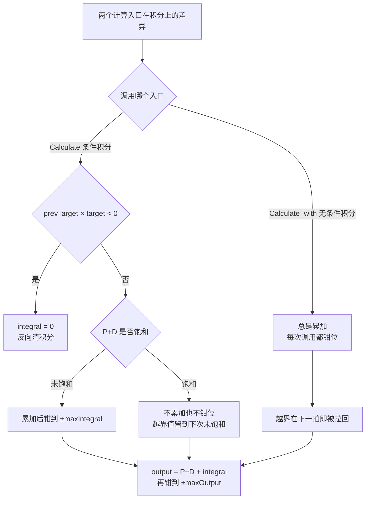
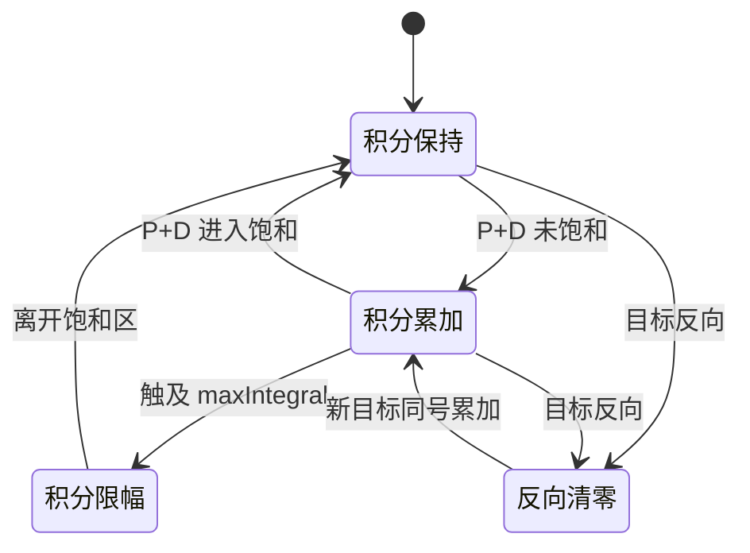

# 积分饱和与抗饱和策略

执行器有物理上限，积分项却在误差存在时持续累加。误差大且限幅紧的场合，积分会一路涨到远超输出的量级，等误差换号后需要很长时间才能退回来，表现为大超调和恢复慢。这不是增益问题，调小增益会让未饱和区间的响应也变差。

本工程没有独立的抗饱和模块，四类处理分散在基类与派生类里：条件积分、积分限幅、单向下限、反向清积分。四者的判据与作用对象各不相同，有的限制累加动作，有的限制积分幅值，有的清理历史。

本文先给出成因与三类对策的公式，逐项拆解判据的强度，再定位到四个文件的实现位置，最后单独分析反向清积分在目标零点附近的边界情形。

> 源码索引

| 路径 | 作用 |
| --- | --- |
| `PID/PidBase.h` | 条件积分、积分限幅、反向清积分 |
| `PID/Src/speed_pid.cpp` | 误差限幅后的条件积分 |
| `PID/Src/temp_pid.cpp` | 积分下限 0 的单向积分 |
| `Task/Src/GimbalTask.cpp` | 角度超限时清零俯仰外环积分 |
| 底盘板同名文件 | 速度环积分钳位被注释 |

## 饱和从哪来

PID 的原始输出由三项相加：

$$ u_{raw} = K_p e + K_i \int e \, dt + K_d \frac{de}{dt} $$

执行器只能接受有限幅值，实际下发量是

$$ u = sat(u_{raw}, -u_{max}, u_{max}) $$

积分饱和指 $u_{raw}$ 已经超出 $u_{max}$，误差仍保持同号，$\int e\,dt$ 继续增大而与实际输出无关。限幅越早触发、误差持续越久，积分储存的虚假能量越多。

理想情况下积分项应当只补偿稳态误差。饱和期间执行器已经无法响应更多指令，这段时间的积分对系统没有贡献，只会延后恢复。识别积分是否饱和，要看积分项本身的幅值与 $maxIntegral$ 的关系，输出被钳住只是表象。

## 发散的符号条件

设误差恒定 $e$、采样周期 $\Delta t$，积分递推为

$$ I_k = I_{k-1} + K_i e \, \Delta t $$

只要 $K_i e$ 不为零，$I$ 就单调增长，速率是 $K_i e$。积分是否继续增长与执行器是否饱和无关。发散条件写成两项同时成立：

$$ |u_{raw}| \ge u_{max} \quad \text{且} \quad sign(u_{raw}) = sign(e) $$

第一项说明已经到限，第二项说明误差还在把积分往限外推。两类符号相反时积分会被误差拉回，不需要干预。这也解释了为什么抗饱和只需要在饱和期间动手，未饱和时积分自然跟随稳态误差。

## 条件积分：饱和时暂停累加

条件积分在输出饱和时暂停累加，只让误差项在未饱和区起作用。判据是

$$ |u_{raw}| < u_{max} \Rightarrow I_k = I_{k-1} + K_i e \, \Delta t $$

否则 $I_k = I_{k-1}$。本工程 `PidBase::Calculate` 用的判据只看比例加微分两项，不含积分：

$$ |K_p e + K_d \dot{e}| < maxOutput $$

这个细节决定了它的强度。若比例项很小、饱和完全由积分造成，判据仍然成立，积分会继续累加，直到被 `maxIntegral` 截住。条件积分在本工程里是第一道防线，积分限幅是第二道。

## 积分限幅给积分单独设界

积分限幅给 $I$ 一个独立于输出的上界：

$$ I_k = clamp\left(I_{k-1} + K_i e \, \Delta t, -I_{max}, I_{max}\right) $$

$I_{max}$ 与 $maxOutput$ 是两个量，前者限制积分项本身，后者限制三项之和。若 $I_{max}$ 远大于 $maxOutput$，退化为只有输出限幅，积分仍能涨到远超输出的量级。合理的取值让积分单独占用输出预算的一个固定份额。

两个限幅的执行时机也有差别。`Calculate` 的钳位写在累加条件内部，进入饱和分支时本次不修正；`Calculate_with` 每次调用都钳位，越界后下一拍立即被拉回。

## 温控的单向积分

温控场景还有单向约束。加热器只能升温，积分下限被强制为 0：

$$ I_k = clamp\left(I_{k-1} + K_i e \, \Delta t, 0, I_{max}\right) $$

负积分会让输出变小，对只能加热的系统意味着停机时间被拉长，去掉负积分等于取消这部分记忆。下限为 0 之后，温度冲过目标时积分最多退到零，再回落时从零重新累积，路径最短。

## 反向清积分用目标乘积判号

反向清积分在控制器目标换号的瞬间把 $I$ 归零。判据是相邻两次目标的乘积：

$$ prevTarget \times target < 0 \Rightarrow I = 0 $$

乘积为负当且仅当两个因子非零且异号。目标反向时，旧积分的方向与新误差相反，清零能立即卸掉这部分阻力。判据比较的是目标而不是误差，因此反馈穿越目标不会触发它。

## 三类对策的取舍

| 对策 | 作用对象 | 触发条件 | 代价 |
| --- | --- | --- | --- |
| 条件积分 | 累加动作 | 输出或 P+D 饱和 | 饱和期间积分停滞，退出饱和后补偿变慢 |
| 积分限幅 | 积分幅值 | $abs(I) > I_{max}$ | 限幅过小会削弱稳态误差补偿 |
| 反向清积分 | 积分历史 | 相邻目标异号 | 目标频繁换号时积分反复归零，积分作用失效 |

三类对策作用在不同层面，可以叠加使用。本工程同时用了条件积分与积分限幅，反向清积分只在目标换号时偶发触发。

## 本工程四处落点

四种写法分布在四个文件里，没有统一封装：

| 策略 | 落点 | 源码位置 | 具体条件 |
| --- | --- | --- | --- |
| 条件积分 | `PidBase::Calculate` | `PID/PidBase.h` | `abs(K_p e + K_d e_dot) < maxOutput` |
| 条件积分加积分钳位 | `SpeedPID::Calculate` | `PID/Src/speed_pid.cpp` | 同上，钳位写成分支判断 |
| 无条件积分加钳位 | `PidBase::Calculate_with` | `PID/PidBase.h` | 每次 `clamp(integral, ±maxIntegral)` |
| 积分下限 0 | `TempPID::calculate` | `PID/Src/temp_pid.cpp` | `output < maxOutput` 时累加，下限 0 |
| 反向清积分 | `PidBase` 两版本 | `PID/PidBase.h` | `prevTarget × target < 0` |
| 限幅清积分 | `GimbalTask::run` | `Task/Src/GimbalTask.cpp` | `roll` 超出 `[-20, 30]` |

### SpeedPID 的判据取钳位后的误差

两个类都在累加前判断 `abs(K_p e + K_d e_dot) < maxOutput`。`SpeedPID` 在误差限幅（`speed_pid.cpp`）之后才计算比例与微分，所以判据里的 `e` 已经被限到 `±error_max_`。误差限幅把大误差截断，条件积分的触发区域随之改变：在 ±250 之内 `K_p e` 随误差线性增长，误差到达 250 即被截断，之后不再随真实误差增大；条件积分的判据取截断后的 `e` 值判断。250 是左右摩擦轮的误差限幅（`FireTask.cpp`、源码里的传入的 `err_max`/`err_min`），供弹环 `motor_SUPPLY_PID` 的边界是 2500，两者不能混用。

### TempPID 的单向积分

`temp_pid.cpp` 只在 `output < maxOutput` 时累加，且把积分下限钉在 0。这里没有负方向判据，输出下限单独处理。`maxIntegral` 在构造函数里是 4400（`temp_pid.cpp`），与 `maxOutput = 4500` 接近，积分几乎可以单独占满输出。

### GimbalTask 的限幅清积分

`GimbalTask.cpp` 在 `imu_data.roll` 越出 `[-20, 30]` 时直接写 `PitchAnglePID.integral = 0`。这是外部复位，不经过 `Clear()`，也不清 `prevError`。角度超限通常意味着机械行程到顶或姿态异常，此时把俯仰外环的积分归零能避免它在下一次回到可用区时带着旧积分冲出。

### 底盘侧的例外

底盘板速度环把积分钳位注释掉（底盘 `speed_pid.cpp`），条件积分保留而积分限幅失效。两块板同名文件的行为不同，跨板对照时要看具体行。

## 反向清积分的边界情形

判据用乘积判号，原因是只关心两次目标的符号是否相反。逐项拆开有几类边界：

| 本次 `target` | 上次 `prevTarget` | 乘积 | 是否清零 |
| --- | --- | --- | --- |
| 正 | 正 | 正 | 否 |
| 正 | 负 | 负 | 是 |
| 正 | 0 | 0 | 否 |
| 0 | 任意 | 0 | 否 |
| 负 | 正 | 负 | 是 |

过零时不会反复清积分。清零发生在符号变化的第一次调用；该次调用末尾 `prevTarget = target` 被更新为新符号（`PidBase.h`），下一次同号目标的乘积为正，不再清零。一次换号只清一次。

反复清零出现在目标于 0 两侧交替抖动的情形：本次正、下次负、再下次正，每次乘积都为负，积分每周期被清一次，$I$ 永远长不起来。此时积分作用等价于关闭，系统退化为 PD。偏航外环的目标来自视觉或遥控，若目标停在零点附近且带噪声，就会进入这种状态。

判据比较的是相邻两次目标值，与被控量无关。目标恒定而反馈穿越目标时，误差换号，但两次目标的乘积为正，积分不清。反馈穿越只会让积分自然回退，回退速率由 $K_i e$ 决定。外环输出作为内环目标时，判据落在外环输出上，外环在目标附近来回修正可能让内环积分被反复清零，这一层耦合本工程没有做区分。

`PidBase::Clear`（`PID/PidBase.h`）只清 `integral` 与 `prevError`，不清 `prevTarget`。外部调用 `Clear()` 之后，`prevTarget` 仍是上一次的目标。若新目标与它异号，下一次 `Calculate` 会再清一次积分，效果相同；若同号，则不会清零。`Clear()` 与反向判据在语义上有重叠但不完全一致。

## 抗饱和相关的易错点

| # | 易错点 | 表现 | 位置 |
| --- | --- | --- | --- |
| 1 | 认为条件积分看的是总输出 | 判据只含 `K_p e + K_d e_dot`，积分驱动饱和时仍会累加 | `PidBase.h` |
| 2 | 积分限幅量级与输出限幅错配 | `maxIntegral` 大于 `maxOutput` 时，积分能压过全部输出预算 | `PidBase.h` |
| 3 | 反向清积分被当作误差换号检测 | 实际比较的是 `target`，不是 `error` | `PidBase.h` |
| 4 | 目标在零附近抖动时积分长期为零 | 每周期乘积为负，`I` 反复归零 | `PidBase.h` |
| 5 | 温控积分下限写成 `-maxIntegral` | 加热器没有制冷能力，负积分制造无效等待 | `temp_pid.cpp` |
| 6 | 外部直接写 `integral = 0` 绕过 `Clear()` | `prevError` 未清，下一次微分项出现尖峰 | `GimbalTask.cpp` |
| 7 | 忽略两块板的积分钳位差异 | 底盘侧积分无上界 | 底盘 `speed_pid.cpp` |

## 小结

### 核心概念

- 积分饱和发生在 $u_{raw}$ 超限且误差与输出同号时，积分以 $K_i e$ 的速率单调增长。
- 条件积分在饱和期间暂停累加，本工程的判据只含比例与微分项。
- 积分限幅给 $I$ 独立上界，量级应与 `maxOutput` 协调。
- 反向清积分用相邻目标的乘积判号，只在目标换号的那一次触发。
- 温控把积分下限钉在 0，取消负向记忆。
- 俯仰角度超限时外部直接清零 `PitchAnglePID.integral`。

### 设计权衡

| 权衡点 | 本工程的选择 | 收益与代价 |
| --- | --- | --- |
| 判据取 P+D | `PidBase.h` | 实现简单；积分造成的饱和不受它约束，依赖 `maxIntegral` 兜底 |
| 两版本并存 | `Calculate` 条件积分，`Calculate_with` 无条件积分 | 可按环路选择；同名家族两套语义容易误用 |
| 反向清积分用乘积 | `prevTarget × target < 0` | 一次换号清一次；目标抖动时积分被周期性抹掉 |
| 温控单向积分 | 下限 0 | 与加热器匹配；降温只能靠自然散热 |
| 限幅清积分写在任务里 | `GimbalTask.cpp` | 针对姿态异常有效；绕过封装，`prevError` 未同步 |

## 练习

### 基础题

1. 写出积分发散的充要条件，并说明为何 $sign(e)$ 与 $sign(u_{raw})$ 相反时不需要干预。
2. 对 `TempPID` 计算误差为 5 ℃、$K_i = 0.2$、$\Delta t = 0.001$ 时每步的积分增量。
3. 说明 $prevTarget \times target < 0$ 在 `target = 0` 时为何不清积分。

### 挑战题

4. 把 `PidBase::Calculate` 的判据改成含积分项的总输出，推导对俯仰外环恢复过程的影响。
5. 设计一个带迟滞的反向清积分判据，抑制目标在零点附近的反复清零。
6. 给定 `maxOutput` 与稳态误差要求，估算 `maxIntegral` 的合理上限，并说明与 $K_i$ 的关系。

## 附：本页引用的固件路径

| 路径 | 用途 |
| --- | --- |
| `/home/wyx/rm/2026SentriOmeniGimbal/2026OmniSentryGimbal/PID/PidBase.h` | 条件积分、积分限幅、反向清积分 |
| `/home/wyx/rm/2026SentriOmeniGimbal/2026OmniSentryGimbal/PID/Src/speed_pid.cpp` | 误差限幅后的条件积分 |
| `/home/wyx/rm/2026SentriOmeniGimbal/2026OmniSentryGimbal/PID/Src/temp_pid.cpp` | 积分下限 0 的单向积分 |
| `/home/wyx/rm/2026SentriOmeniGimbal/2026OmniSentryGimbal/Task/Src/GimbalTask.cpp` | 角度超限时清零俯仰外环积分 |
| `/home/wyx/rm/2026SentriOmeniChassis/2026OmniSentryChassis/PID/Src/speed_pid.cpp` | 底盘速度环积分钳位被注释 |
