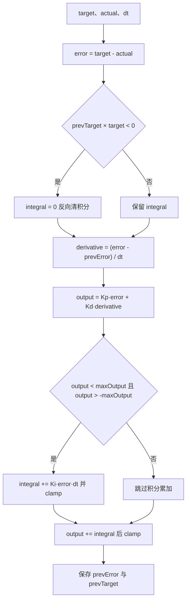
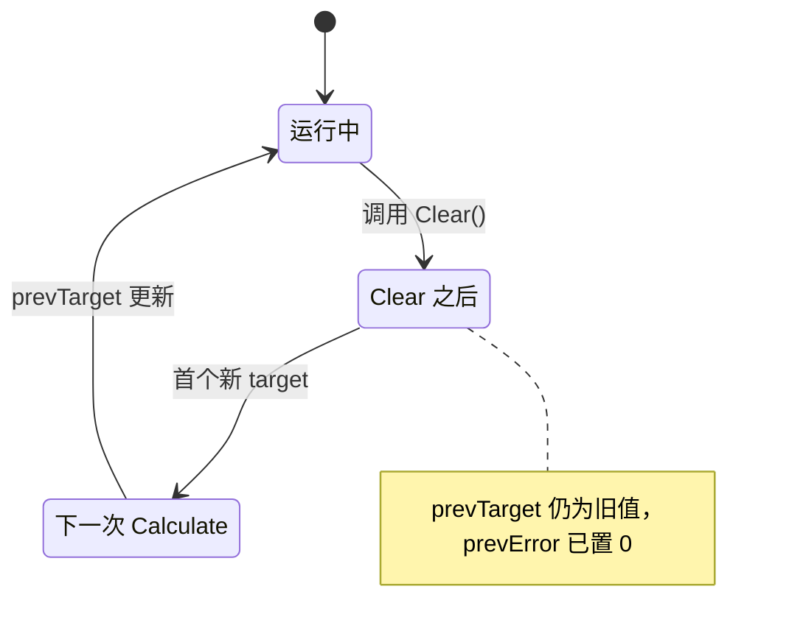

# PidBase实现逐行

`PID/PidBase.h` 只有 101 行，角度环、速度环、温度环都从这里取统一的误差、微分、限幅与反向清积分逻辑。文件里并存两个计算入口：`Calculate` 条件积分，`Calculate_with` 无条件积分。两者的差别集中在积分累加那几行，其余结构逐句对应。

这个基类还有两个容易被忽略的设计：成员全部 public，任务代码可以在运行期改写限幅与积分；`Clear()` 只清两个状态，目标历史不在其中。两处都影响阅读方式，理解限幅与积分时必须同时搜索成员名的全部写入点。

本文按执行顺序展开两个计算入口，对照它们在积分处理上的差异，说明 `Clear` 的状态语义与 public 成员带来的外部改写点，最后汇总几个派生类对基类的不同用法。

> 源码索引

| 路径 | 作用 |
| --- | --- |
| `PID/PidBase.h` | 基类全文 |
| `PID/Src/speed_pid.cpp` | 派生类构造函数与重写 |
| `PID/Src/temp_pid.cpp` | 独立同名函数与单向积分 |
| `PID/Inc/angle_pid.h` | 角度环的跨零处理 |
| `BSP/magictools.h` | `clamp` 模板 |
| `Task/Src/GimbalTask.cpp` | 外部改写 `maxIntegral` 与 `integral` |

## 一个基类承载四个环的共同逻辑

`PidBase` 是一个带虚析构的 C++ 基类，封装三项共同内容：

| 内容 | 位置 | 作用 |
| --- | --- | --- |
| 五个构造参数 | `PidBase.h` | `Kp / Ki / Kd / maxOutput / maxIntegral` |
| 计算入口 |—| 误差、微分、积分、限幅、状态保存 |
| 清零入口 |—| 清 `integral` 与 `prevError` |
| 参数与状态成员 |—| 全部 public |

派生类用 `using PidBase::PidBase;` 透传构造，例如 `AnglePID`（`PID/Inc/angle_pid.h`）。`SpeedPID` 另写两个构造函数，`TempPID` 则新增 `target_temp`。

基类不区分方向、不区分执行器类型，也不做误差限幅。它提供的是最小公共集合：一个误差定义、一个后向差分、一个条件积分与一个输出限幅。误差限幅、单向积分、`dt` 保护这些差异留给派生类。

## 构造与初始状态

构造函数初始化列表设置 $K_p$、$K_i$、$K_d$、maxOutput、maxIntegral，并把 `integral` 与 `prevError` 显式清零。`prevTarget` 不在列表里，它在成员声明处用默认值 0.0f初始化。

五个参数的类型都是 `float`，顺序固定。调用点常把输出限幅与积分限幅写成两个数，例如云台偏航外环 `60.0f / 0.000f / 0.3f / 200000.0f / 180.0f`（`Task/Src/GimbalTask.cpp`），依次是 $K_p$、$K_i$、$K_d$、maxOutput、maxIntegral。

三个状态量的初值不同：`integral` 与 `prevError` 由构造函数清零，`prevTarget` 由声明处默认值清零。三者在首次调用前都是 0，首次 `Calculate` 的微分项因此是 $e/dt$，这一项在 `prevError` 被清零后的每次重启时都会重复出现。

## Calculate 的逐步展开

| 语句 | 作用 |
| --- | --- |
| `float error = target - actual;` | 误差按目标减反馈定义 |
| `if ((prevTarget * target) < 0.0f) integral = 0.0f;` | 目标换号时清积分 |
| `float derivative = (error - prevError) / dt;` | 后向差分近似微分 |
| `float output = Kp * error + Kd * derivative;` | 先算比例与微分 |
| `if (output < maxOutput && output > -maxOutput) { integral += Ki * error * dt; integral = clamp(integral, -maxIntegral, maxIntegral); }` | 未饱和才积分，并把积分钳到 $\pm$ maxIntegral |
| `output += integral;` | 把已有积分并入输出 |
| `output = clamp(output, -maxOutput, maxOutput);` | 总输出限幅 |
| `prevError = error; prevTarget = target;` | 保存状态供下次调用 |
| `return output;` | 返回 |

源码里的的判断对象是 源码里的得到的 `output`，此刻还没有累加积分。判据因此只覆盖比例加微分两项，积分本身造成的饱和不进入判断。

`Calculate` 没有 `dt` 保护。传入 `dt = 0` 时后向差分变成除零，输出取决于浮点除零的结果。派生类 `SpeedPID` 在重写版里加了 `dt > 0` 判断，基类版本没有这一层。

## Calculate_with 与 Calculate 的对照

| 步骤 | `Calculate` | `Calculate_with` |
| --- | --- | --- |
| 误差 |—|—|
| 反向清积分 |—|—|
| 微分 |—|—|
| 比例与微分中间量 | 先算 | 不先算，直接进积分 |
| 积分 | 条件累加并钳位 | 无条件累加并钳位 |
| 合成 | `output += integral` | `output = Kp*error + integral + Kd*derivative` |
| 输出限幅 |—|—|
| 状态保存与返回 |—|—|

两处实质差异：

1. 积分累加条件。`Calculate` 只在 $|K_p e + K_d \dot e| < maxOutput$ 时累加；`Calculate_with` 每次都累加，随后 `clamp(integral, ±maxIntegral)`。
2. 积分钳位的执行时机。`Calculate` 的钳位写在 `if` 内部，未饱和时如果此前积分已越界，本次不会主动修正；`Calculate_with` 无条件钳位。

`Calculate_with` 的注释写“带积分限幅的版本，总是积分”，语义与代码一致。俯仰角度外环用它，偏航角度外环用 `Calculate`，两个轴在同一次循环里走不同的积分语义。

## 两处积分钳位的执行时机

把两个版本的积分行为按输入分成三种情形，差别更直观：

| 情形 | `Calculate` | `Calculate_with` |
| --- | --- | --- |
| P+D 未饱和，积分未越界 | 累加并保持 | 累加并保持 |
| P+D 未饱和，积分已越界 | 累加后再钳位 | 累加后钳位 |
| P+D 饱和 | 不累加也不钳位 | 仍累加并钳位 |

第三行是两者的关键差别。当 P+D 已经把输出顶到 maxOutput 时，`Calculate` 完全冻结积分，`Calculate_with` 仍让积分随误差变化，只保证不越过 maxIntegral。俯仰轴的超调恢复速度因此与偏航轴不同，这一条按代码结构推导，具体幅值需实测。

## Clear 的清零范围

`Clear` 只有两行赋值：

$$ integral = 0, \qquad prevError = 0 $$

`prevTarget` 不在其中。清零后紧接着调用 `Calculate`，判据读到的 `prevTarget` 还是上一次计算保存的旧目标。后果分两种：

- 旧目标与新目标异号：第一次调用触发一次反向清积分，`integral` 本就为 0，无额外影响。
- 旧目标与新目标同号：不触发清积分，`integral` 保持 0，同样无额外影响。

受影响的是 `prevError`。清零后第一次调用的微分项变成

$$ derivative = \frac{error - 0}{dt} = \frac{e}{dt} $$

误差不为零时这一项是尖峰，幅值随误差线性增长。`Clear` 用于控制器重新启用时，这个尖峰会直接进入输出。

## 成员为什么全是 public

源码里的有一行注释 `//protected:`，下面的成员实际仍是 `public`。公开成员让派生类与任务代码都能直接读写参数和积分。设计上的便利体现在：

- `SpeedPID` 构造函数在函数体内再次给 `maxOutput` 赋值（`PID/Src/speed_pid.cpp`）。
- `GimbalTask` 在创建后把 `PitchAnglePID.maxIntegral` 改成 1000（`Task/Src/GimbalTask.cpp`），覆盖构造参数 5000。
- `GimbalTask` 在角度超限时直接写 `PitchAnglePID.integral = 0`，并用全局 `cheak` 读出积分。
- `TempPID::calculate` 在结尾写 `prevTarget = target_temp`（`PID/Src/temp_pid.cpp`）。

代价是任何一处都能在运行期改动限幅与参数，源码阅读时需要同时搜索成员名才能找到全部改写点。

## 三个派生类怎么用这个基类

| 派生类 | 构造方式 | 计算入口 | 重写点 |
| --- | --- | --- | --- |
| `AnglePID` | `using PidBase::PidBase;` | `calculate(int32_t, int32_t, float)` 内调用 `Calculate` | 跨零处理后转 float |
| `SpeedPID` | 两个自写构造函数 | `Calculate` 重写 | 误差限幅、`dt > 0` 保护 |
| `TempPID` | `using PidBase::PidBase;` | `calculate(float, float)` 独立实现 | 单向积分与输出下限 |

`TempPID::calculate` 与基类 `Calculate` 同名但签名不同，不构成重写。基类的三参数版本在 `TempPID` 里没有被调用。

## 外部改写点与 clamp 模板

| 改写对象 | 位置 | 值 |
| --- | --- | --- |
| `PitchAnglePID.maxIntegral` | `GimbalTask.cpp` | 1000（构造参数为 5000） |
| `PitchAnglePID.integral` | `GimbalTask.cpp` | 0 |
| `pitch_current_out` 读取积分 | `GimbalTask.cpp` | 写入全局 `cheak` |
| `maxOutput` | `speed_pid.cpp` | 取 max_out 与 min_out 绝对值较大者 |
| `prevTarget` | `temp_pid.cpp` | `target_temp` |

`PidBase.h` 在源码里引入 `magictools.h`。`clamp` 是模板函数（`BSP/magictools.h`），按 `T` 推导返回类型。`PidBase` 传入 `float`，返回 `float`。模板用两个分支实现，没有处理 `min_val > max_val` 的输入；调用点都按升序传参。

## 实现细节上的易错点

| # | 易错点 | 表现 | 位置 |
| --- | --- | --- | --- |
| 1 | 把 `Calculate` 与 `Calculate_with` 当成等价 | 前者条件积分，后者无条件积分，俯仰外环用的是后者 | `PidBase.h` |
| 2 | 认为条件积分看总输出 | 判据在积分累加之前，只看比例与微分 |—|
| 3 | 期望 `Clear` 复位全部状态 | `prevTarget` 不清，`prevError` 清零反而制造微分尖峰 |—|
| 4 | 无 `dt` 保护 | `dt = 0` 时 出现除零，`SpeedPID` 有保护，基类没有 |—|
| 5 | 外部覆盖 `maxIntegral` 后未检查量级 | 1000 与 `maxOutput = 10000` 的比例关系改变 | `GimbalTask.cpp` |
| 6 | 依赖 `//protected:` 注释判断可见性 | 注释被注释掉，成员实际可被任意代码改写 | `PidBase.h` |
| 7 | 认为 `clamp` 会检查区间顺序 | 模板不校验 `min_val > max_val` | `BSP/magictools.h` |

## 小结

### 核心概念

- `Calculate` 与 `Calculate_with` 的差异只在积分处理：条件累加与无条件累加。
- 条件积分的判据是 $|K_p e + K_d \dot e| < maxOutput$，不含积分项。
- `Calculate` 在饱和分支里既不累加也不钳位，`Calculate_with` 每次都累加并钳位。
- `Clear` 清 `integral` 与 `prevError`，不清 `prevTarget`。
- `prevError` 清零会在下一次调用产生 $e/dt$ 的微分尖峰。
- 成员全为 public，任务代码可直接改参数与积分。
- 基类的微分项没有 `dt > 0` 保护。

### 设计权衡

| 权衡点 | 本工程的选择 | 收益与代价 |
| --- | --- | --- |
| 两个计算入口 | `Calculate` 与 `Calculate_with` 并存 | 可按环路选择；同名家族两套语义容易混用 |
| 成员 public | 全部公开 | 便于就地整定；改写点分散，阅读成本高 |
| 条件积分判据取 P+D | `PidBase.h` | 实现短；积分驱动的饱和要靠 `maxIntegral` 兜底 |
| Clear 保留 prevTarget |—| 反向判据逻辑不受影响；`prevError` 归零带来尖峰 |
| clamp 用模板 | `BSP/magictools.h` | 类型自洽；不校验区间顺序 |

## 练习

### 基础题

1. 对照 `Calculate` 与 `Calculate_with`，列出积分处理的全部差异。
2. 计算 `error = 10`、`dt = 0.001` 时 `Clear()` 后第一次调用的微分项数值。
3. 说明 `prevTarget` 的初始化位置与初始值。

### 挑战题

4. 给 `PidBase` 增加一个同时条件积分与无条件钳位的 `Calculate`，写出改动后的行序。
5. 把 `Clear` 改成复位全部状态，分析对 `GimbalTask` 角度超限清零逻辑的影响。
6. 设计一个只读访问器替换 public 成员，列出需要修改的调用点，并说明 `SpeedPID::Calculate` 如何取到 `maxIntegral`。

## 附：本页引用的固件路径

| 路径 | 用途 |
| --- | --- |
| `/home/wyx/rm/2026SentriOmeniGimbal/2026OmniSentryGimbal/PID/PidBase.h` | 基类全文 |
| `/home/wyx/rm/2026SentriOmeniGimbal/2026OmniSentryGimbal/BSP/magictools.h` | `clamp` 模板 |
| `/home/wyx/rm/2026SentriOmeniGimbal/2026OmniSentryGimbal/PID/Src/speed_pid.cpp` | 派生类构造函数与重写 |
| `/home/wyx/rm/2026SentriOmeniGimbal/2026OmniSentryGimbal/PID/Src/temp_pid.cpp` | 独立同名函数与单向积分 |
| `/home/wyx/rm/2026SentriOmeniGimbal/2026OmniSentryGimbal/Task/Src/GimbalTask.cpp` | 外部改写 `maxIntegral` 与 `integral` |
